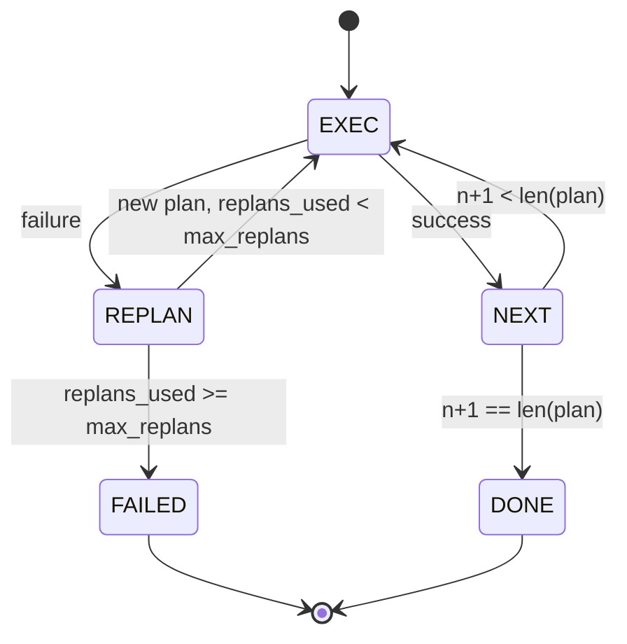

# خطة التدفقات التدريبية

> خطة لا تستطيع البقاء على قيد الحياة في الفشل هي النص النص الذي يمكن إعادة التخطيط هو وكيل بناء إعادة التخطيط أولا

**Type:** Build
**Languages:** Python
**Prerequisites:** Phase 13 lessons 01-07, Phase 14 lesson 01
**Time:** ~90 minutes

## أهداف التعلم
- تمثيل خطة كقائمة مرتبة من الخطوات المكتوبة حتى يتمكن المنفذ من التفكير في التقدم والنتيجة.
- قم بإجراء الخطوات بشكل متسلسل مع إعطاء فشل مسيطرة إلى المخطط.
- إعادة تعديل من المؤشر الحالي مع الخطأ السابق في السياق حتى يتم إعلام الخطة التالية.
- إصدار خطة مختلفة على كل مراجعة حتى يمكن للمعقب أو واجهة المستخدم أن يظهر لماذا تغيرت الخطة.
- تطبيق ميزانيات: سقف خطوة صلبة وسقف إعادة التخطيط صلب.

```figure
cg-plan-replan
```

## تخطيط وتنفيذ، وليس سلسلة من الفكر

وكيل سلسلة الفكر ينبعث رموز ويسمح للحلقة بتخمين أين تنتهي مكالمة الأداة. وكيل خطة وتنفيذ ينبعث خطة مهيكلة أولاً ، ثم يقوم بتنفيذ كل خطوة بشكل تحديدي. الخطة هي البيانات التي يمكن أن تتخيلها الحزمة. التنفيذ هو الحزمة التي تعمل على تشغيل تلك البيانات من خلال جهاز إرسال.

اثنين من القطع. خططاً يُنتج خطة. تنفيذياً يُدير الخطة. العمل المثير للاهتمام هو ما يحدث عندما يُصيب تنفيذياً بفشل. ثلاثة خيارات:

```text
1. Abort         (return failed, surface the error)
2. Skip          (mark step failed, continue with the rest)
3. Replan        (hand the error to the planner, get a new plan from the cursor)
```

(ريبلان) هو الذي يحول السيناريو إلى عميل

## شكل الخطوة

```text
Step
  id              : int           (monotonic within a plan revision)
  tool_name       : str
  args            : dict
  expected_outcome: str           (planner's stated success condition)
  result          : Any | None
  error           : str | None
```

`expected_outcome`هي جملة قصيرة ينبعثها المخطط إلى جانب الخطوة. لا يتم تطبيقها من قبل المنفذ. إنه لأسباب اثنتين: يقرأها المخطط الجديد عند مراجعة الخطة؛ يُنبعها سلسلة الأحداث حتى يتمكن المتعقب من إظهار "كان من المفترض أن تفعل هذه الخطوة X".

## شكل المخطط

```python
def planner(goal: str, history: list[Step], last_error: str | None) -> list[Step]:
    ...
```

وظيفة نقية`goal`هو هدف المستخدم. `history`هي الخطوات التي تم تنفيذها بالفعل (مع نتائج وأخطاء ملؤة). `last_error`لا يوجد في المكالمة الأولى والرسالة الأخيرة للخلل في كل مكالمة لاحقة. يقوم المخطط بإرجاع الخطوة التالية بدءا من المؤشر.

المخطط لا يعرف عن المنفذ لا يعرف عن التجربات لا يعرف عن التوقيتات لا يعرف عن الخطة، هذا كل شيء

## المُعدّم

إن المنفذ هو آلة صغيرة. كل خطوة تمر عبر المُبعث. النتيجة هي واحدة من ثلاثة أشياء: النجاح، والفشل الذي يمكن إعادة التخطيط له، والفشل الذي يمكن إعادة التخطيط له. الفشل الذي يمكن إعادة التخطيط له يعود إلى المخطط. الفشل المميت (تجاوز الميزانية، وتصادم السقف لإعادة التخطيط) يعود إلى `FAILED`نتيجة الجلسة



## الخطة تختلف عن المراجعة

عندما يعيد المخطط خطة جديدة بعد فشل، يقوم المنفذ بإصدار خطة`plan.diff`حدث مع ثلاث حقل

```text
removed: list of step ids that were in the old plan and are not in the new
added  : list of step ids in the new plan that were not in the old
revised: list of step ids whose tool_name or args changed
```

يمكن أن يعطي متسق أو واجهة اتصال هذا كإضفاء الضوء على الخطوات المزودة وتعزيز الخطوات المضافة. النقطة ليست في شكل المختلف. النقطة هي أن الإصلاح هو حدث مرئي، وليس إعادة كتابة ساكنة.

## ميزانيتين، كلاهما صعب

`max_steps`يحد إجمالي عمليات تنفيذ الخطوات على مدار الجلسة بأكملها، بما في ذلك إعادة التخطيط. الافتراض هو اثني عشر. خطة خطية من خمسة خطوات التي تقوم بإعادة التخطيط مرتين وتضيف ثلاث خطوات في كل مرة يصل إلى ستة عشر تنفيذًا وتجاوز الميزانية. سوف يرفض المنفذ إعادة التخطيط ويرد فشلًا.

`max_replans`يحدد عدد المخططات التي يتم استدعائها بعد الخطة الأولى. الاختيار الافتراضي هو خمسة. هذا هو الحد الأكثر أهمية. المخطط الذي يعيد نفس الخطة المكسورة خمس مرات على التوالي سوف يتحرك في حلقة حتى يلتحق بها ميزانية الخطوة. يجعلها التخطيطات المعدلة الفشل أسرع والسبب أكثر وضوحا.

## المخطط المحدد في هذه الدروس

نحن لا ندعو نموذج في هذا الدروس. الدروس ترسل خطة تحديدية التي تختار خطة على أساس`last_error`. . .

```text
last_error is None    -> emit a four-step plan
last_error matches X  -> emit a three-step plan that routes around X
last_error matches Y  -> emit a two-step plan that gives up gracefully
otherwise             -> return [] (signals nothing to replan)
```

هذا يكفي لاختبار سلوك المنفذ في كل مسار انتقال: النجاح، إعادة التخطيط مرة واحدة، إعادة التخطيط مرتين، إعادة التخطيط الإنفاذ، وتعب ميزانية خطوة.

## شكل النتيجة

```text
SessionResult
  status      : "completed" | "failed"
  reason      : str     ("goal_met" | "step_budget" | "replan_budget" | "no_plan")
  history     : list[Step]
  revisions   : list[PlanDiff]
  events      : list[Event]
```

يمكن لدورة الحوار من الدروس العشرين قراءة هذا مباشرة. المرسل من الدروس الثلاثة والعشرين هو ما يقوم بتنفيذ كل خطوة. سجل من الدروس العشرين والحد يؤكد args كل خطوة. النقل من الدروس الثانية والعشرين سوف يظهر هذا التدفق كله على JSON-RPC إلى عميل نموذج.

## كيفية قراءة الرمز

`code/main.py`يحدد`PlanExecuteAgent`،`Step`،`PlanDiff`،`SessionResult`و المخطط الحاسم ، و المنفذ هو واحد`run(goal)`طريقة تعود`SessionResult`يتم حساب الخطة المختلفة عن طريق مقارنة أرقام الخطوة و`(tool_name, args)`أضعاف

`code/tests/test_agent.py`تغطي نجاح خطي، فشل في منتصف خطة يعدّ تخطيطًا مرة واحدة، يعدّ تخطيطًا متوفّرًا يعود `failed:replan_budget`، وتفقد الميزانية المتدفق عليها، و تنسيق الحدث المتباين بين الخطة.

## الذهاب إلى أبعد

اثنين من التوسعات التي سوف تحتاجها بمجرد توصيل هذا إلى نموذج حقيقي. أولا، التخزين الآلي لخطط جزئية: عندما تنجح خطة في أول ثلاثة من ست خطوات ثم تفشل، لا تريد إعادة تشغيل أول ثلاثة. يقوم المدير بالفعل بحفظ التاريخ؛ ويجب على المخطط فقط قراءته. ثانيا، الفرع الموازية: التنفيذ الحالي هو تسلسل صارم. المخطط الذي ينبع فرع مستقل (`gather_step`بدلاً من`next_step`) يمكن أن تقوم بإجراء مكالمات أدوات في وقت واحد من خلال جهاز التسليم.

كلاهما يضيف تعقيدًا حقيقيًا. كلاهما أسهل في إضافة مرة واحدة يتم وضع التنفيذ الخطي. هذا ما يفعله هذا الدروس.
