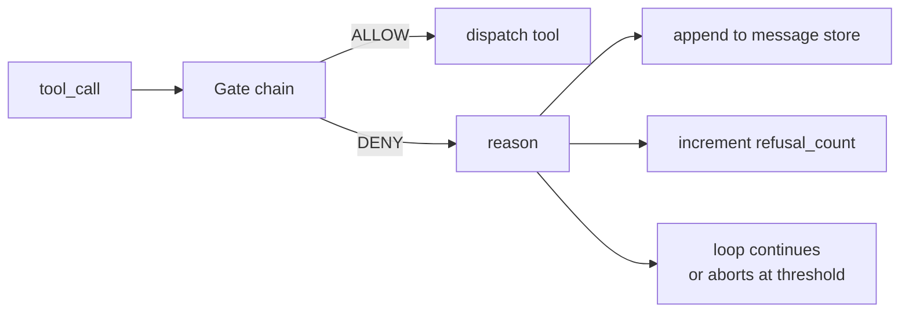
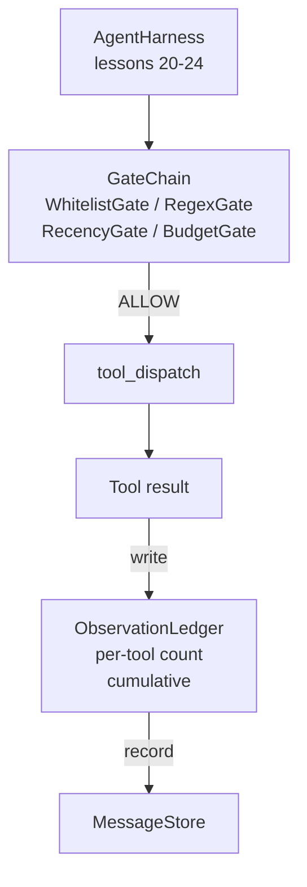

# دراسة كابستون 25: بوابات التحقق وميزانية المراقبة

> حزمة عميلة بدون طبقة التحقق هي رغبة في سترة حفرة هذا الدروس يبني سلسلة البوابة التحديدية التي تقرر ما إذا كان يسمح لإطلاق مكالمة أداة، كم من خروجه يسمح للوكيل برؤيته، ومتى يجب أن يتوقف الحلقة لأن الوكيل قرأ الكثير. السلسلة هي وظيفة من البوابات الصغيرة، المسمى بالإضافة إلى دفتر الملاحظات التي تتبع كل رمز تم عرض النموذج.

**Type:** Build
**Languages:** Python (stdlib)
**Prerequisites:** Phase 19 · 20-24 (Track A1: agent loop, tool registry, message store, prompt builder, model router), Phase 14 · 33 (instructions as constraints), Phase 14 · 36 (scope contracts), Phase 14 · 38 (verification gates)
**Time:** ~90 minutes

## أهداف التعلم

- بناء `VerificationGate`بروتوكول مع تحديد `evaluate(call)`الطريقة
- قم بتجميع بوابات الميزانية والجريدة والقائمة البيضاء والإجراءات في سلسلة مع أساسيات الدوائر القصيرة.
- تتبع كل ملاحظة من خلال `ObservationLedger`المفاتيح بواسطة الأداة وتحويل.
- رفض طلب أدوات عندما يتجاوز ميزانية الملاحظة التراكمية.
- سطح مُهيّن`GateDecision`تسجيل أن الملاحظة التدريجية يمكن أن تتناول.

## المشكلة

عندما يسمح حزمة الوكيل للنموذج بدعوة الأدوات بحرية، تظهر ثلاث فئات من الحذاء في غضون الساعة الأولى من الاستخدام الحقيقي.

الأول هو الملاحظة غير المحدود. إضافة عبر 200K خط repo يرمي نصف مليون رمز من الإنتاج إلى الجولة التالية. النموذج يرى مباراة واحدة لكل كيلو بايت وبقية السياق يضيع. فاتورة الرمز كبير والوكيل الآن أسوأ، وليس أفضل، في المهمة.

الثاني هو التجديد القديم. تقوم مهمة طويلة المدى بتجميع خمسين مكالمة أداة. يقوم النموذج بإعادة قراءة أول ملف read_file من الجانب الثالث كما لو كان حالة حية. لا تظهر التحريرات التي تم إجراؤها في الجانب الأربعين والسبعة أبداً لأن المُنشئ السريع قام بتسلسل أول الملاحظات.

والثالث هو "مُخففِفِيّةِ الامتيازات" مهمةِ البحث تبدأ بالاتصال`web_search`ثم ينتهي الأمر بطريقة ما بالهرب`shell`لأن النموذج اخترع اسم الأداة والحزمة كانت تسمح افتراضيًا. في الوقت الذي يقرأ فيه أي شخص البحث ، يكون ملفًا غير مرغوب فيه موجودًا في /tmp ومركزًا يضرب API خاصًا.

بوابة التحقق هي مكون الحزام الذي يقول لا. انها ليست نموذج. انها ليست قاضية. انها وظيفة تحديدية من `(call, history, ledger)`يعود إما السماح أو النكر مع سبب. يتم تسجيل السبب. يتم إخبار النموذج. الحلقة تستمر أو تنتهي.

## المفهوم



البوابة هي أي شيء مع`evaluate(call, ctx) -> GateDecision`الطريقة. السلسلة هي قائمة مرتبة. تقييم قصير الأفق على الرفض الأول. أمر الأمور: البوابات الهيكلية رخيصة تعمل قبل البوابات الثمينة الثمينة حساب.

هذا الدروس يفتح أربعة أبواب:

- `WhitelistGate`اسم الأدوات المسموح بها هو مجموعة صريحة أي شيء خارج يُنكر هذا هو أبواب الأرخص ويتم تشغيله أولاً
- `RegexGate`. يتم تطابق حجج الأداة مع regex. مفيد لرفض المكالمات القذيفة مع `rm -rf`أو مكالمات HTTP إلى عناوين IP داخلية.
- `RecencyGate`. النموذج يرى الملاحظات فقط من آخر N المدار. الملاحظات القديمة مخفي. البوابة ترفض دعوة الأداة التي نتيجة لها ستعمل على تمديد نافذة الملاحظة التي قد قد انتهت بالفعل.
- `BudgetGate`. الوهميات التراكمية التي قرأها النموذج خلال الجلسة لديها سقف. عندما يقول دفتر التسجيل أن السقف قد تم الوصول إليه، يتم رفض كل دعوة أداة أخرى.

دفتر الملاحظات هو الحسابات. كل مكالمة أداة ناجحة تكتب سطراً واحداً: اسم الأداة، وتناوله، والرموز المنبعثة، وتجميع. يجيب دفتر التسجيل على سؤالين: كم رأى النموذج إجمالي، ومقدار رأى من الأداة X. يقرأ بوابة الميزانية الأولى. بوابة الميزانية لكل أداة، التي ستكتبها كتمارين، يقرأ الثانية.

```figure
cg-gate-chain
```

## الهندسة المعمارية



يطلب الحزام من السلسلة. السلسلة إما ترجع أو ترفض. إذا ترجع ، تعمل الأداة ، وتقرص دفتر الكتب ، ويتم إرفاق النتيجة إلى مخزن الرسائل. إذا رفض ، يتم تسليم النموذج إلى الرفض كرسالة نظامية وتقرر الحلقة ما إذا كانت ستحاول مرة أخرى أو تتوقف.

## ما ستبني

إن تنفيذها واحد`main.py`بالإضافة إلى الاختبارات

1. `Observation`و`ToolCall`فصول البيانات تعريف أشكال الأسلاك.
2. `ObservationLedger`السجلات`(turn, tool, tokens)`الصفوف والجوابات`cumulative()`و`per_tool(name)`. . .
3. `GateDecision`يحمل`(allow, reason, gate_name)`. . .
4. `VerificationGate`كل بوابة تنفذ`evaluate(call, ctx)`. . .
5. `GateChain`يلف قائمة مرتبة، يطلب كل بوابة، يعيد أول رفض، أو يعيد السماح إذا تمر كل بوابة.
6. التجربة تشغيل حلقة صغيرة من العاملات الاصطناعية. ثلاث جولات. الجولة الثالثة تثبت البوابة الميزانية والحلقة تقرير رفض نظيف مع عدد رفض غير الصفر.

العداد الوهمي هو عمدا غبية`len(text) // 4`الهدف من هذه الدروس هو أنبوب البوابة، وليس الجهاز التجاري.

## لماذا نظام السلسلة مهم

إنكار أرخص من السماح`WhitelistGate`يستخدم في البحث عن الاهشيش O(1). `RegexGate`يدير في نمط O( * argv). `RecencyGate`يقرأ شريحة صغيرة من متجر الرسائل`BudgetGate`تطلبهم من خلال ارتفاع التكلفة حتى رفض المكالمة قصيرة قبل القيام بالعمل الثمينة.

أنت أيضاً تطلبهم حسب نصف قطر الانفجار. البريد الأبيض هو أقوى دعوى: هذه الأداة ليست في العقد. بوابة regex هي التالية: هذه الحجة ليست في العقد. يأتي بعد ذلك: الحزام لا يزال يهتم ولكن المكالمة هي قانونية من الناحية الهيكلية. الميزانية هي الأخيرة لأنه، من حيث التعريف، فإنه يطلق فقط عندما تمت كل شيء آخر.

## كيف يتوافق هذا مع بقية المسار A

دروس سابقة أعطتك الحلقة، سجل الأدوات، مخزن الرسائل، مبدع الإشارات، والمركز نموذجي. هذا الدرس يضيف الطبقة بين النموذج والأدوات. الدروس 26 ترسل صندوق الرمل الذي يقدم الوصول إلى أداة الاتصال بمجرد أن تقول سلسلة البوابة "تسمح". دروس 27 تملك القنبلة التي تسجل الرفض تعتبر إشارة جودة. الدروس 28 تُحوي القرارات على البوابة إلى أوساط OpenTelemetry. الدروس 29 تسخن الكثير في وكيل تشغيل يعمل.

## أديرها

```bash
cd phases/19-capstone-projects/25-verification-gates-observation-budget
python3 code/main.py
python3 -m pytest code/tests/ -v
```

يطبخ التجربة مسارًا تلو الآخر بما في ذلك كل قرار بوابة وتخرج من الصفر. تغطي الاختبارات دفتر التسجيل ، كل بوابة معزولة ، وقطع قصيرة السلسلة ، والحلقة الاصطناعية من نهاية إلى نهاية.
