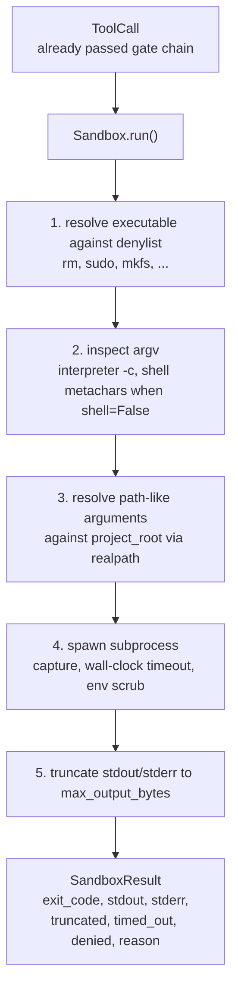
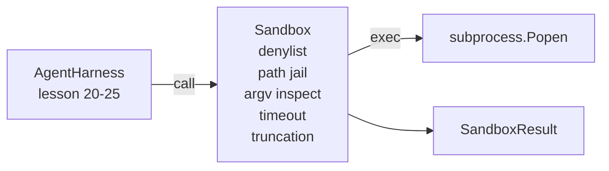

# دراسة كابستون 26: راني صندوق الرمال مع دينيلست و سجن طريق

> بوابة التحقق تقرر ما إذا كان يجب تشغيل مكالمة أداة. الصندوق يقرر ما سيحدث عندما يفعل هذه الدروس ترسل مدربة فرعية العمليات التي ترفض الممارسات الخطرة، ترفض أشكال ARGV الخطرة، تسجن كل مسار الملف إلى جذور المشروع، تقصر الناتج المفرط، وتقتل العمليات الهربة في وقت مع وقف الساعة الحائطية. إنها الثانية من طبقتين تقع بين النموذج والنظام التشغيلي.

**Type:** Build
**Languages:** Python (stdlib)
**Prerequisites:** Phase 19 · 25 (verification gates and observation budget), Phase 14 · 33 (instructions as constraints), Phase 14 · 38 (verification gates)
**Time:** ~90 minutes

## أهداف التعلم

- بناء `Sandbox`غلفة الفصل`subprocess.run`مع وقف الوقت، القبض، وتقصير.
- رفض الأمر باسم ضد دينيليست وبشكل هيكلي ضد مفتش
- رفض أي حجة مسار تحل خارج جذور المشروع المعلن.
- رفض طابعات القذيفة عندما يكون وضع القذيفة مغلق.
- أعد المُهيّئ`SandboxResult`يمكن أن تتناول الملاحظة التدريجية والحزمة التقييمية.

## المشكلة

وكيل التشفير الذي يمكنه أن يخرج من القبو يمكن أن يثبّت الأبواب الخلفية، ويقوم بإخراج المفاتيح، ويعمل على حاسوب محمول للمطور، ويقوم بتجميع فاتورة سحابة في جولة واحدة. الدفاع الأقل تكلفة هو عدم إعطائها قبوة. ثاني أقل تكلفة هو صندوق رمل يقول لا ل قائمة دقيقة من الأنماط.

ثلاث فئات من الفشل تتكرر في آثار العميل.

الأول هو أجهزة تنفيذية خطيرة، نموذج تحت ضغط لإصلاح مشكلة المسار سوف تحاول`sudo`،`chmod -R 777`،`rm -rf`،`mkfs`،`dd`لا أحد من هؤلاء ينتمي إلى عملاء، "دانيلست" يلتقطهم باسمهم و باسم مستعار

الثاني هو خدعة الارغف، النموذج الذي قيل لا قذيفة سوف تنبيه هجوم من خلال مترجم:`python3 -c "import os; os.system('rm -rf /')"`،`bash -c '...'`،`node -e '...'`،`perl -e '...'`يجب أن يعرف المترجم أنّه يعمل مع`-c`- مثل العلم هو مجرد مكالمة قذيفة مع خطوات إضافية.

الثالث هو الهروب من المسار، ويقول النموذج أن يقرأ`./src/main.py`وبدلاً من ذلك يقرأ`../../etc/passwd`الصندوق السريع يحتجز كل نزاع طريق من خلال حل ذلك من خلال`os.path.realpath`و تأكيد المُضاف

لا يعد صندوق الرمل حدودًا أمنية بمعنى النظام التشغيلي. لا يزال بإمكان مهاجم معين مع تنفيذ الرمز أن ينفجر. صندوق الرمل هو حافة وقت التطوير: يجعلها أنظمة الفشل الشائعة صاخبة ويمنع العميل من إلحاق الضرر بسبب عدم كفاءة.

## المفهوم



صندوق الرمل لديه أربعة محورات رفض: اسم، argv، المسار، الهيكل. كل محور هو وظيفة نقية من الدعوة، لا عملية فرعية حتى الآن. تنشأ العملية الفرعية فقط بعد مرور كل محور.

- نعم`SandboxResult`رموز الخروج هي الرمز التقليدي: 0 نجاح، فشل غير صفر، بالإضافة إلى ثلاثة رموز حراسة لرفض (-100) ، وقت_out (-101) ، وتقصر (رمز الخروج هو الحقيقي، مع مجموعة العلامات). دروس أسفل النهر تقرأ هذه النتيجة المهيكلة بدلا من تحليل stderr.

```figure
cg-path-jail
```

## الهندسة المعمارية



المجموعة هي مجموعة من الأسماء الأساسية القابلة للتنفيذ.`/bin/rm`،`/usr/bin/rm`يقرر جميعها إلى نفس الاسم الأساسي. يعرف مفتش argv شكل المترجم: أي argv حيث argv[0] هو مترجم وأي arg لاحقا يبدأ ب`-c`أو`-e`يتم رفضها.`;`،`|`،`&`،`>`،`<`، الظهر ،`$()`) يسبب الرفض عندما لا يطلب الدعوة صراحة قذيفة.

سجن الطريق هو الجزء الأكثر خفية، صندوق الرمل يقبل`project_root`في البناء. أي حجة تبدو كمسار (تحتوي على`/`أو يطابق ملف موجود) يتم تعديلها من خلال `os.path.realpath`إذا لم يكن الهدف المحل تحت الجذر، رفض. يتم حظر محاولات الهروب من Symlink (رابط رمزي في الجذر من المشروع الذي يشير إلى الخارج) عن طريق التحقق من truepath، وليس المسار الحرفي.

## ما ستبني

التنفيذ هو`main.py`بالإضافة إلى اختبارات

1. `SandboxResult`فئة البيانات: exit_code, stdout, stderr, truncated, timed_out, denied, reason, duration_ms.
2. `SandboxConfig`فئة البيانات: project_root، max_output_bytes، timeout_seconds، denylist، interpreter_block.
3. `Sandbox`فئة: `run(argv, *, shell=False, cwd=None)`يعود الـ`SandboxResult`. . .
4. المساعدون الداخليون في رفض:`_check_executable_denylist`،`_check_argv_interpreter`،`_check_shell_metachars`،`_check_path_jail`. . .
5. خفض الخروج مع صافي`truncated`العلم وخط مرشح في التيار المقبض عليه
6. التجربة في الأسفل: سلسلة من المكالمات المشروعة والمعادلة.

الصندوق الرملي يستخدم`subprocess.run`مع`shell=False`بطبيعة الحال و`capture_output=True`. توقيت الساعة الحائطية يستخدم`timeout`الحجة`TimeoutExpired`، يقتل صندوق الرمال مجموعة العمليات و يخلق نتيجة

## لماذا هذا ليس صندوق رمل حقيقي

لا تستخدم مربع الرمل الدروس مساحات الأسماء أو مجموعات أو seccomp أو gVisor أو Firecracker أو أي عزل على مستوى النواة. أي شيء يمكن أن تفعله العملية الفرعية ، يمكن أن تفعله مربع الرمل. الحماية هي هيكلية: يتم رفض العميل الأكثر شيوعاً دعوات خطيرة ، ويتم إصدار رفض صاخب في قابلية للملاحظة بدلاً من التشغيل بصمت.

بالنسبة لعاملات الإنتاج تقوم بتطبيق طبقة فوق: تشغيل داخل حاوية Docker غير محظورة، تشغيل داخل microVM، إمكانات التخلص من، وضع قراءة فقط للعملية الجذر والشقق dir القراءة-الكتابة، وضع حد على الذاكرة والمتحركات المعالجة المركزية، مسح البيئة إلى قائمة بيضاء آمنة معروفة. الدروس 29 تفعل بعض هذا. عزل النظام التشغيلي خارج نطاق هذا الدروس.

## أديرها

```bash
cd phases/19-capstone-projects/26-sandbox-runner-denylist
python3 code/main.py
python3 -m pytest code/tests/ -v
```

يقوم المشاهد بإنشاء دليل مؤقت، ويقوم بإلقاء ملف نظيف فيه، ثم تشغيل بطارية من المكالمات. النجاح المكالمات القانونية. المكالمات التي تم رفضها تعود إلى SandboxResult مع `denied=True`وسبب، تعود التوقيت`timed_out=True`. مجموعات التقطيع`truncated=True`. الظهور يطبخ جدول JSON من النتائج و يخرج من الصفر.

## كيف يتوافق هذا مع بقية المسار A

دروس 25 أنتج سلسلة البوابة. دروس 26 هي المنفذ الذي يعمل بعد بوابة المسموح بها. دروس 27 تقارن حزمة تقييم نتائج مربع الرمل مع رمز الخروج المتوقع لكل مهمة. دروس 28 ينبعث `gen_ai.tool.execution`يمتد حول كل واحد `Sandbox.run`التدعو، التجربة المشتركة في الدروس 29 تُشغل وكيلًا حقيقيًا للتشفير عبر كلا الطبقتين
