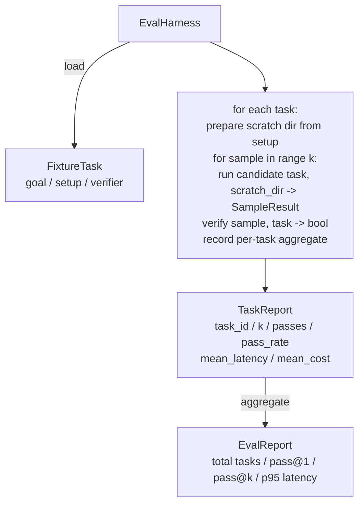

# دراسة الحجر الرئيسي 27: التسجيل المتكامل مع المهام الثابتة

> وكيل التشفير جيد فقط بقدر مجموعة المهام التي تقيسها هذا الدروس يبني حزمة تقييم تأخذ مجلد من المهام الثابتة، ويعمل كل من خلال وكيل مرشح، والنقاط تمر أو تفشل من خلال مؤكد تحديد، ويتجمّع النتائج إلى pass@1, pass@k، متوسط التأخير، والتكلفة المتوسطة. الحزام هو مصدر الحقيقة الذي يسمح لك أن تعرف عكس من المعدل.

**Type:** Build
**Languages:** Python (stdlib)
**Prerequisites:** Phase 19 · 25 (verification gates), Phase 19 · 26 (sandbox runner), Phase 14 · 30 (eval-driven agent development), Phase 14 · 19 (SWE-bench and GAIA benchmarks)
**Time:** ~90 minutes

## أهداف التعلم

- تعريف مهمة الثابتة كثلاثة من الهدف، الإعداد، والتحقق.
- تسجيل عدة أداءات عينات لكل مهمة وحساب pass@1 و pass@k.
- جمع التأخير والتكلفة إلى متوسط و 95 بالمئة
- التحققات المحددة (مختلف الملف، رمز الخروج، مطابقة regex) في وظائف قابلة لإعادة الاستخدام.
- إصدار تقرير JSON مهيكل يمكن أن تتناول الكتب المتابعة للعودة.

## المشكلة

ثلاثة أوضاع فشل مؤشرات الموازنة المُصنعة بدون قناة تقييم

الأول هو مرور غير مؤكد. يقول العميل أنه صعد الحذاء، والنظرة البشرية على الاختلاف، ويتم وضع علامة خضراء، وبعد ثلاثة أسابيع من اختبار التراجع يظهر نفس الحذاء.

الثاني هو التراجع غير الكشف عنه. تغيير على القالب الإستعلامي يجعل الوكيل أفضل بنسبة 4% في المهمة الصاخبة وأسوأ بنسبة 14% في المهمة الهادئة. بدون مجموعة ذهبية ونقطة لكل مهمة، يذهب التراجع إلى الرئيسي ويظهر فقط عندما يشكو العميل.

الثالث هو التحرك لكل مهمة. تم إجراء التقييم يوم الاثنين مع 100 مهمة والجمعة مع 95 منهم، لأن شخص ما غير اسم خمسة معدات. معدل الانتقال يبدو مثل تحسن 5٪. ليس كذلك.

الحزام هو البرنامج الذي يحول هذه الفشل إلى حقائق، وهو يعمل كل مرة، في ترتيب قابل للتكرار، ضد مؤكد يعود صحيح أو خاطئ على التحقق التحديدي.

## المفهوم

```mermaid
flowchart LR
  F1[fixtures/task_001/<br/>task.json + expected/] --> Harness
  F2[fixtures/task_002/<br/>...] --> Harness
  Harness[Harness<br/>for each task:<br/>setup / run agent k samples /<br/>verify each sample /<br/>record latency, cost]
  Harness --> Report[EvalReport<br/>pass@1 / pass@k<br/>mean ms / p95 ms<br/>mean cost]
```

أ`FixtureTask`هو ملف JSON صغير بالإضافة إلى اختياري `expected/`الإرشادات. JSON يعلن `id`، أ`goal`(المساعدة التي تم إعطائها للعميل) ،`setup`الكتلة (ملفات تسقط في الرمض dir) ، و `verifier`كتلة. كتلة التحقق تسمى وظيفة في سجل التحقق من الحزمة وتقدم حججها.

تشمل ثلاثة أشكال للتحقق معظم المهام المفيدة.

الأول هو`file_equals`بعد تشغيل الوكيل، مقارنة الملف المسمى مع المحتوى المتوقع. هذا يلتقط "صلاح هذه الأخطاء بهذه الطريقة بالضبط" المهام.

الثاني هو`regex_match`. محتويات الملف المسمى تتطابق مع regex. هذا يلتقط "العمل يجب أن يكون موجودا ويعود X" المهام حيث هناك العديد من الحلول المقبولة.

الثالث هو`shell_exit_zero`. يقوم الحزام بتشغيل أمر القذيفة (من خلال صندوق الرمل من الدروس 26) ويجتاز المهمة فقط إذا خرجت اللعبة من الصفر. هذا يلتقط مهام "يجب أن تتجاوز الاختبارات".

الحزام يدير كل مهمة`k`أوقات.`1 - (1 - p)^k`حيث p هو معدل مرور تجربي؛ ويقوم الحزم أيضا بتقديم حسابات خامة حتى تتمكن من اكتشاف التباين. التأخير هو ساعة جدارية لكل عينة. التكلفة هي ما يبلغ عنه العميل نفسه (عدد الوهم، أو الدولارات الأمريكية، أو كليهما). يجمع الحزمة ذلك عبر العينات ويقدم الأرقام لكل مهمة والجمع.

```figure
pass-at-k
```

## الهندسة المعمارية



المرشح هو المطلوب:`Callable[[FixtureTask, str], SampleResult]`. الحزام يخلق دليل الخدشة عبر `tempfile.mkdtemp()`ويمر مساره كسلسلة بسيطة. لا يهم كيف يعمل المرشح. يمكن للمرشح أن يكون مقدمًا للتطبيق المزج المحدد (المفيد لاختبارات الذاتية للسلسلة) ، وكيل LLM الحقيقي ، ومضغ. العقد هو SampleResult.

## ما ستبني

`main.py`السفن:

1. `FixtureTask`فئة البيانات
2. `SampleResult`فئة البيانات: success_self_reported، latency_ms، cost_units، تحرير.
3. `TaskReport`،`EvalReport`فئات البيانات مع `to_dict()`. . .
4. `VerifierRegistry`اسم المحقق لتحديد المواقع. المحققين المدمج: file_equals، regex_match، shell_exit_zero.
5. `EvalHarness`يدير دليل المهام ضد المرشح يعيد EvalReport
6. خمسة مهام ثابتة مرتبطة في `tasks/`:
   - - من الواحد إلى الآخر`fizzbuzz`
   - المفقودين في العودة`factorial`
   - خطأ في رسالة الخطأ
   - جسم وظيفة فارغة
   - التقاطع الواحد إلى الواحد في القائمة المرتبطة
7. مرشح مرجعية تحديدية (`apply_known_fixes`) يستخدم الحزام لإظهار مرور نظيف1 من 1.0.
8. يطبخ Demo JSON من EvalReport و يخرج من الصفر.

يتم جمع مهام المثبتات كملفات JSON في `tasks/`بالإضافة إلى ملفات المصدر المزدوجة في `tasks/<id>/buggy/`و`tasks/<id>/expected/`.الخطوط نسخ البغجي في خدش القرف، يمنحه للمرشح، ويتحقق ضد المتوقع.

## لماذا تمر و لا تمر فقط

وكلاء LLM الحقيقيون متواضعون. يبدو أن الاختبار 1 من 0.6 فشل. يقول الاختبار 5 من 0.95 أن الوكيل يحصل على الإجابة الصحيحة في معظم الأحيان لكنه يختار خطأ في العينات المبكرة. التحدي هو أخذ العينات والتصنيف، وليس دائمًا المزيد من التدريب. Pass@k يجعل ذلك مرئيًا.

يتم الإبلاغ عن Pass@k إلى جانب pass@1 لأن pass@k يكتب عن فشل حقيقي: إذا حصل النموذج على الإجابة الصحيحة مرة واحدة في كل عشرين محاولة، فلن يكون لديك عامل مفيد. يظهر الحزام كليهما.

## كيف يتوافق هذا مع بقية المسار A

دروس 25 أنتجت سلسلة البوابة دروس 26 أنتجت صندوق الرمال`shell_exit_zero`التحقق. الدروس 28 تغلف كل إطار تشغيل في تعقب OTel. الدروس 29 تشغيل إظهار نهاية إلى نهاية ضد واحدة من الأجهزة المجمعة وتؤكد أن مرر@1 = 1.0 للمرشح المرجعي.

## أديرها

```bash
cd phases/19-capstone-projects/27-eval-harness-fixture-tasks
python3 code/main.py
python3 -m pytest code/tests/ -v
```

يطبخ التجربة تقرير EvalReport في JSON ، بما في ذلك pass@1 ، pass@5 ، متوسط التأخير ، وتقسيم لكل مهمة. رمز الخروج هو صفر. تغطي الاختبارات وظائف المؤكد ، والرياضيات pass@k ، وتحميل المكونات ، والإستخدام من نهاية إلى نهاية ضد مرشح المرجع المجمع.
