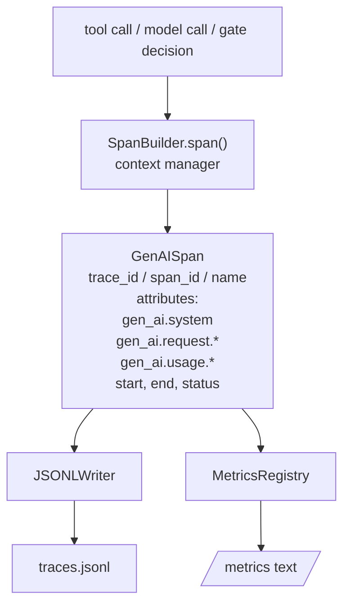
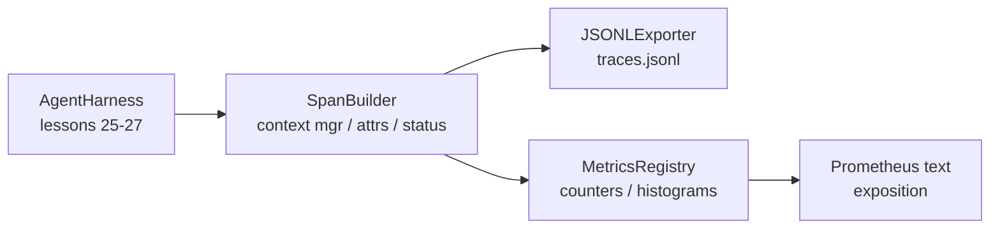

# دراسة كابستون 28: قابلية الملاحظة مع OTel GenAI Spans و Prometheus Metrics

> تعتبر مجموعة العملاء دون قابلية للملاحظة مربع أسود يكلف المال. هذه الدروس تدور يدويًا على مبدع المدة التي تنشر سجلات تتوافق مع اتفاقيات OpenTelemetry GenAI التفصيلية ، وتكتبها في ملف JSON-Lines مدى واحد لكل سطر ، وتكشف العدادات والهستوجرامات في شكل نص Prometheus. كل شيء هو stdlib Python ويجري خارج الاتصال.

**Type:** Build
**Languages:** Python (stdlib)
**Prerequisites:** Phase 19 · 25 (verification gates), Phase 19 · 26 (sandbox), Phase 19 · 27 (eval harness), Phase 13 · 20 (OpenTelemetry GenAI), Phase 14 · 23 (OTel GenAI conventions)
**Time:** ~90 minutes

## أهداف التعلم

- بناء فئة بيانات المدة التي تشكل على اتفاقيات OpenTelemetry GenAI التعريفية.
- تنفيذ مصدر JSONL يكتب فترة واحدة مستقلة لكل سطر.
- قم ببناء العدادات والهستوجرامات مع العلامات و التعرض على شكل نص Prometheus.
- لف أي مكالمة في مدير سياق المدة التي تسجل المدة والحالة والإستثناءات.
- تأكد من أن المدى المنبعث يذهب ذهاباً وإياباً`json.loads`و تتناسب مع شكل المواصفات

## المشكلة

وكيل التشفير في الإنتاج ينتج ثلاث فئات من الأدوات في كل دور: دعوة نموذجية، تنفيذ أداة، وقرار بوابة التحقق. لا شيء من هذه مفيد دون قياسات التلفاز المهيكلة.

النظام الأول الفشل هو البصمة المفقودة. حدث خطأ ما يوم الثلاثاء ولكن السجل الوحيد هو سجل الدردشة 500 سطر. لا يوجد سجل عن أداة تشغيل، كم استغرق، كم رموز دخلت في الإشارة، أو ما إذا كان البوابة رفضت أي شيء. يجب على المؤلف الوكيل أن يخمن.

النظام الثاني للخلل هو البصمة غير المرئية. كتب الحبل المنتجات ولكن استخدم أسماء الحقول الخاصة به. لا شيء في Grafana، Honeycomb، Jaeger، أو CLI المحلي يمكن قراءتها. أي أدوات موجودة في كومة الفريق يتم إهدارها لأن المنتجات غير قياسية.

النظام الثالث للخلل هو المقياس غير المجمّع. يمكنك رؤية مكالمة واحدة بطيئة في أداة التتبع، ولكن لا يمكنك الإجابة على "ما هو تأخر p95 من مكالمات read_file خلال الساعة الأخيرة؟" لأنه لا توجد مقاييس، فقط آثار.

توجد اتفاقيات OpenTelemetry GenAI الدلالية لهذا بالضبط. وهي تحدد مجموعة صغيرة من الصفات القياسية التي يتشاركها المذاعب عبر إطاريات LLM. إذا كتب الحزام هذه الصفات ، يمكن لكل خلفية متوافقة مع OTel قراءتها.

## المفهوم



كل عملية في الحزام تنتج فترة. فترة لديها رقم تعقب (تدعو الوكيل كله) ، رقم فترة (هذا العمل واحد) ، اسم (مثل `gen_ai.chat`،`gen_ai.tool.execution`), وصفات تتبع اتفاقيات GenAI، وقت البدء والنهاية، وحالة.

تقييم اتفاقيات جناي هذه مفاتيح الصفات: `gen_ai.system`(أي مزود، على سبيل المثال `anthropic`،`openai`()`gen_ai.request.model`(مصدر النموذج)`gen_ai.request.max_tokens`،`gen_ai.usage.input_tokens`،`gen_ai.usage.output_tokens`،`gen_ai.response.model`،`gen_ai.response.id`،`gen_ai.operation.name`، بالإضافة إلى مفاتيح محددة للأدوات `gen_ai.tool.name`و`gen_ai.tool.call.id`. . .

يكتب المصدر JSONL. يكتب جسم JSON واحد لكل سطر. هذا هو أبسط شكل ممكن يمكن أن تدفق الأدوات المتدفقة على التيار والتشغيل والاستيراد. المصدر الحقيقي OTel يتحدث GRPC OTLP. مصدر JSONL الدروس هو المكافئ خارج الاتصال وتخرج من الصفر على كل محطة عمل.

المقاييس تعيش بجانب آثار. زيادة مضادة على كل مكالمة أداة: `tools_called_total{tool="read_file"}`. سجلات التأرجحات تُسجل التأخير الملاحظ: `tool_latency_ms{tool="read_file"}`. كلتا التسلسل إلى نمط تعليق نص Prometheus ، وهو المعيار الفعلي للمقاييس القائمة على الجذب.

```figure
trace-spans
```

## الهندسة المعمارية



إنّ بناء الدرجة هو فئة صغيرة مع`span(name, attrs)`طريقة تعيد مدير السياق. مدير السياق يسجل وقت البدء عند الدخول، يسجل وقت النهاية عند الخروج، يرفع استثناءً إذا تم رفع واحد، ويدفع المدة النهائية إلى المصدر.

سجل المقاييس هو اثنين من القوائم.`{(name, frozen_labels): int}`. الحاسوبات الحاسوبية تحتفظ بالعينات الخام في قائمة وتسلسل إلى علبة الحاسوبات الحاسوبية Prometheus في وقت التعرض.

## ما ستبني

`main.py`السفن:

1. `GenAISpan`فئة البيانات: trace_id، span_id، parent_span_id، الاسم، الصفات، start_unix_nano، end_unix_nano، الحالة، status_message، الأحداث.
2. `SpanBuilder`الفصل مع`span(name, attrs, parent=None)`مدير السياق
3. `JSONLExporter`الفصل مع`export(span)`هذا يضيف خط واحد.
4. `Counter`و`Histogram`الفصول بالإضافة`MetricsRegistry`. . .
5. `prometheus_exposition(registry)`التي تنتج النسخة النصية.
6. `wrap_tool_call(name)`المزخرف الذي ينبعث من فترة وتحديث المقاييس.
7. Demo: يجمع دعوة وكيل كاملة (gen_ai.chat span حول أدوات التدريب) ، ويكتب traces.jsonl، طبع تعريفة Prometheus، وتخرج من الصفر.

إن هوية المدى و هوية العثور هي سلسلة شيكس 16 بايت، تم إنشاؤها من `os.urandom`هذا يطابق سياق تعقب OTel W3C المصدر لا يرمي أبداً، يتم إظهار أخطاء IO ولكن الحزام لا يزال يعمل.

يحتوي النظام على مجموعة علبة ثابتة (تعداد OTel الافتراضي للتخفيف في الأثنين: 5 ، 10 ، 25 ، 50 ، 100 ، 250 ، 500 ، 1000 ، 2500 ، 5000 ، 100 ، + إنف). يتم تخزين العينات كقائمة ؛ يحسب التعرض على الطلب حسابات لكل علبة.

## لماذا يُدحَرُ بدلاً من openlemetry-sdk

تعتمد أوتل بايثون SDK على حقيقة. كما أنها عبارة عن عدة آلاف من الخطوط من الكود، وعمليات متعددة لمصدر OTLP، وتكلفة وقت تشغيل التي تغمر ميزانية الدروس. يدرس الإصدار المتحرك يدويا تنسيق الأسلاك. في الإنتاج تقوم بتشغيل نفس الصفات في أوتل بايثون SDK الحقيقي والحصول على مصدر OTLP، والحصائح، وكشف الموارد مجانا.

الاتفاقيات مستقرة. تنسيق الأسلاك الذي ينبعث منه الدروس سيستمر في التحليل في عام 2030 لأن OTel لا يكسر أسم سمات GenAI أبداً؛ فإنها فقط تضيف صفات جديدة.

## كيف يتوافق هذا مع بقية المسار A

دروس 25 أنتجت سلسلة البوابة. دروس 26 أنتجت صندوق الرمل. دروس 27 أنتجت قناة تقييم. دروس 28 تجعل الثلاثة قابلًا للملاحظة. دروس 29 تغلف كل خطوة من الإعلان النهائي إلى النهائي في فترات وتطبيق نص Prometheus في النهاية.

## أديرها

```bash
cd phases/19-capstone-projects/28-observability-otel-traces
python3 code/main.py
python3 -m pytest code/tests/ -v
```

الظهور يُصدر`traces.jsonl`في الدروس العمل dir (منظف في نهاية) ، ثم طباعة عينة من ثلاثة فترات، ثم طباعة تعريض Prometheus للعداد والهستوغرامات. التجارب تثبت أن فترات التسلسل رحلة ذهاب وإياب، أن صفات GenAI القنوني موجودة، التي تعدد الزيادة بشكل صحيح، وأن تعريض الهستوغرام يحتوي على العدادات المتوقعة.
