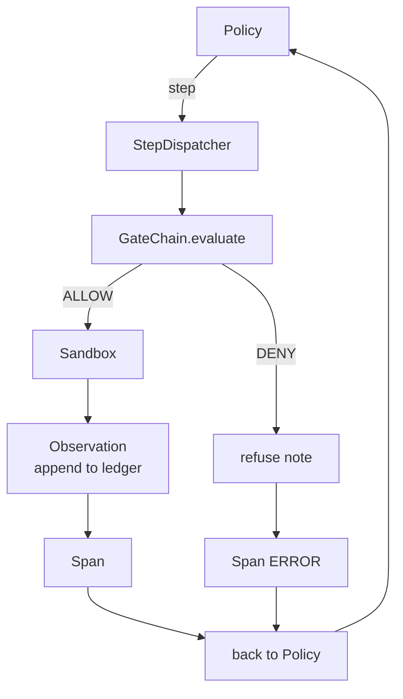

# دراسة كابستون 29: وكيل التشفير من نهاية إلى نهاية على الحزام

> ثمن المسار "أ". هذه الدروس تسحق سلسلة البوابة، صندوق الرمل، حزمة تقييم، وتمتد OTel إلى وكيل تشفير واحد يعمل الذي يصلح خطأ حقيقي (صغير، على نطاق ثابت) في مشروع Python متعدد الملفات. الوكيل هو سياسة تحديدية، وليس ماجستير في التدريبات، والبدل يجعل الدروس قابلة للتكرار ويظهر أن الحزام كان الجزء المثير للاهتمام طوال الوقت. العقد هو نفسه: نموذج حقيقي يضبط في سيل السياسة.

**Type:** Build
**Languages:** Python (stdlib)
**Prerequisites:** Phase 19 · 25 (verification gates), Phase 19 · 26 (sandbox), Phase 19 · 27 (eval harness), Phase 19 · 28 (observability), Phase 14 · 38 (verification gates), Phase 14 · 41 (workbench for real repos), Phase 14 · 42 (agent workbench capstone)
**Time:** ~90 minutes

## أهداف التعلم

- قم بتجميع سلسلة البوابة، صندوق الرمل، وسلسلة تقييم، ومدفوعة البناء في حلقة عامل واحدة.
- تنفيذ سياسة تحديدية تستخدم read_file و run_tests و write_file لإصلاح خطأ في الجهاز.
- تنفيذ ميزانية خطوة عالمية بالإضافة إلى ميزانية رمزية للملاحظة على مدار المشاريع من نهاية إلى نهاية.
- إصدار أثر OTel GenAI كامل ومقاييس Prometheus للوصول الكامل.
- التحقق من أن الوكيل يحل المصلحة في أقل من 12 خطوة مع صفر من الخروج على أدوات قانونية.

## المشكلة

معظم نماذج العملاء تعمل بشكل معزول: صندوق رمل لوحده، حزمة تقييم لوحدها، إمتصاز فاصل لوحده. تبدو جيدة. قم بتجميعها وتظهر الخياطة.

السلسلة تقول "أسمح" لكن صندوق الرمل يرفض لسبب لم يتوقعها السلسلة القنبلة التقييمية تسجل المرور لكن البوابة تقول أن البوابة رفضت أداة الوكيل يدعي أنها استخدمتها يتم زيادة العداد Prometheus مرتين عندما يجب زيادة مرة واحدة. تم تجاوز ميزانية المراقبة لكن العميل استمر في العمل لأن الميزانية تم تعقبها في السلسلة ولم يعرف صندوق الرمل

هذه الدروس هي اختبار التكامل لسلسلة كاملة. يجب على الوكيل القيام بأربعة أشياء من أجل: قراءة المشروع، تشغيل الاختبارات، تحديد الأخطاء من فشل الاختبار، كتابة الإصلاح، إعادة تشغيل الاختبارات، والوقف. كل عملية تمر عبر سلسلة البوابة. كل تنفيذ أداة تمر عبر صندوق الرمال. كل خطوة مغلفة في فترة. تسجل الحزمة التقييم كل شيء في النهاية.

## المفهوم

```mermaid
flowchart TD
  Repo[Repo fixture<br/>src/fizz.py buggy<br/>tests/test_fizz.py] --> Harness
  Policy[Policy<br/>deterministic stand-in<br/>for the model] -->|tool call| Harness
  Harness[Harness<br/>gate chain / sandbox<br/>span builder / observation ledger] -->|observation| Policy
  Harness --> Out[EvalReport + JSONL<br/>+ Prometheus exposition]
```



سياسة العميل هي آلة الولاية خمسة ولايات

`SURVEY`: العميل يقرأ قائمة المشروع. الحالة التالية هي RUN_TESTS.

`RUN_TESTS`إذا تمت الاختبارات، فإن آلة الحالة تتوقف بنجاح. وإلا فإن الحالة التالية هي INSPECT.

`INSPECT`: العميل يقرأ الملف المصدر الفاشل. الحالة التالية هي إصلاح.

`FIX`الوكيل يكتب الملف المصحّح، والحالة التالية هي VERIFY.

`VERIFY`إذا تمت الاختبارات، توقف النجاح، وإلا توقف مع الفشل.

تتوافق كل حالة مع مكالمة أداة. كل مكالمة أداة تمر عبر سلسلة البوابة. إذا تم رفض مكالمة أداة، يقوم الوكيل بإبلاغ الرفض في المسار ويقف.

حشوة الجهاز هي واحدة واحدة في`fizz.py`. تكتشف السياسة التحديدية الفشل من رسالة فشل الاختبار عبر regex وتصدر الملف المصحح. لا يغير استبدال السياسة بموجب LLM عقد الاستغلال.

```figure
cg-harness-weave
```

## الهندسة المعمارية



الدروس هي ذاتية. كل دروس سابقة بدائية يتم إعادة تنفيذها على نطاق أدنى في`main.py`(بوابة، مربع الرمل، دفتر التسجيل، فترة) لذلك الدروس تعمل دون استيراد الأخوة والأخوات. الأسماء تتطابق الدروس 25-28 بالضبط حتى الخرائط المفاهيمية غير واضحة.

## ما ستبني

`main.py`السفن:

1. أساسيات الحزمة الحد الأدنى، نسخة بنفس الأسماء التي كانت في الدروس 25-28:`GateChain`،`Sandbox`،`ObservationLedger`،`SpanBuilder`،`MetricsRegistry`. . .
2. `CodingAgentPolicy`فئة: آلة الدولة مع خمسة دولة.
3. `Repo`المساعد: يعد خدشًا مع جهاز الحافلة المجمّع.
4. `AgentRun`فئة: تدفع السياسة، تنقل عبر الحزام، تعيد `AgentRunReport`. . .
5. (مصنع مشترك)`fixture_repo/`) مع src/fizz.py، tests/test_fizz.py، و شجرة متوقعة/ للقاعدة التقييم.
6. التجربة: تشغيل السياسة من نهايتها إلى نهايتها، طباعة خطوة خطوة، يؤكد المرور، طباعة المقاييس.

يحتوي الإصلاح المجمّع على نفس الشكل الذي يتمتع به هيكل المهمة في الدروس 27: ملف حثثث وملف اختبار. تحتوي رسالة فشل الاختبار على معلومات كافية لسياسة التحديد لتحديد الإصلاح. سوف يقوم ماجستير في مجال التدريب الحقيقي بنفس العمل، ببطء وأكثر استدعاءً، لكنه لن يغير توقعات الحزمة.

## لماذا السياسة ليست ماجستير في مجال حقوق

يتطلب ماجستير دراسة الحقوق الحقيقي مفتاح API ، ودعوة الشبكة ، والإستوكاستية غير المثبتة. الحبل هو الجزء الذي يهتم به الدروس. إضافة في سياسة تحديدية تسمح للدرس بالتشغيل على أي جهاز كمبيوتر محمول للمطور مع صفر الاعتمادات الخارجية وتسمح لمجموعة الاختبار بتأكيد حسابات الخطوات الدقيقة.

سياسة الدروس هي مجموعة فرعية صارمة لما يفعله وكيل LLM. تقرأ السياسة الإجراءات، وترى الاختبار الفاشل، وتحدد الخط، وتصدر تصحيحًا. يمر LLM في نفس الحلقة مع نفس عقد الاستخدام؛ والحاسبة هي نفسها.

## ما يزعم الظهور

التجربة من نهاية إلى نهاية تؤكد خمسة أشياء في وقت الخروج، و مجموعة الاختبار تؤكد لهم برنامجيا.

لقد حلّت السياسة المشكلة في أقل من 12 خطوة.

لم يتم تجاوز ميزانية الملاحظة أبداً

إنكارات بوابة صفر تم إطلاق النار عليها على أدوات قانونية

كل خطوة لها فترة متوافقة في الأثر. jsonl.

تعرض "بروميثيوس" يحتوي على`tools_called_total{tool="read_file"}`الدخول و`tool_latency_ms`(هستوجرام)

## كيف يتوافق هذا مع بقية المسار A

هذه الدروس هي التكامل. درس 25 كتب سلسلة البوابة. درس 26 كتب صندوق الرمل. درس 27 كتب حزمة تقييم. درس 28 كتب قابلية الملاحظة. درس 29 يثبت أنها تعمل كنظام. يمتد حزمة وكيل حقيقي من هنا: تبادل السياسة التحديدية لنموذج، تبادل المصلحة المجمعة لمهمة ريبو الحقيقية، تبادل مصدر JSONL ل OTLP.

## أديرها

```bash
cd phases/19-capstone-projects/29-end-to-end-coding-task-demo
python3 code/main.py
python3 -m pytest code/tests/ -v
```

يطبخ التجربة تعقب لكل خطوة ، وتقرير التقييم النهائي ، وتعليق Prometheus. رمز الخروج هو صفر. تغطي الاختبارات عمليات انتقال حالة السياسة ، ورفض البوابة على مكالمات الأدوات الاصطناعية ، والعمل من نهاية إلى نهاية على الجهاز المجمّع ، والمتغيرات الميزانية الخطوة.
