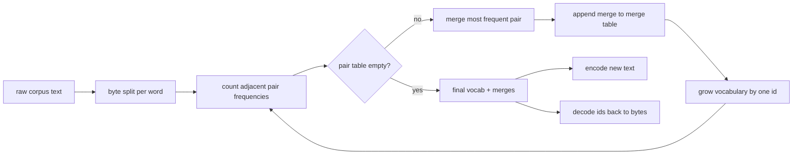
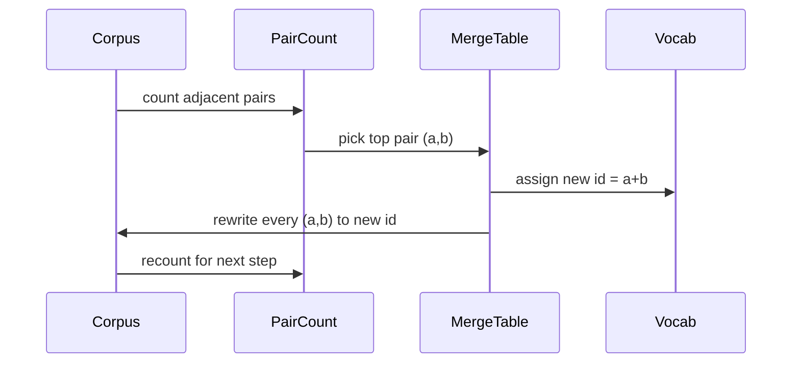

# برنامج BPE Tokenizer من الصفر

> البايتات داخل، والهوية خارج، والهوية مرة أخرى إلى نفس البايتات. بناء الوهم الذي كل نموذج نص الحديث لا يزال يبدأ من.

**Type:** Build
**Languages:** Python
**Prerequisites:** Phase 04 lessons, Phase 07 transformer lessons
**Time:** ~90 minutes

## أهداف التعلم
- تدريب كلمات تشفير بايت-بير من مجموعة نصية خامة من خلال دمج زوج الرمز المجاور الأكثر شيوعا مرارا.
- تنفيذ جدول مزيج تحديدي وتطبيقه على النص الجديد لإنتاج تيار من أرقام تعريف الكلمات الفرعية.
- إدخال UTF-8 التعسفي للجهات الهوية والعودة دون فقدان المعلومات.
- احتفظ بحماية الرموز الخاصة (`<|endoftext|>`،`<|pad|>`) حتى يتمكنوا من البقاء على قيد الحياة من خلال التدريب و فك الكود.
- سبب لماذا الأبجدية على مستوى البايت هي الطابق المناسب لتكون علامة عامة

```figure
cap-bpe-merge
```

## الإطار

نموذج اللغة لا يرى أبدا النص. فإنه يرى الأرقام الكاملة. الخريطة من سلسلة إلى قائمة الأرقام الكاملة والخلف هو الوهم. الحصول على هذه الطبقة خطأ وكل منحنى الخسارة في التدريب يقياس الشيء الخطأ.

العائلة المهيمنة من علامات الكلمات الفرعية لنماذج النص العامة هي تشفير بايت زوج. الفكرة صغيرة. ابدأ من الأبجدية المعروفة. ابحث عن زوج الرمز المجاور الذي يظهر في الغالب في مجموعة التدريب. دمجها في رمز جديد. كرر حتى تصل المفردات إلى حجم الهدف. تشفير النص الجديد يستخدم نفس قائمة الاندماج في نفس الترتيب.

سنقوم ببناء التغير على مستوى البايت. الأبجدية هي 256 بايت خام، وليس نقاط رمز يونيكود. هذا الخيار هو ما يسمح للمؤشر بتعامل أي إدخال UTF-8 دون أن يعود إلى رمز مجهول.

## خط الأنابيب



الجانب التدريبي وجانب الإستنتاج يشتركون في الجدول المشترك. هذا المشاركة هو العقد. إذا قمت بتغيير ترتيب الإستنتاج في الإستنتاج، تقوم بتشخيص تيار مختلف من الهويات.

## الحرف البايت

يتم احتياط أول 256 هوية للبايتات الخام 0x00 إلى 0xFF. وهذا يضمن أن كل سلسلة مدخل يمكن أن تعبر عنها في المفرد قبل أي مزيج يحدث. بعد حظر البايت نحتفظ بمدى صغير للوكنات الخاصة. لا يقترح حلقة التدريب هذه الهوية كمستهداف مزيج لأننا نبقيها خارج التيار المُقبل من التوكينية بالكامل.

ينفصل المُحذف المُسبق على الفضاء الأبيض على حدود التقاطيح قبل أن يراه التدريب. دون ذلك الفصل خطوة دمج BPE سوف تتعلم بسهولة الاندماج التي تتعبر حدود الكلمات ويملأ المفرد مع عبارات مشتركة كاملة. مع الانقسام، تبقى الاندماج داخل كلمة والنتيجة تعميم.

## حلقة التدريب

لكل خطوة تدريبية تقوم الحلقة بثلاث أشياء. إنها تمشي كل كلمة في الجسم وتحسب عدد مرات ظهور كل زوج من الرموز الحالية المجاورة ، وموزنًا بمدى ظهور الكلمة نفسها. فإنها تختار الزوج الذي يحتسب أعلى عدد. فإنها ترجع كل حدث من تلك الزوجة إلى رمز جديد واحد يكون الهوية مفتوحًا التالي في المفرد. ثم تسجل الاندماج.



تكلفة كل خطوة خطية في حجم الجسم المعبور كقائمة من تسلسلات الرمز. بالنسبة لمليون كلمة ومفردات هدف من عشرة آلاف هوات ، يصل الحلقة إلى الانتهاء في ثوان لأن تسلسلات الرمز تقلص مع دمجها.

## تشفير النص الطازج

لا تدعو إيجابية مقعد الاندماج. إنها تطبق جدول الاندماج بنفس الترتيب الذي تعلمته. بالنسبة لكلمة جديدة يبدأ المرموز من قسم البايت. فإنه يصفح التسلسل الحالي للحصول على أقل ترتيب من الاندماج (الأول الذي ينطبق). فإنه يقوم بتدقيق ذلك الاندماج. فإنه يصفح مرة أخرى. تنتهي الحلقة عندما لا يطبق أي اندماج في الجدول على التسلسل الحالي.

التنظيم حسب الرتب هو الملكية التي تجعل التشفير محددًا وتطابق سلوك التدريب على نفس المدخل. يجلس الاندماج الذي تم تعلمه أولاً في أعلى الجدول ويطبق أولاً. إذا تم تطبيق إدماجين في نفس الموقف ، فيمكنه الاندماج الأدنى.

## الرموز الخاصة

الرموز الخاصة هي هويات لا يمكن أن تنتجها تدفق البايت. نحن نحتفظ بها يدويا. اثنان كافية لهذا الدروس.

- `<|endoftext|>`يفرق الوثائق أثناء التدريب. يخبر النموذج "وثيقة جديدة تبدأ هنا، لا تدع سياق السابق يسرق".
- `<|pad|>`يملأ سلسلة قصيرة حتى تكون اللحظة مضغوطة مستطيلة. قناع الخسارة يخفيها أثناء التدريب.

يقبل المُشفّر العلم لسمح بطاقات خاصة في المدخل. مع إيقاف العلم، فإن السلاسل `<|endoftext|>`و`<|pad|>`يتم تعريفها باستخدام البايتات التي تحددها مع إشعال العلم، يتم رسم السلاسل الحرفية إلى أجهزة الهوية المحجوزة ولا تخضع لأي اندماج.

## ضمان الرحلة ذهابًا وإيابًا

يجب أن يعيد التشفير التشفير البايتات المدخلة بالضبط. يقوم المشفير بتجمع امتداد البايتات لكل معرف في ترتيب. نظرًا لأن كل معرف هو إما بايت خام أو امتداد إماطين معروفين مسبقاً ، ينتهي التوسع التجاري دائمًا في بايتات خام. يقوم التشفير بعد ذلك بإرجاع سلسلة UTF-8 التي تحدد تلك البايتات.

مجموعة الاختبارات في هذا الدروس تحقق من هذه العلاقة على جملة غير مرئية، على جملة مع إموجي يونيكود، وعلى جملة تحتوي على حرفية `<|endoftext|>`إشارة

## ما لا يفعله هذا الدروس

لا تقوم ببناء جهاز تحديد التكنولوجيا القائم على regex على أسلوب أكبر جهاز تحديد التكنولوجيا الإنتاج. المُحَرِّرُ هنا هو مساحةٌ صغيرةٌ من الفضاءِ الأبيضِ و التقاطع. يكفي أن تنتج اندماجًا معقولًا على مجموعة تدريبية صغيرة والعقد مع بقية سلسلة الدروس يبقى نفسه. دراسة التالية تعامل مع الوسيط كصندوق أسود وتبني مجموعة بيانات النافذة المنزلقة فوقه.

لا يوازي عد الأزواج. حلقة في بايثون على مجموعة من بضعة آلاف الكلمات تنتهي في أقل من ثانية. بالنسبة إلى الكوربوس الأكبر الحركة الواضحة هي احتساب أزواج لكل كلمة بالتوازي وتقليل.

## كيفية قراءة الرمز

`main.py`يحدد أربعة أشياء`BPETokenizer`يحتوي على المفردات، جدول الاندماج، و جدول الوهم الخاص. `train`هو حلقة التدريب`encode`هو طريق الاستنتاج`decode`هو سلسلة البايت. التجربة في الأسفل تدرب رمز صغير على الجسم المدمج ، وتشفير جملة متواصلة ، وتشفر الهويات مرة أخرى ، وتطبيع كليهما.`code/tests/test_bpe.py`قم بتحديد خصائص الرحلة ذهابًا وإيابًا، وحجز رموز خاصة، وتصنيف الاندماج.

إشغال العرض التجريبي ثم قم بتغيير حجم المفردات المستهدفة في العرض التجريبي من 300 إلى 600 ومشاهدة كيف ينخفض طول الحكم المشفّر. هذا المنحنى هو منحنى ضغط BPE.
