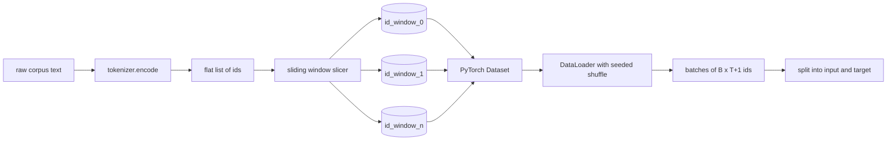
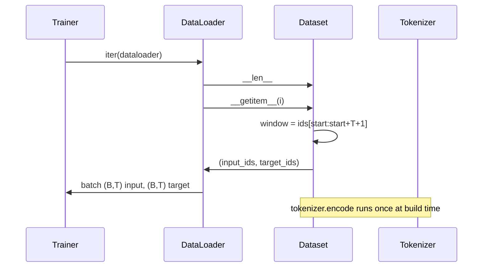

# مجموعة بيانات مع علامات مع نافذة تنزلق

> عملية التدريب هي وظيفة من أوراق الهوية إلى التراجع. هذه الدروس تبني الناقل الذي يغذى على أوراق الهوية.

**Type:** Build
**Languages:** Python
**Prerequisites:** Phase 04 lessons, Phase 07 transformer lessons, Lesson 30 of this phase
**Time:** ~90 minutes

## أهداف التعلم
- حول الجسم الخام إلى سلسلة من الهويات الوهمية عن طريق الاتصال بـ "التوكينيزر" مرة واحدة.
- قطع تيار الهوية في نوافذ ذات الطول الثابت مع خطوة قابلة للتشكيل.
- بناء مجموعة بيانات PyTorch التي تعيد المدخلات والهدف التنسورات للتنبؤ التوجيهية القادمة.
- لف مجموعة البيانات في DataLoader مع مزيج تحديدية زرع لكل عصر.
- سبب التنازل بين التقدم والكفالة وحجم مجموعة البيانات الفعالة.

```figure
cap-sliding-window
```

## الإطار

يقرأ دورة ما قبل التدريب مجموعة واحدة من أوراق الهوية التجريبية في وقت واحد ويحديث النموذج. يتم تحديد شكل كل مجموعة من خلال عقد التدريب. بالنسبة لنموذج لغة السببية، فإن اللعبة تحمل `(B, T)`هويات المدخلات و `(B, T)`الهدف هو إدخال المعلومات المتحول من جانب واحد. مهمة خط البيانات هي إنتاج هذا العقد على الطلب، بطريقة تحديدية ويمكن إعادة إنتاجها، من مجموعة قد تكون عدة جيجا بايت من النص الخام.

هذه الدروس تبني خط الأنابيب. يحول الوهم من الدروس السابقة النص إلى قائمة طويلة مسطحة من الهويات. ينقسم نافذة زائفة تلك القائمة إلى أمثلة تدريبية. يعرض مجموعة بيانات مخصصة الأمثلة كمتخديرات. يقوم DataLoader بتجميعها ويتم خلطها مع بذرة معروفة.

## عقد الشكل

المعدل المسببي يستهلك أوراق الشكل`(B, T)`أين`B`هو حجم اللحظة و `T`هو طول السياق. الهدف في الموقف `t`هو المدخل في الموقف`t+1`هذا يعني أن كل مثال للتدريب يغطي`T+1`المعلومات الخامة. خطوات النافذة تحكم كمية التداخل بين الأمثلة المتتالية.



لا تتداخل قطعة القصص مع حدود الجسم إذا لم يكن لدى النافذة الأخيرة ما يكفي من الهويات لملءها`T+1`المواقع، القاطع يرميه.`<|pad|>`هذا أيضاً خيار صالح لكنه يزيد تعقيداً في قناع الخسارة

## لماذا نافذة زلقة

إنّ جسم التدريب هو سلسلة طويلة من المعلومات. إذا كان النموذج يرى فقط نوافذ غير متداخلة، فإنّ كل مثال تدريب سيُعلّم نفسه`T`حدود. تعديل الخطوة يُحرك تلك الحدود حولها بحيث يرى النموذج مهام أكثر تنوعاً

خطوة من`T`يُنتج نافذة غير متداخلة.`T // 2`يُنتج التداخل بنسبة 50% ويضاعف مجموعة البيانات الفعالة.`1`يُنتجُ التداخلُ القصوى ويزيدُ مجموعةِ البياناتِ بِعَاملِ `T`تكلفة أكثر حساباً لكل عصر. الفائدة هي تنوع الحدود. معظم الجولات التي تتم قبل التدريب تستخدم خطوة تساوي طول السياق لأن الجسم أكبر بكثير من ما يمكن أن ينهي النموذج في عصر واحد ، لذلك يكون حججة تنوع الحدود أضعف.

## فئة مجموعة البيانات

مجموعة بيانات PyTorch لديها طريقتين مطلوبتين. `__len__`يعيد عدد الأمثلة. `__getitem__`يعود مثال واحد كزوج من العجلات. مجموعة بياناتنا تخزين تيار id المشفر والخطوة. تحسب إندكسها بداية النافذة على الفور بحيث تكلفة الذاكرة هي نسخة واحدة من تيار id بغض النظر عن عدد الأمثلة التي تنتج الخطوة.



التحول الواحد يحدث بالداخل`__getitem__`. مجموعة البيانات تعود`(input, target)`أين`input = window[:-1]`و`target = window[1:]`كلاهما هو "بيتورش" طويل الجهاز، ويعالجهم حلقة التدريب على أنها حقيقة الأرض

## التشويش القياسي

جهاز تحميل بيانات مع `shuffle=True`يقرأ من مولد بيتورش عشوائي.`torch.Generator`في كل مرة يتم إعادة تشغيل الدورة، نحصل على نفس التشويش كل مرة يتم إعادة تشغيل الدورة. هذه الملكية مهمة عندما تريد مقارنة اثنين من الدورات التي تختلف فقط في مادة واحدة. بدون بذرة، الدورين ترى البيانات في ترتيبات مختلفة وعوالي الخسارة تختلف لأسباب غير مرتبطة بالتغيير.

العقد في هذه الدروس بسيط`epoch_seed = base_seed + epoch_index`يتم نقل البذور الأساسية عند البناء. يتم زيادة مؤشر العصر من قبل المدرب في أعلى كل عصر. إعادة التدريب مع نفس البذور الأساسية ترى دائما نفس الترتيب في كل عصر.

## عينة العينات

الاختيار الافتراضي في PyTorch يختار المؤشرات بشكل متساوي بشكل عشوائي مع تعطيل استبدال. هذا ما نريده للتدريب المسبق. للتحسينات الدقيقة على مجموعة بيانات صغيرة العقد هو نفسه. يقوم DataLoader بتجميع مجموعة عن طريق الاتصال `__getitem__` `B`لأن كل مثال هو نفس الطول من خلال البناء، لا حاجة إلى منطق التشغيل.

الدرس لا يزال`num_workers=0`في عملية إنتاجية يوازي العمال`__getitem__`مع خط أنابيبنا هذا هو في الغالب بدون عملية لأن العمل هو مجرد شريحة من الجهاز التنسوري في الذاكرة، ولكن نفس مجموعة بيانات API يدعم العمال نظيفة.

## أمثلة العد

لـ (د) سلسلة طول `N`، طول السياق`T`و خطوة`S`، عدد الأمثلة هو `max(0, 1 + (N - (T + 1)) // S)`. يضع الدروس هذا الحساب كطريقة ثابتة على مجموعة البيانات حتى يستطيع المدرب حساب إجمالي الخطوات لكل عصر دون تكرار.

## ما لا يفعله هذا الدروس

لا يتدفق من القرص. يتم تشفير الجسم بالكامل في الذاكرة ويحتفظ كمتضغوط واحد. بالنسبة لجسم يضم بضع ملايين من الهويات التي هي أقل بكثير من مائة ميغابايت وهي الشكل المناسب للدرس. التدفق على القرص هو مصدر قلق منفصل يضبط من خلال استبدال التخزين لكنه يبقى عقد مجموعة البيانات.

لا يتعامل مع العديد من الوثائق. يتم التعامل مع الجسم كمتدفق واحد متواصل. يتم تشفير الحدود التالية للوثيقة عن طريق إدخال `<|endoftext|>`عندما يتم بناء الجسم من العديد من الوثائق، يتعلم النموذج التنبؤ حول الحدود.

## كيفية قراءة الرمز

`main.py`يحدد فئتين ومساعد واحد`SlidingWindowDataset`هو مجموعة بيانات PyTorch. `make_dataloader`يعيد جهاز DataLoader المثبت مع مولد بذرة. `_encode_corpus_to_ids`هو مكالمة tokenizer واحدة. التجربة في الأسفل تبني tokenizer صغير في العملية، وتشفير مجموعة متكاملة، وبناء مجموعة البيانات والمدفوعة، طباعة مجموعة واحدة، وتؤكد عقد الشكل.`code/tests/test_dataset.py`قم بتحديد صيغة عدد النوافذ، خاصية التحول بمقدار واحد، التشويش المحدد، والتبادل الدوري.

إشغلي التجربة، ثم قم بتغيير طول السياق من 16 إلى 32 وشاهد كيف ينخفض عدد الأمثلة لكل عصر. هذا الرقم هو ميزانيتك خطوة لكل عصر.
