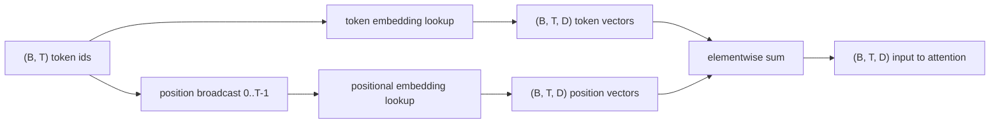
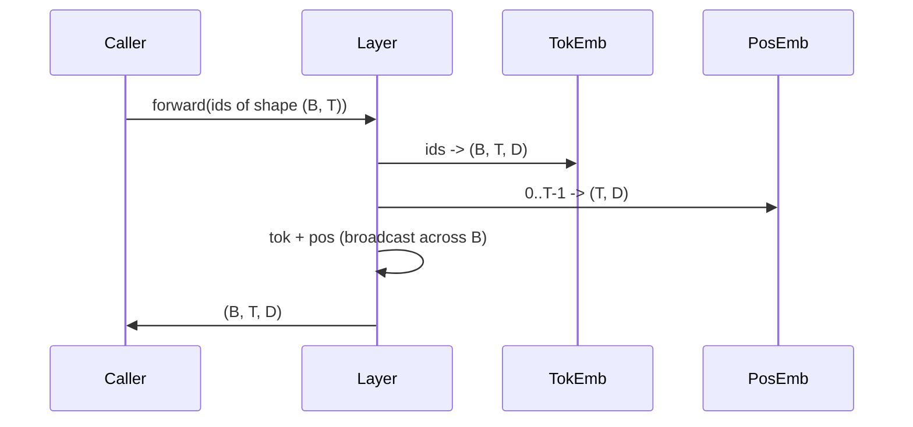

# إشارات ووضع إضافة

> الهوية هي أرقام كاملة. النموذج يريد المتجهين. طاولتين للبحث تقع بينها، واختيار الموقف واحد تشكل ما يمكن أن يتعلم النموذج.

**Type:** Build
**Languages:** Python
**Prerequisites:** Phase 04 lessons, Phase 07 transformer lessons, Lessons 30 and 31 of this phase
**Time:** ~90 minutes

## أهداف التعلم
- قم ببناء جدول بحث شامل للرموز الذي يقوم بتحديد هويات المفردات إلى المتجهات الكثيفة.
- قم ببناء جدول بحث متعلم من خلال وضعيات الموقع الموضحة.
- بناء مقسمة مقارنة مع السينوسوسيدال الموضعية المحددة حسب الموقف دون وجود معايير.
- قم بتجميع إشارات ووضعيات في مدخل واحد لبرقة محول.
- التناقض تعلمت و التوابل السينوسيدالية على التعميم الطويل وعدد المعلمات.

```figure
cc-embedding-lookup
```

## الإطار

أول اتصال للنموذج مع رمز هو بحث صف في المصفوفة التي تضم رمز. المصفوفة لديها سطر واحد لكل اسم المفردات وعمدة واحدة لكل بعد النموذج. يعود البحث متجه يعالج بقية النموذج بمعنى اسم. يقوم Backprop بتحديث الصفوف التي استخدمت في المرور الأمامي. خلال التدريب تتعلم هندسة تلك الصفوف لتشفير التشابه في الاتجاهات.

الهوية الوحيدة لا تملك ترتيب النموذج يحتاج إلى إشارة ثانية تقول له الموقف واحد مختلفة عن الموقف السابع عشر. الخيارين المهيمنين لهذه الإشارة هي إضافة موضعية تعلم (جدول بحث ثاني، صف واحد لكل موقف) وإضافة موضعية سينوسوايدالية ثابتة (صيغة رياضية بدون معايير). الخيار له عواقب الجدول المعلم هو معايير ويتم تحديدها من خلال أقصى طول السياق الذي تم تدريب النموذج عليه. طاولة الحواجب السينوسيدالية خالية من المعلمات في النظرية والصيغة تمتد إلى أي موقف، ولكن هذا الدرس `SinusoidalPositionalEmbedding`يعد من قبل جدول ثابت في `max_context_length`و هي`forward`يزيد هذا الحد، وبالتالي فإن كلا الوحدات يفرضون أقصى طول السياق هنا. قد يزال النموذج يكافح ما يزيد عن طول التدريب حتى عندما تكون الجدول كبيرة بما فيه الكفاية للتصنيف.

هذا الدروس يبني كل منهما ويضمها مع رمز تضمينها في مدخل واحد لجميع الدروس التالية.

## عقد الشكل

المدخلات إلى مرحلة الإدراج هي مجموعة من أوراق الهوية الوهمية`(B, T)`. الخروج هو تنصر الشكل`(B, T, D)`أين`D`هو بعد النموذج. كل عنصر لفة لديه نفس طول السياق `T`كل موقع لديه نفس الوسيط المتجه`D`. . .



التركيبة هي جمع وليس سلسلة`D`ثابتة عبر الشبكة وتركت النموذج يقرر على أساس كل ميزة ما إذا كان المعنى الرمزي أو الموقف يهيمن على كل طبقة.

## المصفوفة التجريبية

إضافة الرمز هو تينزر المعلمة من الشكل `(V, D)`أين`V`هو حجم المفردات.`nn.Embedding(V, D)`في init يتم رسم الإدخالات من غوسيان صغير ، تقليديا مع متوسط الصفر والانحراف القياسي حول `0.02`بالنسبة للنماذج على نطاق المحولات، إن الإبتداع الدقيق لا يهم أكثر من أنه يبقى متسقًا عبر الجوائز.

المخطط الأمامي هو عملية تحديد مؤشر واحدة.`(B, T)`أوراق تعريفات int64 إلى `(B, T, D)`يطفو من خلال جمع الصفوف. التسلل الخلفي يجمع تراجعات فقط في الصفوف التي تم لمسها في الممر الأمامي. الصفوف التي لم تظهر في المجموعة تحصل على تراجعات صفر على تلك الخطوة.

التفاصيل الخفيفة. يتم تشغيل إضافة الرمز والتنبيهات المخرجة في نهاية النموذج في كثير من الأحيان في نفس الوزن (الارتباط بالوزن). عندما يحدث ذلك، كل مرور خلفي يلمس كل صف من الإضافة من خلال جانب الخروج. يظهر الدروس هنا كمتجازات منفصلة ولكن نفس المصفوفة يمكن أن تلعب كلا الدورين في نموذج كامل.

## التطبيق المميز المكتشف

التأثير الموضعي المتعلم هو الثاني`nn.Embedding`من الشكل`(max_context_length, D)`. البحث يتم تحديده بواسطة رقم الموقع`0, 1, 2, ..., T-1`.المركبة الأمامية تبث تلك الموقع المتجه عبر أبعاد اللحظة.

النقطة السلبية من الجدول المعلم هو أنه لا يمكن استفساره في الموقف`T`إذا كان النموذج تم تدريبه فقط إلى الموقف `T-1`لا توجد صف. النماذج التي تستخدم هذه النظام فقط لإنتاج المقاطع تطبيق أقصى طول السياق في الهندسة المعمارية ورفض معالجة المدخلات أطول.

## التوابل الموضعي السينوسويدي

التوابل الموضعي السينوسويدي هو وظيفة من الموقف إلى المتجه.`p`و الميزة`i`المنتجات

```python
angle = p / (10000 ** (2 * (i // 2) / D))
emb[p, 2k]     = sin(angle)
emb[p, 2k + 1] = cos(angle)
```

لا توجد في الوظيفة معايير. كل موقف له متجه فريد. يختلف طول الموجة هندسيًا عبر أبعاد الميزات، لذلك فإن الأبعاد السفلية ترمز إلى الموقف الخام والأبعاد العليا ترمز إلى الموقف الدقيق.

العقار الذي يتبع من اختيار`sin`و`cos`معا هو أن المتجه في الموقف `p + k`هو وظيفة خطية للنقل في الموقف`p`هذا يمنح طبقة الاهتمام مسارًا سهلًا لتعلم تعويضات الموقف النسبي. النموذج لا يحتاج إلى پیرامتر منفصل لعبره عن "انظر إلى خمسة رموز للخلف".

في الدروس يحسب الجدول السينوسويدي الكامل مرة واحدة في البناء ويحدد في وقت مضى.

## التركيب

خط المدخل يقوم بثلاث أشياء بالترتيب. اقرأ أوراق الهوية الرمزية. ابحث عن متجهات الرمزية. اضف متجهات الموقف. ارجع المبلغ.



الإذاعة في خطوة المجموع تكرر `(T, D)`الجهاز المتحرك يدير هذا تلقائيا لأن الجهاز المتحرك لديه شكل`(1, T, D)`بعد التخلص من الضغط

## تحليل مُقارن

الدروس تطبق على نفس المدخلات و تقوم بطبع تشخيصين.

الأول هو عدد المعلمات.`max_context_length * D`المعلمات فوق إضافة الرمز.

الثاني هو تشابه الكوسين بين التوابل في المواقع المجاورة. يحتوي التغير السينوسويدي على تدهور سلس ومتوقع لأن الوظيفة مستمرة. التنوع المكتشف عند البدء لديه تشابه عشوائي تقريبا لأن الصفوف رسم بشكل مستقل. بعد التدريب، يطور المتغير المعلم عادةً بنية سلسة مماثلة، لكنه يجب أن يكتشف تلك الهيكل من البيانات.

## ما لا يفعله هذا الدروس

لا يُبني التشفير الموقفي المتحرك (RoPE) أو AliBi. هذه هي الخيارات الحديثة في محولات الإنتاج. كلاهما يتبع نفس عقد الشكل مثل التوابل هنا (تطبق تحويلًا يعتمد على الموقف على متجهات الشكل `(B, T, D)`) ولكن يتم تطبيقها في خطوة التصوير للاهتمام بدلاً من المدخل. الدروس التالية تبني كتلة الاهتمام، وواحدة من التوسعات الاختيارية هي أن يتم طيّبها بشكل دوري في التنبؤات المفتاحية هناك.

لا تدرب التثبيت. التدريب يتطلب خسارة، والتي تتطلب نموذج الخروج، والتي تتطلب الاهتمام ورأس LM. وهذا هو الدروس التالية والآخر بعد.

## كيفية قراءة الرمز

`main.py`يحدد ثلاثة وحدات. `TokenEmbedding`غلفات`nn.Embedding(V, D)`. .`LearnedPositionalEmbedding`غلفات`nn.Embedding(L, D)`. .`SinusoidalPositionalEmbedding`يعد الجدول مسبقاً ويعرضه كمركز. `EmbeddingComposer`يربط إضافة رمزية وإضافة موضعية معًا. يطبق التجربة في الأسفل الأشكال، وعد المعايير، وتشخيص التشابه بين الموقف الجار.`code/tests/test_embeddings.py`شكل القنبلة، سلوك البث، عدد المعايير، والصيغة السينوسويدية.

أطلق التجربة ثم غير ابعد النموذج`D`من 64 إلى 32 وراقب كيف تتغير فئات طول الموجة السينوسويدية
