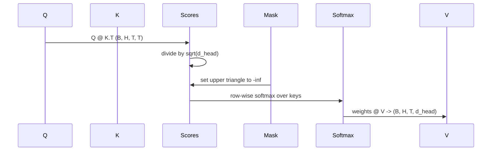

# الاهتمام الذاتي متعدد الرؤوس

> مشهد خطي واحد، ثلاث مشاهد، رؤوس متوازية H، قناع واحد.

**Type:** Build
**Languages:** Python
**Prerequisites:** Phase 04 lessons, Phase 07 transformer lessons, Lessons 30 through 32 of this phase
**Time:** ~90 minutes

## أهداف التعلم
- تنفيذ مشروع استفسار/مفتاح/قيمة المكون من مجموعات كطبقة خطية واحدة مقسمة إلى رؤوس H.
- الحساب على نطاق نقطة منتج الاهتمام مع التطبيع الصحيح و dtype التعامل.
- ضع قناع سببي يمنع الموقف من الالتزام بالمواقع المستقبلية.
- تحقق من أوزان الاهتمام لكل رأس للحصول على مدخل ثابت و التفكير حول ما ينظر إليه كل رأس.
- قم بتدريب حجر الاهتمام الصغير على مهمة لعبة وشاهد الخسارة تسقط مع تخصص الرؤوس.

```figure
cap-multihead-attention
```

## الإطار

الانتباه هو الوظيفة التي تسمح لممثلة رمزية بسحب المعلومات من رموز أخرى في نفس التسلسل. الانتباه الذاتي يعني استفسارات، مفتاحات، والقيم كلها مشتقة من نفس المدخل. تعني رأس متعددة أن التنبؤ تقسيم إلى H مشاكل الاهتمام المتوازية التي يتم تشبيك وتنبؤها مرة أخرى.

نمط التنفيذ الفعال هو طبقة خطية واحدة تنظم من `D`إلى`3 * D`و يتم قطعها إلى ثلاثة أشكال ثم يتم إعادة تشكيلها إلى رؤوس H`D // H`كل واحد. المتمول، والغالبية الناعمة، والجمع الموزن يحدث كعمليات التنسور المكتسبة حتى الرؤوس تعمل على التسريع على متوازية.

هذه الدروس تبني تلك الكتل. فإنها تضيف أيضا قناع السببية حتى يعمل نفس الشفرة كطبقة الاهتمام في نموذج لغة المفكّر فقط. الدروس التالية تقوم بتجميع الكتل إلى محول كامل والدرس بعد تدريبها.

## عقد الشكل

المدخل هو`(B, T, D)`. إنتاجها`(B, T, D)`القناع هو`(T, T)`داخل الكتلة العصبات الوسطى لها شكل`(B, H, T, d_head)`أين`d_head = D // H`القيود هي`D % H == 0`. . .

```mermaid
flowchart LR
    A["(B, T, D) input"] --> B[Linear D -> 3D]
    B --> C["split into Q, K, V"]
    C --> D["reshape to (B, H, T, d_head)"]
    D --> E["scores = Q @ K.T / sqrt(d_head)"]
    E --> F[apply causal mask]
    F --> G[softmax over keys]
    G --> H["context = weights @ V"]
    H --> I["reshape to (B, T, D)"]
    I --> J[output Linear D -> D]
    J --> K["(B, T, D) output"]
```



الطبقات الخطية (تحديد QKV والتحديد الخروج) هي المعلمات الوحيدة في الكتلة. القناع، والغالبة الرقيقة، والطوابع، والإعادة تشكيل جميعها خالية من المعلمات.

## الانقسام في QKV

التنفيذ البديل لديه ثلاث طبقات خطية منفصلة ، واحدة لكل من Q ، K ، و V.`3 * D`المصفوفات وتقسم النتيجة. هذان هما متساويان رياضيا لأن ثلاث مضاعفات ماتريكية منفصلة`(D, D)`الوزن هو بالضبط واحد المصفوفة مضاعفة بـ `(3D, D)`وكل الوزن يُكثر منهم

النسخة الفعالة أسرع لأن المسرع يطلق مامل واحد بدلاً من ثلاثة. كما أنه أسهل في البداية لأن ثلاث المصفوفات الفرعية تعيش في نفس تنصر المعلم ويمكن البداية معا.

## رأسها يُعيد تشكيل

بعد الانقسام، كل من Q، K، V هو `(B, T, D)`لتحويل ذلك إلى مشكلة الاهتمام المتوازية H، نعدل شكلنا إلى`(B, T, H, d_head)`ويتم نقلها إلى`(B, H, T, d_head)`. بعد الرأس الآن يقع بجانب بعد المجموعة لذلك PyTorch يعامل الاهتمام لكل رأس`B * H`الهيئات المستقلة.

البعد d_head يبقى آخر حتى النتيجة متتالية`Q @ K.transpose(-2, -1)`ويتعاقب عليه النتيجة هي`(B, H, T, T)`نقاط الاهتمام لكل شخص

## التوسع

النتيجة تقسم بـ`sqrt(d_head)`بدون هذا التوسع، منتجات النقاط تنمو`d_head`ينمو ويدفع الـ softmax إلى نظام حيث يحتوي مدخل واحد على كل الكتلة تقريبا والآخرين على ضئيلة.`sqrt(d_head)`يحتفظ التباين بين النتائج باستمرار تقريباً عبر أحجام الرأس

## القناع السببي

نموذج لغة مُشفر فقط يمكن أن يتأثر بالماضي فقط عند التنبؤ بالرمز التالي. يفرض القناع ذلك. على وجه التحديد، قبل softmax، كل إدخال فوق خط المُخترع من الـ`(T, T)`يتم استبدال المصفوفة بالبعد السائل بعد softmax تلك المواقع تحصل على الوزن الصفر.



نحن نسجل القناع كمركز مكافئ عند البناء حتى يعيش على نفس الجهاز مع النموذج وليس جزءا من الرسم البياني التراجعية. القناع يغطي أقصى طول السياق الذي سيراه الكتلة في أي وقت مضى. في الوقت المقبل نقسم الجزء العلوي اليسرى`(T, T)`الزاوية

## التنبؤات

بعد متجهات السياق لكل رأس `(B, H, T, d_head)`، نُرجع إلى`(B, T, H, d_head)`, إعادة تشكيل`(B, T, D)`و تطبيق النهائي`(D, D)`التنبيه الخطى. يسمح للتنبيه الخارجي للنموذج بمزج الرؤوس. بدونها، فإن رؤوس H لن تتجمع مرة أخرى إلا من خلال طبقات لاحقة وسيتم تقييد الكتلة بشكل اصطناعي.

## فحص الوزن الاهتمام

الدرس يظهر`return_weights=True`العلم على الممر الأمامي. عند تحديد، يعيد الكتلة وزرات الاهتمام لكل رأس من الشكل`(B, H, T, T)`على المدخل القصير حتى تتمكن من رؤية بنية المثلث السببية والتركيز لكل موقف.

في نموذج مدرب، تتعلم رؤوس مختلفة أنماط مختلفة. بعض الرؤوس تلتزم بالرمز السابق مباشرة. بعض الرؤوس تلتزم بدء التسلسل. بعض الرؤوس تنتشر الانتباه بشكل متساو تقريبا. هو خط المفتاح نقطة دخول لهذا العمل التفسير.

## التدريب التجريبي

الظهور في أسفل `main.py`يضبط حلقة الاهتمام إلى رأس LM صغير ويعمل على التدريب على كل شيء على مهمة تكرارية. كل سطر من المدخل هو معرف عشوائي واحد يتم تكراره عبر السياق. الهدف هو المدخل الذي تم تحويله بواسطة واحد، لذلك يجب على النموذج أن يتعلم أن الرمز التالي هو نفسه من الرمز السابق. الخسارة هي التشابك. مع H = 4، D = 32، T = 12، ومخزون 64، فإن الخسارة تقع من عشوائي (حوالي`log(64) ~ 4.16`) إلى أسفل`1.0`أكثر من ثلاث فترات على المعالجة المركزية.

النقطة في التجربة ليست لتدريب نموذج مفيد، النقطة هي تأكيد تدفق التدرج من خلال كل قطعة من الكتلة والرؤوس تعلم شيئا على مشكلة حيث الجواب واضح.

## ما لا يفعله هذا الدروس

لا يضيف كتلة إرسال. طبقة المحول في نموذج حقيقي هي الاهتمام تليها MLP ذات طبقتين مع اتصال بقايا وتقنية طبقة حول كل واحد. الدروس التالية تضيف تلك.

لا تنفذ تشفيرات الموقف الدوارية أو AliBi. كل منهما ينطبق على خطوة إلقاء QKV في نفس الكتلة ، ولكنهما وحدة تعليمية منفصلة. الكتلة كما بنيت هنا متوافقة مع أي من خلال تحويل Q و K قبل المتمول.

لا تنفذ الاحتفاظ بالمساحة الاحتفاظ بها KV للإستنتاج. الاحتفاظ بالمساحة الاحتفاظ بها والقيم عبر الممرات الأمامية هو التحسين الذي يجعل التشخيص السريع السريع. فإنه يغير عقد الشكل على الختام K و V ولكن ليس على Q. إنه ينتمي إلى دروس الإستنتاج.

## كيفية قراءة الرمز

`main.py`يحدد`MultiHeadSelfAttention`. . . الصف يحمل طبقتين خطيتين ومركز قناع مسجل المخططات المقبلة مشروعات، إعادة تشكيل، نقاط، أقنعة، softmaxes، الوزن، إعادة تشكيل، والمشاريع مرة أخرى. يقوم النموذج التجريبي في الأسفل ببناء نموذج صغير يُغلف الانتباه مع إشارات ومواقع وضمها رأس LM، ويعلمه على مهمة نسخ لثلاث حقائق، ويقوم بطبع منحنى الخسارة ورسم حرارة الاهتمام لكل رأس. الاختبارات في`code/tests/test_attention.py`وضع العقد على الشكل، خاصية العلاقة، خاصية softmax، خاصية رأس-فصل، وتدفق التدفق.

أطلق الظهور ثم زيادة`n_heads`من 4 إلى 8 (الاحتفاظ `d_model=32`، لذا`d_head=4`) ومشاهدة تغيير خريطة الحرارة.
