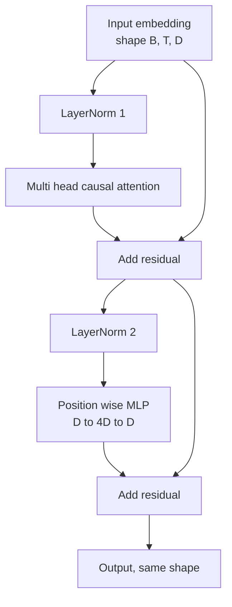
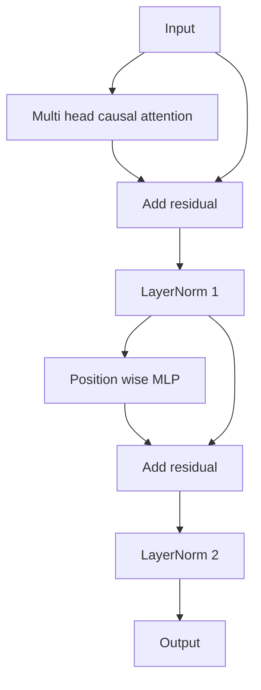

# حجر المحول من الصفر

> كتلة واحدة هي وحدة كل مُعبر جديد LLM. معيار الطبقة، انتباه رأس متعدد، بقايا، MLP، بقايا. يتدرب المتغيرات السابقة لـ LN بشكل ثابت دون تسخين. المتغيرات بعد LN هي ما شحنته الورقة الأصلية. يبن هذا الدروس كل منهما، جنبا إلى جنب، ويظهر أي واحد ينجو من كومة 12 طبقة بمعدلات التعلم المشتركة.

**Type:** Build
**Languages:** Python
**Prerequisites:** Phase 19 lessons 30 to 33 (tokenizer, embeddings, attention math, batched data loader)
**Time:** ~90 minutes

## أهداف التعلم

- بناء كتلة تحويل في PyTorch من الأجزاء المتحركة الأربعة: LayerNorm، الاهتمام السببية متعددة الرأس، الاتصالات المتبقية، الموقف الحكيم MLP.
- ضع القواعد الطبقة في إعدادين (قبل LN وبعد LN) و اشرح لماذا يتم تدريبك بشكل مستقيم دون تسخين.
- تنفيذ التخفيض السببي داخل الرأس المتعددة الاهتمام حتى رمز`i`لا أستطيع رؤية الرموز`j > i`. . .
- تتبع تدفق التراجع عبر كلا المتغيرات على كومة من 12 طبقة وقراءة النتيجة دون تهويب اليد.
- إعادة استخدام الكتل كوحدة تساقط عندما تجمع الدروس التالية 124 مليون المعلمات GPT.

## المشكلة

محول هو كتلة واحدة تكرر. إخطأ الكتلة مرة واحدة، كررها 12 مرة، وترسل نموذجاً يختلف في العصر الأول أو يحتاج إلى حرارة حارة لبقية الطريق. الوضعين الفاشلين الذي ستراهما في هذا الدروس ليسا غريبين. يظهرون عندما يتولى المتعلمون أول مرة حزمة من الكتل بشكل ساذج الأول هو طبقة الاهتمام التي تلتزم بالمستقبل. والآخر هو LayerNorm وضعت حيث لا يمكن أن تدمير الإشارة المتبقية في العمق.

الإصلاح هو ميكانيكي بمجرد رؤيته، والجكل لديه بالضبط اثنين من المسارات المتبقية ومواقف التطبيع بالضبط اثنين. اختيار المواقف بشكل صحيح وبقية كومة هو مجرد الحساب.

## المفهوم

كل مقياس تعريف فقط كتلة المحول هي وظيفة التي تأخذ تنصر من الشكل `(batch, sequence, embedding)`و يعيد الجهاز نفس الشكل داخله، هناك طبقتان فرعية تقوم بعملها



هذا هو التغير السابق لـ LN. يقع LayerNorm داخل الفرع المتبقية ، قبل الطبقة الفرعية. الاتصال المتبقية يحمل الإشارة غير الطبيعية إلى الأمام.

يُحرك التنوع بعد LN إلى LayerNorm بعد إضافة البقية.



الشكل هو نفسه. سلوك التدريب ليس كذلك. مع ما بعد LN، يجب أن يمر التراجع الذي يتدفق مرة أخرى من خلال المسار المتبقية عبر الطبقة. عند عمق اثني عشر وتيرة التعلم`3e-4`يقلل هذا التراجع بسرعة كافية لتحقيق جدول الحرارة. يترك Pre-LN المسار المتبقية غير طبيعي، لذلك ينتشر التراجع بشكل نظيف إلى طبقة التوابل. Pre-LN هو التكوين GPT-2 على المدى السفينة لهذا السبب.

### الاهتمام العلوي متعدد الرأس

تعرض طبقة الفرعية للاهتمام المدخلات ثلاث طرق إلى استفسار ، مفتاح ، وموجهات القيمة. يتم إعادة تشكيل كل منها من `(B, T, D)`إلى`(B, H, T, D/H)`أين`H`هو عدد الرؤوس. الحسابات المحددة نقطة الاهتمام المنتج`softmax(Q K^T / sqrt(d_k))`لكل رأس، يغطي المثلث العلوي إلى اللانهاية السلبية، يطبق القناع عبر softmax، ثم يضاعف ب `V`الرؤوس تُقَيَّدُ مرة أخرى في واحد`(B, T, D)`القناع هو الجزء الوحيد الذي يجعل النموذج سببياً

### المجلس

يطبق MLP ذو المعرفة الموقف نفس شبكة الطبقتين لكل رمز بشكل مستقل. الواسعة الخفية أربع مرات عرض إدمج، والتنشيط هو GELU، والانقطاع يتبع الخط الثاني. لا توكنات تتحدث مع بعضها البعض داخل MLP. يحدث جميع الاختلاط الرمزي في الانتباه.

### العلاقات المتبقية تفعل شيئان

يجعلان مسار التراجع إضافي عبر العمق ، مما يبقي معايير التراجع في المقياس عبر اثني عشر طبقة. كما يسمحون لكل كتلة بتعلم تحديث إضافي لممثلة التشغيل بدلاً من استبدال كامل. كلا التأثيرين هم السبب في تطورات كتلة.

```figure
cc-transformer-block
```

## بناءها

`code/main.py`تطبيقات:

- `class LayerNorm`مع دراسة النطاق والتحول، eps المتحيزة، تطبيق لكل متجه رمزي.
- `class MultiHeadAttention`مع`num_heads`،`head_dim = d_model // num_heads`، التشويش المدمج QKV، مسجلة القناع السببية، الاهتمام والإقلاع المتبقي.
- `class FeedForward`مع طبقتين خطية، تنشيط GELU، التوقف.
- `class TransformerBlock`مع`pre_ln`العلم الذي يتحول بين الإختلافين.
- عرض تجريبي يُبني كومة من قبل LN ذات 6 طبقات ومجموعة من بعد LN ذات 6 طبقات مع إدخالات ومطبوعات متطابقة (أ) شكل الخروج، (ب) معيار التراجع عند الإدراج بعد مرور واحد للخلف.

إشغله

```bash
python3 code/main.py
```

الناتج: التحقق من الشكل على كلا الساقين ، معايير التراجع جنبا إلى جنب. تراجع إدراج ساق قبل LN أكبر من ساق بعد LN بنفس سرعة التعلم ، وهو الإشارة التجريبية قبل قطار LN دون تسخين.

## الـ"كثيرة"

- `torch`لـ الرياضيات التنسورية، والمرحلة الذاتية، و`nn.Module`-المحطة
- لا , لا`transformers`لا يوجد أوزان مسبقة، إنّ الحجر تمّ تنفيذه من البدائيين

## أنماط الإنتاج في البرية

ثلاثة أنماط تحويل كتب الدراسة إلى شيء يمكنك شحن.

**Fused QKV projection.**ثلاثة طبقات خطية منفصلة تكلف ثلاثة إطلاقات للنواة وثلاثة مالمولات. طبقة خطية واحدة من الاحجام `3 * d_model`يقوم نفس العمل في إطلاق واحد ، ثم يقسّم الخروج على طول المحور الأخير. المسار المدمج أسرع على كل تسريع ويتطابق مع تنفيذات مرجعية GPT-2 ، LLaMA ، و Mistral جميع السفن.

**Registered causal mask buffer.**يعتمد القناع فقط على أقصى طول السياق.`register_buffer`، قطع النافذة النشطة لكل مرور إلى الأمام، وتفوت التخصيص لكل مكالمة. إنسيان هذا يحول القناع إلى نقطة ساخنة للمخصص في سياق طويل.

**Dropout in two places, not three.**ينتمي الانقطاع بعد الاهتمام softmax (انقطاع الاهتمام) وبعد الخط الثاني من MLP (انقطاع بقايا). إن الانقطاع على البقايا نفسها يكسر الهوية الإضافية التي تسمح لتدفق التدفق في العمق. حصلت بعض التطبيقات المبكرة على هذا الخطأ ودفع ثمن ذلك بتدريب هش.

## استخدمها

- الكتلة في هذا الدروس تتصل مباشرة مع مجموعة GPT في الدروس 35 دون تعديل.
- التنوع السابق لـ LN هو ما يستخدمه كل درجة مفتوحة حديثة LLM. التنوع بعد LN هو ما استخدمه ورقة الاهتمام الأصلية لعام 2017. معرفة كل من ذلك يكفي لقراءة أي معمارة تشكيل القيود التي ستواجهها.
- تغيير GELU إلى SiLU و لديك تفعيل عائلة LLaMA تغيير LayerNorm إلى RMSNorm و لديك الطبيعية عائلة LLaMA نفس العظم

## التمارين

1. إضافة`bias=False`علامة على كل خطي في الكتلة. الوزن المفتوح الحديث LLMs السفينة دون تحيز على الطبقات الخطية. قياس كم من المعلمات التي يمكنك حفظها في 12 طبقة 768 نموذج ضئيل.
2. استبدل`nn.LayerNorm`مع معدل RMSNorm المتحرك يدويا والتحقق من أن شكل الخروج لا يتغير.
3. إضافة علم يعيد الوزن الاهتمام لل رأس الأول ك `(B, T, T)`التنسور، رسم المثلث العلوي للتأكيد أنه هو صفر بعد softmax.
4. قم ببناء فحص للصحة العقلية الذي يغذى`(2, 16, 384)`الـ " الـ " الـ " الـ " الـ " الـ " الـ " الـ " الـ " الـ " الـ " الـ " الـ " الـ " الـ " الـ " الـ " الـ " الـ " الـ " الـ " الـ " الـ " الـ " الـ " الـ " الـ " الـ " الـ " الـ " الـ " الـ " الـ " الـ " الـ " الـ " الـ " الـ " الـ " الـ " الـ " الـ " الـ " الـ " الـ " الـ " الـ "`H=6`على حد سواء من خلال المتغيرات والادعاءات المقدمة الخروج مختلفة (على سبيل المثال ، `not torch.allclose`) عندما يتم تشغيل الأوزان بشكل متطابق ويتم تعيين التخلي عن الوزن إلى الصفر.

## الشروط الرئيسية

| Term | What people say | What it actually means |
|------|-----------------|------------------------|
| Pre-LN | "Pre norm" | LayerNorm inside the residual branch, before each sublayer; the residual carries the unnormalized signal |
| Post-LN | "Post norm" | LayerNorm after the residual add; what the 2017 paper shipped and what needs warmup |
| Causal mask | "Triangle mask" | The upper triangle of the attention logits set to negative infinity so token i cannot read token j when j is greater than i |
| Fused QKV | "Combined projection" | One linear of width 3D instead of three linears of width D; one kernel, one matmul |
| Residual stream | "Skip connection" | The unnormalized tensor that flows top to bottom through every block; what each block adds to |

## المزيد من القراءة

- المرحلة 7 دروس 02 (تأمل الذات من الصفر) لرياضيات الانتباه تحت هذه الحجر.
- المرحلة 7 دروس 05 (المتحول الكامل) لنسخة مُشفّر المُشفّر لنفس العظم.
- المرحلة 10 الدروس 04 (ميني GPT قبل التدريب) لإجراء التدريب الذي يربط به هذا الكتلة.
- المرحلة 19 دروس 35 (هذه المسار) التي تقوم بتجميع اثني عشر من هذه الكتل في نموذج GPT.
