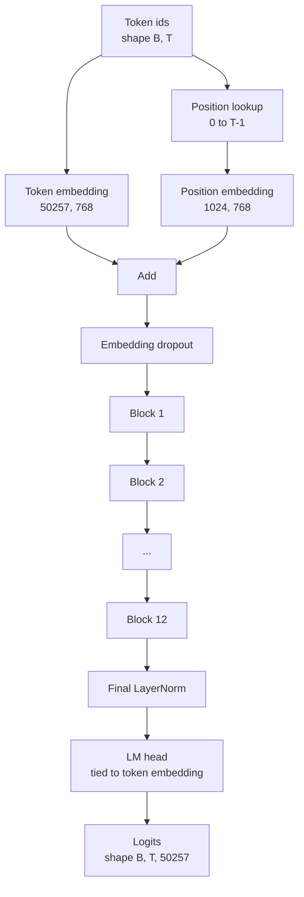
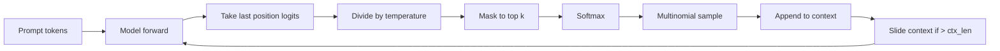

# تجميع نموذج GPT

> تم تجميع اثني عشر كتلة، وتضمين رمز، وتضمين موقف تعلم، ورقة النهائية، ورأس نموذج لغة مرتبطة. وهذا هو نموذج GPT المعلمين 124 مليون. هذا الدروس يجمع هذه الأجزاء في طبقة عاملة، ويعد المعلمات لتحديد أن النموذج يطابق شكل 124M المرجعية، ويولد النص مع عينة متعددة النقاط، والحرارة، و top-k.

**Type:** Build
**Languages:** Python
**Prerequisites:** Phase 19 lessons 30 to 34
**Time:** ~90 minutes

## أهداف التعلم

- تجميع كتلة المحول من الدروس 34 إلى نموذج GPT كامل: إدراج رمز، إدراج الموقف، كتلة N، LayerNorm النهائية، رأس نموذج اللغة.
- إعادة إنتاج تشكيل المعلمات 124 مليون: الكلمة 50257، السياق 1024, تضمين 768, اثني عشر رأس، اثني عشر طبقة.
- ربط وزن رأس نموذج اللغة إلى إضافة الرمز وتوضح لماذا هذا يحتفظ بنحو 38 مليون مبرمج في هذا المقياس.
- توليد النص من عرض مع عينة متعددة النقاط، وتحقيق درجة الحرارة، وتقليص القمة-ك، مع الحفاظ على طول السياق مع نافذة زلقة.
- قياس عدد المعلمات وتكلفة الممرات إلى الأمام مقابل هدف 124 مليون.

## المشكلة

لا يقوم كتلة المحول بأي شيء بمفردها. تحتاج إلى تحويل أوراق الهوية إلى متجهات، وتخلط في المعلومات الموضعية، وتشغيلها عبر الكتلة، وتقديمها إلى المخططات المفردية. انسى أي من هذه الخطوات الأربعة والنموذج إما يفشل في التقدم، أو يتحرك في المعلومات الموضعية، أو لا يستطيع التحدث.

شكل النموذج مهم أيضاً إن مقياس GPT-2 الصغير هو 124 مليون مبرمير في التكوين بالضبط أعلاه. الأرقام ليست سحرية الكلمة 50257 مرات تضمين 768 هو الجدول الرمزي. الموقف 1024 × 768 هو جدول المواقع. 12 كتلة عند حوالي 7 ملايين ملامح كل منها هو 84 مليون. الرأس النهائي يستخدم الجدول الرمزي من جديد عن طريق الوزن. قم بتجميع الأجزاء وتصل إلى 124 مليون بناء نموذج لا يطابق عدد المعلمات مع المرجح هو علامة على أنك قمت بتشغيل شيء خاطئ.

## المفهوم



تصبح أرقام الهوية رمزية. تصبح أرقام الموقع متجهات الموقع. يتم إضافة الاثنين وإرسالها من خلال كومة. LayerNorm النهائية هي القطعة الواحدة خارج الكتل التي تنجو من كل فاريان حديث. يستخدم رأس LM مرة أخرى ماتريكس إدراج الرمز، وهو ما يعني الوزن.

### الوزن

الـ " إشارة " لديها شكل`(vocab, d_model)`. يجب أن يُنظر رأس النموذج اللغوي من`d_model`عودوا إلى`vocab`. هذه هي نقلات من بعضها البعض. ربط الاثنين يعني حرفيا نفس العجلة المعلمية، تستخدم مرتين. في الكلمات 50257 و d_model 768, المصفوفة 38 مليون ملامح. منفصلة، تدفع ثمنها مرتين. ربط، تدفع ثمنها مرة واحدة وتحصل أيضا على إشارة تراجيعية أكثر نظافة قليلا لأن التضمين والتحديث الرأس معا.

### يتم تعلم وضع التضمين، وليس السينوسيدال

GPT-2 يرسل وضع تعلم إضافة. جدول المواقف هو واحد معدل تنصر الشكل `(1024, 768)`يبحث النموذج عن الموقف 0 إلى T-1 في كل تقدم ويضيف البحث إلى إضافة الرمز. هذه هي أبسط مخططات الموقف (RoPE ، ALiBi ، T5 التحيز النسبي هي البدائل) وهو ما يستخدمه المرجح 124M.

### الجيل: درجة الحرارة، أعلى-ك، متعددة النقاط

التوليد هو التراجعي. في كل خطوة، يعيد النموذج التسجيلات على كامل المفردات في كل موقف. تأخذ فقط الموقف الأخير، تقسم بالدرجة الحرارة، اختياريا غطاء جميع إلا التسجيلات العليا k إلى اللانهاية السلبية، softmax للحصول على الاحتمالات، ومعينة واحدة من الرمز الناتج من التوزيع.



ثلاثة أزرار، ثلاثة سلوكيات مختلفة. تسقط درجة حرارة قريبة من الصفر إلى طمع. درجة حرارة واحدة تتطابق مع التوزيع الطبيعي للنموذج. أعلى-ك واحد طمع. أعلى-ك أربعين تصفية الذيل الطويل. الجمعيات مهمة؛ الدروس التالية على التدريب يستخدم التوليد كإشارة تقييم نوعية.

```figure
cc-gpt-assembly
```

## بناءها

`code/main.py`تطبيقات:

- `class GPTConfig`فئة البيانات مع 124M الافتراضات: `vocab_size=50257`،`context_length=1024`،`d_model=768`،`num_heads=12`،`num_layers=12`،`mlp_expansion=4`،`dropout=0.1`،`use_bias=True`،`weight_tying=True`. . .
- `class GPTModel`مع إضافة رمزية، إضافة موقعية، إضافة متخلفة، اثني عشر `TransformerBlock`(s) ، آخر (LayerNorm) ، و (`lm_head`التي ترتبط بالرمز عندما يتم وضع العلم.
- أ`count_parameters`المساعد الذي يعيد عدد المعلمات الفريدة (حيث يتم احترام الوزن في العد).
- أ`generate`وظيفة التي تفعل درجة الحرارة، أعلى-ك، متعددة النقاط، ونظيفة الزحف.
- عرض تجريبي يُبني النموذج، ويُطبخ عدد المعلمات بجانب 124M المرجعية، ويُولد تسلسلًا قصيرًا من طلب ثابت لإظهار نهاية خط الأنابيب إلى النهاية.

إشغله

```bash
python3 code/main.py
```

الناتج: حساب المعلمات جنبا إلى جنب مع إشارة 124M ، وتوليد هويات الشهارات من طلب عشوائي ، والتأكيد على أن رأس LM وتوابل الشهارات مشاركة التخزين عند الربط مشغولا.

للحفاظ على التجربة السريعة، البرنامج يدير أيضا إعداد صغير (`d_model=64`،`num_layers=2`) من النهاية إلى النهاية ويقوم بطبع تسلسل الرمز المولود في خط. يتم بناء تشكيل 124M ولكن يتم ممارسة عدد المعايير وحسب مرسلة واحدة إلى الأمام.

## الـ"كثيرة"

- `torch`لرياضيات الانسدادات، والتحديد الذاتي، والمركبات الرياضية.
- `code/main.py`يُعيد تنفيذ نفس نمط الكتل من الدروس 34 محلياً.

## أنماط الإنتاج في البرية

ثلاثة أنماط تمثل الفرق بين النموذج الذي يعمل ونموذج الذي يُرسل.

**Initialize the residual projections small.**يقدم التنبؤ الخارجي للاهتمام والخطوط الثانية من MLP إضافة بقايا مباشرة. إطلاق تلك التي لديها نفس الانحراف القياسي ككل خطية أخرى يعطي تيار بقايا ينمو مع عمق ويضغط على الطبقة النهائية إلى نظام ساخن.`1 / sqrt(2 * num_layers)`بالنسبة لهذه التنبؤات الثانية، يظل التيار المتبقي في نطاق معقول عبر اثني عشر طبقة.

**Cache the position id tensor, do not recompute.** `torch.arange(T)`يُخصص ذاكرة جديدة في كلّ خطوة.`__init__`للوقت القصوى، قم بتقطيع أول إدخالات T لكل مكالمة، ثم تخطي رحلة ذهاب وإياب المخصص.

**Tie weights at parameter level, not just by copying.**الإعداد`lm_head.weight = token_embedding.weight`يشارك الانسجام، لا ينسخ. يحتاج المحسن إلى تحديث معايير واحدة والرسوم البيانية المحورية تحتاج إلى تراكم واحد. إذا نسخ، يبتعد الرأس عن التضمين والوزن يربط لك لا شيء.

## استخدمها

- فصيلة النموذج في هذا الدروس هي نفس الشكل الذي تدرب عليه الدروس التالية.
- استبدال الموقف المعلم مع إضافة RoPE يمنحك عائلة LLaMA دون لمس الكتلة أو الرأس.
- استبدال GELU ب SiLU و LayerNorm ب RMSNorm يحصل لك بقية عائلة LLaMA تغييرات.
- تعمل وظيفة التوليد مع أي مصدر من المواد التنظيمية، وليس فقط هذا النموذج. يمكنك سحب المواد التنظيمية من ملف GPT-2 المُتدرب مسبقاً في الدروس 37 وإعادة استخدام نفس حلقة التوليد.

## التمارين

1. إزالة رأس LM من إضافة الرمز وإعادة حساب المعايير. التحقق من الدلتا هو 50257 × 768 = 38 مليون.
2. استبدل الموقف المكتشف بتضمين من خلال جدول سينوسيدال محاسب في وقت البناء. تأكد من النموذج لا يزال في الأمام وتراجع عدد المعلمات بنسبة 786,432.
3. إضافة`greedy=True`علامة إلى الجيل الذي يفرط في أخذ العينات و يختار argmax. تأكد من أن التسلسل هو محدد عبر الجوائز.
4. إضافة`repetition_penalty`الزر الذي يقسّم منطق أي رمز في الإشارة أو التاريخ المولد بواسطة ثابت قبل softmax. أظهر على إشارة ثابتة أن القيم فوق واحد تقلل من عدد التكرار في الخروج.
5. إضافة`top_p`(النواة) أخذ العينات بجانب `top_k`. التحقق من خطين أن مجموع احتمالات الرموز المحفوظة يتجاوز `top_p`. . .

## الشروط الرئيسية

| Term | What people say | What it actually means |
|------|-----------------|------------------------|
| Weight tying | "Tied embeddings" | The LM head and the token embedding share the same parameter tensor; saves vocab times d_model parameters and matches the GPT-2 reference |
| Position embedding | "Learned positions" | A separate table of shape (context length, d_model) added to token vectors; learned end to end |
| Sliding window context | "Context cap" | When the prompt plus generated tokens exceed the context length, drop the oldest tokens so the active window fits |
| Top-k sampling | "K truncation" | Keep the K logits with the highest values, mask the rest to negative infinity, softmax over the remainder |
| Temperature | "Sampling temperature" | Divide logits by T before softmax; T less than 1 sharpens, T equal to 1 keeps the natural distribution, T greater than 1 flattens |

## المزيد من القراءة

- المرحلة 19 دروس 34 للجكل هذا النموذج يجمعه.
- المرحلة 19 دروس 36 للدورة التدريبية التي تدفع هذا النموذج مع فقدان الانتروبيا المتقاطعة.
- المرحلة 19 دروس 37 لتحميل الأوزان GPT-2 المدربة مسبقاً في هذه الهندسة المعمارية بالضبط.
- مرحلة 7 دروس 07 (GPT نمذجة لغة السبب) ل الرياضيات من التنبؤات التوقيتية القادمة.
- المرحلة 10 الدروس 04 (ميني GPT قبل التدريب) لإجراء التدريب الأصلي على نفس الهندسة المعمارية.
