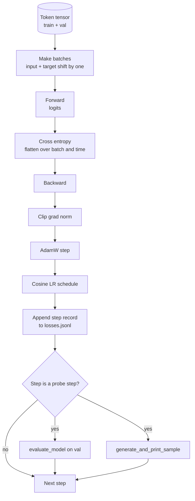

# حلقة التدريب والتقييم

> حلقة لا تقيس هي حلقة تكذب. هذا الدروس يبني حلقة التدريب التي تدفع نموذج GPT: AdamW مع تقسيم التدهور في الوزن ، وترقية التدفئة بالإضافة إلى جدول معدل التعلم الكوسيني ، a `calc_loss_batch`المساعد،`evaluate_model`إرسال البيانات المحتفظة،`generate_and_print_sample`كل خطوة من خطوات K، و سجل JSONL من الخسائر يمكنك رسم بعد. نفس العظم تدريب كل مكشف LLM سوف بنيت.

**Type:** Build
**Languages:** Python
**Prerequisites:** Phase 19 lessons 30 to 35
**Time:** ~90 minutes

## أهداف التعلم

- بناء حلقة تدريبية التي تحسب خسارة الانتروبيا المتقاطعة مع المدخل الصحيح ومواءمة الهدف للتنبؤ التوجيهي التالي.
- قم بتهيئة AdamW مع تدهور الوزن المطبق على مضاعفات الوزن وليس على مضاعفات LayerNorm أو التحيز.
- تنفيذ جدول معدل التعلم مع الاحترار الخطوي وتدهور الكوسين، وقراءة LR الناتجة مع مرور الوقت.
- تقييم على الانقسام المُمسك مع `evaluate_model`لذا فقدان تقييم مقارن بين الجوائز.
- إنشاء عينة نوعية كل خطوة K مع `generate_and_print_sample`للاحتفال بالانعكاس قبل أن يحدث منحنى الخسارة
- استمر في تخسير كل خطوة إلى JSONL حتى تتمكن من إعادة تحميل، وتخطيط، وإرسال سجل التدريب كإنجاز.

## المشكلة

نص تدريبية التي تطبق الخسارة ولكن لا تفعل أي شيء آخر تفشل في ثلاثة طرق. لا يمكن أن تخبرك إذا كان الخسارة ينخفض لسبب صحيح (يمكن أن يتجاوز النموذج مجموعة التدريب ولا يتعلم أبداً). لا يمكن أن تخبرك إذا كان الانحراف يبدأ (يمكن أن يرتفع الخسارة خطوة واحدة ويتعافى، أو خطوة واحدة ويتحطم). لا يمكن أن تخبرك بما تعلمه النموذج (الخسارة هي مقياسية؛ العينة المولدة هي الفقرة). كلّ الفشل الثلاثة يخفي ما لم تُقيّم الحلقة.

الحلقة في هذا الدروس تقيس ثلاثة طرق. فقدان على مجموعة التدريب في كل خطوة. فقدان على مجموعة تمتد كل خطوة K. استمرار من محاولة ثابتة كل خطوة K. سجل التدريب يقع في JSONL لذلك الفن هو شهادة الحلقة.

## المفهوم



الأجزاء غير الواضحة هي التوجه الخسائر والانقسام في التفكك في آدم و.

### التوجه في الخسائر

النموذج يتوقع الرمز التالي في كل موقف. إذا كانت مجموعة المدخل هي الرمز `[t0, t1, t2, t3]`يجب أن تكون اللحظة المستهدفة`[t1, t2, t3, t4]`. يتم حساب الإنتروبي المتقاطع على الشكل المسطح`(batch * seq, vocab)`ضد الهدف المستوى`(batch * seq,)`إنسى التحول وتدرب النموذج على التنبؤ بنفسه، والذي يتقارب إلى صفر الخسارة بينما لا تتعلم شيئا مفيدا.

### الانقسام في الاندماج

يضع التدهور على التدهور غير ضار رياضيًا ولكن مضيعة لدورات. الانقسام القياسي هو: يتم تدهور التدهور على شكل ماتريكس (وزن خطي، جداول إدراج) ، أي شيء يبدو وكأنه مقياس أو تحول لا.

### التدفئة بالإضافة إلى جدول المواعيد

الحرارة يرفع معدل التعلم من الصفر إلى الهدف خلال بضع مئات الخطوات حتى يكون لدى حالة المحسن وقت للاكتمال. تُخفض تدهور الكوسين معدل التعلم إلى الصفر على الخطوات المتبقية بحيث يُحدد المرحلة النهائية الأوزان في حجم خطوة صغير. هذا الجمع هو جدول الأعمال الأكثر شيوعاً في تدريب الوزن المفتوحة لـ LLM لأنه يزيل معظم اللحظات الهشة في الألف خطوة الأولى والألف خطوة الأخيرة.

### تم تقييمها

`evaluate_model`يُعدّ عددًا ثابتًا من الحزم من تقسيم التحقق، ويُجمع الخسارة، ويُقسمها بمعدل الحزم، ويُعطي. لا تراجع. لا تخفيض. يمكن إعادة إنتاج العدد عبر الركوبات مع نفس البذور والقسم نفسه. الإبلاغ عن الخسارة المُبقاء بجانب الخسارة التدريبية هو كيفية اكتشاف التكيف الزائد.

### العينات النوعية كإشارة مبكرة

نموذج ينخفض خسائر التدريب بشكل جيد ولكن عيناته المولدة هي نفس الشكلة يتم كسرها. نموذج يبدو منحنى الخسارة مسطح ولكن عيناته المولدة تحدد إلى كلمات متماسكة هو التعلم. الس Sonda الجودية تعمل أسرع من قراءة منحنى كاملة ويصطحب أوضاع يفتقدها المتوسط.

```figure
cap-training-loop
```

## بناءها

`code/main.py`تطبيقات:

- `make_batches(token_ids, batch_size, context_length)`الذي يقطع الجهاز الزمني الطويل إلى أزواج المدخلات والهدف.
- `calc_loss_batch(model, inputs, targets)`الذي يقدم، يُسطح، ويرجع الإنتروبيّة المتقاطعة.
- `evaluate_model(model, val_loader, max_batches)`الذي يعيد عدد ثابت من دفعات التحقق من التحقق من التحقق من التحقق من التحقق من التحقق من التحقق من التحقق من التحقق من التحقق من التحقق من التحقق من التحقق من التحقق من التحقق من التحقق من التحقق من التحقق من التحقق من التحقق من التحقق من التحقق من التحقق من التحقق من التحقق من التحقق من التحقق من التحقق من التحقق من التحقق من التحقق من التحقق من التحقق من التحقق من التحقق من التحقق من التحقق من التحقق من التحقق من التحقق من التحقق من التحقق من التحقق من التحقق من التحقق من التحقق من التحقق من التحقق من التحقق من التحقق من التحقق من التحقق من التحقق من التحقق من التحقق من التحقق من التحقق من التحقق من التحقق من التحقق من التحقق من التحقق من التحقق من التحقق من التحقق من التحقق من التحقق من التحقق من التحقق من التحقق من التحقق من التحقق من التحقق من التحقق من التحقق من التحقق من التحقق من التحقق.
- `generate_and_print_sample(model, prompt, max_new_tokens)`الذي يعمل على عمل الجيل 35 في الدروس على طلب ثابت وطباعة النتيجة.
- `build_param_groups(model, weight_decay)`والذي ينتج قائمة المعلمين AdamW المجموعتين.
- `cosine_with_warmup(step, warmup_steps, total_steps, max_lr, min_lr)`التي تعيد LR في خطوة معينة.
- `train(...)`الذي يدير الحلقة، يستمر`outputs/losses.jsonl`، ويقوم بطبع خسارة التقييم وعينة كل `eval_every`خطوات
- تمثيل تدريب نموذج صغير على بيانات اصطناعية لعدد صغير من الخطوات، وكتب سجل JSONL، وتطبيع خسارة تقييم وعينة في نقاط المراقبة. تم تشغيل التجربة في أقل من دقيقة على CPU.

إشغله

```bash
python3 code/main.py
```

الناتج: لكل خط خسارة خطوة، خسارة تقييم كل خطوة من المسح، عينة تم إنتاجها كل خطوة من المسح، وأخيرا `outputs/losses.jsonl`يمكنك أن تحملي`json.loads`لكل خط

## الـ"كثيرة"

- `torch`للـ "أوتوجراد" و "الآتيميزر" و "المودولات".
- `main.py`يُعيد تنفيذ الدروس 35 `GPTModel`وحدة دعم محلية.

## أنماط الإنتاج في البرية

ثلاثة أنماط تحويل حلقة الكتب المدرسية إلى شيء يمكنك تركها تعمل طوال الليل.

**Gradient norm clipping is non negotiable.**المجموعة السيئة (بيانات غير طبيعية، ذروة LR، قضية الحافة الرقمية) تنتج تراجعًا هائلًا يزيل ساعات التدريب. `torch.nn.utils.clip_grad_norm_(params, max_norm=1.0)`بعد`backward`و قبل ذلك`step`يحتفظ المتحفّظ في نطاق آمن. قيمة التقطيع هي مُعيار حر؛ واحد هو المُعيّن الذي يتبقى على معظم الإعدادات.

**Resumable JSONL logging, not pickled state.**سجلات خسائر خطوة`{"step": int, "train_loss": float, "lr": float}`الخطوط في JSONL هي دائمة: أي حادث يترك عنصرًا قراءة ، يمكنك التقاط ، يمكنك رسم مع ثلاثين خطًا من Python ، ويمكنك استئناف التدريب من خلال قراءة الخطوة الأخيرة. حالة Pickled ترتبطك بتخطيط الوحدة الدقيقة التي أنتجت الملف ، والتي هي هشة عبر المعدات.

**Eval batches drawn from a fixed slice.**يتم تقسيم رموز التحقق إلى دفعات عند بدء النص، وليس على الفور. تعتمد إعادة التنظيم على أن تكون دفعات التقييم متطابقة من تشغيل إلى تشغيل. وإلا فإن مقارنة فقدان التقييم بين اثنين من الجريعات تقيس مزيج البطاق بقدر ما هو الحال مع النموذج.

## استخدمها

- الحلقة في هذه الدروس هي نفس العظم الذي تدرب نموذج 124M على البيانات الحقيقية.`datasets`-الجهاز التحميل و السيطرة تعمل دون تغيير
- سجل JSONL هو المنتج الذي يحول تدريب تشغيل إلى دليل. الدروس التالية تستخدم واحدة لتقارن نقطة تفتيش تدربت حديثا مع واحدة مقدمة التدريب.
- المسح النموذجي النوعي هو كل ما لا يمكن استبداله من خسائر مستوى الكمية

## التمارين

1. إضافة`weight_decay_groups()`اختبارات الوحدة التي تؤكد أن معايير الحجم والتحيز تسقط في مجموعة عدم التدهور والوزن الخطي والمنشط يسقط في مجموعة التدهور.
2. استبدل الرموز العشوائية الاصطناعية بأبايت من ملف نصي صغير بحيث يتم تشغيل الادم على شيء يمكن قراءته. تحقق من أن العينة المولدة تستخدم الأحرف الموجودة في الملف.
3. إضافة`min_lr`السطح 10 في المائة من `max_lr`إلى جدول المواقف و إعادة التخطيط
4. احتفظ بمراقبة كل مرة`eval_every`الخطوات إضافية إلى سجل JSONL. إضافة `resume_from`العلم الذي يعيد تحميل حالة النموذج وحالة المحفز.
5. تسجيل كل خطوة (الرموز في الثانية) بجوار الخسارة وتأكيد أنها تبقى في فئة ثابتة.

## الشروط الرئيسية

| Term | What people say | What it actually means |
|------|-----------------|------------------------|
| Loss alignment | "Shift by one" | Input tokens at positions 0..T-1, target tokens at positions 1..T; cross entropy is computed on flattened shapes |
| Decay split | "Two groups" | AdamW receives matrix shaped tensors with weight decay and scale or bias tensors with none |
| Warmup | "Ramp" | The learning rate climbs from zero to its target over a fixed number of steps so the optimizer state can populate |
| Eval batches | "Held out batches" | A fixed slice of the validation token tensor, sliced once at script start, used identically every probe |
| Qualitative probe | "Sample print" | A short generation from a fixed prompt printed every K steps to catch failure modes loss alone hides |

## المزيد من القراءة

- المرحلة 19 دروس 35 للنموذج المحركات الحلقة.
- المرحلة 19 دروس 37 لتحميل الأوزان المسبقة للتدريب في نفس النموذج.
- المرحلة 10 الدروس 04 (GPT الاصغر قبل التدريب) للعملية المتعلقة بالبيانات الحقيقية.
- المرحلة 10 الدروس 10 (التقييم) لمساحة تقييم أوسع من الخسارة المتقاطعة للإنتروبيا.
