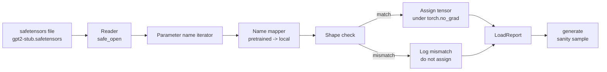

# تحميل الأوزان التي تم تدريبها

> تعليما نموذج 124 مليون برميل من الصفر هو قرار ميزانية؛ تحميل نقطة تفتيش نشرت هو يوم الثلاثاء. هذا الدروس تحميل الأوزان نمط GPT-2 المدربة مسبقا من ملف الأجهزة الآمنة إلى الهندسة المعمارية الدقيقة من الدروس 35، وتجري خريطة اسم المعلم قطعة قطعة، والعقلانية تولد استمرار لإثبات الحمل عمل. لا شبكة، لا محملات طرف ثالث، لا سحر غير شفاف.

**Type:** Build
**Languages:** Python
**Prerequisites:** Phase 19 lessons 30 to 36
**Time:** ~90 minutes

## أهداف التعلم

- اقرأ ملف المراقبين مع `safetensors`مكتبة بايثون وتفقد أسماء العجلات والأشكال.
- قم بتخطيط كل اسم لمعلمة مسبقة إلى معلمة داخل نموذج دروس 35 GPT.
- التعامل مع اتفاقيات الاسم التي تختلف بين الوزن GPT-2 المنشورة والنموذج في هذا المسار: `wte/wpe/h.N.attn.c_attn/c_proj`و`mlp.c_fc/c_proj`مقابل الاسم المحلي`tok_embed/pos_embed/blocks.N.attn.qkv/out_proj`و`mlp.fc1/fc2`. . .
- اكتشاف ورفض عدم مطابقة الشكل مع خطأ واضح قبل أي تفويض الوزن يحدث.
- إنشاء استمرار قصير مع الوزن المحملة وتأكيد الرموز تأتي من التوزيع المحمل، وليس من المبدئية عشوائيا.

## المشكلة

الوزن المنشورة لا يتم تعبئةها لهيكل معماري الخاص بك. أنها تحمل الأسماء التنفيذ الأصلي المستخدم. الملف المُتدرب مسبقاً لديه `transformer.h.0.attn.c_attn.weight`من الشكل`(2304, 768)`النموذج الخاص بك يتوقع`blocks.0.attn.qkv.weight`من الشكل`(2304, 768)`(الذي هو نفس المصفوفة في عقدة ترتيب مختلفة) أو نموذجك يستخدم `nn.Linear`يظهر نفس المعيار مع ثلاثة هويات مختلفة بشكل ظريف (اسم، شكل، ترتيب البايت) ويجب على المحمول أن يوافق بين الثلاثة.

شحن ينسخ عميقا يضع الجهاز الزمني الصحيح في المكان الخطأ وتحصل على نموذج يخلق الهراء. شحن يرفض النسخ عندما يختلف الشكل ولكن لا يسجل شيء يتركك تخمين أي الجهاز الزمني فشل في الهبوط. شحن في هذه الدروس واضح: كل مهمة مسجلة، كل شكل يتم التحقق منها، و`LoadReport`يختص الضربات والخسائر والشكل الخلافات حتى تتمكن من قراءة ما حدث.

## المفهوم



خريطة الاسم هو مجرد وظيفة من سلسلة إلى سلسلة. التحقق من الشكل هو واحد إذا. يتم تعيين داخل `torch.no_grad()`لذا فإن "أوتوجراد" لا تتبع الحمل، ويقوم التقرير بتحويل نتائج كل اسم

### اتفاقية تسمية GPT-2

الوزن المنشورة GPT-2 يعيش تحت أسماء مثل:

| Pretrained name | Shape | Meaning |
|-----------------|-------|---------|
| `wte.weight` | (50257, 768) | Token embedding |
| `wpe.weight` | (1024, 768) | Position embedding |
| `h.N.ln_1.weight` | (768,) | LayerNorm 1 scale at block N |
| `h.N.ln_1.bias` | (768,) | LayerNorm 1 shift at block N |
| `h.N.attn.c_attn.weight` | (768, 2304) | Fused QKV linear weight |
| `h.N.attn.c_attn.bias` | (2304,) | Fused QKV linear bias |
| `h.N.attn.c_proj.weight` | (768, 768) | Attention output projection |
| `h.N.attn.c_proj.bias` | (768,) | Attention output projection bias |
| `h.N.ln_2.weight` | (768,) | LayerNorm 2 scale |
| `h.N.ln_2.bias` | (768,) | LayerNorm 2 shift |
| `h.N.mlp.c_fc.weight` | (768, 3072) | MLP fc1 weight |
| `h.N.mlp.c_fc.bias` | (3072,) | MLP fc1 bias |
| `h.N.mlp.c_proj.weight` | (3072, 768) | MLP fc2 weight |
| `h.N.mlp.c_proj.bias` | (768,) | MLP fc2 bias |
| `ln_f.weight` | (768,) | Final LayerNorm scale |
| `ln_f.bias` | (768,) | Final LayerNorm shift |

مفاجأتين يجب أن تخطط لها`c_attn`،`c_proj`،`c_fc`يتم تخزين الخطوط المتحركة مع المصفوفة التي يتم نقلها بالنسبة إلى ما `nn.Linear.weight`المتوقع. يقوم الشاحن بنقل أثناء التعيين. رأس LM ليس في الملف على الإطلاق. يعتمد النموذج على ربط الوزن مع `wte`، لذا يتم تحديد الرأس عن طريق التعرف على الاسم مرة واحدة`wte`أرض

### الإتفاقية المحلية

النموذج في هذه المسار يستخدم أسماء وصفية:

| Local name | Meaning |
|------------|---------|
| `tok_embed.weight` | Token embedding |
| `pos_embed.weight` | Position embedding |
| `blocks.N.ln1.scale` | LayerNorm 1 scale at block N |
| `blocks.N.ln1.shift` | LayerNorm 1 shift |
| `blocks.N.attn.qkv.weight` | Fused QKV |
| `blocks.N.attn.qkv.bias` | Fused QKV bias |
| `blocks.N.attn.out_proj.weight` | Attention output projection |
| `blocks.N.attn.out_proj.bias` | Output projection bias |
| `blocks.N.ln2.scale` | LayerNorm 2 scale |
| `blocks.N.ln2.shift` | LayerNorm 2 shift |
| `blocks.N.mlp.fc1.weight` | MLP fc1 |
| `blocks.N.mlp.fc1.bias` | MLP fc1 bias |
| `blocks.N.mlp.fc2.weight` | MLP fc2 |
| `blocks.N.mlp.fc2.bias` | MLP fc2 bias |
| `final_ln.scale` | Final LayerNorm scale |
| `final_ln.shift` | Final LayerNorm shift |

الخرائط هي وظيفة ثابتة، الدروس ترسلها كإرشاد يقوم محمولها بتكرارها.

### الوصول إلى الدرج

وزن GPT-2 الحقيقي هو 0.5 جيجابايت. لا تنزله التجربة ؛ فإنه يولد جهازًا صغيرًا لجهازات التشغيل في أول تشغيل ، مع الاتفاقية الدقيقة لإسم GPT-2 والأشكال المناسبة لنموذج 12 كتلة في d_model 192 بدلاً من 768.

```figure
cc-weight-remap
```

## بناءها

`code/main.py`تطبيقات:

- نسخة صغيرة من الدروس 35 `GPTModel`لذا هذا الدرس هو نفسه المحتوى.
- `make_pretrained_to_local(num_layers)`الذي يوسع إدخالات كل طبقة.
- `load_safetensors(model, path)`الذي يتكرر الأسماء، يرسمها، يبحث عن الشكل، ويحول الوزن على النمط conv1d، ويعطي تحت `torch.no_grad()`يعيد رقم`LoadReport`. . .
- `make_stub_safetensors(path, cfg)`الذي يخلق ملف ثابت مع الاتفاقية المسبقة للتسمية.
- عرض تجريبي يخلق`outputs/gpt2-stub.safetensors`في أول تشغيل ، يبني نموذجًا جديدًا ، ويستقطب استمرارًا واحدًا تم إنشاؤه من إبتكار عشوائي ، ويحمله ، ويستقطب استمرارًا آخرًا ، ويطبخ كليهما ، ويؤكد أن الاثنين مختلفان (تغير الحمل بالفعل النموذج).

إشغله

```bash
python3 code/main.py
```

الناتج: مسار الجهاز، سجل الحمل لكل اسم، `LoadReport`الموجة، استمرار قبل الحمل، استمرار بعد الحمل، وعدم مطابقة الشكل على مضغرة واحدة غير صالحة بشكل متعمد حقن في الجهاز بحيث يتم ممارسة مسار الفشل.

## الـ"كثيرة"

- `safetensors`لنموذج القرص على القرص وقارئ البث.
- `torch`للنموذج والحسابيات المهمة.
- لا , لا`transformers`لا , لا`huggingface_hub`لا اتصالات للشبكة

## أنماط الإنتاج في البرية

ثلاثة أنماط تجعل المحمول ينجو من الاتصال مع الأوزان التي لم تخلقها

**Always validate the file before any assignment.**افتح الملف، وقم بإدراج كل اسم للخميس مع نوعه وشكلها، و قم بتشغيل الخريطة الكاملة مع فحص الشكل، وبدأت في تخصيصها فقط عند النجاح. النماذج المتحملة نصفًا هي آلات فشل صامت.

**Log every assignment with the source name and the destination name.**عندما يبدو شيئا خاطئا، سجل يخبرك أي ضغط هبط حيث؛ البديل هو قراءة الهيكسدومب.`LoadReport`درجة البيانات في هذه الدروس تتبع `loaded`،`missing`،`unexpected`و`shape_mismatch`القوائم والطباعة ملخص في النهاية.

**The LM head is a weight tying alias, not a separate copy.**الإعداد`model.lm_head.weight = model.tok_embed.weight`بعد التحميل`tok_embed`هو النمط القنوني نسخ المصفوفة في صورة جديدة`lm_head.weight`المعلم يقطع الارتباط ويقوم بتضاعف عدد المعلمات

## استخدمها

- يعمل محمول أي ملف من أجهزة الأمان التي تستخدم اتفاقية الإسم المسبق للتدريب. تعمل الملفات GPT-2 الحقيقية (صغيرة / متوسطة / كبيرة / xl) دون تغييرات في الشفرة. تختلف فقط تشكيل النموذج.
- نفس النمط ينطوي على الوزن LLaMA، Mistral، Qwen بمجرد تحديث خريطة الاسم.
- إن توليد العقل العصبي بعد الحمل هو بوابة سريعة: إذا كانت عينات ما بعد الحمل تبدو مثل عينات ما قبل الحمل، فإن الحمل لم يغير النموذج، مما يعني أن الخريطة لم تتمكن من إدراك كل مؤشر.

## التمارين

1. إضافة`dtype`الحجة إلى الحامل الذي يلقي كل تنسور إلى نوع الهدف d (`bfloat16`،`float16`،`float32`) أثناء المهمة.`float32`يمكن تخفيض النموذج إلى `bfloat16`ومازالوا يخلقون
2. إضافة `expected_layers`الحجة التي ترفض تحميل نقطة تفتيش`h.N`المؤشرات لا تتطابق مع النموذج `num_layers`. . .
3. قم بتوصيل المحمول إلى وظيفة التوليد الدروس 35 وتحقيق عينات جانباً إلى جانبه: واحدة من الابتكار العشوائي، والآخر من الوصول المحمول.
4. إضافة مسار التصدير: اكتب حالة النموذج الحالية في ملف سيفيتنسور جديد باستخدام اتفاقية الإسم المسبق تدريبها. رحلة ذهابًا وإعادة إلى المحمول وتأكيد أن التقارير لا تضم أي عدم مطابقة في الشكل.
5. التمديد`NAME_MAP`للتعامل مع اتفاقية تسمية LLaMA (لا تحيزات، RMSNorm، ترتيب qkv مزيج) وإعادة تشغيل المحمول على إطار LLaMA القطع التي تولدها.

## الشروط الرئيسية

| Term | What people say | What it actually means |
|------|-----------------|------------------------|
| Name map | "Key remapping" | The function from pretrained tensor names to local parameter names; usually a literal dict with one entry per layer index expanded over a loop |
| Shape mismatch | "Bad shape" | The pretrained tensor exists under the mapped name but its dimensions disagree with the local parameter; the loader refuses to assign and logs the pair |
| Transpose-on-load | "Conv1d layout" | Published GPT-2 stores attention and MLP projections in the transpose of what nn.Linear expects; the loader transposes during assignment |
| Weight tying alias | "Shared LM head" | Setting model.lm_head.weight = model.tok_embed.weight so the head and embedding share storage; the head is not in the file because of this |
| Load report | "Coverage summary" | A small dataclass that tracks loaded, missing, unexpected, and shape_mismatch lists; printing it is how you tell whether the load succeeded |

## المزيد من القراءة

- المرحلة 19 دروس 35 للعماريات التي تتلقى الوزن.
- المرحلة 19 دروس 36 للدورة التدريبية التي تنتج نقطة تفتيش من نفس الشكل.
- المرحلة 10 دروس 11 (تكميس) عن ما يجب القيام به مع الوزن المحمل عندما تكون الذاكرة ضيقة.
- المرحلة 10 الدروس 13 (بناء خط أنابيب كاملة لدرجة الماجستير) لدورة الحياة الكاملة حول الحمل والإستنتاج.
