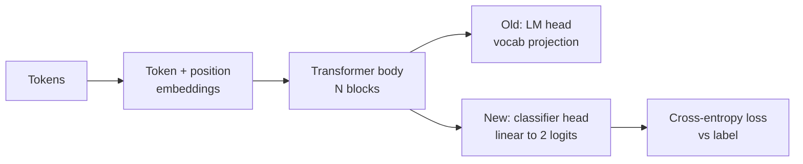
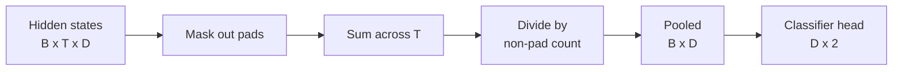
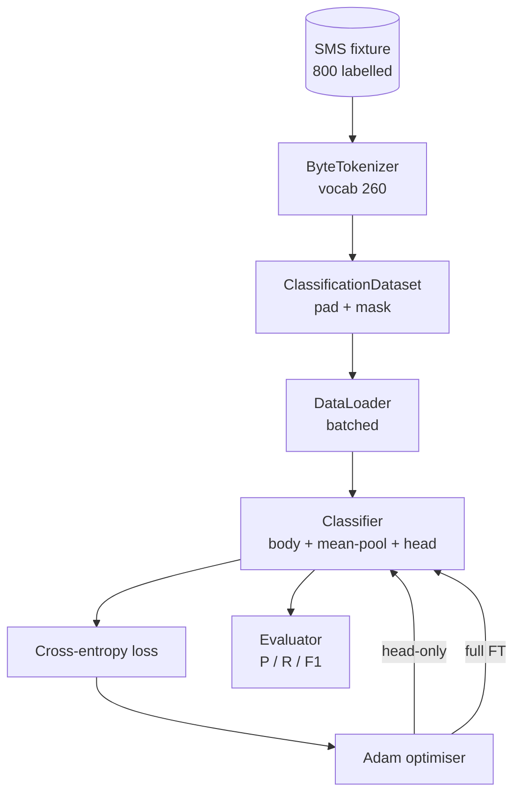

# دراسة القصبة 38: تصنيف التنسيق الدقيق حسب التغيير الرئيسي

> أول حجر أساسي للطريق ب نموذج اللغة المُتدرب مسبقًا هو كومة من كتلة الاهتمام الذاتي التي تنتهي في رأس التنبؤ بالأعلام. عندما تريد البريد الإلكتروني مقابل الخنزير، الرأس خاطئ ولكن الجسم هو في الغالب الحق. هذه الدروس تقطع رأسها، وتقوم بتلصق طبقة خطية من فئتين على التمثيل المجمّع، وتدرب المصفّح بطرق مختلفة: الطبقة النهائية فقط، والتحديد الدقيق الكامل. التقييم هو دقة، التذكير، و F1 على الانقسام المتواصل. تعلم ما الذي يشتريك كل استراتيجية و ما تكلفة.

**Type:** Build
**Languages:** Python (torch, numpy)
**Prerequisites:** Phase 19 lessons 30-37 (NLP LLM track: tokenizer, embedding table, attention block, transformer body, pre-training loop, checkpointing, generation, perplexity)
**Time:** ~90 minutes

## أهداف التعلم

- استبدل رأس نموذج اللغة برأس تصنيف دون إعادة تشغيل الجسم.
- تنفيذ نظامين للتدريب: تجميد الجسم (الرأس فقط) والتحديد الدقيق الكامل، وتقاسم حلقة تدريب واحدة.
- بناء خط أنابيب بيانات واعية للتوكينزير التي تضغط، وتغطية التغطية، وتجمع الناتج الانتباه.
- الحساب الدقيق، التذكير، F1، ومصفوفة الارتباك من المخططات الخام.
- سبب التنازل بين عدد المعلمات، وقت التدريب، و غرفة الرأس.

## المشكلة

لقد تدربت تحويل صغير على مجموعة عامة. رأس الخروج يعرض الحالة الخفية الأخيرة إلى مخزون لغوي من 1000 رمز. لديك الآن 800 رسالة نصية تحمل علامة بريد غير مرغوب فيها أو الخنزير والتي تريد تصنيف ثنائي. هناك ثلاثة خيارات.

الخيار الخطأ هو تدريب مصنف جديد من الصفر على 800 مثال. جسم النموذج المُدرب مسبقاً يرمز بالفعل هيكلاً مفيدًا: هوية الكلمة، الموقع، التواجد البسيط. إرمالها يُهدر الحوسبة التي بناها.

الخيارين الصحيحين هو تبادل الرأس مع الجسم المجمد، وتبادل الرأس مع الجسم المدرب. التدريب الرأس فقط سريع، تقريبا مجاني في الذاكرة، ونادرا ما يزداد مع هذه البيانات الصغيرة. التنسيق الدقيق الكامل هو أبطأ، يمكن أن يزداد من التكيف على البيانات الصغيرة، ولكن يصل إلى دقة أعلى عندما يتحرك المجال التدريبي التدريبي من الجسم السابق.

هذا الدروس يُبني على كليهما، لذا يمكنك مقارنتهما على نفس المعدة.

## المفهوم



النموذج هو وظيفة`f_theta(tokens) -> hidden_states`الرأس هو وظيفة`g_phi(hidden) -> logits`. تبادل الرؤوس يعني الاحتفاظ`theta`وبدل`g_phi`.معايير الجسم هي الجزء الثمين .الرأس طبقة خطية واحدة

هناك مجموعة من المعلمات القابلة للتدريب:

- `theta`عشرات الآلاف من الوزن لكل كتلة إنتباه
- `phi`(الرأس):`hidden_dim * num_classes`الوزن بالإضافة إلى التحيز

في التدريب الرئيسي فقط تقوم بحساب التدفقات مقابل`phi`و أنصفهم ضد`theta`. بيتورش يسمح لك بذلك عن طريق إعداد`requires_grad=False`يرى المتحقق بعد ذلك رأس فقط والجسم يبقى مجمد

في التنسيق الكامل تسمح التدفقات تدفق مرة أخرى عبر كومة كاملة. وزن الجسم يتحرك لتتناسب مع هدف التصنيف. الخطر هو النسيان الكارثي على البيانات الصغيرة: يتم غسيل تدريب الجسم قبل الضوضاء المفرطة.

## سؤال التجميع

المصفوف يحتاج إلى متجه واحد لكل تسلسل، وليس متجه واحد لكل رمز. ثلاثة خيارات شائعة:

- **Mean pool**: متوسط الحالات الخفية عبر التسلسل، وزنها بواسطة قناع الاهتمام.
- **CLS pool**: إعداد رمز خاص واستخدام إصداره فقط. هذا ما يفعله BERT.
- **Last-token pool**: استخدم آخر رمز غير ملصق هذا ما يفعله المصنفون من فئة GPT

يستخدم هذا الدروس جمع المتوسط مع وزن قناع الاهتمام الصريح. إنه أبسط، يعطي إشارة مستقرة على طول التسلسل، ولا يتطلب تدريبًا مسبقًا على رمز CLS.



## البيانات

800 رسالة رسالة نصية، متوازنة 400 رسالة غير مرغوب فيها و 400 مخبث، يتم توليدها بشكل تحديدي في `code/main.py`. يستخدم المولد بذرة ثابتة ، ويختار الشبابط ويستبدل ملء فتحات ، ويصدر رسائل تتراوح طولها بين 5 و 25 رمزا. المجموعات البيانية الحقيقية لديها ضوضاء لا تفعل هذا المكون. نقطة المكون هي قابلية التكرار.

تقسيم البيانات 80/20: 640 قطار، 160 اختبار. يتم تقسيم التقسيمات بحيث تحتفظ مجموعة الاختبار بالتوازن 50/50. مجموعة متواصلة مع توازن معروف تسمح بدقة والذكرى أن تقرأ بأرقام صادقة.

## المقاييس

التصنيف الثنائي مع الفئة 1 كالفئة الإيجابية (الإبلاغ عن طريق البريد الإلكتروني).

- `TP`: المتوقع البريد الإلكتروني، كان البريد الإلكتروني.
- `FP`: المتوقع البريد الإلكتروني، كان الخنزير.
- `FN`: توقعت لحم، كان البريد الإلكتروني.
- `TN`: توقعت الخنزير، كان الخنزير.

المقاييس الثلاثة الرئيسية:

- `precision = TP / (TP + FP)`من الرسائل المشاركة بالبريد الإلكتروني، ما هو الجزء الحقيقي؟
- `recall = TP / (TP + FN)`من الرسائل غير المرغوب فيها، ما الجزء الذي تم إصداره على العلامة النموذجية؟
- `F1 = 2 * P * R / (P + R)`. المتوسط المنسيق بين الاثنين

تقوم المصفوفة المربطة بالارتباك بطبع الأربعة أرقام كشبكة 2x2، وكتب الموضة هذا لتقديم الدعم لكل من نظام التدريب.

```figure
cap-classifier-head-swap
```

## الهندسة المعمارية



الجسم هو محول صغير عمدا: الكلمات 260، مخفي 64، 4 رؤوس، 2 كتلة، تسلسل أقصى 32. هو صغير بما يكفي لتدريب كلا النظم إلى التقارب في غضون تسعين ثانية على جهاز التشغيل المركزي.`pretrain_quick`يقوم المساعد بخمس فترات من تدريب LM على نص نفس المعدة لإعطاء الجسم نقطة بداية غير بسيطة. وهذا يبقي الدروس ذاتية.

## ما ستبني

التنفيذ هو واحد `main.py`بالإضافة إلى وحدة اختبار واحدة (`code/tests/test_main.py`)

1. `ByteTokenizer`: خرائط بايتات إلى هويات، احتفظ هوية البد.
2. `Block`: كتلة تحويل مع تركيز متعدد الرؤوس وطبقة إرسال إلى الأمام.
3. `LMBody`: رمز + وضع إضافة كومة من الكتل. يعيد الحالات الخفية.
4. `MeanPool`: متوسط الموزن على القناع على محور التسلسل.
5. `Classifier`الجسم، المجموعة، الرأس الخطية. الجسم هو نفس الحالة عبر الأنظمة.
6. `freeze_body`و`unfreeze_body`: التبديل `requires_grad`على ملامح الجسم
7. `train_classifier`: حلقة مشتركة واحدة. يقبل النموذج ومحفز المثالي الذي يتم تكوينه لأي مجموعة برمجة يمكن تدريبها.
8. `evaluate`: يدير مجموعة الاختبار ويرجع `Metrics(precision, recall, f1, confusion)`. . .
9. `run_demo`: يُدرب الجسم قبل قليل، ثم يُدرب ويقيم رأسه فقط، ثم يُملي، يُطبق كلتا التقارير، و يخرج من الصفر.

## لماذا المقارنة مهمة

نظام الرأس فقط عادة ما يتدرب بشكل أسرع ويتساوى بشكل أكثر نعمة. على هذا الجهاز عادة ما ترى الدقة بالقرب من 0.9 وتتذكر بالقرب من 0.85 بعد عشرين حقبة من التدريب الرأس فقط. يستغرق التنسيق الكامل حوالي ثلاث مرات أطول ويصل إلى نقطتين في كلتا الاتجاهين ، اعتمادا على البذور العشوائية.

الدروس لا تختار الفائز. انها تعلمك لقراءة الأرقام والتكلفة. على 800 مثال و جسم صغير، رأس فقط هو المكالمة الصحيحة. على 80،000 مثال و جسم أكبر، التنسيق الكامل يبدأ في الوفاء. العقد الذي تأخذ من هذا الدروس هو API: نفس `train_classifier`وظيفة التعامل مع كل منهما، والتحويل هو مكالمة واحدة.

## إرسال أهداف

- إضافة نظام ثالث يفكّر فقط الكتلة الأخيرة. هذا ما يسمى أحياناً التنظيم الجزئي. إنه يكلف أقل من FT كامل وتتعلم أكثر من رأس فقط.
- إضافة جدول معدل التعلم. جدول كوسين على الرأس بالإضافة إلى معدل ثابت أصغر على الجسم هو إعداد إنتاج شائع.
- استبدل المجموعة المتوسطة بجميع الاهتمام المتعلم: طبقة صغيرة من الاهتمام بمسألة واحدة متعلمة. هذا غالبًا ما يفوق المجموعة المتوسطة على تسلسلات أطول.

التنفيذ يعطيك الركاب الاختبارات تعقد العقد الأرقام لك لتدفع
