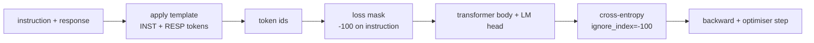
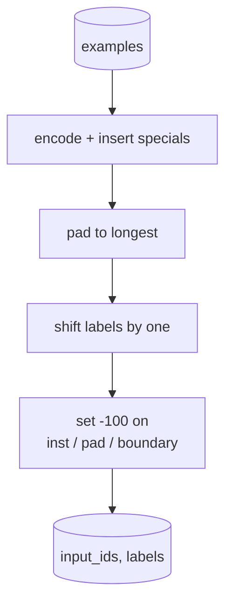
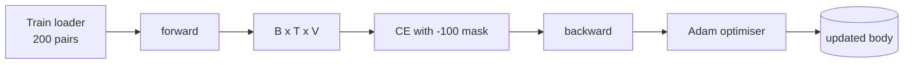

# دراسة Capstone 39: ضبط التعليمات بواسطة ضبطات دقيقة تحت الإشراف

> نموذج أساسي مدرب مسبقًا يمكن أن يمتد تسلسلًا ولكن لا يمكن أن يتبع تعليمات. التنسيق الدقيق المراقب هو أصغر تغيير يصلح هذا: إطعام النموذج مع مثالات من التعليمات والرد المرغوب فيه، وتدريب الجسم على التنبؤ بملفات الاستجابة. الخدعة هي أنك تريد أن تعد الخسارة فقط الإجابة وليس التعليمات هذا الدروس يُبني حلقة SFT على طراز Alpaca مع وظيفة التجميع المخصصة التي تخفي رموز التعليمات مع `ignore_index=-100`، تدرب على 200 زوج من التعليمات والرد، وتقييم على الانقسام المحتمل باستخدام المقابلة الدقيقة.

**Type:** Build
**Languages:** Python (torch, numpy)
**Prerequisites:** Phase 19 lessons 30-37 (NLP LLM track: tokenizer, embedding table, attention block, transformer body, pre-training loop, checkpointing, generation, perplexity)
**Time:** ~90 minutes

## أهداف التعلم

- قم بتصميم بيانات التعليمات والرد على التعليمات إلى تسلسل سببي واحد مع رموز حدود صريحة.
- بناء وظيفة التجميع التي تخفي رموز التعليمات بحيث تعدد الإنتروبي المتقاطع رموز الاستجابة فقط.
- تدريب جسم محول صغير تحت هدف SFT ومشاهدة تحرك تقييم الميتر.
- تنفيذ توليد طموح ومعينة درجة الحرارة يحترم حدود الاستجابة-بدء.
- الحسابات التي تمت إدارتها على المكملات المكتملة.

## المشكلة

نموذج أساسي مدرب على التنبؤ بالتوقيت التالي ليس لديه فكرة عن ما هو التعليمات. أرها السلسلة `"What is the capital of France?"`و سيستمر السؤال أو يختلق جملة جديدة. النموذج لديه اللغة ولكن ليس عقد النموذج.

عقد SFT هو نموذج سلسلة. كل مثال من التدريب يصبح تسلسل واحد مع ثلاثة مناطق:

```text
<INST> What is the capital of France? <RESP> The capital of France is Paris.
```

رموز الحدود هي رموز خاصة محجوزة في وقت التدريب.`<RESP>`هو الرد والرد هو ما يتم تصنيفه. ما زال الهدف التالي للنموذج الأساسي ينطبق؛ هو فقط تدريب على مجموعة حيث كل مثال لديه هذا الشكل.

ولكن هناك مشكلة. إذا قمت بإعطاء التسلسل بأكمله إلى خسارة الانتروبيا المتقاطعة الفانيليا، فإنك تدرب النموذج للتنبؤ أيضًا بملفات التعليمات. يتم إعطاء التعليمات. تريد انخفاض صفر على تلك المواقع. والحل هو القناع.

## المفهوم



`ignore_index`هو ميزة من`torch.nn.functional.cross_entropy`أي موقف هدف يساوي`ignore_index`المساهمة في تساوي الخسارة و تساوي التراجع.`-100`. وظيفة الكولاتة تبني اثنين من الجهاز التنسوري على سبيل المثال: `input_ids`(السلسلة الكاملة) و `labels`(نسخة من `input_ids`مع وضعيات التعليمات المكتوبة فوقها`-100`)

النموذج يرى التسلسل بأكمله خلال المضي قدما، يمكن أن يتابع الاهتمام إلى التعليمات. الخسارة تعتبر فقط رموز الاستجابة. هذا بالضبط ما تريد: حالة على التعليمات، التنبؤ بالرد.

## البيانات

يتم إنشاء 200 زوج من التعليمات والردود بشكل تحديدي في `main.py`. يغطون ست أنواع من المهام:

- الفعل الفعلي (رأس المال من X)
- الحساب
- إستخراج القائمة
- ملخص جملة واحدة
- الرمز (الطباعة، التنظيم)
- التعريف

كل مهمة لديها تعليمات نموذجية ورد فعل تحديد. هذا بسيط عمدا. المقابلة الدقيقة هشة، ويتم استخدام الدروس في جهاز ثابت حيث يكون الجواب الصحيح سلسلة محددة. تحتاج مجموعات بيانات SFT الحقيقية إلى مقاييس مغمورة؛ والمبدأ هو نفسه.

تقسيمات 160 قطار، 40 اختبار. مجموعة الاختبار تغطي جميع أنواع المهمات الستة حتى يمكن الإبلاغ عن مطابقة دقيقة لكل فئة.

## التسمية والإطلاع

الـ " tokeniser " على مستوى البايت مع ثلاثة خصائص محجوزة:

- `INST_ID = 256`: يُعَرِّف بداية منطقة التعليم.
- `RESP_ID = 257`: يحدد الحدود بين التعليم والرد.
- `PAD_ID = 258`: التعبئة للكفائح ذات الطول المتغير.

التسلسل هو`[INST] inst_bytes [RESP] resp_bytes [PAD]*`وظيفة التجميع:

1. يرمز كل مثال
2. يضع كل مثال في المجموعة إلى أطول تسلسل في المجموعة.
3. البناء`labels`= `input_ids`تم تحويلها إلى واحد (هدف LM السببية) ، مع:
   - منطقة التعليمات تم استبدالها ب `-100`. . .
   - منطقة التدفق استبدلت بـ `-100`. . .
   - - نعم`RESP_ID`تم استبدال موقع الحدود نفسه بـ `-100`(لا تدرب النموذج على توقع علامة الحدود؛ فإنه يتنبأ بما يلي).



التحول هو خدعة السببية القياسية: الموقف`i`من`input_ids`يتوقع الموقف`i+1`، لذا`labels[i] = input_ids[i+1]`(بإسقاط الموقف النهائي من المدخل والقاعدة الأولى من الهدف) يتم تطبيق القناع بعد التحول إلى الهبوط في المواقع الصحيحة.

## التدريب



الحلقة هي حلقة PyTorch SFT القياسية. آدم، معدل التعلم حول 3e-4 إلى 1e-3, عشرة إلى عشرين عصر على هذا المكون، لا يوجد مخطط. النموذج صغير بما فيه الكفاية (خفية 96، 2 كتلة، أقصى طول 64) للتدريب على التقارب على CPU في غضون دقيقتين.

كل خمس دورات يقوم الحلقة بإجراء عملية تقييم صغيرة على مجموعة المحتملة وتطبيق مطابقة دقيقة. مشاهدة مطابقة دقيقة تتراوح من 0.0 في دورة واحد إلى ما يشبه 0.85 في دورة خمسة عشر هو مكافأة الدروس: يمكنك رؤية النموذج يتعلم الشكل والجوابات في نفس الوقت.

## الجيل

في وقت تقييم النموذج يحصل على مقدمة التعليمات`[INST] inst_bytes [RESP]`ويتولى الردود حتى:

- التسلسل يصل`max_len`أو
- النموذج يصدّر إيقاف خاص: بايتين متتاليتين ينتهيان الجملة (`.`،`!`،`?`)

يستخدم الدروس تشفير الطمع بالإضافة إلى عينة درجة الحرارة اختيارية. تستخدم المطابقة الدقيقة الطمع لأن درجة الحرارة ستجعل المقاييس متماسكة. غالباً ما تقوم الأنظمة الحقيقية بعينة، ثم تقرر بشكل غامض. هذا الخط أنابيب هو الدروس 41.

## تقييم مطابقة تمامًا

المقابلة الدقيقة هي أقصى مقياس نصي. يتم قياس سلسلة الاستجابة المتوقعة (أقل حرفًا ، فضاءً أبيضًا ، فضاءً مزدوجًا ينهار) ومقارنة مع الاستجابة المرجعية ، يتم قياسها بنفس الطريقة. المقياس إما 1 أو 0 على سبيل المثال. مجموع هو المتوسط.

وتكمل خطوط SFT الحقيقية المقابلة الدقيقة مع F1 على مستوى الرمز (المرحلة 41) ونموذج القضاة. ما زال المقابلة الدقيقة مفيدة لأنه غير واضحة؛ إذا قال 0.7 ، فإن 70 في المائة بالضبط من تعليمات الاختبار أنتجت حرف الاستجابة الذهبية للكرة.

```figure
cc-sft-loss-mask
```

## ما ستبني

التنفيذ هو واحد `main.py`بالإضافة إلى الاختبارات

1. `InstructionTokenizer`: رمز مستوى البايت مع إحتياطات خاصة. يقوم بتشفير إما مقدمة التعليمات أو زوج كامل.
2. `make_dataset`: يخلق 200 زوج على ستة أنواع من المهام مع بذرة ثابتة.
3. `SFTDataset`: العائدات `(input_ids, labels)`على سبيل المثال، قناع جاهزة بالفعل.
4. `sft_collate`: التعبئة الديناميكية، تشكيل الجهاز الزمني، المجموعات `-100`على المواقف التعليمية والمدفوعة.
5. `TinyGPT`: جسم المحول بالإضافة إلى رأس LM مقيد أو منفصل.
6. `train_sft`: حلقة SFT، مع معقب تقييم على أوقات.
7. `generate`: تعريف السببية من المقبل، طموحة أو عينات، مع وقف هيرستيك.
8. `exact_match`: مقارنة سلسلة معايرة، العائدات تتحرك في `[0, 1]`. . .
9. `run_demo`: يجمع البيانات، يقطّب على مدار عشرين فترة، يقيّم، يطبّق تقسيمًا لكل فئة، يخرج من الصفر عن النجاح.

## لماذا القلق مهم

بدون القناع، الخسارة تعامل مع رموز التعليمات كاهداف. يتعلم النموذج التنبؤ بالمرسوم هذا هو هدف مختلف ويؤدي إلى نموذج أسوأ بطرقين. أولاً، يتم إضاعة قدرة النموذج لإعادة بناء المدخلات التي يقدمها المستخدم دائمًا. ثانيا، فإن خسارة الاستجابة أقل في مجموع التراجع لأن رموز التعليم تتجاوز عدد رموز الاستجابة في معظم المجموعات؛ ومعدل التعلم الفعال للمحفز على الجزء الذي تهتم به هو أقل مما كنت تخطط له. القناع ليس برشة، إنه الهدف

## إرسال أهداف

- إضافة ارتفاع معدل التعلم يليه تدهور السينوم. SFT أكثر حساسية ل LR من قبل التدريب.
- إضافة سجل الخسائر لكل رمز وتخطيط منحنى الخسائر على التدريب. لاحظ أن العصور المبكرة تهيمن على رموز الشكل (`<RESP>`ويحكم العصور اللاحقة من خلال رموز الإجابة الفعلية.
- تمديد تقييم إلى BLEU-1 أو chrF. المقابلة الدقيقة تقليل تقدير النماذج التي تنتج تعبير مع نفس الإجابة.
- إضافة نموذج دردشة مع تنسيق متعددة التحولات وتدريب على جهاز يحتوي على متابعة.

يمنحك التنفيذ عقد الشكل والقناع والحلقة. التغيير الموضوعي من النموذج الأساسي إلى متابع التعليمات هو وظيفة واحدة.
