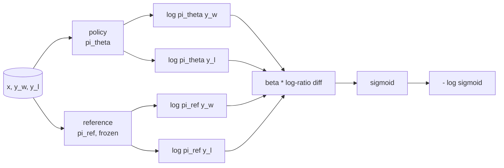
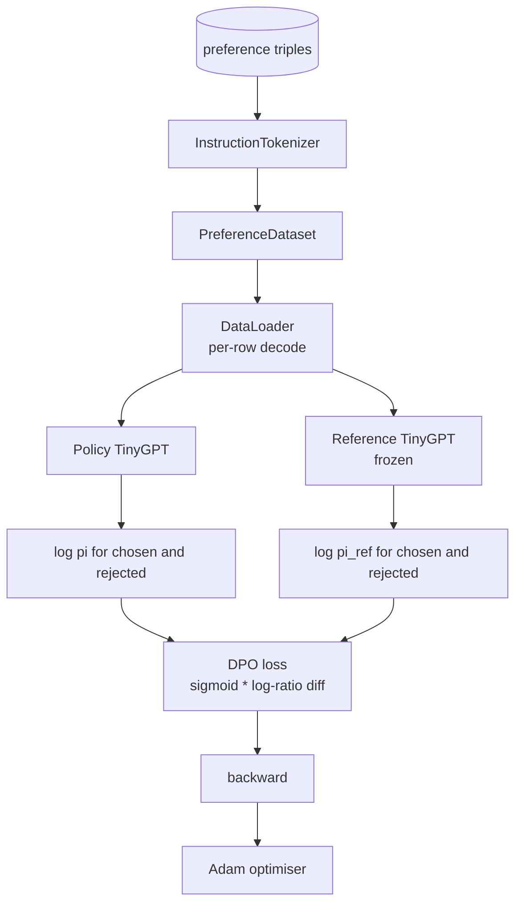

# دراسة كابستون 40: تحسين الاختيارات المباشرة من الصفر

> نماذج المكافأة و PPO هي كومة RLHF الكلاسيكية. ينهار DPO تلك الدرجة إلى خسارة واحدة تحت الإشراف تتناسب مع السياسة مباشرة ضد أزواج التفضيلات. هذا الدروس يستخرج خسارة DPO من هوية الفرق في الجائزة، ويرسل نموذج مرجع العمل بالإضافة إلى نموذج السياسة، ويحسب احتمالات السجلات لكل رمز، ويعلّم محول صغير على جهاز تفضيل من الانتخابات والإكمالات التي رفضت. الاختبارات تحدد حساب الخسارة وتحديد اتجاه التراجع حتى تعرف أن التنفيذ يطابق الورقة.

**Type:** Build
**Languages:** Python (torch, numpy)
**Prerequisites:** Phase 19 lessons 30-37 (NLP LLM track: tokenizer, embedding table, attention block, transformer body, pre-training loop, checkpointing, generation, perplexity)
**Time:** ~90 minutes

## أهداف التعلم

- استنباط خسارة DPO كسيغمايد على اختلاف سجل النسبة المقياسية وربطها بالمكافأة الضمنية.
- بناء نموذج مرجع + زوج نموذج السياسة مع مرجع مجمد وسياسة قابلة للتدريب.
- قم بحساب احتمالات السجل على مستوى التسلسل في كلا النماذج، وتخفيض رموز الإشارة.
- تدريب السياسة على`(prompt, chosen, rejected)`ثلاث مرات وشاهد ارتفاع الملف المختار مقارنة مع الرفض
- سلوك اللوحة مع اختبارات على حساب الخسارة، علامة التراجع، وعدم تغير المرجعية.

## المشكلة

لديك نموذج SFT. يتبع التعليمات، ولكن نتائجها غير متساوية؛ بعض الإكمالات واضحة، وبعضها صريح أو خاطئ. لديك أيضًا مجموعة صغيرة من أزواج التفضيلات: لنفس اللمسة، يُعَلَّق الإنسان على إكمال واحد كمتحرم وآخر كمنكر.

الجواب الكلاسيكي لـ RLHF هو خط أنابيب مرحليين. قم بتدريب نموذج مكافأة على التفضيلات. قم بتحسين السياسة ضد المكافأة مع PPO. هذا يعمل ولكن مكلف: نموذجين في الذاكرة خلال PPO ، والتحكم في KL للحفاظ على السياسة بالقرب من المرجع ، وتحطيم المكافأة عندما يكون نموذج المكافأة هشًا.

يستبدل DPO كلا المراحل بخسارة واحدة تحت الإشراف. لا يوجد نموذج الجائزة أبداً صراحة. يتم تدريب السياسة مباشرة على أزواج التفضيلات ، مع عقوبة KL صريحة تجاه مرجع SFT. نفس الحل الأمثل تحت نموذج تفضيل برادلي تيري ، أقل بكثير من الشفرة.

## المفهوم

ابدأ من نموذج برادلي تيري`x`و إكمالان`y_w`(مختار) و `y_l`(مرفوض) ، احتمال الإنسان يفضل`y_w`هو

```text
P(y_w > y_l | x) = sigmoid( r(x, y_w) - r(x, y_l) )
```

أين`r`هو وظيفة مكافأة خفية`r`من الاختيارات، ثم تدريب سياسة `pi`لتحقيق أقصى قدر ممكن من`r`مع مرساة KL:

```text
max_pi   E_{x, y~pi} [ r(x, y) ] - beta * KL(pi || pi_ref)
```

ولاحظ استنتاج DPO أن السياسة المثلى`pi*`في هذا الهدف، يكون الشكل مغلقًا من حيث`r`:

```text
pi*(y | x) = (1/Z(x)) * pi_ref(y | x) * exp( r(x, y) / beta )
```

إعادة ترتيب`r`:

```text
r(x, y) = beta * ( log pi*(y | x) - log pi_ref(y | x) ) + beta * log Z(x)
```

- نعم`log Z(x)`المصطلح هو نفسها لكلتا`y_w`و`y_l`(يعتمد على`x`لا ، لا`y`), لذلك فإنه يلغي عند حساب الفرق في الاختلافات:

```text
r(x, y_w) - r(x, y_l) = beta * ( log pi_theta(y_w|x) - log pi_ref(y_w|x)
                                - log pi_theta(y_l|x) + log pi_ref(y_l|x) )
```

استبدل في برادلي تيري sigmoid واخذ احتمالات السجل السلبي على أزواج التفضيل:

```text
L_DPO(theta) = - E_{(x, y_w, y_l)} [
  log sigmoid( beta * ( log pi_theta(y_w|x) - log pi_ref(y_w|x)
                       - log pi_theta(y_l|x) + log pi_ref(y_l|x) ) )
]
```

هذه هي الخسارة. إنها سيقمويدا على مستوى مستوى واحد على سبيل المثال ، محسوبة من أربعة احتمالات سجل. لا نموذج مكافأة منفصل. لا PPO. لا وجود لمفهوم KL في الخسارة. يتم احتواء قيود KL في مشتق الشكل المغلق.



## علامة التراجع

فحص عقل مفيد قبل أي تدريب.`log pi_theta(y_w | x)`:

```text
d L_DPO / d log pi_theta(y_w | x) = - beta * (1 - sigmoid(z))
```

أين`z`هذا هو الحجة إلى sigmoid. هذا سلبي للجميع`z`ويعني: زيادة احتمالية التسجيل في السياسة من الانتهاء المختار يقلل من الخسارة.`log pi_theta(y_l | x)`إيجابي: زيادة احتمالية الرفض الزراعي يزيد من الخسارة. التدريب يدفع المختار إلى الأعلى والمنرفض إلى أسفل. الإشارة تجمد؛ لا تتحرك.

## البيانات

اثني عشر تفضيلات ثلاثية السفينة مع الدروس.`(prompt, chosen, rejected)`. الانتهاء المختار قصير ودقيق. الرفض هو الكلمات، خارج الموضوع، أو خاطئ. تغطي الأزواج نفس أسرة المهام مثل الدروس 39 (رأس المال، الحساب، القائمة) لذلك سياسة التي بدأت من قاعدة SFT لديها نقطة بداية معقولة.

إنّ المُصَلّح صغيرًا عمداً. يعمل DPO على عشرات الآلاف من الأزواج في الإنتاج؛ هنا، النقطة هي أنّ حساب الخسارة والحلقة تعمل من نهاية إلى نهاية على مجموعة بيانات صغيرة، ويتزايد الفجوة في المُختبرات المُختارة مقابل المُرفضة بشكل مرئي.

## عدم تغير الإشارة

يجب على تنفيذ DPO التعامل مع نموذج المرجع بعناية. المرجع هو نموذج SFT المجمد في مكانه. يجب أن تحتوي على ثلاث خصائص:

- لم تتلقى المعايير المرجعية أبداً تراجع
- احتمالات السجل المرجعي لا تتغير أبداً بين العصور.
- تبدأ السياسة من نفس الوزن الذي يُسمى بالمراجع.`theta`هو المرجع بالإضافة إلى تحديث علمي؛ إطلاق السياسة كنسخة من المرجع هو البداية المحددة جيدا.)

تنفيذها يفرضها من خلال:

- إغلاق المرجع في `torch.no_grad()`خلال الممرات الأمامية
- الإعداد`requires_grad=False`على كل ملامح مرجعية.
- بناء السياسة عبر `policy.load_state_dict(reference.state_dict())`بعد أن يتم بناء المرجع.

```figure
cap-dpo-preference
```

## الهندسة المعمارية



النموذج هو نفس TinyGPT المستخدم في الدروس 39 (المنشط فقط، السببية، رمز البايت). يشارك المرجع والسياسة الهندسة المعمارية؛ ويزن السياسة تتحرك عن المرجع في التدريب بينما تظل المرجع ثابتة.

## ما ستبني

التنفيذ هو واحد `main.py`بالإضافة إلى الاختبارات

1. `InstructionTokenizer`: إشارة بايت مع `INST`و`RESP`نفس الشكل الذي تم وضعه في الدروس 39
2. `TinyGPT`نفس الشكل الذي تم وضعه في الدروس 39 لذا الدروس هي ذاتية حتى لو تخطيت الدروس 39
3. `make_preferences`: يعود اثني عشر `(prompt, chosen, rejected)`ثلاث مرات
4. `sequence_log_prob`: بالنظر إلى النموذج، ومثابة المقبلة العاجلة، والإكمال، يعيد مجموع احتمالات السجل التالي على الإكمال (لا مساهمة في وضع الموقع العاجل).
5. `dpo_loss`: يأخذ أربعة احتمالات التسجيل و `beta`، يعيد ضغط الخسارة لكل مثال و دلتا مكافأة ضمنية للتسجيل.
6. `train_dpo`: حلقة دورية التي تحسب المختيارات والرفض السجلات-المختبرات تحت السياسة والإشارة، وتطبيق الخسارة، والخطوات آدم.
7. `evaluate_margins`: يعيد متوسط حيز احتمالية السجل المختار الذي تم رفضه في أي وقت في السياسة.
8. `run_demo`: يُبني الإشارة والسياسة من قبل التدريب على التدفئة الصغيرة، ويُنسخ الأوزان، ويتدرب على ثلاثين خطوة، ويُطبق الخسائر والحافة لكل خطوة، ويخرج من الصفر على النجاح.

## لماذا يعمل الـ DPO

DPO يعادل رياضياً RLHF تحت نموذج تفضيل برادلي تيري ، حتى تعريف الجائزة.`r(x, y) = beta * (log pi(y|x) - log pi_ref(y|x))`يمكن تحديدها من التفضيلات إلى وظيفة `x`سياسة النموذج المغلق تسمح لك بالقفز من نموذج المكافأة الصريحة. يتم فرض قيود KL بشكل هيكلي: أي انحراف من`pi`من`pi_ref`يزيد نسبة التسجيل، ويتمشبّع السيغمويد، مما يخفف التدفق عندما تتحرك السياسة إلى أبعد من اللازم.

## إرسال أهداف

- إضافة عدة أشكال من التطبيقات المختلفة: تقسيمها على طول الإكمال. التحيز على الطول هو وضع فشل DPO المعروف حيث يختار النموذج بشكل مفضل إكمالات أقصر لأن احتمالاتها أكبر من حيث الإكمال المطلق.
- إضافة خيار IPO للخسارة: استبدال sigmoid + log ب `(z - 1)^2`. مقارنة التقارب على العضو
- إضافة معايير تسهيل اللقب التي تتداخل بين اللقب الذي تم رفضه بجد و 0.5 متساوية.
- استبدل المرجع بنموذج أصغر وأرخص (ذوق التطهير المعروف).

التنفيذ يعطيك الخسارة، عدم التغير المرجعي، و حلقة التدريب. الرياضيات هي الدروس.
