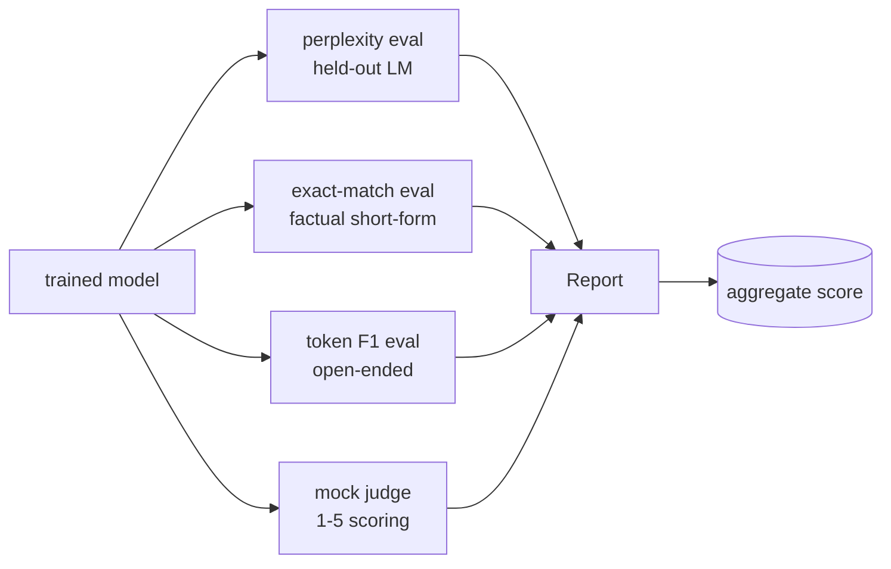
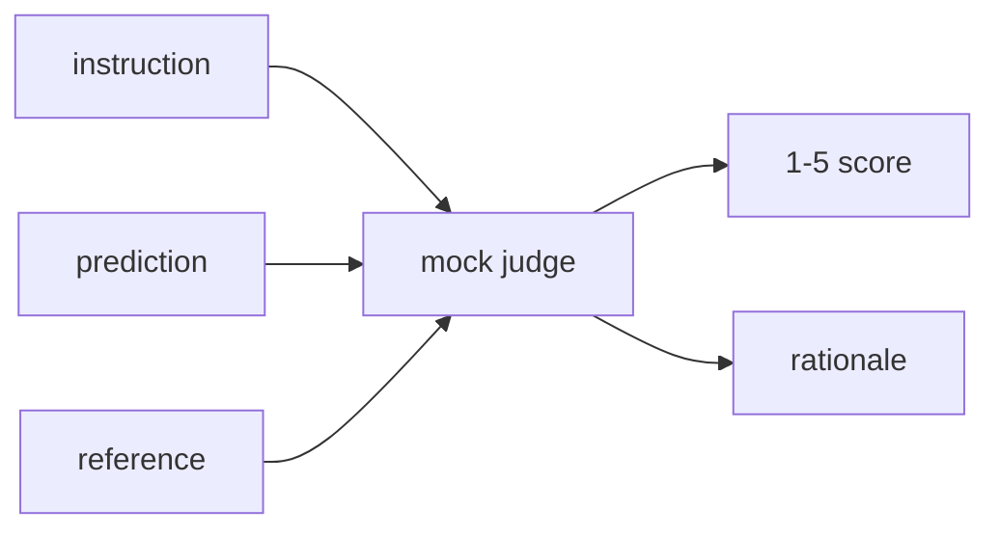
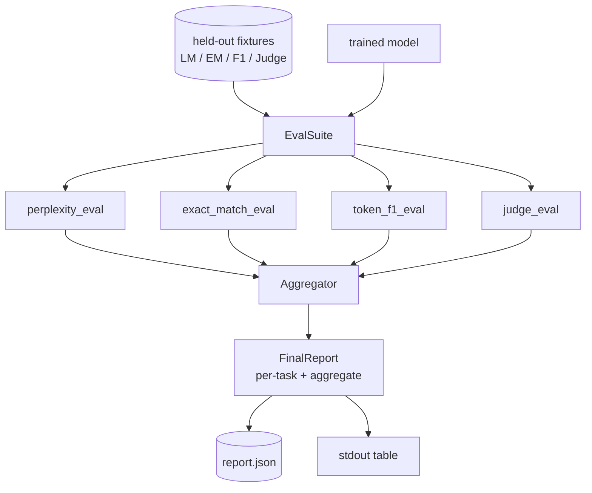

# دراسة كابستون 41: خط أنابيب التقييم الكامل

> التدريب هو الجزء الذي يمكنك مراقبته مع منحنى الخسارة. التقييم هو الجزء الذي يجب أن تصمم. هذا الدروس يبني خط أنابيب تقييم موحد يأخذ أي نموذج لغة مدربة، ويركض أربعة تقييمات متفرقة عليه، ويركز النتائج في تقرير لكل مهمة، ويرسل محلية مزيفة LLM- كقاضي حتى تعمل الحلقة دون شبكة. تغطي هذه التقييمات الأبعاد التي يحتاجها كل نموذج شحن: نمذجة اللغة (المعقدة) ، وصادقة الشكل القصير (التطابق الدقيق) ، ومشابهة الشكل المفتوح (الرمز F1) ، والدرجة الجودية (الحكم).

**Type:** Build
**Languages:** Python (torch, numpy)
**Prerequisites:** Phase 19 lessons 30-37 (NLP LLM track: tokenizer, embedding table, attention block, transformer body, pre-training loop, checkpointing, generation, perplexity)
**Time:** ~90 minutes

## أهداف التعلم

- احسب معقدة معقدة مع رمز مخفي على محول صغير
- إجراء تقييم مطابق دقيق على طلبات حقيقية قصيرة
- قم بحساب مستوى الرمز F1 بين السلاسل المتوقعة والإشارة مع التطبيع.
- بناء محلية مزيفة ماجستير في مجال القانون كقاضي الذي يُسجل النموذج الناتج على مقياس 1-5.
- جمع التقييمات الأربعة في تقرير واحد معزز بتقسيم لكل مهمة.

## المشكلة

لم تكن هناك مقياس واحد يصف نموذج لغة الارتباك يقول كم تناسب النموذج توزيع اللغة ولكن لا يقول شيئا عن ما إذا كان يجيب على الأسئلة. المقابلة الدقيقة تقول ما إذا كان النموذج ينتج الخيط الذهبي ولكن يعاقب المقاطع الصحيحة. الـ"F1" تسمح بالعبرة لكن يتم خداعها بسبب التداخل الكسسي مع المحتوى الخطأ القانون الدراسي كقاضي يحتوي على أبعاد نوعية لكنه مكلف ومستقيم.

النظام الذي تريده في الواقع لديه الأربعة. كل تقييم يغطي بعدة لا تظهر لها الآخرون. كل واحد يعمل على مجموعة فرعية مختلفة من البيانات المحتفظة التي تشكل تلك المقياسة. يظهر التقرير النهائي أرقام كل مهمة جنبا إلى جنب و مجموع، حتى يمكن للمراجع أن يرى في نظرة واحدة ما هي التداولات التي يقوم بها النموذج.

هذا الدروس يبني هذا النبيو، نهاية إلى نهاية، في ملف واحد.

## المفهوم



كل تقييم هو وظيفة من `(model, dataset) -> EvalResult`. النتيجة تحمل القيمة الميترية، وتفاصيل لكل مثال للتفتيش، واسم للمجموعة. يتكون خط الأنابيب منها مع تشكيل يوضح أي تقييمات يجب تشغيلها وكيفية وزنها.

## الارتباك، معد بشكل صحيح

الارتباك هو`exp(mean negative log-likelihood per token)`. التنفيذ له اثنين من الفخاخ:

- يجب أن تكون المتوسط فوق المواقع الحقيقية للرموز ، وليس فوق تسلسل البط * يجب استبعاد رموز التشغيل من المعروف أو سوف تبدو الخوف أفضل مما هي عليه.
- النموذج يتوقع الرمز التالي، لذا يلتقط موقعها`i`توقع الرمز في الموقف`i+1`الخطأ المتفرد هنا صامت: الخسارة لا تزال تتدفق، ولكن المقياس يصبح بلا معنى.

يُحسب التقييم مبالغ لكل مجموعة من`-log p(token)`على المواقع غير المكملات والعدد من الرمز لكل مجموعة، ثم تقسيم في النهاية. هذا أكثر أمانا عدديا من متوسط المرتبات لكل مجموعة (التي تقل وزنها من التسلسلات القصيرة) وتطابق مع تعريف الكتب المدرسية.

## مطابقة دقيقة مع التطبيع

يُعَادِل الحزام كل من التنبؤ والإشارة قبل مقارنة:

- الحروف الصغرى
- القطعة المحيطة بالمساحة البيضاء
- إنهيار الفضاء الداخلي يذهب إلى فضاء واحد.
- التقاط المقطع النهائي (`.`،`!`،`?`) إذا كان كلا الجانبين يختلفان فقط من خلال النقاط.

التطبيع يجعل المقابلة الدقيقة مفيدة في الممارسة العملية.`"Paris"`هو على حق، واحد يقول `"Paris."`هو أيضاً صحيح، واحد يقول`"  paris  "`المقياس لا يزال يتطلب أن تكون الإجابة نفس السلسلة بعد التطبيع.

## الـ F1، الطريق الصحيح

رمز F1 هو المتوسط الهارموني للدقة والذكاء المحاسب على حقيبة الرموز.

1. عادي التنبؤ والإشارة (والقواعد نفسها مثل المقابلة الدقيقة).
2. تقسيم كل واحد إلى قائمة من الرموز (التميز في الفضاء الأبيض).
3. عدّ التقاطع المتعدّد.
4. الدقة = `intersection_count / len(pred_tokens)`. تذكر = `intersection_count / len(ref_tokens)`F1 = المتوسط الهارموني

إذا كان التنبؤ والإشارة فارغين ، ف1 هو 1 (التطابق الفارغ). إذا كان واحد فقط فارغ ، ف1 هو 0. يطابق هذا النمط إشارة تقييم SQuAD ويؤدي إلى عدد مستقيم عبر المقاطع.

## محلية محلية محلية محلية

القضاة الحقيقيون هي نموذج الحدود وراء API. لهذا الدروس يجب أن يبدأ القضاة خارج الاتصال. القضاة المزيفة هو مستحق الدراسة الذي يأخذ تعليمات، وتنبؤ النموذج، والإشارة، ويرد نتيجة في `{1, 2, 3, 4, 5}`بالإضافة إلى دليل واحد، قواعد الجائزة واضحة:

- 5 إذا كان التنبؤ المعتاد يساوي المرجع المعتاد.
- 4 إذا كانت رمز F1 بين التنبؤ والإشارة 0.8 على الأقل.
- 3 إذا كان رمز F1 في `[0.5, 0.8)`. . .
- 2 إذا كان رمز F1 في `[0.2, 0.5)`. . .
- 1 خلاف ذلك

هذا ليس قاضيا حقيقيا، لكنه لديه واجهة صحيحة. تغيير في نموذج حقيقي في وقت لاحق من خلال تغيير وظيفة واحدة.



## التجميع

المجموع هو متوسط موازن من درجات تقييم المعتاد.`[0, 1]`:

- الارتباك: التطبيع على النحو`1 / (1 + log(perplexity))`- معقدة من خرائط 1 إلى 1 خرائط لا نهاية لها إلى 0.
- المقابلة الدقيقة: بالفعل في `[0, 1]`. . .
- الـ (F1) ، قد تم إدخالها بالفعل`[0, 1]`. . .
- القاضي: تقسيم بـ 5

الوزن قابلة للتكوين. الاختلاط الافتراضي هو 0.2 تعقيد، 0.3 مطابقة دقيقة، 0.3 رمز F1، 0.2 قاض. اختيار الوزن هو قرار المنتج؛ الدرس يظهر الزر حتى تتمكن من التجربة.

```figure
cg-eval-quadrant
```

## الهندسة المعمارية



- نعم`EvalSuite`كل تقييم فردي هو وظيفة حرة التي تأخذ`(model, tokenizer, dataset, config)`و يعود`EvalResult`- المُؤمنون`Aggregator`يجمع النتائج ويقدم التقرير النهائي. يقوم الديمو بطبع الجدول ويكتب نسخة JSON التي يمكن للمعلوماتية التابعة للنقل التدريجي أن تتناولها.

## ما ستبني

التنفيذ هو واحد `main.py`بالإضافة إلى الاختبارات

1. `TinyGPT`: نفس الهندسة المعمارية المستخدمة في الدروس 38-40 فقط، بما في ذلك لذلك الدروس تقف لوحدها.
2. `InstructionTokenizer`: إشارة بايت مع إخصائص INST / RESP / PAD.
3. أربعة أجهزة: مجموعة LM، مجموعة EM، مجموعة F1، ومجموعة القضاة. عشرون مثال لكل منها، تحديد.
4. `perplexity_eval`: العائدات `EvalResult`مع قيمة الارتباك والهستوجرام الخسارة لكل رمز.
5. `exact_match_eval`: تعود متوسط إحصائيات النقل والسجلات لكل نموذج.
6. `token_f1_eval`: يعود متوسط الرمز F1 و سجلات لكل مثال.
7. `mock_judge`و`judge_eval`: على سبيل المثال النتيجة والعقلانية، متوسط النتيجة في جميع أنحاء المجموعة.
8. `Aggregator.normalise`: قاعدة التطبيق المتوافق مع الحالة.
9. `Aggregator.aggregate`: المتوسط الموزن والرأي المجمع.
10. `run_demo`: تدرب نموذج صغير بشكل قصير، وتقوم بتشغيل جميع التقييمات الأربعة، وتطبيع جدول التقرير وتكتب JSON، وتخرج من الصفر على النجاح.

## قراءة التقرير

يتكون التقرير من ثلاث طبقات. أعلى هو النتيجة الإجمالية. أسفلها الأرقام الأربعة لكل فئة. أسفل هذه هي التقسيمات لكل مثال للتشخيص. عادة ما يطلب تشغيل مؤشر المعلومات الإجمالي الفاشل التجمعية، ولكن المراجع الذي يطارد رجعة يريد التقسيم لكل مثال لمعرفة أي مدخلات أخطأت النموذج.

يستخدم المرفق JSON مفاتيح مستقرة حتى يتمكن لوحة التحكم في المعلومات الإلكترونية من رسم خطوط الاتجاه عبر الإصدارات. الجدول المطبوع بشكل جميل هو للبشر الذين ينظرون إلى المحطة بعد تشغيل التدريب.

## إرسال أهداف

- إضافة تقييم التصفية: هل احتمالات softmax النموذج تتطابق مع دقةها؟ توقعات السلة حسب الثقة وتقرير الدقة التجريبية لكل سلة.
- إضافة تقييم للقوة: قم بتسمية كل مثال بتشويش (تايبو، الفرز، الاهتمام) وتقرير انخفاض الميتر لكل تشويش.
- استبدل القضاة المزيفة بنموذج حقيقي وراء مكالمة HTTP. توقيع الوظيفة لا يتغير.
- إضافة تعلم الوزن لكل مهمة: بدلاً من الوزن الثابت، قم بتكيف الوزن إلى ترتيب تفضيل هدف على النماذج.

يقدم التنفيذ لك الأربعة تقييمات، والجميع، والنقابة. خطوط التقييم الحقيقية تضع أبعادًا كثيرة على أعلى؛ والنمط يبقى نفسه: وظيفة واحدة لكل تقييم، ومجمعة واحدة، تقرير واحد.
