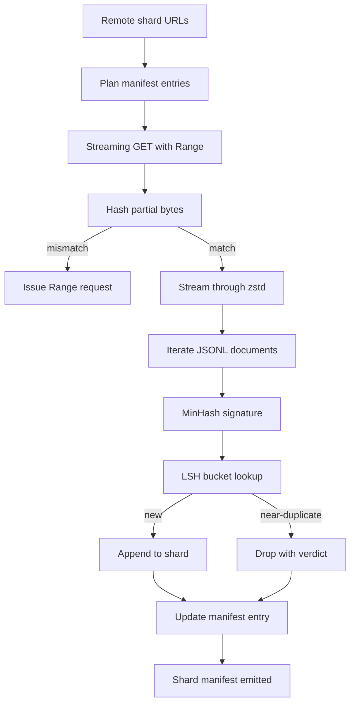

# مُنزّل كبير للجسم

> تدريب نموذج اللغة يبدأ قبل فترة طويلة من أول مرور إلى الأمام. يجب أن يصل القسم إلى القرص، يتم إزدهاره، ويقوم بتخصيصه، ويمكن إدراجه، مع عمل قصة سيرته الذاتية بالفعل قبل أن تنخفض الشبكة إلى 4 في المئة. هذا الدروس يبني مُنزّلًا تدفقيًا يسحب الشظايا المضغوطة، ويقوم بتفكيكها في الهواء مع Zstandard، ويقوم بتكرار بصمات الأصابع تقريباً عبر MinHash بالإضافة إلى التشغيل الحساس للمكان، ويكتب شظايا يُمكن لبقية خط الأنابيب أن يثق بها.

**Type:** Build
**Languages:** Python
**Prerequisites:** Phase 19 lessons 30-37
**Time:** ~90 minutes

## أهداف التعلم

- تشغيل الشظايا عن بعد مع `urllib`و إزالة الضغط مع`zstandard`بدون تعويض الملف بأكمله في الذاكرة
- استئناف التنزيلات الجزئية بإصدار HTTP `Range`الطلبات ضد تعويض بايت معتمد.
- بناء توقيع من هاش لكل وثيقة و وضعها في علبة مع LSH حتى تتصادم المزدوج تقريبا.
- إصدار إشارة شظيفة مع محتوى الاختراق، حجم البايت، عدد الوثائق، وحكم التخفيف.

## المشكلة

أول مرة تدرب فيها على جهاز 200 جيجا غيغابايت تتراجع الشبكة بنسبة 41% و يخرج النص مع`urllib`الاستثناء. المرة الثانية انخفضت إلى 78٪. بنسبة 99٪ قمت بإعادة كتابة الحلقة ثلاث مرات. الإخفاقتان التي يجب عليك تصميمها من الدقيقة الأولى هي إعادة التنزيل الجزئي وإزالة المستندات المكررة. كلاهما لديه حلول معروفة. يتم تخطي كل منهما بشكل روتيني لأن خط الأنابيب يبدأ كخط واحد.`requests.get`دعونا نسميه "أسنان متقدمة"

سيرتك الذاتية مشكلة HTTP . يجب على الخادم أن يحترم`Range`يجب على العميل تتبع التداخل المحقق ضد سجل على القرص ، ويجب على التداخل المحقق البقاء على قيد الحياة في حالة وفاة العملية. إذا كان التداخل المحقق والملف يختلف حتى بعين البايت واحد ، فإن استئناف التنزيل يكتب القمامة ويتلف الجسم بطريقة تظهر فقط أثناء التوضيح.

إن التخفيض هو مشكلة توقيع. يفتقد التخفيض الدقيق إلى المضاعفات القريبة: تظهر نفس مقالة ويكيبيديا مع ثلاث أقدام مختلفة من اللوحة التجهيزية ، وملف رمز واحد مع عنوان ترخيص مختلف ، ونفس مشاركة مدونة مع پیرامتر تتبع على كل رابط. تمكن MinHash بالإضافة إلى LSH من الحصول على هذه التخفيضات بتكلفة فرعية. التكلفة هو توقيع واحد لكل وثيقة وبحث سطل واحد لكل توقيع.

## المفهوم



### التدفق مع`urllib`

المكتبة القياسية`urllib.request.urlopen`يعيد كائن يشبه الملف. لفها في `zstandard.ZstdDecompressor().stream_reader`وتدفق البايتات من الشبكة عبر المضغوط إلى متكرر الوثائق دون أن تتميز قطعة المضغوطة أو القطعة المضغوطة في الذاكرة. تكلفة الذاكرة الوحيدة هي حافظة الخط، وقع MinHash للوثيقة الحالية، ومؤشر LSH.

### استئناف مع `Range`

يقوم المتنزيل بكتابة ملفين لكل شقق: الشقق نفسه و `.partial.json`نقطة التفتيش، سجلات نقطة التفتيش`verified_bytes`،`expected_size`،`sha256_prefix`(حسب على أول `verified_bytes`(بايت) ، و عنوان المصل. عند بدء تنزيل المنزيل يقرأ نقطة التفتيش، ويعيد الحساب `sha256_prefix`على القرص البايت، ويتم استئنافها فقط إذا كانت الحسابات المعدلة مرة أخرى تتطابق. إذا كان الحساب خاطئ يتم التخلص من الجزئي وتستئناف التنزيل من البايت الصفر. الإفساد الصامت مستحيل لأن البايتات المحققة يتم التحقق منها، وليس الافتراض.

### مين هاش + LSH

تقييم MinHash تشابه جاكارد للمجموعتين في مساحة ثابتة. بالنسبة إلى وثيقة، تكون المجموعة هي الشينجول (ن-غرامات متداخلة) من نصها. التوقيع هو `k`الحد الأدنى من قيم الهاش، واحد لكل وظيفة الهاش المستقلة. وثائقين مع شبيهة جاكارد `s`لدي احتمال`s`التوصل إلى اتفاق على أي عنصر واحد من التوقيع.

ثم تقوم LSH بتجميع `k`المكونات إلى `b`فصائل`r`كل صف، حيث `k = b * r`اثنين من الوثائق تتصادم في شريط واحد على الأقل مع احتمال`1 - (1 - s^r)^b`، وهو عتبة حادة حول قيمة `s`أنت تتنسخ`(b, r)`الحد الأدنى لـ "كوربوس ديبوب" هو`s = 0.8`، التي تصل بها أبحاث LSH`k = 128`،`b = 32`،`r = 4`. . .

### إشارة الشظايا كعقد

إن الخروج الوحيد المستدام للمنزّل هو المخطط تحتوي المخطط، لكل شظيفة، على عنوان URL، وعدد البايتات المفصلة، وعدد الوثائق، وعدد الوثائق الفريدة بعد إزالة، والش256 من ملف الشظيفة النهائي. التكنولوجيا التابعة للشروط تقرأ المخطط، وليس قائمة الإداري. إذا كانت شظيفة مفقودة أو شكلها256 خاطئ، فإن المخطط يخبر المرحلة التالية بأن ترفض البدء. المخطط هو الحافة القصوى بين "تُنزيل البيانات" و"تُنزيل البيانات ويمكن التحقق منها".

```figure
cap-corpus-downloader
```

## بناءها

`code/main.py`تطبيقات:

- `ShardPlanner`- يقرأ قائمة بال عناوين URL المقطوعة ويقدم إدخالات المخطط لها.
- `StreamingDownloader`- يفتح`urllib`التدفق مع اختياري `Range`، يكتب إلى ملف مؤقت، يُحديث الملف`.partial.json`نقطة تفتيش على كل قطعة، وتحقق من المرفق Sha256 على سيرته الذاتية.
- `ZstdDocIterator`- يلف سلسلة مثل الملفات في `zstandard.ZstdDecompressor`ويعطي وثيقة واحدة لكل سطر
- `MinHasher`- ينتج`k`- توقيع مكون لسلسلة تستخدم عائلة ثابتة من بذور الهيش
- `LSHIndex`-تتسجيل توقيعات من قبل الفرقة وتقديم تقارير عن الصدامات
- `Dedup`- يجمع بين المصفوفة والإندكس لتسمية كل وثيقة `keep`أو`near_duplicate`مع هوية الشظايا الملائمة
- `ManifestWriter`- يجمع الإحصاءات لكل جزء ويكتب`manifest.json`. . .

إظهار في أسفل الملف يبنى جسم صناعي صغير على القرص، يضغط عليه مع `zstandard`، تنزله من خلال `file://`URL، يُنقل، ويقوم بطبع المخطط.

إشغله

```bash
python3 code/main.py
```

النص يغادر الصفر ويقوم بطبع ملخص واضح

## نمط الإنتاج

أربعة أنماط تصل هذه الدروس إلى أعضاء حقيقية.

**Checkpoint before write.**- نعم`.partial.json`يجب أن يكون`fsync`-ed قبل إضافة البايت إلى الشظيفة. وإلا فقدان الطاقة يعكس الترتيب: البايت الشظيفة على القرص، نقطة التفتيش بدونها، المقال التالي يعتقد أنه لديه أقل من البايتات المحققة من ذلك، البايتات المضاعفة الإضافية تفسد الملف. نقطة التفتيش أولا، ثم الكتابة. هذا هو نفس الانضباط مثل سجل الكتابة مقدما.

**Sharded LSH index.**مؤشر LSH واحد على الجسم كله لا يناسب ذاكرة الوصول الذكي عند مقياس 200 جيجا غابايت. تقسيم مؤشر LSH بواسطة أول شريط hash ، وتخزين القسمات على القرص ، ومراجعة فقط القسم الذي سوف يصل توقيع جديد إليه. التكلفة هي قرأة قرص إضافي واحد لكل وثيقة ؛ والفائدة هي أن مؤشر LSH لم يعد سقف ذاكرة القلب.

**Tombstone, not delete.**يتم تسجيل النسخ المزدوجة في المذكرة مع الحكم`near_duplicate`و هو المقطع الذي تعرضوا له. إزالة هذه المعلومات تفقد الرابط بين المنسق والحافظ عليه. الحجر المقبر يحافظ على مسار المراجعة ويسمح للمرسلين التدريجيين بتغيير رأيه حول العد.

**Per-shard sha256 in the manifest, plus a manifest sha256.**يحصل المخطط نفسه على مادة hash. تتحقق المراحل المتدفقة من المخطط hash قبل أن تثق في إدخالات كل شق. بدون هذا المخطط هو سطح الهجوم الصامت: يمكن للمهاجم الذي يمكنه تحرير ملف واحد أن يفسد الأنابيب بأكملها.

## استخدمها

أنماط الإنتاج:

- **Resume on every CI run.**أجهزة تشغيل المعلومات المعلوماتية مؤقتة، يجب على المنزيل أن يفترض قرصًا جديدًا في كل تشغيل ويتعافى من التخزين أو عن بعد.`--cache-dir`هو علم من الدرجة الأولى.
- **Dedup before tokenization.**التكنولوجيا مكلفة. تشغيلها مرتين على نفس الوثيقة تكلف مرتين للكوربة نفس الخسارة. ديدوب هو في الأعلى من التكنولوجيا، وليس في الأسفل.
- **Manifest as merge gate.**يقرأ التدريب من إشارة إشارة Sha256 من إشارة مقبضة. إصدار مجموعة بيانات جديدة يتطلب إشارة إشارة جديدة. الرابط بين الشفرة والبيانات هو git، وليس الفولكلور.

## أرسله

`outputs/skill-corpus-downloader.md`في مشروع حقيقي، سوف تصف أي عناوين URL تغذى على المنزيل، وكيف يتم وضع دليل نقاط التفتيش، ما هو عرض الشينجل و `(k, b, r)`ثلاث مرات استخدامات الددوب، و حيث يعيش المخطط في التحكم في النسخة.

## التمارين

1. إضافة`--shingle-width`علامة و قياس كيف يتغير حكم التخفيض في الأطول 3، 5، 9 الدفاع عن الاختيار الافتراضي.
2. إضافة دعم gzip إلى جانب zstd عن طريق استنشاق البايتس السحرية. لا يجب على المنزل أن يطلب من المدعو تحديد الكوديك.
3. إضافة`--resume-only`النظام الذي يرفض بدء تنزيل جديد إذا لم يتم العثور على نقطة تفتيش مفيدة في CI لمنع واحد من التشغيل عن طريق الخطأ إعادة سحب 200 جيجا بايت.
4. نقل مؤشر LSH إلى ملف رف أو sqlite وقياس التكامل مقابل المتغير في الذاكرة.
5. إضافة إشارة Sha256 للتحقق عند بدء. يجب أن يفشل المنزيل إغلاق إذا كان الإشارة على القرص لا توافق مع الإشارة في `manifest.lock`. . .

## الشروط الرئيسية

| Term | What people say | What it actually means |
|------|-----------------|------------------------|
| Shard | "A file" | A self-contained slice of the corpus with its own sha256, used as the unit of resume and dedup |
| MinHash signature | "Fingerprint" | A `k`-component sketch of a set, where each component is the minimum of one independent hash over the set |
| LSH band | "Bucket" | A group of `r` signature components used as a single bucket key for collision detection |
| Verified bytes | "Resume offset" | Bytes on disk whose sha256 prefix matches the checkpoint; the only safe offset to resume from |
| Manifest | "The index" | The single durable record of what the downloader produced, including content hashes |

## المزيد من القراءة

- [RFC 7233](https://datatracker.ietf.org/doc/html/rfc7233)- طلبات النطاق HTTP، بروتوكول استئناف
- [Zstandard format specification](https://datatracker.ietf.org/doc/html/rfc8478)- تصميم الإطار الذي يجعل التشغيل من شأنه أن يكون آمناً
- [MinHash](https://en.wikipedia.org/wiki/MinHash)- عائلة التوقيع هذه الدروس تستخدم
- [Locality-sensitive hashing](https://en.wikipedia.org/wiki/Locality-sensitive_hashing)- نظام التصفيق خلف عتبة الإقلاع
- المرحلة 19 · 43 - HDF5 الجهاز الجهاز التنزيل إطعام
- المرحلة 19 · 44 - جدول الكوسين الذي يتدرب على الجسم
- المرحلة 19 · 45 - حلقة AMP التي تستخدم الجدول الزمني
