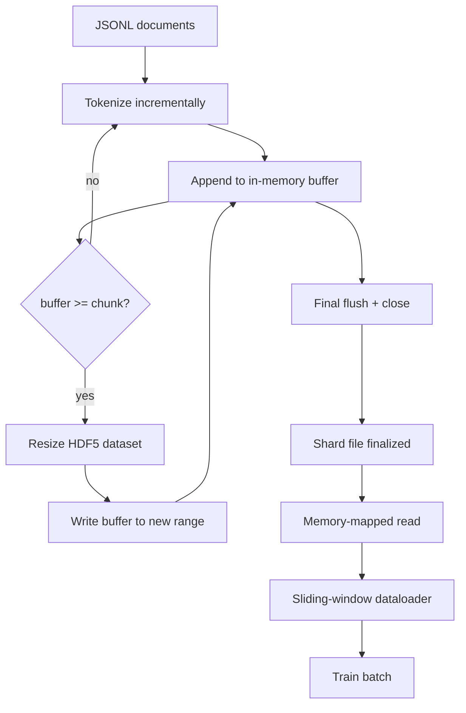

# HDF5 كورس رمزي

> يجب أن يصل الجسم الذي تم تحميله إلى وضع يمكن للمدرب أن يتدفق منه بسرعة خطية. JSONL على القرص لا ينجو 16 عامل محمّل بيانات. HDF5 مع مجموعة بيانات كاملة قابلة للاستعمال هذه الدروس تبني التشغيل التدريجي في مجموعة بيانات HDF5 قابلة للاستخدام الحجم، والكتابة المجزأة عبر ملفات متعددة، والقراءة في خريطة الذاكرة في وقت التدريب، ومحمول بيانات النافذة المزلقة التي تنتج تسلسلات طويلة ثابتة مع التعبئة الصحيحة.

**Type:** Build
**Languages:** Python
**Prerequisites:** Phase 19 lessons 30-37
**Time:** ~90 minutes

## أهداف التعلم

- تحرك المستندات إلى مجموعة بيانات HDF5 كاملة قابلة للتحويل مع التجزئة التحديدية.
- شقّق الكتابة عبر ملفات HDF5 متعددة حتى يتمّ تحديد الفشل وتكون الموازية ممكنة.
- قراءة الرموز من خلال صفحة HDF5 تأكيد الاحتفاظ الاحتفاظ به التخطيط المقطوعة حتى النسخة البيانات إلى الحافظات اللاتين فقط في وقت اللاتين.
- تنفيذ محمل بيانات النافذة المنزلق التي تنشر تسلسلات تدريب على طول ثابت مع قواعد إصدار صريحة.

## المشكلة

تدريبات لغة حديثة تقرأ الرموز بمئات الآلاف من العينات في الثانية على عشرات العمال. يموت JSONL على القرص عند أول خطأ في صفحة الاحتفاظ بالكاش البارد: محلل JSON بطيء ، لا يمكن تعيين حدود الوثائق ، ويحتاج السعي إلى "مثال 4,217,884" إلى مسح الملف. حتى باركيت، الذي يضغط بشكل جيد، هو مناسبة سيئة لأن المدرب لا يريد أعمدة؛ إنه يريد تيار رمزية مسطحة مع O(1) الوصول عشوائي.

يتناسب HDF5 لأنه يوفر مجموعة بيانات صغيرة، قابلة للتحويل، فقط للأرقام الكاملة التي تكون قطعها صديقة لحفظ الصفحة في وقت القراءة.`tokens[3,200,000 : 3,200,8192]`و HDF5 نسخ المعلومات المطلوبة من الاحتفاظ بالمساعدة المتقدمة إلى صفحة NumPy المخصصة حديثا. تكلفة واحدة مفتوحة ومعقب في الملفات وخطوة مخزن الاحتفاظ بالمساعدة المتقدمة في الصفحة بحجم قطعة لكل عامل، وهو أمرٌ بسيط بالمقارنة بتكلفة فك تشفير JSONL.

مشكلة البناء هي جعل الجانب الكتابي صادق مجموعة بيانات قابلة للاستخدام السهل للاساءة الاستخدام: كتابة وثيقة واحدة في كل مرة ويتم تقسيم ملف HDF5 إلى حد عدم الاستخدام. اكتب كل الوثائق في حجم واحد وفاة عملية تفقد الشظيفة بأكملها الانضباط الصحيح هو التمدد بعد ذلك، مع حجم المضخة الذي يطابق حجم الجزء، و كتابة شقق التي تقسم عبء العمل على بين الملفات بحيث تحطم يفقد على الأكثر شقق واحدة.

## المفهوم



### HDF5 القابل للقياس يتم القيام به بشكل صحيح

يتم إنشاء مجموعة بيانات الرمز مع `maxshape=(None,)`ومركز ثابت`chunks=(chunk_size,)`. كتابة العائدات عن طريق تعويض الوهم في صف NumPy من الطول `chunk_size`عندما يملأ المكافئ، يتم إعادة حجم مجموعة البيانات بالتحديد`chunk_size`ويتم كتابة العازلة في النطاق الجديد. في نهاية الشق الأقلية يتم كتابة العازلة المتبقية في النطاق الجزئي النهائي. كل كتابة متواصلة ومحوّلة جزئيا باستثناء الأخيرة، التي يُطلب من القارئ أن يختصر عند المسجلة`token_count`في صفات HDF5 للشظيفة.

### الكتابة الممزقة

ملف HDF5 واحد هو نقطة واحدة من الفشل. يكتب خط الأنابيب شرائح متوازية: كل شرائح مدخلة من المرحلة 19 دروس 42 تنتج شرائح خروج HDF5 واحدة.`shards.json`سجلات المؤشر، لكل شظيفة، مسار الملف، عدد الرموز، عدد الوثائق، و sha256 على الرموز.`shards.json`لحساب التسويات العالمية وتؤكيد الدليل.

### القراءة في الخريطة الذاكرة

في وقت التدريب يفتح كل عامل حصته من ملفات HDF5 في `swmr=True`النظام وطلبات`tokens[start:stop]`يجعلها قراءة مخزن محفظة صفحة بمجرد أن يكون الجزء ساخناً. العامل لا يضمن الملف كله: يتم نسخ الجزء إلى حافظة البطاقة البيانية ، والتي يقوم محمول البيانات بعد ذلك بتنسخها إلى تنزور تدريب ذاكرة محمولة في وقت البطاقة. المسار الحار لديه سيسكال واحد لكل انتقال من القطعة. كل شيء آخر هو وصول ذاكرة الذاكرة.

### محمّل بيانات النافذة المنزلقة

محمّل البيانات هو المرحلة الوحيدة التي تعرف طول تسلسل التدريب. فإنه يختار مؤشر بدء عشوائي في تدفق الرمز العالمي، يقرأ `window_size + 1`الارقام والعائدات`(input, target) = (tokens[:-1], tokens[1:])`لا يتم فرض حدود الوثائق: يمكن أن تتواجد نافذة على اثنين من الوثائق، مع صراحة `boundary_token_id`بينهم حتى يتعلم النموذج استخدام مفصل. هذه هي قاعدة التعبئة القياسية؛ هي أيضا القاعدة التي ينسى المبتدئ، ينتهي به مع مجموعة التي هي 8٪ إشارات التدريب الحدودية و 92٪ النص الطبيعي.

```figure
cc-hdf5-corpus
```

## بناءها

`code/main.py`تطبيقات:

- `Tokenizer`- إشارة تحديدية على مستوى البايت جيدة بما فيه الكفاية للتجربة.`encode(text) -> list[int]`و`vocab_size`. . .
- `HDF5ShardWriter`- يفتح مجموعة بيانات كاملة قابلة لتحويل حجمها، ويحفظ الرموز إلى حجم الجزء، ويعيد الحجم ويكتب في خطوات ذات الحجم الثابت، ويحفظ السجلات`token_count`و`sha256`كما هي صفات HDF5 على القريب.
- `ShardedTokenizationPipeline`- يعيد إدخال الوثائق، ويرسلها إلى كاتب، ويعرض`shards.json`المؤشر
- `MmapTokenStore`- يفتح ملفات شارت للقراءة في خريطة الذاكرة، يحسب التداعيات العالمية، ويكشف واحد `get_slice(start, stop)`-إلى (إي بي)
- `SlidingWindowDataloader`- يختار النوافذ العشوائية من التيار العالمي ويعطي`(input_ids, target_ids)`-مجموعات "نومبي"

تُبني إثباتية في أسفل الملف مجموعة صغيرة من الأذكار، وتُقسم إلى شرائح، فتحتها عبر خريطة الذاكرة، وتُشغّل محفظة البيانات لمدة 10 دفعات، وتطبّق شكل كل دفعة ومجموعة.

إشغله

```bash
python3 code/main.py
```

النص يغادر الصفر ويقوم بطبع مجموعات الفحص

## نمط الإنتاج

أربعة أنماط تصل هذه الدروس إلى تدريب حقيقي

**Chunk size equals the typical read.**المدرب يقرأ`window_size + 1`إعداد قطعة HDF5 إلى مضاعفة من `window_size`و القراءة متوافقة مع مخزن الصفحة. قطع غير متطابقة تقلل النمو إلى النصف لأن كل عينة تلمس قطعتين.

**Token count in attributes, not in the dataset.**قد تكون الجزء التالي من مجموعة البيانات مليئة جزئيا لأن حجم الجزء لا يفرق حدود الوثيقة. تخزين الملف الحقيقي `token_count`في هذه الحالة، فإن القارئ يخرج من النهاية إلى رموز الصفر المغطاة، ويتعلم النموذج التنبؤ الصفر.

**Sharded sha256 with parallel verification.**كل شقق لديه شقق خاصة به على البايتات الرمزية. يمكن للمدرب التحقق من جميع الشقق بالتوازي قبل بدء التدريب. فشل شقق 256 الخطأ في الجري مبكرا، وليس في الفترة الثالثة بعد ستة عشر ساعة.

**`swmr=True` on both sides, with `libver="latest"` on the writer.**وضع الكاتب الواحد والقراءة المتعددة يتطلب من الكاتب فتح مع `libver="latest"`، إنشاء كل مجموعة بيانات مقدماً ، ثم تعيين `file.swmr_mode = True`بعد ذلك يجب على الكاتب الاتصال`dataset.flush()`بعد كل تحويل حجم لذلك القراء العاملين (فتح مع `swmr=True`) انظر البيانات المتسقة.`libver="latest"`أو تمكين SWMR بعد تغييرات هيكلية هو مصدر شائع للفشل في "الملف مغلق".

## استخدمها

أنماط الإنتاج:

- **One HDF5 per source shard.**يقوم المنزّل (المرحلة 42) بإصدار شقّة واحدة لكل URL؛ وتقوم التوجيه (هذه المرحلة) بإصدار HDF5 واحدة لكل شقّة مصدر. يجعلها خريطة 1:1 عملية الاستئناف والحصول على إعادة التأهيل غير مهمة.
- **Boundary token id.**رمز الحدود هو جزء من الكلمة الزمنية و هو الزمنية الوحيدة التي يحققها محمول البيانات. يخفي فقدان التدريب رمز الحدود إذا كان من المفترض أن يتجاهله النموذج. وإلا يتعلم استخدامه كفصل تسلسل.
- **`shards.json` as the source of truth.**إضافة شق جديد يعني كتابة HDF5، حسابها sha256، وإضافة إدخال. يقرأ المدرب الملف مرة واحدة عند بدء العمل ولا يلمس أبدا قائمة السجلات.

## أرسله

`outputs/skill-hdf5-tokenized-corpus.md`هل، في مشروع حقيقي، وصف أي توكينيزر تغذية الأنابيب، ما حجم الجزء يطابق نافذة المدرب، حيث `shards.json`هذه الدروس تعزز المحرك

## التمارين

1. إضافة`--compression gzip`علامة إلى كاتب HDF5 وقياس تكلفة التكامل على الجسم التجريبي. الدفاع عن الاختيار الافتراضي.
2. إضافة بذرة تحديدية إلى محمل بيانات النافذة المنزلقة والتحقق من أن اثنين من الجريئين مع نفس بذرة تنتج دفعات متطابقة.
3. إضافة`--validate`وضع يقرأ كل شقق، يعيد حساب Sha256 على رموزها، ويقارن مع`shards.json`يجب أن يبحث المخبر عن هذا قبل بدء التدريب
4. مقارنة إمدادات محفظة البيانات في حجم قطعة مساوية، نصف، ونصف حجم النافذة.
5. إضافة`--max-document-tokens`العلم الذي يختصر الوثائق الطويلة جدا في وقت الكتابة. الدفاع عن التداول ضد القرار في وقت القراءة.

## الشروط الرئيسية

| Term | What people say | What it actually means |
|------|-----------------|------------------------|
| Resizable dataset | "Append-only" | An HDF5 dataset with `maxshape=(None,)` that grows via `resize` calls in chunk-sized strides |
| Chunked layout | "How HDF5 stores it" | Fixed-size on-disk pages that the kernel can memory-map and the dataloader can read contiguously |
| `swmr` mode | "Read-while-write" | Single-Writer-Multiple-Reader mode that lets dataloader workers share the file safely |
| Shard index | "shards.json" | The durable index of all token shards with offsets and content hashes |
| Sliding window | "Training sample" | A fixed-length slice of the global token stream that the trainer pairs with its shift-by-one target |

## المزيد من القراءة

- [HDF5 chunking documentation](https://support.hdfgroup.org/documentation/hdf5/latest/hdf5_chunking.html)- التخطيط المكون من قطع ، قابلة للتحويل
- [h5py user guide](https://docs.h5py.org/en/stable/)- روابط بايثون لـ HDF5
- [NumPy memory mapping](https://numpy.org/doc/stable/reference/generated/numpy.memmap.html)- تعرض الجانب البدائي للـ HDF5 عبر h5py
- المرحلة 19 · 42 - المنزل الذي يتم إضفاء علامة على إصدار هذا الدروس
- المرحلة 19 · 44 - جدول الكوسين الذي يستغرق هذا محمول البيانات
- المرحلة 19 · 45 - حلقة AMP التي تغطي خطوة التدريب
