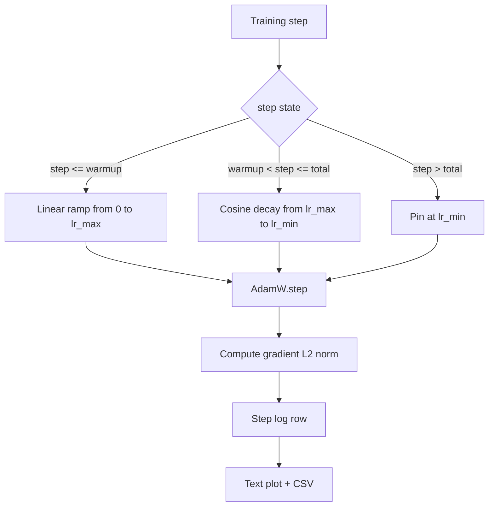

# كوزين LR مع حرارة خطية

> جدول معدل التعلم هو ثاني أهم قرار بعد وظيفة الخسارة. أدام و مع التدهور الكوسينية والحرارة الخطية هي الافتراض الحديث للتدريب على نموذج اللغة لأنه يسمح للنموذج رؤية حجم خطوة فعالة صغيرة خلال التحديثات الفنية الأولى ، ويتم تصاعدها إلى ذروة محددة ، ويتدهور بسلاسة نحو الصفر. هذا الدروس يبني هذا الجدول الزمني، يرسم منحنى على خطوات التدريب، يكتب معايير التراجع بالقرب من الجدول الزمني، ويدل على أن الجدول الزمني يحترم حدود الاحتباس الحراري، الذروة، والفساد.

**Type:** Build
**Languages:** Python
**Prerequisites:** Phase 19 lessons 30-37
**Time:** ~90 minutes

## أهداف التعلم

- تنفيذ محفز AdamW متصل بتوقيت معدل التعلم الكوسيني مع التدفئة الخطية.
- احسب القيمة الدقيقة للجدول الزمني في أي خطوة دون ان يتنقل نقطة العبور عبر الرحلات.
- نسبة التدفقات L2 مع معدل التعلم حتى يتم ملاحظة صحة التدريب.
- اعيد الجدول الزمني إلى مسار نصي يمكن للعين قراءته و CSV أي أداة يمكن استهلاكها.

## المشكلة

أول ألف تحديث للتدريب هو الأكثر صاخبة أوزان النموذج ما زالت قريبة من البداية. تقدير اللحظة الثانية التشغيلية لم يتحسن معايير التراجع كبيرة و ضوضاء إذا كان معدل التعلم في ذروته خلال هذه التحديثات فإن النموذج إما يختلف تماماً أو يستقر في مستوى الخسارة لا يفر منه أبداً. الإصلاحات المعروفة هي قطع التراجع، والذي هو موضوع الدروس في المرحلة 19 45، وجدول زمني لعدد التعلم الذي يبدأ صغيرًا ويصعد.

جدول التدريبات مع الحرارة يحتوي على ثلاث مناطق من الخطوة الصفرة إلى الخطوة`warmup_steps`معدل التعلم يتحرك خطيا من الصفر إلى ذروة التكوين `lr_max`من الخطوة`warmup_steps`للخطوة`total_steps`معدل التعلم يتبع النصف العلوي من منحنى الكوسين، يتحلل من `lr_max`إلى`lr_min`بعد ذلك`total_steps`معدل التعلم يحدد على `lr_min`لذا مدرب خاطئ يخطئ فلن يخرج عن الجدول

مشكلة البناء هي أن الجدول الزمني سهل التخطئ به. يظهر الجدول الزمني لمدة ست ساعات في عملية التدريب كمعدل تعلم مرتفع بنسبة 1٪ أو منخفض جدا في اللحظة التي يبدأ فيها النموذج في التكيف بشكل كبير، وهو أمر غير مرئي ما لم يتم اختبار الجدول الزمني بشكل كامل على الحدود.

## المفهوم



### صيغة الحرارة

لأجل`step`في`[0, warmup_steps]`مع`warmup_steps > 0`، معدل التعلم هو `lr_max * step / warmup_steps`. المتعرضين للخسارة`warmup_steps = 0`يتم التعامل مع الحالة "لا تسخين": يبدأ الجدول مباشرة في `lr_max`عند الخطوة الصفرة وبدء التهالك الفوري`warmup_steps = 0`للتحقق من الجدول الزمني لا يزال ينتج منحنى قابلة للاستخدام.

### صيغة كوزين

لأجل`step`في`(warmup_steps, total_steps]`معدل التعلم هو `lr_min + 0.5 * (lr_max - lr_min) * (1 + cos(pi * progress))`أين`progress = (step - warmup_steps) / max(1, total_steps - warmup_steps)`في`step = warmup_steps`يقدر الكوسين إلى `cos(0) = 1`، مما يعطي`lr_max`، تتطابق مع نقطة نهاية التدفئة بالضبط`step = total_steps`يقدر الكوسين إلى `cos(pi) = -1`، مما يعطي`lr_min`، تتطابق مع نقطة نهاية التهالك بالضبط

استمرارية في كلا النقاط النهائية ليست صدفة. هذا هو السبب في تنفيذ الجدول الزمني كعمل واحد على`step`ليس كثلاث وظائف مختلفة ملصقة معاً. جدول ملصق يفقد حدود واحدة في المرة الأولى`lr_max`تغيرت

### الطابق بعد الخطوات الكلية

لأجل`step > total_steps`معدل التعلم يبقى عند `lr_min`. العقد صريح: الجدول الزمني لا يخطئ ولا يستقطب، إنه يضع في الأرض ويسمح للمدرب بسجل تحذير.`total_steps`ليس الحلقة

### التسجيلات المتعددة مع معدل

الموعد هو نصف صحة التدريب. القاعدة التدريجية هي النصف الآخر. تسجل حلقة التدريب كلتا الخطوات. تشير مسار التدريب المختلف إلى ارتفاع معدل التدريج قبل الخسارة. يحافظ التدفئة المنسقة على ارتفاع المعيار خطيا مع معدل التدريب. يظهر ذروة عدوانية للغاية كمعيار يبقى مرتفعًا بعد التدفئة. مجموعة البيانات على القرص هي`step, lr, grad_l2_norm, loss`-الـ CSV هو السجل الوحيد القيّم

```figure
cap-cosine-warmup
```

## بناءها

`code/main.py`تطبيقات:

- `CosineWithWarmup`- وظيفة بدون ولاية`lr(step) -> float`على الجدول الزمني المحدد.
- `TrainState`- يلف نموذج،`AdamW`ووضع الجدول الزمني في عمل خطوة واحدة
- `TrainState.step`- يستخدم مرسلة واحدة للأمام، مرسلة واحدة للخلف، يكتب معايير التراجع L2، ويتم تطبيقها `lr(step)`إلى المحسن
- `plot_schedule_ascii`- يعبر عن الجدول الزمني كخطوط نصية يمكن للعين قراءتها
- `write_schedule_csv`- يُصدِّر صف واحد لكل خطوة مع معدل التعلم.

التجربة في أسفل الملف يُبني قليل `nn.Linear`النموذج، القطارات لمدة 20 خطوة على مجموعة مدخل ثابتة، وتطبيع معدل التعلم في كل خطوة، ومعايير التراجع، والخسارة. يتم أيضا تقديم الجدول الزمني كخطوط نصية للتحقق من الصحة البصرية.

إشغله

```bash
python3 code/main.py
```

النص يغادر الصفر ويقوم بطبع سجل التدريب لكل خطوة بالإضافة إلى خطة الجدول

## نمط الإنتاج

أربعة أنماط ترفع الجدول الزمني إلى أداة إنتاجية.

**Schedule lives in a config, not in code.**المدرب يقرأ`warmup_steps`،`total_steps`،`lr_max`،`lr_min`من إعداد YAML أو JSON الذي يلتزم بتقديم git. يمكن إعادة إنتاج الجدول لأن الإعداد هو معالج المحتوى؛ الجدول يمكن تدقيقه لأن الإعداد هو جزء من فرق العلاقات العامة.

**Step counter is monotonic and decoupled from epochs.**بعض الإطاريات تخلط بين الخطوة والفترة عندما يتم تقسيم مجموعة البيانات أو إعادة تشغيل محمّل البيانات.`global_step`من نقطة تفتيش المدرب وليس من مقعد محلي. يستمر الجولة المستمدة في وضع جدول المناسب لأن مقعد الخطوة هو المحور الدائم.

**Schedule plot in the run directory.**كل دورة تدريبية تكتب`outputs/lr_schedule.png`(أو في هذه الدروس مسار نصي) في دليل التشغيل. يمكن للمراجع الذي يصفف المجلد التحقق من الجدول الزمني دون إعادة تشغيل أي شيء. هذا يلتقط فئة الخطأ في الجدول الزمني في وقت العلاقات العامة.

**Log row schema is fixed.** `step, lr, grad_l2_norm, loss`يقرأ دفتر ملاحظات أو لوحة التحكم التدريجي التدريجي النظام المخطط؛ إعادة تسمية عمود دون تضرب نسخة يؤدي إلى إبطال كل لوحة التحكم الموجودة.

## استخدمها

أنماط الإنتاج:

- **Sweep peak before sweeping anything else.** `lr_max`هو أسهل كلمة حساسة. مسحها على نموذج صغير أولاً؛`lr_max`يُقَدِّمُ الضعفُ مع حجم النموذج، لذا فإنّ التمطّرِ النموذجِ الصغيرُ هو مقدّمٌ قوي.
- **Warmup is a fraction of total steps, not an absolute count.**يبدأ ركض 200 مليون خطوة مع 2000 خطوة للتدفئة في ذروته على الفور تقريباً؛ يبدأ ركض 20000 خطوة مع نفس العدد بتدفئة بنسبة 10 في المائة. حدد التدفئة كجزء (عادة: 1-3 في المائة) حتى يتساوى جدول الممارسة مع مدة التدريب.
- **`lr_min` is non-zero on purpose.**طابق يبلغ 10 في المائة من`lr_max`يحتفظ المتحسن بالتعلم خلال الذيل الطويل.`lr_min = 0`الموعد ينتج منحنى تدريب يبدو جيدا على مسار و نموذج لم ينتهي التدريب في الواقع.

## أرسله

`outputs/skill-cosine-warmup.md`سوف، على مشروع حقيقي، وصف أي تشكيل يحمل الجدول الزمني، والخطوة المدربة التي يقرأ العداد العالمي، وما `lr_max`وذلك يعني أنّه من المفترض أن يكون هناك قدرات أخرى

## التمارين

1. أضف إختلافًا معاكسًا للجذر التربيعي للجدول الزمني وقارنيه في مسار تدريب لعبة يمتد 200 خطوة. أي منحنى ينتج الخسارة النهائية الأقل؟
2. إضافة`--restart`العلم الذي يضيف حرارة ثانية في `total_steps / 2`الدفاع عن ما إذا كانت إعادة تشغيل الحرارة تتحسن أو تؤذي أثناء تشغيل الألعاب
3. إضافة اختبار الوحدة أن الجدول الزمني مستمر: لكل خطوة في `[0, total_steps]`الفرق`|lr(step+1) - lr(step)|`يحددها `lr_max / warmup_steps`. . .
4. سلك الجدول الزمني إلى `torch.optim.lr_scheduler.LambdaLR`لذلك هو يتكون من رمز الإطار. الدروس تستخدم وظيفة خطوة بسيطة؛ ما الذي يغير الملف؟
5. إضافة`--plot-png`العلم الذي يكتب قصة حقيقية عبر `matplotlib`الدفاع عن ما إذا كان مسار نص الدروس أو PNG هو أفضل افتراضية ل IC تشغيل.

## الشروط الرئيسية

| Term | What people say | What it actually means |
|------|-----------------|------------------------|
| Warmup | "Slow start" | Linear ramp from zero to `lr_max` over the first `warmup_steps` updates |
| Cosine decay | "Smooth drop" | Upper-half cosine curve from `lr_max` to `lr_min` over the remaining steps |
| Floor | "After training" | The fixed `lr_min` value the schedule pins at past `total_steps` |
| Gradient norm | "L2 of grads" | The Euclidean norm of the concatenated gradient vector, logged each step |
| Global step | "Schedule axis" | A monotonic step counter that survives restarts and drives the schedule |

## المزيد من القراءة

- [Loshchilov and Hutter, SGDR: Stochastic Gradient Descent with Warm Restarts (arXiv 1608.03983)](https://arxiv.org/abs/1608.03983)- ورقة مرجعية لجدول التخطيط
- [Loshchilov and Hutter, Decoupled Weight Decay Regularization (arXiv 1711.05101)](https://arxiv.org/abs/1711.05101)- ورقة مرجعية "آدم"
- [PyTorch torch.optim.lr_scheduler](https://docs.pytorch.org/docs/stable/optim.html#how-to-adjust-learning-rate)- كيف تتألف الوظائف الخطوة من الجدوليات الإطارية
- المرحلة 19 · 42 - المتنزيل الذي يستهلك جسم هذا الجدول
- المرحلة 19 · 43 - محمل البيانات يتطور الجدول التالي مع
- المرحلة 19 · 45 - قطع التراجع و AMP، الطبقة التالية في الحلقة
