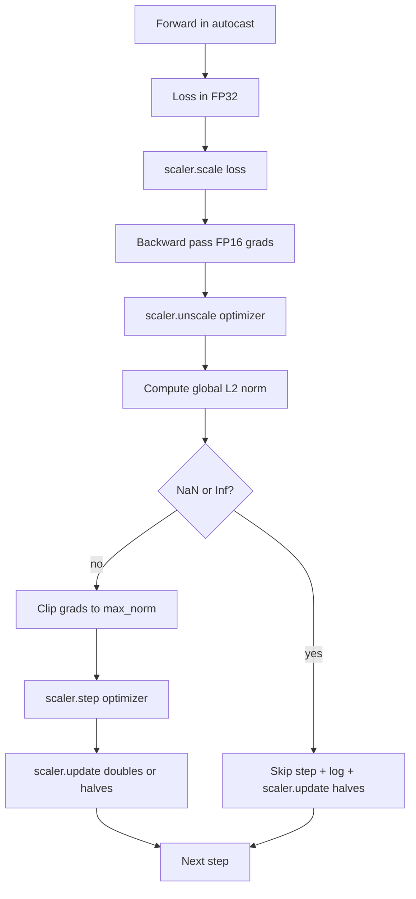

# قطع تدريجي ودقة مختلطة

> المُحسن والجدول الزمني من الدروس السابقة يفترض أنّ التراجعات معقولة. عادة لا يكونون كذلك مجموعة سيئة واحدة يمكن أن تزيد من معايير التراجع ثلاث مرات من حجم. تدريب الدقة المختلطة يضخم هذا عن طريق إدخال FP16 تجاوز على جانب الخسارة. هذا الدروس يُبني حزام السلامة الثنائي الذي لا يمكن أن يتم شحنه من دون تدريب الإنتاج: التقطيع على التدفق إلى معيار عالمي L2 محدد، ودورة بدقة مختلطة مع Autocast و GradScaler التي تكتشف NaN و Inf، وتتخطى الخطوة نظيفة، وتسجل عامل التوسع للطب الشرعي.

**Type:** Build
**Languages:** Python
**Prerequisites:** Phase 19 lessons 30-37
**Time:** ~90 minutes

## أهداف التعلم

- احسب المعيار العالمي لـ L2 على جميع تراجع المعلمات والقطعة الموضحة عندما يتجاوز العد الأساسي المحدد.
- إغلف خطوة تدريبية في طرد محرك بالإضافة إلى GradScaler حتى يتمكن FP16 من عبور الأمام والخلفية من البقاء على قيد الحياة.
- اكتشاف NaN و Inf في الخسارة أو التراجع، تخطي خطوة التحسين، وتسجيل تخطي.
- أبلغ عن عامل تراكم GradScaler كل خطوة حتى يتم رؤية تسلسل طويل من القفز على الفور.

## المشكلة

تمارس تدريبات نظيفة بالأمس، و تنتج منحنى الخسارة يذهب عموديًا عند الخطوة 8،217. الجاني هو مجموعة واحدة التي يبلغ معايير تراجعها 4200، عشرون مرة من الذروة السابقة. بدون قطع المُحسن يطبق خطوة تعيد تعيين كل تعلم كان النموذج قد أدى في الساعة السابقة. مع كليف L2 العالمي عند المعيار 1.0, يساهم نفس اللحظة بتحديث المعيار الوحدي؛ والخسارة تبقى على خط الاتجاه؛ والجري ينجو.

تدريب الدقة المختلطة يدفع الانتقال بنسبة 2-3x عن طريق حساب الممر الأمامي وأغلب الممر الخلفي في FP16. التكلفة هي أن FP16 لديها نطاق ضيق من المضربين. يُقيّم تراجع نموذجي يتدفق في FP16 إلى Inf، الذي ينتشر عبر الطبقات اللاحقة كNaN، الذي يضع كل وزن إلى NaN في الخطوة التالية من المحفز. يحل GradScaler من PyTorch هذا عن طريق مضاعفة الخسارة بعامل مقياس كبير قبل مرور الخلفي وتقسيم التراجع بنفس العامل قبل خطوة التحسين. إذا كان أي تراجع Inf أو NaN في وقت غير مقياس، فإن المقياس يخطئ الخطوة ويقلل من عامل المقياس إلى النصف؛ إذا كانت الخطوات N السابقة نظيفة، فإن المقياس يضاعف العامل. خلال تدريب العامل يجد أعلى قيمة يسمح لها مجموعة FP16.

مشكلة البناء هي توصيل الاثنين بشكل صحيح. المقطوعة قبل عدم قياس الحجم والعدوان على تراجعات مقياسية؛ المقطوعة بعد عدم قياس الحجم وتسلسل العمليات على GradScaler مهمة. التسلسل الصحيح هو: `scaler.scale(loss).backward()`، ثم`scaler.unscale_(optimizer)`، ثم`clip_grad_norm_`، ثم`scaler.step(optimizer)`، ثم`scaler.update()`أي أمر آخر ينتج حلقة مكسورة بصمت

## المفهوم



### المعيار العالمي ل2

المعيار العالمي ل2 هو المعيار الأوكليدي لمتجهات التراجع المتراكمة ، وليس المعيار لكل مُعيار. ينفذ PyTorch هذا على النحو`torch.nn.utils.clip_grad_norm_(parameters, max_norm)`. يعيد الوظيفة المعيار قبل التقطير حتى يمكن للدرس تسجيل كل من القيمة الطبيعية والقصص ، والتي هي ضرورية ل "نحن نقص في كل خطوة" التشخيص.

### التلقائية والجريدي

`torch.amp.autocast(device_type)`هو مدير السياق الذي يقوم بشكل انتقائي بتنفيذ العمليات المؤهلة (معظم العمليات في فئة المتمول) في فترة 16 أوائل الدورة الأساسية. `torch.amp.GradScaler(device_type)`هو المساعد الذي يقيّم الخسارة قبل الخلف ويتقليد المراجع قبل خطوة المحفّز. تم تصميم الاثنين معاً؛ استخدام واحد دون الآخر هو خطأ تشكيل يجب أن يلتقطه الاختبار.

الدرس يستخدم CPU autocast لأن هذا ما يعمل في CI؛ نفس النمط ينقل حرفيا إلى CUDA عن طريق تغيير `device_type="cpu"`إلى`device_type="cuda"`. GradScaler على CPU هو stub (CPU autocast يعمل بالفعل في BF16 الافتراضي ولا يحتاج إلى استحداث حجم الخسارة) ، ولكن الدروس تشمل مواقع الدعوة لذلك التشبكات هو نفسه لدورة GPU.

### الكشف عن NaN و Inf

الاكتشاف يحدث في مكانين أولاً، يتم التحقق من الخسارة نفسها`torch.isfinite`قبل الخلف؛ فقدان Inf أو NaN لا ينتج تراجعات مفيدة ويتم تخطي دون دخول المحافظ. ثانيا، بعد `scaler.unscale_(optimizer)`الدروس تقوم بفحص التدرج غير المقاس مع `has_non_finite_grad(...)`ويعامل أي Inf أو NaN كقفز. تغطي التحققين معا كل من وضع الفشل المضي قدما والمرحلة الخلفية.

### تشخيص عوامل التوسع

عامل التوسع هو الحالة الداخلية للجريدرال.`scaler.get_scale()`ويقوم بتسجيلها بجانب معدل التعلم والمعيار التدريجي.`2^17`أو`2^18`. يظهر عملية السلوك غير السليم عامل يتذبذب بين القيم العالية والمنخفضة، وهو الإشارة إلى أن تراجع النموذج في بعض الأحيان في نطاق و في بعض الأحيان لا.

```figure
grad-clip-monitor
```

## بناءها

`code/main.py`تطبيقات:

- `clip_global_l2_norm`- غلاف حولها`torch.nn.utils.clip_grad_norm_`يعيد كل من القاعدة قبل المقطع و بعد المقطع
- `has_non_finite_grad`- مساعد يُسحّر التدفقات لـ NaN و Inf
- `AmpTrainState`- يلف نموذج،`AdamW`تحسينات، GradScaler، و جهاز التلقائي.`step(inputs, targets)`التي تعمل على قطع كامل، وتوسيع، والقفز على أنابيب NaN.
- `StepLog`و`SkipLog`- سجلات بنية لكل خطوة
- عرض تجريبي تدرب صغير`nn.Linear`نموذج لمدة 20 خطوة، حقن Inf في التدفق على الخطوة 5 لممارسة مسار القفز، وتطبيق السجل الناتج.

إشغله

```bash
python3 code/main.py
```

النص يغادر الصفر ويطبع سجل لكل خط مع كل سطر معلّق `STEP`أو`SKIP`؛ على الأقل صف واحد هو `SKIP`. . .

## نمط الإنتاج

أربعة أنماط ترفع الحلقة إلى مرحلة تدريب الإنتاج.

**Skip counter as an alert, not a log line.**يُعدّ عدد قليل من الخطوات التي يتمّ تخطيها في كلّ ركوب تدريب صحيّاً. مئات الخطوات التي يتمّ تخطيها في كلّ فترة هي تحذير صعب: النموذج في نظام FP16 لا يمكن أن يتحمل، والحلقة تفشل بصمت. تتتبع الدروس معدل القفز المتحرك الذي يتجاوز 1000 خطوة، ويتمّ إنتاجها بمعدل أعلى من 5 في المئة.

**Clip threshold lives in the config.** `max_norm = 1.0`هو الاختيار الافتراضي الحديث للتدريب على نموذج اللغة. قم بتصفيحه على نموذج صغير أولاً؛ والحد الأقصى يسمح للنموذج بالعودة من مجموعات صعبة حقاً؛ والحد الأدنى الأصغر يحد الأسوأ في الحالة بتكلفة منحنى الخسارة الأكثر ضوضاء. والحد يقع في نفس إعداد YAML أو JSON كما هو الحال في الجدول المخطط من الدروس 44.

**Norm log goes to a CSV with the schedule.**عمودات CSV هي`step, lr, grad_l2_pre_clip, grad_l2_post_clip, loss, skipped, skip_reason, scaler_scale`. يرى المراجع الذي يفتح الملف الجدول الزمني، قصة التراجع، عامل التوسع، والنتيجة المفروضة (مع سببها) في صف واحد. تقسيم الأعمدة بين الملفات هو وصفة لتحليلات غير مرتبطة.

**`scaler.update()` runs every step, even on skip.**في خطوة نظيفة يقرأ المقياس العداد غير المفروض، ويزيد من ذلك، وربما يضاعف العامل. في خطوة تم تخطي المقياس يقل العامل إلى النصف ويعيد ضبط العداد. نسيان `update()`على مسار القفز هو الحذاء الذي ينتج "عامل التوسع لم يتغير أبدا".

## استخدمها

أنماط الإنتاج:

- **Autocast device matches optimizer device.** `torch.amp.autocast(device_type="cuda")`للتدريب على الجيبو`torch.amp.autocast(device_type="cpu")`لـ CPU. أجهزة الاختلاط تنتج خطأ صامت النموذج الذي يظهر كحافظة الخسارة التي تبدو جيدة ولكن نموذج لا يتعلم.
- **Loss check before backward.** `torch.isfinite(loss).all()`إن خفض التنسور واحد، فإن التكلفة ضئيلة، والإدخار على خسارة الناتج النووي هو خطوة تدريبية كاملة.
- **`set_to_none=True` in `zero_grad`.**يضع التراجع إلى `None`بدلا من الصفر، مما يسمح للمحفز بالفاف عن الحساب لمجموعات المعلمات غير المتأثرة. الإعداد هو تحسين التوصيل الحر وتقليل طفيف في سطح البغ.

## أرسله

`outputs/skill-clip-amp.md`سوف، على مشروع حقيقي، وصف أي عتبة المقطوعة و جهاز التلقيح التلقائي تستخدم خطوة التدريب، حيث CSV في كل خطوة يعيش في التحكم في النسخة، وما هو عتبة الإنتاج تخطي-سرعة التحذير.

## التمارين

1. استبدل حقن Inf الاصطناعي بـ " عجلة خسارة حقيقية " (تضاعف هدف اللحظة الواحدة بـ 1e8) وتحقق من محفزات مسار القفز.
2. إضافة`--bf16`وضع يغير التسجيل الآلي إلى BF16 بدلاً من FP16. BF16 لديه نطاق معارض أوسع من FP16 ونادراً ما يحتاج إلى تحليل الخسائر؛ التحقق من انخفاض معدل التسجيل إلى الصفر على نفس التجربة.
3. إضافة اختبار الوحدة التي تعيد لفاحة المرافق المقطوعة معايير ما قبل المقطوعة وما بعد المقطوعة بشكل صحيح عندما لا يحدث أي قطعة.
4. إضافة حساب سعر تخطي النافذة المتدفقة ورمز CLI الذي يفشل في التشغيل إذا تجاوز السعر عتبة محددة لمدة 100 خطوة متتالية.
5. سلك الحلقة لكتابة CSV القنوني (`step, lr, grad_l2_pre_clip, grad_l2_post_clip, loss, skipped, skip_reason, scaler_scale`) و تأكيد أن الملف يتجاوز المخططات بـ Ctrl-C عن طريق التمرير بعد كل سطر.

## الشروط الرئيسية

| Term | What people say | What it actually means |
|------|-----------------|------------------------|
| Global L2 norm | "Clip target" | Euclidean norm of the concatenated gradient vector across all trainable parameters |
| autocast | "Mixed precision" | Selective FP16 (or BF16) execution of eligible operations inside a `with` block |
| GradScaler | "Loss scaler" | Helper that multiplies the loss before backward and inverse-scales gradients before the optimizer step |
| Skip | "Bad step" | An optimizer step refused because the gradient or loss was non-finite; the scaler halves the factor |
| Scaling factor | "Scaler state" | The GradScaler's current multiplier; doubles after clean stretches and halves on every skip |

## المزيد من القراءة

- [Micikevicius et al., Mixed Precision Training (arXiv 1710.03740)](https://arxiv.org/abs/1710.03740)- الاقتراح الأصلي لتحديد حجم الخسائر
- [Pascanu, Mikolov, Bengio, On the difficulty of training recurrent neural networks (arXiv 1211.5063)](https://arxiv.org/abs/1211.5063)- ورقة مرجعية لقطع التراجع
- [PyTorch torch.amp.GradScaler](https://docs.pytorch.org/docs/stable/amp.html)- API المقياس هذا الدروس يحتوي
- [PyTorch torch.nn.utils.clip_grad_norm_](https://docs.pytorch.org/docs/stable/generated/torch.nn.utils.clip_grad_norm_.html)- القطع البدائي هذا الدروس يستخدم
- المرحلة 19 · 42 - المتنزيل الذي يغذى جسمه على الحلقة
- المرحلة 19 · 43 - محمل البيانات الذي يستهلكه الحلقة
- المرحلة 19 · 44 - الجدول الزمني الذي يتكون منه هذه الحلقة
