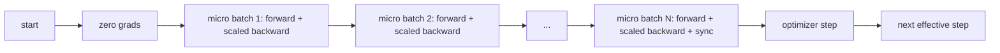
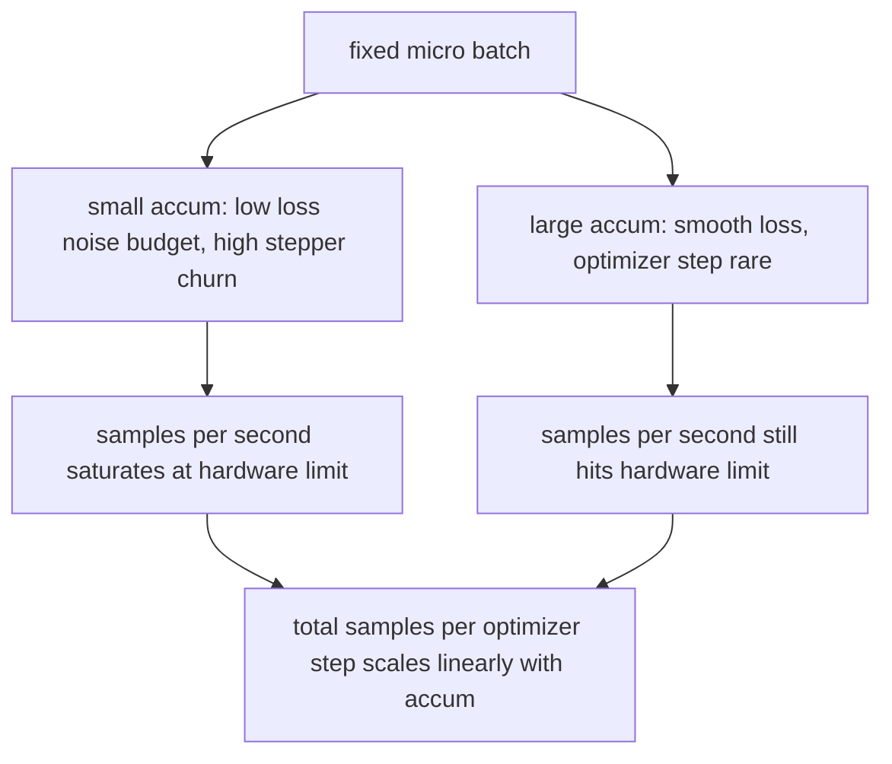

# التراكم المتدريج

> تدريب في مجموعة فعالة لا يمكنك تحمل تكاليفها، واحدة صغيرة في كل مرة.

**Type:** Build
**Languages:** Python
**Prerequisites:** Phase 19 lessons 42 to 45
**Time:** ~90 minutes

## أهداف التعلم

- استنتاج هوية اللحظة الفعلية: `effective_batch = micro_batch * accum_steps`. . .
- قم بتنفيذ تراكم الخسارة لكل مجموعة صغيرة بحيث يتطابق التراجع المتراكم مع مجموعة كاملة واحدة للخلف.
- تخطي التزامن مع المحافظ حتى آخر مجموعة صغيرة (التزامن على الخطوة الأخيرة).
- اقرأ المعدل مقابل منحنى اللحوم الفعلي و اشرح انخفاض العائد.

## المشكلة

تريد التدريب في مجموعة فعالة من 512 لأن منحنى الخسارة أكثر سلاسة والخطوة المحسّنة أكثر منطقية على هذا النطاق. السرعة على المكتب تحتوي على 32 مثال قبل أن تنتهي من الذاكرة. مضاعفة العدد ليس خياراً نصف النموذج ليس خياراً الخدعة التي وصل إليها الحقل في عام 2017 ولم يتوقف عن استخدامها هي تشغيل 16 مراراً للخلف، ودع التراجع يتراكم داخل مسدسات المعلمات، وتخطى المحفز فقط عندما يصل العد إلى الهدف.

الخطر هو أن الخسارة لم تعد نفس العدد الذي كانت عليه في المجموعة الأكبر. إن الانتروبيا المتقاطعة من 16 مجموعة صغيرة تضم بشكل ساذج هي 16 مرة خسارة مجموعة كاملة. دون قياس النطاق، فإن اتجاه التراجع صحيح ولكن الحجم خاطئ، والخطوة المحسّنة هي 16 مرة كبيرة جدا. التحديد هو تقسيم واحد. التحديد سهل أيضًا أن ننسى.

## المفهوم



العقد قصير

- الخسارة لكل مجموعة صغيرة مقسمة على `accum_steps`قبل ذلك`backward()`. بيتورش يجمع التراجع إلى`param.grad`بطبيعة الحال، فإن القسم يدفع المبلغ الجاري إلى المقياس الصحيح.
- يقوم المحافظ بإطلاق الخطوة مرة واحدة لكل دفعة فعالة، بعد أن تراجع آخر دفعة صغيرة.
- تقدم حالة المحفز (مومنتوم بوفرز، لحظات آدم) مرة واحدة لكل خطوة فعالة، وليس مرة واحدة لكل مجموعة صغيرة. فإن المتوسطات المتحركة المتعرضة سترى التردد الخطأ وإلا ستحرق خلال الجدول الزمني.
- على جهاز واحد هذا هو الحساب. على مجموعة متعددة المستويات نفس النمط يلف المجموعات الصغيرة غير النهائية في`no_sync`السياق الذي يفرض التراجع الكامل للنحو؛ الدفعة الصغيرة الأخيرة تقلل من التراجع الكامل المتراكم في مرور واحد بدلا من دفع تكلفة الشبكة N مرات.

### دليل التكافؤ في الرمز

```python
loss = criterion(model(x_full), y_full)
loss.backward()
opt.step()
```

يعادل

```python
for x, y in chunks(x_full, y_full, n):
    scaled = criterion(model(x), y) / n
    scaled.backward()
opt.step()
```

حتى ترتيب جمع نقطة عائمة. البفر التراكمية المتراكمة في نهاية الحلقة هي نفس الجهاز الذي يمكن أن تنتجها مجموعة كاملة واحدة للخلف. يؤكد رمز الدروس هذا مع اختلاف أقصى-abs تحت 1e-4 في `equivalence_check`. . .

### حيث تذهب التكلفة

كل مجموعة صغيرة تكلفة واحدة للأمام وواحدة للخلف. مع التراكم تتبادل الذاكرة بالوقت. منحنى التكامل في`outputs/accum-curve.json`يظهر ما يحدث عندما تنمو اللحظة الفعالة عند اللحظة الصغيرة الثابتة:



لا توجد وجبة غداء مجانية`accum_steps`يضاعف وقت الجدار لكل خطوة تحسين. ما يتغير هو اختلاف تقدير التراجع: في نفس ميزانية الجدار قمت بإجراء خطوات تحسين أقل ولكن تم متوسط كل منها على المزيد من العينات. تعامل الأدب مع الحزمة الكبيرة والحزمة الصغيرة كمشاكل تحسين مختلفة. الدرس هنا هو ميكانيكي ، وليس إحصائي.

```figure
cc-grad-accumulation
```

## بناءها

`code/main.py`هو القطع الأثرية القابلة للعمل.

### الخطوة الأولى: التحقق من المساواة

`equivalence_check()`يُبني نسختين من نفس الشبكة بنفس البذور. يرى أحد مجموعة 16 عينة في مرور واحد إلى الأمام. يرى الآخر أربعة قطع من 4 عينة مع الخسارة مقسمة على أربعة. يقوم العمل بمقارنة مسدسات التراجع قبل خطوة التحسين والمعايير بعد ذلك.`max_abs_diff < 1e-4`. . .

### الخطوة الثانية: نمط التزامن على الخطوة الأخيرة

`train_one_optimizer_step`يمرّ في مجموعات صغيرة لكل مجموعة صغيرة باستثناء آخر مجموعة تدخل`no_sync_context(model)`في عملية واحدة يكون السياق غير عملي، في DDP هذا هو المكان الذي يتم فيه تخطي تراجع كل. الحسابات هي نفسها بغض النظر.`sync_counter`تسجل عدد المرات التي غادرت فيها نطاق no_sync؛ بالنسبة لـ N مجموعات صغيرة، فإن العدد هو واحد لكل خطوة فعالة، وليس N.

### الخطوة الثالثة: منحنى الانتقال

`sweep_effective_batches`يستخدم نفس النموذج مع مجموعة صغيرة ثابتة و قائمة خطوات التراكم. لكل إعداد يقوم بتسجيل:

- `samples_per_sec`: إجمالي عينات رأى مقسمة على الوقت الحائط
- `median_step_ms`: 50 في المئة لكل خطوة فعالة
- `sync_calls`: النقاط الجماعية الممارسة
- `avg_loss`: متوسط عبر خطوات التحسينات

إنتاجها يصل إلى `outputs/accum-curve.json`ويمكن إعادة استخدامها من دفتر ملاحظات

إشغله

```bash
python3 code/main.py
```

النص يطبخ فرق التكافؤ ثم الجدول التنقيب ثم مسار JSON.

## استخدمها

في تدريب الإنتاج، تكثيف التراجع يعيش خلف الزر. نمط PyTorch هو `accumulation_steps = effective_batch // (micro_batch * world_size)`الإطار الذي لا يسمح لك باستخدامه هنا يلف نفس الحلقة، ولكن الخطوات هي نفسها: قياس الخسارة، تخطي التزام المزامن على الميكرو غير النهائي، التراكم، الخطوة مرة واحدة.

ثلاثة أنماط في البرية:

- يتم اختيار حجم الحزمة الصغيرة لتشبين ذاكرة الجهاز أي شيء أصغر ينفذ دورات التسارع أي شيء أكبر ينهار
- يتم اختيار المجموعة الفعالة من جدول معدل التعلم. تحتاج المجموعات الكبيرة الفعالة إلى معدلات تعلم واسعة النطاق والحرارة. هذه هي قاعدة التوسع الخطية التي تم الحديث عنها منذ عام 2017.
- عدد التراكم هو الجسر بين الاثنين والقنبلة الوحيدة التي يمكنك ضبطها في وقت تشغيل دون إعادة كتابة محرك تحميل البيانات.

## أرسله

`outputs/skill-gradient-accumulation.md`يحتجز الوصفة حتى يستطيع أحد الزملاء إلقائها في إعادة التأمين الجديدة: فقدان النطاق بحلول `accum_steps`، تخطي المزامنة المثلى على المجهرات غير النهائية، خطوة المثلى مرة واحدة لكل دفعة فعالة، سجل النتائج ضد دفعة فعالة ك JSON حتى التجارة مرئية.

## التمارين

1. إعادة التدقيق مع`--num-steps 100`و عينات المسار في الثانية مقابل اللحظة الفعالة. أين يسطح المنحنى؟
2. إضافة خيار مقياس خاطئ (لا تقسيم) و عرض المعلمة diff في الخطوة 1 ضد المرجع.
3. تغيير SGD مقابل AdamW وتأكيد تقدم حالة المحفز مرة واحدة في كل خطوة فعالة، وليس مرة واحدة في كل مجموعة صغيرة.
4. أدخلوا حقيقية`DistributedDataParallel`الملف و طريق المخطط`no_sync_context`تأكيد انخفاضات المزامن_المكالمات بنسبة N-1 لكل دفعة فعالة
5. قم بتعديل فحص المساواة لمقارنة مزدوجين مختلفين من الميكرو شقق (2×8 مقابل 4×4) وشرح أي تسامح تحتاج إلى الاسترخاء.

## الشروط الرئيسية

| Term | What people say | What it actually means |
|------|-----------------|------------------------|
| Micro batch | The batch you forward | The slice that fits in memory in a single forward pass |
| Accum steps | Backward passes per step | Number of backwards summed before one optimizer step |
| Effective batch | The batch | Micro batch times accum steps times data parallel world size |
| Loss scaling | Divide by N | Per-micro-batch division so summed gradients match full batch |
| Sync on last | Skip the rest | Only run the gradient collective on the last backward in the window |

## المزيد من القراءة

- أوراق بيتورش على`DistributedDataParallel.no_sync`للنسخة الإنتاجية من خدعة التزامن على الخطوة الأخيرة.
- Goyal et al., 2017، على التوسع الخطى لتدريب المجموعات الكبيرة، السبب القنوني لاهتمام المجموعة الفعالة.
- متابعة إصدار PyTorch على تفاعلات تراكم التدفقات مع عدم تحديد الدقة المختلطة.
- الدروس في المرحلة 19 42 إلى 45 تغطي النموذج، محمول البيانات، المحفز، ومستدربة الدرجة التي تتخذها هذه الدروس.
- المرحلة 19 دروس 47 تغطي نقطة التفتيش والإستئناف حتى تتجاوز مدة طويلة من التراكم
