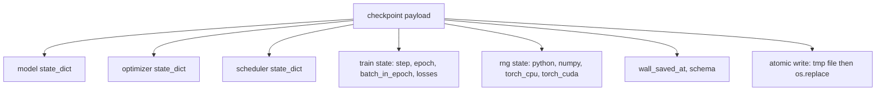
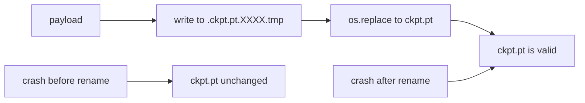
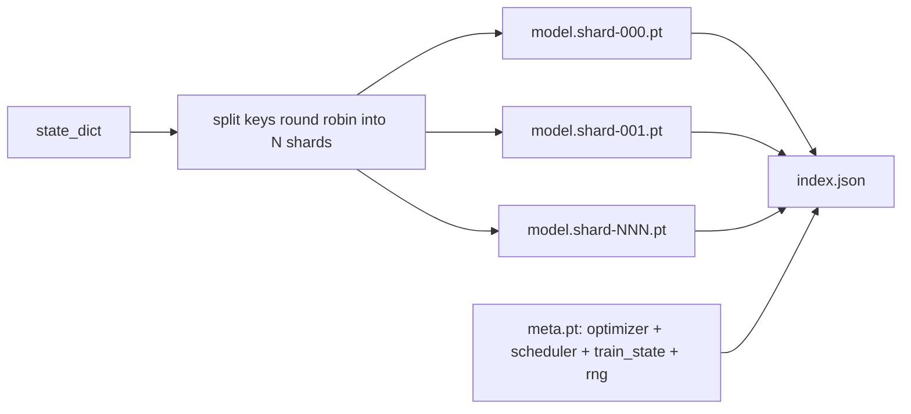

# نقطة التفتيش حفظ واستئناف

> القطار يقاطع عمليات القتل؛ نقاط التفتيش تسمح لهم بالواصلة. حفظ النموذج، المحسن، المجدول، تاريخ الخسارة، عدّة الخطوات، وحالة RNG، بشكل ذريعي، بحيث يترك القتل في أي لحظة ملف صالح على القرص.

**Type:** Build
**Languages:** Python
**Prerequisites:** Phase 19 lessons 42 to 45
**Time:** ~90 minutes

## أهداف التعلم

- إلتقاط حالة التدريب الكاملة في عبء مفيد واحد يمكن إعادة تحمله في عملية جديدة.
- تنفيذ حفظ ذري مع كتابة-إلى-تيم ثم إعادة تسمية حتى تصادم لا يترك ملف نصف مكتوب.
- استعادة حالة RNG ل Python و NumPy و PyTorch بحيث الخسارة بعد استئناف تتطابق مع خط الأساس غير المتوقف.
- قم ببناء ترتيب نقطة التفتيش المقطوعة للنماذج التي لم تعد تناسب في ملف واحد، مع قطع مُحققة بالهاش وإندكس JSON.

## المشكلة

لقد وضعت وظيفة تدريب لمدة 18 ساعة -ساعة الحائط 4 ساعات المجموعة تعيد تشغيلها في الساعة 11 لأن شخص ما فوق مستوى راتبك وافق على تحديث النواة بدون نقاط تفتيش تبدأ من جديد بدون استئناف تفقد أيضا حالة التحسين التي استغرقت الـ 11 ساعة الأولى للتعلم، حتى لو نجت أوزان النموذج، فقد ذهبت لحظات آدم و الخطوة التالية تتحرك في اتجاه مسار التدريب قد تجاوز بالفعل.

الفن الصائب هو ملف واحد يحمل كل ما يلزم للاستمرار: موازين النموذج، حالة المحسن، حالة المخطط، تاريخ الخسارة للمخططات، الخطوة الحالية والعصر والحسابات اللحظة في العصر، وحالة RNG لكل مصدر من العشوائية. بدون حالة RNG، تعود منحنى الخسارة إلى منحنى مختلف. نفس النموذج، نفس البيانات، مختلفة التشويش، مختلفة القناع التخلي، مختلفة الرقم على لوحة التحكم.

إن حفظ الذرة هو النصف الآخر من العقد. الكتابة في اسم الملف النهائي تعني أن النقطة الوسطى للكتبة تترك ملفًا فاسدًا؛ يقرأ سيرته الذاتية القمامة. الكتابة في ملف مؤقت في نفس الإداري ثم إعادة تسمية يعني أن النقطة الوسطى للكتبة تترك الملف الجيد السابق غير متأثرة. إعادة تسمية الذرية على أنظمة ملف POSIX.

## المفهوم



### الخمسة دلوول الولاية

| Bucket | Why it matters |
|--------|----------------|
| Model | Weights and buffers; what the model is. |
| Optimizer | Momentum and adaptive moments; without these the next step is a different optimization problem. |
| Scheduler | Where the learning rate is on its curve; cosine schedules in particular care. |
| Train counters | Step, epoch, batch-in-epoch, plus the loss history that draws the dashboard. |
| RNG state | Determinism for dropout, data shuffling, and any sampling inside the model. |

### الحفاظ الذري



قواعد اثنتان. أولاً، يعيش الملف المؤقت في نفس السجل مع الهدف بحيث يبقى الإعادة تسمية داخل نفس نظام الملفات؛ إعادة تسمية عبر الأجهزة ليست ذرية. ثانياً، يكون الاسم المؤقت فريدًا لكل محاولة بحيث لا يحتل الكتاب اثنان.

### نقاط التفتيش الممزقتة

عندما يصبح النموذج كبير، يصبح الحمل المفيد لملف واحد كبيرًا جدًا لتحميل سريعًا، كبيرًا جدًا لتحقق فيه، وألمًا جدًا عندما تشارك شبكة تعاقب في منتصف القراءة.



يسجل المؤشر عدد الشظايا، sha256 لكل شظايا، و sha256 من ملف الميكا. يفشل المحمول بصوت عال عندما يختلف أي هاش. يمكن أن تهبط الشظايا على أقراص مادية مختلفة؛ والمتا صغيرة وتقرأ أولا.

### استمرار سيرته في منتصف العصر

سيرتك الذاتية التي تتراوح مع بداية العصر القادم من النفايات في أي مكان من دقائق إلى يوم.`(epoch, batch_in_epoch)`بالإضافة إلى حالة RNG. بعد الحمل، حلقة التدريبية تتقدم بسرعة إلى الأمام من قبل مولد الأعداد العشوائية إلى ما بعد الحزم التي استُهلكت بالفعل في العصر الحالي وتستمر من`batch_in_epoch`. رمز الدروس يفعل هذا بالضبط؛ والادعاء هو أن مسار الخسارة بعد استئناف يطابق خط الأساس غير المتوقف داخل 1e-4.

```figure
cc-atomic-checkpoint
```

## بناءها

`code/main.py`يقدم أربعة أسباب ومدفع تجريبي

### الخطوة الأولى: التقاط واستعادة حالة RNG

`capture_rng_state`يعيد إقليم مع Python `random.getstate`، NumPy's `np.random.get_state`و CPU PyTorch و CUDA RNG بايت`restore_rng_state`و يعكس ذلك. و هو عازف بـ 8 بايت و RNG PyTorch يعرف كيفية استهلاكها.

### الخطوة الثانية: الحفاظ على الذرات

`atomic_save`يكتب الحمل المفيد إلى ملف مؤقت في دليل الهدف ، ثم `os.replace`يغيرها إلى الاسم النهائي`atomic_write_json`يستخدم نفس الشيء للمؤشر الممزق.

### الخطوة الثالثة: رحلة ذهاب وإياب كاملة من نقطة التفتيش

`save_checkpoint`يُحجز النموذج، المحفّز، المجدّل، حالة القطار، و RNG في إختبار واحد. `load_checkpoint`يعود الـ`TrainState`. حقل النظام هو خطة الترقية: تغييرات في النموذج في المستقبل تضرب سلسلة الإصدارات وتبعث جهاز التحميل.

### الخطوة الرابعة: النوع الممزق

`save_sharded_checkpoint`يُجول مفاتيح المعلمات عبر N شرائح، ويكتب كل شرائح مع حفظها الذري، ويكتب ملفًا متيًا مع المحافظ والجدول المخطط وحالة القطار، ويكتب مؤشر JSON مع شرائح sha256s. `load_sharded_checkpoint`يُحقق من كل شظّة قبل الاندماج

### الخطوة 5: عرض استعادة

`run_resume_demo`تدرب نموذج صغير ل`total_steps`, يحتفظ بمراقبة في`interrupt_at`، ثم يستمر. عملية ثانية تعيد نقطة التفتيش وتقوم بالخطوات المتبقية. يعيد الوظيفة الفرق المطلق القصوى بين مسارات الخسارة بعد نقطة الانقطاع. مع استعادة RNG ، فإن الفرق هو صفر أو ضجيج نقطة عائمة.

إشغله

```bash
python3 code/main.py
```

الملف الواحد والإثباتات المجزأة كل من تأكيد أقصى اختلاف تحت 1e-4.`outputs/resume-demo.json`. . .

## استخدمها

تدريب الإنتاج يجمع نقاط التفتيش للسفن كجزء من المدرب. الشكل هو نفسه: النموذج + المفعّل + المجدد + العدادات + RNG ، مكتوب ذريّاً ، يُسمى خطوةً خطوةً بحيث يكون أحدثها سهل العثور عليه. تخطيطات شقّة تعمل على تحميل النموذج الكبير مع قراءات متوازية؛ وهو ما يجعل ذلك يعمل.

ثلاثة أنماط ليتم تنفيذها:

- **Schema is a string in the payload.**لا يمكنك تطوير الشكل دون كسر القواعد القديمة
- **Sha256 every shard.**التنزيل المقطع بصمت هو أسوأ نوع من الأخطاء؛ الفاشلة التحميل تُفشل بسرعة أو تتأخر.
- **Keep checkpoint cadence honest.**احتفظ بكل خطوات N وكل ساعة الحائط دقيقة، أيا كان أقصر. وإلا الخطوة الطويلة التي تتحطم تضيع نافذة كاملة من العمل.

## أرسله

`outputs/skill-checkpoint-save-resume.md`هو وصفة لأي نص تدريب جديد: شكل الحمل المفيد، الكتابة الذرية، استيلاء RNG، مؤشر شقق.`save_checkpoint`في موقع الاحتفاظ الدوري، سلك `load_checkpoint`عند بدء العمل، والجري ينجو من القتل.

## التمارين

1. استبدل شقق الدورية بقطع حسب مجموعة المعلمات (طبقات تنتهي في `.weight`و`.bias`متى يفضل كل ترتيب؟
2. تمديد حلقة حفظ للحفاظ على نقاط التفتيش الأخيرة K وتحذير القديمة. ما هو K الصحيح عندما يكون القرص صغير؟
3. إضافة`--ckpt-every-seconds`العلم الذي يؤدي إلى حفظ على فترة ساعة الحائط، وليس مجرد حساب الخطوات.
4. إضافة مسار التحقق من المبلغ الذي يعمل عند بدء، مسح كل نقطة تفتيش في السجل، وتقرير أي منها فاسد.
5. تنفيذ`migrate_v1_to_v2`وظيفة تضيف حقل جديد إلى الحمل المفيد وتضرب سلسلة النظام. جعل الحمل تحمل كلا الإصدارين.

## الشروط الرئيسية

| Term | What people say | What it actually means |
|------|-----------------|------------------------|
| Atomic save | "Write and pray" | Write to a temp file in the same directory, then os.replace into the target name |
| State dict | "The weights" | Model parameters and buffers, keyed by parameter name |
| Sharded checkpoint | "Big model file" | Multiple files, one per shard, plus a meta file and a JSON index with sha256s |
| RNG state | "Random seed" | Captured state for python random, numpy, torch CPU, torch CUDA; not just the seed |
| Mid-epoch resume | "Restart" | Fast-forward the RNG and continue from the next batch in the same epoch |

## المزيد من القراءة

- البوسيكس`rename`الادباءات الاسمية للذرية تدعي ان `os.replace`يعتمد على.
- وثائق PyTorch على `torch.save`و`torch.load`، بما في ذلك`map_location`لإعادة الجهاز المتقاطع.
- المرحلة 19 دروس 46 تغطي تراكم التدرج الذي ينجو من عبء نقطة التفتيش هذه الدروس.
- المرحلة 19 الدروس 48 تغطي الملفات الموزعة التي يسمح لها هذه الخطة بتصميمها الحكومي.
- النواة لينكس `fsync`وثائق ضمان الاستدامة وراء إعادة تسمية الذرة.
