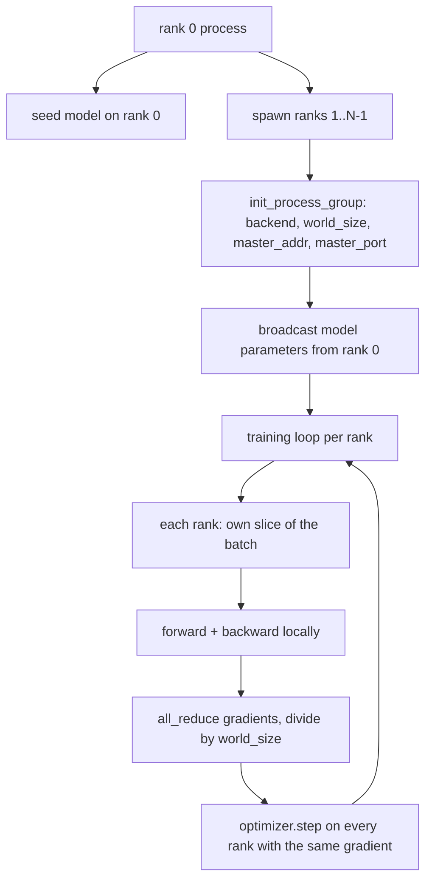
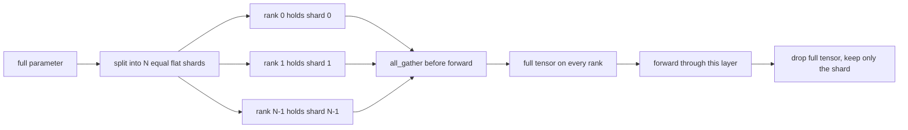

# المعلومات الموزعة متوازية و FSDP من الصفر

> التدريب متعدد الرتب هو مجموعتين وقاعدة واحدة. نشر المعايير عند البدء، متوسط التراجع بعد الخلف، لا تدع الرتب تختلف حول الخطوة التي هي عليها.

**Type:** Build
**Languages:** Python
**Prerequisites:** Phase 19 lessons 42 to 45
**Time:** ~90 minutes

## أهداف التعلم

- قم بإعداد مجموعة العمليات عبر صفوف N مع `gloo`الخلفي، لا أجهزة خاصة.
- تنفيذ غطاء DDP الحد الأدنى الذي ينشر المعلمات عند البناء ويقلل تماما من التراجع بعد الخلف.
- إثبات أن التخفيض الكامل من تراجعيات لكل صف يطابق تراجع عملية واحدة على المدخل المتراكم.
- رسم FSDP شظافة المعلم: كل صف يحمل شريحة، يتم جمع التنسور الكامل للمرور إلى الأمام ويتم إسقاط بعد ذلك.

## المشكلة

النموذج يناسب جهاز واحد لم يكن ذلك في مجموعة البيانات ميزانية التحسين تقول أنك تريد أن ترى N ضرب الأمثلة لكل ساعة الحائط ثانية. الرافعة الأولى هي متوازية البيانات: كل صف يدير نفس النموذج على شريحة مختلفة من اللحظة، ثم يُوسع تراجع قبل خطوة التحسين. الرافعة الثانية هي FSDP: النموذج لا يناسب جهاز واحد أيضًا ، لذلك تحتوي كل صف على جزء من كل مبرمج وإعادة بناء الطبقة الكاملة للثنسرات طبقة بعد طبقة خلال المرور إلى الأمام.

إن كان المعدل يُحكم في المعدلات، فإن المعدلات تتحرك عبر الصفوف، فإنّ المعدل يُفسد بشكل صامت. إذا كنتِ تقيسين التدرجات، ولكن ليس الخسارة، فإنّ لوحة التحكم تكذب. إذا لم تتمكن المجموعة من الاتفاق على أساسية، فإنّ المعدل يُعلق إلى الأبد. فإنّ الحل هو كتابة المجموعات يدوياً مرة واحدة، ولا تثق أبداً في غلاف لا يمكنكِ إعادة تكرارها.

هذا الدروس يعمل على CPU.`gloo`سفن خلفية مع كل PyTorch بناء و تقبل`torch.multiprocessing`العمال؛ نفس الرمز يتحول إلى `nccl`على عقدة متعددة GPU دون تغيير الهيكل.

## المفهوم



### الجماعتين التي تهتم

| Collective | What it does | When |
|------------|--------------|------|
| `broadcast` | Copy a tensor from one rank to all others | Parameter init, scheduler state, any one-to-all sync |
| `all_reduce` | Sum (or mean, or max) a tensor across all ranks, every rank gets the result | Gradient averaging after backward |
| `all_gather` | Each rank contributes a tensor, every rank gets the concatenation | Logits collection, FSDP parameter unshard |

عقد " ديب " هو`broadcast`في البناء و`all_reduce`بعد العودة إلى الوراء.`all_gather`قبل أن يمر كل طبقة إلى الأمام

### يطابق متوسط التدريج التدريجية مع التدريجية ذات العملية الواحدة

يجب أن ينتج نموذج يتم تدريبه على مجموعة من أمثلة B عبر صفوف N نفس التدرجية التي تنتجها تدريب عملية واحدة على مجموعة من N * B. الخدعة هي أن جمع التدرجيات لكل صف و تقسيمها ب N يعطي متوسط التدرج الخسارة ، وهو ما ستنتج عليه الإنتروبي المتقاطع مع الحد من المتوسط على المجموعة الكاملة. يؤكد رمز الدروس هذا مع `max-abs-diff < 1e-3`بين تراجع اليدوي للحد من كل شيء و تراجع العملية الواحدة المرجعية.

### رسم FSDP



فوز الذاكرة هو دقيق: يقل الذاكرة لكل رتبة للعلمات إلى 1/N. التكلفة هي جمع، والتي يتم دفعها كل مرور إلى الأمام. إنتاج FSDP يترابط جمع مع حساب الطبقة السابقة بحيث تكلفة الساعة الحائطية أقل بكثير من المتوقع المحاسبة الباطلة. يقوم الدروس بالرحلة ذهاباً وإياباً على كل معايير ويؤكد أن إعادة الإعمار مساوية بيت للمصدر الأصلي.

### المعالجة المركزية والخلفية المظلمة

إنّ "كودا" هو هدف الإنتاج، لكنّ نفس مسارات الكود موجودة على "سي.بي.سي".`gloo`هو الخلفية الجماعية للمعالج.`nccl`على أجهزة البيانات البيانية (GPU) حسب ترتيبات من الحجم، ولكن سطح API هو نفسه.`backend="gloo"`ويتم إنشاء صفوف مع`torch.multiprocessing`بدلاً من`torchrun`؛ كلتا النهاية في نفس الوقت `torch.distributed`في عقدة متعددة GPU، التغييرات الوحيدة هي `backend="nccl"`، و الجهاز الجهاز الجهاز الجهاز الجهاز الجهاز الجهاز الجهاز الجهاز الجهاز الجهاز الجهاز الجهاز الجهاز الجهاز الجهاز الجهاز الجهاز الجهاز الجهاز الجهاز الجهاز الجهاز الجهاز الجهاز الجهاز الجهاز الجهاز الجهاز الجهاز الجهاز الجهاز الجهاز الجهاز الجهاز الجهاز الجهاز الجهاز الجهاز الجهاز الجهاز الجهاز الجهاز الجهاز الجهاز الجهاز الجهاز الجهاز الجهاز الجهاز الجهاز الجهاز الجهاز الجهاز الجهاز الجهاز الجهاز الجهاز الجهاز الجهاز الجهاز الجهاز الجهاز الجهاز الجهاز الجهاز الجهاز الجهاز الجهاز الجهاز الجهاز`torchrun`لإطلاقها

```figure
cg-allreduce-ring
```

## بناءها

`code/main.py`هو القطع الأثرية القابلة للعمل.

### الخطوة الأولى: إظهار مجموعة العمليات

```python
os.environ["MASTER_ADDR"] = "127.0.0.1"
os.environ["MASTER_PORT"] = str(port)
dist.init_process_group(backend="gloo", rank=rank, world_size=world_size)
```

`MASTER_ADDR`و`MASTER_PORT`كل صف يقرّر نفس البوابة على نفس المضيف. الدرس يختار البوابة الحرة عن طريق خدعة التزمين والإغلاق لتجنب الصدامات عندما يتشارك العديد من الركوبات جهازًا واحدًا.

### الخطوة الثانية: البث أثناء البناء

`MinimalDDP.__init__`يمر كل المعلمات والمركزات والمكالمات`dist.broadcast(tensor, src=0)`. تصبح قيم الصف 0 القائمة على القرارات القائمة. بدون هذا، كل صف يبدأ بذريته الخاصة والصف تختلف عن الخطوة الأولى.

### الخطوة الثالثة: تقليل التدفقات بعد التراجع

```python
def all_reduce_grads_(module, world_size):
    for p in module.parameters():
        if p.grad is None:
            p.grad = torch.zeros_like(p.data)
        dist.all_reduce(p.grad.data, op=dist.ReduceOp.SUM)
        p.grad.data.div_(world_size)
```

كل صف ينتهي به مع نفس التراجع المتوسط. خطوة المحسنة هي الآن وظيفة من نفس المدخل على كل صف، وهذا هو السبب في أن المعلمات تبقى متزامنة على مدار الجولة.

### الخطوة الرابعة: إثبات التكافؤ

`manual_all_reduce_matches_single_process`يقوم بنشأة نفس النموذج على صف 0 ويقارن تراجع ما بعد كل خفض مع تراجع عملية واحدة سوف يحسب على المدخل المتراكم.

### الخطوة 5: رحلة ذهاب وإياب من وراء FSDP

`fsdp_round_trip_sketch`يُسطح كل مُعايير، يُسطح إلى مضاعفة`world_size`، قطع ، مجموعات ، وقطع. إعادة بناء كل صف يساوي الأصلي. هذه هي الخطوة غير المقطوعة. العكس (إعادة تقسيم بعد المقدمة) هو قطعة واحدة من التنسور المجمع.

إشغله

```bash
python3 code/main.py
```

حجم العالم الافتراضي هو 2 عمليات معالجة المركبات (CPU) تنشأ، تتحدث مع بعضها البعض من خلال`gloo`، والخروج صفر .`outputs/ddp-demo.json`يحتوي على مجموعات المعلمات لكل صف، ومعايير التراجع بعد كل خفض، ونتيجة FSDP ذهابًا وإيابا، والتحديد المرجعي المرجعي المرجعي.

## استخدمها

تعليميات الإنتاج تدعو نفس البدائيات`DistributedDataParallel`يضيف: مضافات التراجعية بعد التراجعية التي تتداخل مع التراجعية كلها، وعاءة التراجعية التي تجمع بين عدة التراجعيات الصغيرة في مجموعة واحدة، وال `no_sync`المواضيع المستخدمة دراسة 46

يضيف FSDP PyTorch: عرض معدل مسطح لكل طبقة بحيث تحتوي كل صف على حافظة متواصلة واحدة ، والتداخل بين عدم تقسيم الطبقة التالية مع حساب الطبقة الحالية ، وتخفيض خيارات CPU للشرائح.

البصمة تبقى نفسها: البث عند بدء، وتقليل بعد العودة، شظاف المعلمات عندما لا يعد يناسب.

## أرسله

`outputs/skill-distributed-fsdp-ddp.md`يحتوي على وصفة لخطوط تدريب جديدة: تحويل مجموعة العمليات مع `gloo`لـ CPU و `nccl`بالنسبة لـ GPU ، لف النموذج في قشور DDP الذي ينشر عند البناء ويقلل بعد الخلف ، وبدلاً من ذلك ، قم بتقسيم المعلمات مع نمط all_gather من رسوم FSDP.

## التمارين

1. اجري مع`--world-size 4`و تأكيد أن انتشار المعلم يبقى تحت 1e-3 طوال الجولة
2. استبدل متوسط اليدوي ب `dist.all_reduce(op=dist.ReduceOp.AVG)`و الوقت هو الفرق
3. إضافة خطوة بعد الظهر إلى غلاف DDP حتى تتداخل كل التخفيض مع بقية الظهر؛ قياس تحسن الساعة الحائطية.
4. تنفيذ خطوة إعادة شرائح FSDP: بعد مرور الأمام، قم باستبدال العجل الكامل بشرائح محلية مرة أخرى. تأكد انخفاضات الذاكرة لكل رتبة.
5. قم بتحويل الخلفية إلى `nccl`في مربع CUDA لاحظ أي متغيرات بيئة تتغير والتي تظل نفسها.

## الشروط الرئيسية

| Term | What people say | What it actually means |
|------|-----------------|------------------------|
| Backend | "gloo or nccl" | The library that implements the collective ops; gloo is CPU, nccl is GPU |
| World size | "Total ranks" | Number of processes in the group; the group is the unit collectives operate on |
| Rank | "Worker id" | Process identifier within the group, zero indexed |
| All-reduce | "Sum the grads" | Sum a tensor across all ranks, every rank ends with the same result |
| Unshard | "Gather the params" | Reconstruct the full tensor from per-rank slices via all_gather |

## المزيد من القراءة

- بيتورش `torch.distributed`وثائق للنطقية الجماعية التي يعتمد عليها هذا الدروس.
- - نعم`gloo`القائمة الجماعية للمكتبة، نفس الشكل من المستندات المدعومة من CUDA `nccl`البدائيين
- مرحلة 19 دروس 46 لنمط تراكم التراجع الذي يلف DDP كل-خفض في `no_sync`. . .
- المرحلة 19 دروس 47 لتخطيط نقاط التفتيش التي تتجاوز DDP و FSDP
- وثائق PyTorch FSDP لتنفيذ الإنتاج لقطع المعلمات المخطط لها هنا.
