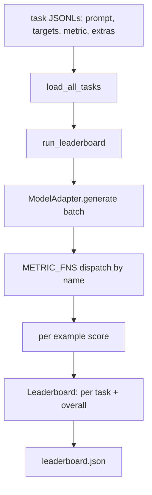
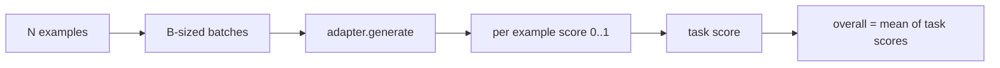

# نموذج تقييم اللغة

> نموذج يعمل بشكل جيد في مهمة لا يمكنك تعريفها هو نموذج يعمل بشكل جيد عن طريق الخطأ. الحزام هو تعريف المهمة، المقياس، الجاري، والجدول الدرجي، في شكل واحد قصير، قابل للتبادل.

**Type:** Build
**Languages:** Python
**Prerequisites:** Phase 19 lessons 42 to 45
**Time:** ~90 minutes

## أهداف التعلم

- تعريف المهمة كملف JSONL مع `prompt`،`targets`،`metric`، و اختياري `extras`على سبيل المثال
- تنفيذ خمس مقاييس: مطابقة دقيقة، Rue-l F1، التحقق القابل للتنفيذ، اختيار متعدد، ومحتويات السلك الفرعي.
- قم ببناء جهاز ركن يجمع المثال لكل مهمة ويرسل إلى مُعدل نموذج قابل للتبادل.
- إصدار جدول قياسي JSON مع درجات لكل مهمة ، والانخفاض ، ومتوسط عام يمكن إعادة التنظيم.

## المشكلة

نموذج لغوي جديد يصل كل أسبوع. الادعاء التسويقي هو أنه يعمل بشكل جيد. السؤال الصادق هو: حسناً في ماذا؟ الجواب الصادق هو قائمة النسب التي كتبتها بنفسك، لأن قائمة البائعين هي التي يتناسبون عليها.

بدون حزمة في إعادة التأمين الخاص بك يمكنك مقارنة النماذج اثنين من خلال الاهتزازات. مع حزمة يمكنك مقارنةهم من خلال النتيجة على مجموعة مهمة ثابتة مع مقياس ثابت، على إنتاج JSON يمكنك التفريق. الحزمة هو العقد بين تشغيل أمس والتشغيل اليوم. بدونها، السفن التراجعات.

الفخة هي إعادة تكييف الحزام إلى نموذج واحد والإصلاح هو نفس الفخ العكسية: الحبل صغير بما فيه الكفاية للاكتتاب في خمسة عشر دقيقة، والمهام صغيرة بما فيه الكفاية للوصول إلى الاستعلام، والمقاييس مكتوبة من الصفر حتى يمكن لزميل مراجعتها، والإعداد هو المكان الوحيد الذي يعيش فيه رمز نموذج محدد. تغيير المعدل، تتحرك اللوحة التابعة؛ تغيير المهام، تتحرك اللوحة التابعة. لا شيء آخر يجب أن يتحرك.

## المفهوم



### تحديد المهام

كل مثال هو خط JSONL واحد:

```json
{"id": "arith-00", "prompt": "compute: 2 + 2", "targets": ["4"], "metric": "exact_match"}
```

بالنسبة للمقاييس التي تحتاج إلى مساعدة تسجيل النقاط،`extras`يحمل الحمل المفيد الجانبي:

```json
{
  "id": "code-00",
  "prompt": "python: write a function f that doubles its input",
  "targets": ["ok"],
  "metric": "code_exec",
  "extras": {"io_pairs": [[1, 2], [3, 6]]}
}
```

المهمة هي مهمة`.jsonl`الملف تحت `outputs/tasks/`اسم الملف هو اسم المهمة. جميع الأمثلة في الملف يشترك في مقياس.

### المهام الخمسة المثبتة

| Task | Metric | What it tests |
|------|--------|---------------|
| arithmetic | exact_match | Token-level correctness on a deterministic answer |
| summary | rouge_l | Longest common subsequence F1 against a one-line reference summary |
| code-exec | code_exec | Executable test: the predicted function must satisfy a list of input-output pairs |
| multiple-choice | multiple_choice | First letter of the prediction must match an allowed letter |
| generation | substring_contains | Free-form text must contain at least one target substring |

### العقد المقياسي

كل مقياس هو وظيفة من`(prediction, targets, extras) -> float in [0.0, 1.0]`. الحزمة تتوسط النتائج لكل مثال للحصول على درجة المهمة ، ثم تتوسط درجات المهمة للحصول على إجمالي.

- `exact_match`: الحروف الصغرى، الانهيار الفضاء، المساواة.
- `substring_contains`: نفس التطبيع، اختبار السلسلة.
- `multiple_choice`: الشخصية الأولى فوق
- `rouge_l`: طول LCS مقسمة على طول التنبؤ والإشارة، F1 من الدقة والإستدعاء.
- `code_exec`: تنفيذ التنبؤ في مساحة أسماء محدودة، دعوة `f(x)`على كل زوج من المدخلات والمخرجات، عد المقابلة.

يدير مقياس code_exec التنبؤ في مساحة أسماء المبنيات المزورة. يؤكد اختبار الدروس أن `import os`ينفجر لأن`os`ليس في مساحة الأسماء؛ لا يمكنك الوصول إلى نظام الملفات من تنبؤ رمز.

### مُعدّل النموذج

```python
class ModelAdapter(Protocol):
    def generate(self, prompts: Sequence[str]) -> List[str]: ...
    @property
    def name(self) -> str: ...
```

المعدل هو الخياطة، و السفينة الدروس`ToyAdapter`، متطابقة نمط تحديدية تعيد الإجابة الصحيحة لكل طلب في المهام الخمسة المثبتة.

### الجاري

`run_task`اللحظات`batch_size`تطلبات في وقت واحد وترسل إلى وظيفة الميتر. `run_leaderboard`يمر بكل مهمة ومتوسطات`write_leaderboard`يُصدر JSON مع سلسلة مخططات بحيث لا تُكسر أجهزة التحكم بصمت تغييرات في الشكل في المستقبل.



```figure
eval-harness-matrix
```

## بناءها

`code/main.py`هو القطع الأثرية القابلة للعمل.

### الخطوة الأولى: مهام إصلاح البذور

`seed_fixture_tasks(target_dir)`يكتب الخمسة`.jsonl`الملفات.`main.py`يزرعها عندما يكون المجلة فارغة.

### الخطوة الثانية: مهام الحمل

`load_all_tasks(task_dir)`يقرأ كل`.jsonl`و يعيد القول من اسم المهمة إلى قائمة `Example`السجلات، خطوط التعليقات تبدأ بـ`#`و يتم تخطي خطوط فارغة حتى يمكن للمساهمين ملاحظة الملفات.

### الخطوة الثالثة: تنفيذ المقاييس

كل مقياس هو وظيفة صغيرة مع اختبار وحدة. مجموعة اختبار الدروس تشمل 13 حالة تغطي التطبيع والترابط الجزئي وتنفيذ الرمز، ورفض الرمز غير الآمن.

### الخطوة الرابعة: اكتب المركض

`run_task`يتكرر اللحظات وينتج`TaskResult`مع النتيجة، العد الصحيح، العد الإجمالي، والبطء. `run_leaderboard`يمر كل المهام ويجعل`Leaderboard`مع المتوسط العام

### الخطوة 5: إصدار JSON

`write_leaderboard`يسلسل اللوحة`--include-per-example`يرمي العلم سجلات كل مثال حتى تتمكن من التفريق التنبؤات ضد الجولة السابقة عندما تتحرك النتيجة.

إشغله

```bash
python3 code/main.py
```

يزرع السيناريو الأجهزة في الركض الأول، ويجري درجة مع مكيّف الألعاب (الذي يحصل على كل أجهزة صحيحة) ، ويكتب `outputs/leaderboard.json`. النتيجة العامة هي 1.0 مع جهاز إعداد الألعاب . اختبار إعداد الألعاب في `test_main.py`يظهر نفس الحزام ينتج 0.0 عندما لا يستطيع المعدل الإجابة.

## استخدمها

لتشغيل نموذج حقيقي، اكتب مُعدّلًا.

```python
class HttpAdapter:
    name = "vendor.v1"

    def __init__(self, endpoint, api_key):
        self.endpoint = endpoint
        self.api_key = api_key

    def generate(self, prompts):
        out = []
        for prompt in prompts:
            response = http_post(self.endpoint, prompt, self.api_key)
            out.append(response["text"])
        return out
```

التغيير`ToyAdapter`لـ`HttpAdapter`في أعلى`main()`.السلسلة، المهام، المقاييس، والجدول الرائد يبقى نفسه.

ثلاثة أنماط يجب تنفيذها عند شحن الحزام في مشروع حقيقي:

- **Pin the task files.**يحتوي قائمة المهام. json على محتوى مهمة محور من خلال الجهاز أو يحمل JSONLs إلى جانبها؛ وإلا تتحرك النتيجة عندما يقوم ملف المهمة بذلك، ولا يمكنك معرفة أي منها.
- **Diff predictions, not just scores.**- نعم`--include-per-example`الدرج يسمح لك أن ترى ما قاله النموذج في اليوم الذي انخفضت فيه النتيجة.
- **Cap the batch size.**المعدلات الحقيقية لديها حدود معدل، حجم اللحظة الصغير يبقي الحزام متوافق بين البائعين.

## أرسله

`outputs/skill-lm-eval-harness.md`يحمل الوصفة: JSONL تحديد المهام، خمسة مقاييس، المعدل قابل للتبادل، المدير المجموعة، جدول الرؤساء JSON مع سلسلة مخطط. الملفات المهام في `outputs/tasks/`هذه هي الأجهزة، نسخها في مشروع حقيقي كبدء.

## التمارين

1. أضف مهمة سادسة مع مقياس مخصصة تكتبها من الصفر (تداخل مثل BLEU، نقطة إشارة مثل BLEURT، أي شيء مع عقد واضح).
2. التمديد`code_exec`لالتقاط المداهمة والقبول بقائمة من المداهمة المتوقعة كهدف.
3. إضافة أمر فرق قائمة: أعطيت اثنين `leaderboard.json`الملفات، طباعة المهام التي تحركت وبكم.
4. حد تأخير على سبيل المثال. لف مكالمة المعدل في وقت وقف؛ سطح منفصل `timeouts`عمود في قائمة النتائج
5. قم بتحديد محتوى المهمة مع sha256 في اللوحة الرتبية حتى يستطيع القارئ المستقبلي التحقق من أنهم حصلوا على نفس المهام.

## الشروط الرئيسية

| Term | What people say | What it actually means |
|------|-----------------|------------------------|
| Task spec | "The eval format" | JSONL file with prompt, targets, metric, optional extras per example |
| Metric | "How you score" | Function from (prediction, targets, extras) to a float in [0, 1] |
| Adapter | "The model client" | Object with a generate(prompts) -> list[str] method; the only model-specific code |
| Leaderboard | "The scoreboard" | JSON with per-task scores, total counts, latency, and an overall average |
| Code exec metric | "Run it and check" | Execute the prediction in a restricted namespace, compare against input-output pairs |

## المزيد من القراءة

- القنب الأصلي لقيام التقييم لـ"المرجع" الإنتاج، أكبر بكثير ولكن يشبه الشكل.
- إشعار "هوجنج فيس" عن تنفيذ بديل لنفس العقد
- المرحلة 19 دروس 46 تغطي أنماط تراكم التراجعية المستخدمة في كومة التدريب نقاط الحزام.
- مرحلة 19 الدروس 47 تغطي شكل نقطة التفتيش التي تسجل ضدها؛ وضع علامة التفتيش في قائمة الدرجات.
- المرحلة 19 الدروس 48 تغطي كومة التدريب الموزعة التي أنتجت النموذج قيد التجربة.
