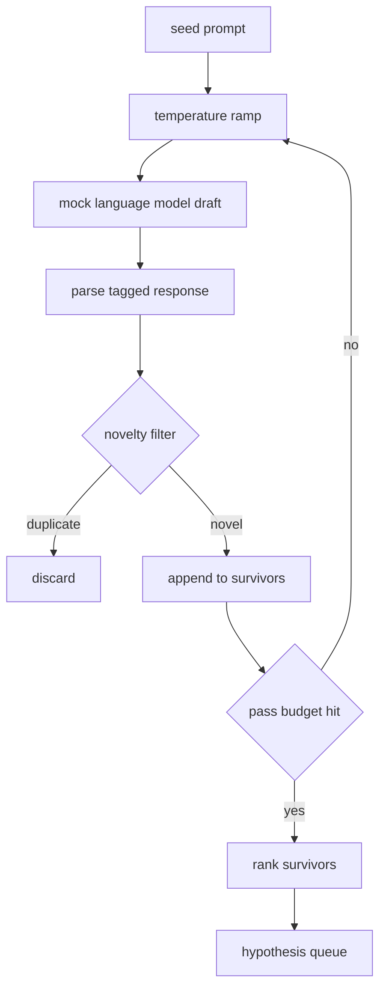

# مولد الفرضية

> وكيل البحوث الذي يطرح نفس السؤال مرتين هو إهدار الرموز. الخدعة هي إجبار كل مسودة إلى الهبوط في مكان جديد.

**Type:** Build
**Languages:** Python
**Prerequisites:** Phase 19 Track A lessons 20-29
**Time:** ~90 minutes

## أهداف التعلم
- قم بتشغيل عينة من طلب البذور وتحويل نتائجها إلى سجلات فرضية منخفضة.
- قم بتحديد درجة حرارة العينة في كل مرسلة بحيث يتحرك المسرح التالي أبعد من الأخير.
- تصفية بالقرب من المكرر مع نموذج ضخم صغير وعلى حد مسافة كوزين.
- قم بتقييم الناجين باستخدام وظيفة تسجيل الدرجات التي تجمع بين الجدول والخصوصية والاختبار.
- قم بإبقاء كل خطوة محددة حتى تنتج نفس البذور نفس الصف دائماً

## لماذا توليد، ثم تصفية

يُمكن للمخطط الذي يسأل نموذجًا واحدًا مرة واحدة أن يحصل على فرضية واحدة. هذا جيدًا لمثال عمل. بالنسبة لدورة بحثية هي الشكل الخطأ. يريد الحلقة صفًا مرتبًا مع عمق، لذلك عندما تفشل الفرضية الأولى ، يكون لدى المتدرب القادم جاهزًا دون دفع ثمن مرور عينات كامل آخر.

تتجمع أفكار لإنتاج هذا الصف. الأول هو ارتفاع درجة الحرارة: يرفع كل مرور من خلال عينة العينات درجة الحرارة بقعة، لذلك يتم تشجيع المسودات اللاحقة على التجول. والثاني هو تصفية الابتكار: بعد كل مسودة، يقيس المولد مسافة إدراج من كل ناجح سابق ويرفض أي شيء داخل العنقود.

يُرسَل الدروس نموذجًا لغويًا مزيفًا يعيد تسلسلات رموز مكتوبة للاستعلامات الثابتة. يكفي المزيّف لتنفيذ المسار الكامل: طلب البذور، وتطبيق ريمب درجة الحرارة، وتحليل المرشحين، وتشغيل مرشحات الابتداع، وتصنيف الصف خارج.

## شكل الفرضية

```text
Hypothesis
  id             : int           (monotonic within a run)
  text           : str           (the claim)
  variables      : list[str]     (what changes between conditions)
  metric         : str           (what the runner will measure)
  baseline_ref   : str | None    (which paper or run the comparison cites)
  draft_pass     : int           (which sampler pass produced this)
  temperature    : float         (the sampler setting at draft time)
  novelty_score  : float         (distance from prior survivors, 0..1)
  rank_score     : float         (weighted sum used for ordering)
```

`variables`و`metric`لا يستخدمون النص الحر. يقوم المتحقق بسحبها من ردود المشاركة. يقرأ المتدرب في الدروس 52 هذه الحقول مباشرة عندما يقوم ببناء تشكيل التجربة.

`baseline_ref`المقيّم في الدروس 53 يحتاج إلى خط أساسي للمقارنة معه. إذا غادرت الفرضية واحدة، فإن المقيّم يعود إلى الجولة السابقة على نفس المقياس.

```figure
cg-novelty-ramp
```

## الهندسة المعمارية



الحلقة مستقيمة للأمام، الجزء المثير للاهتمام هو أن كل مربع لديه عقد صعب.

## ريمب الحرارة

ابدأ`t_min`، ينتهي في`t_max`، خطوة`(t_max - t_min) / (n_passes - 1)`كل مرسل يدعو العينة في درجة الحرارة الحالية، مما ينتج `n_passes`قيم متساوية من `GeneratorConfig.schedule()`النموذج المزيف يحترم درجة الحرارة عن طريق التبديل بين مجموعة صغيرة من الاستجابات المخطوطة المكفلة`(prompt, temp_bucket)`. السفن هي فترات مفتوحة بحيث تغير صغير في درجة الحرارة يختار سفن مختلفة ويجري مسودة مختلفة. في الإنتاج سيكون العينات نموذج حقيقي مع `temperature=t`مرّت

الجدول الزمني الافتراضي هو ستة مرّات من `0.2`إلى`1.2`ستة كافية لملء الصف دون دفع مقابل عينات التي سوف ترفضها مرشح الابتكار على أي حال.`0.2`النموذج يعيد البطاطس البذور`1.2`الردود تميل إلى الانحراف عن الموضوع وتفشل في المصفح

## مرشحات الابتدائية

بعد أن يتم تحليل كل مشروع ، يقوم المولد بتضمين النص وتقارن مع كل فرضية مقبولة. التضمين هو حقيبة صغيرة من رموز الكلمات ، تمتعيزها إلى طول الوحدة. المسافة الكوسينية بين متجهين وحدتين هي `1 - dot(a, b)`يمر مسودة إذا كانت الحد الأدنى لمسافتها إلى أي من الناجين السابقين هو أعلى`novelty_threshold`. الوضع الافتراضي هو`0.25`. . .

لا يعد التضمين المضخم المضخم مغناً. إنه محدد ، وله صفر الاعتمادات ، ويكفي لقبض على الحالة الواضحة: مسارين يشتركون معظم اسميهما. تنشر الإنتاج سيتم تبادلها في نموذج جملة صغيرة. تظل الواجهة نفسها.

## درجة الرتب

```text
rank_score = w_novelty * novelty_score
           + w_specificity * specificity_score
           + w_testability * testability_score
```

ثلاث نقاط فرعية`novelty_score`هو الحد الأدنى من المسافة إلى التركيب من الناجين السابقين. `specificity_score`هو عدد المتغيرات الملموسة في الفرضية مقسمة على عدد الهدف. `testability_score`هو واحد إذا كانت الفرضية تحدد كل من الميترات وخط الأساس، نصف إذا كان فقط لديه الميترات، صفر خلاف ذلك.

الوزن الافتراضي هو `0.4`،`0.3`،`0.3`الوزن يعيش في جهاز توليد الكهرباء لذا يمكن أن تغيرهم درساً متدفقًا دون أن تفرق الرمز

## نموذج اللغة المزيفة

```python
class MockLLM:
    def sample(self, prompt: str, temperature: float, seed: int) -> str:
        ...
```

العينة تحدد مع إعطاء `(prompt, temperature, seed)`ثلاثية. الاختبار يحافظ على جدول الاستجابة المخطوط على`(prompt_signature, temperature_bucket)`إذا لم يكن في الجدول مدخل لمفتاح، فإن عينة العينة تعيد إرجاعًا يفشل المصفح. يتم ممارسة مسار إرجاعًا بواسطة أحد الاختبارات.

البذور مختلطة في الاستجابة لذا نفسها`(prompt, temperature)`في الاختبارات نضع البذور للحفاظ على نتائج قابلة للتكرار في نشر حقيقي البذور ستأتي من ساعة النظام أو مقعد.

## صف الخروج

الناتج هو قائمة `Hypothesis`السجلات مرتبة حسب `rank_score`إذا كان القائد في الدروس 52 يضع رأسه، ويقوم بتجربة، ويقوم المقيّم في الدروس 53 بإعادة حكم. إذا قال الحكم أن الفرضية كانت خاطئة، فإن القائد يضع الحكم التالي.

الصف محدود، وعندما يكون فارغًا، يمكن للموسيقي إما توسيع طلب البذور وإعادة تشغيل المولد أو التوقف وإبلاغ عن استنفاد الميزانية.

## كيفية قراءة الرمز

`code/main.py`يحدد`Hypothesis`،`MockLLM`،`HypothesisGenerator`و إثبات تحديدية ، مولد الكهرباء يعرض واحد`run(seed_prompt)`طريقة تعيد صف محرم ، يتم قراءة عدد المرور من `GeneratorConfig.n_passes`بدلا من أن يتم تمريرها كحجة. التضمين هو حقيبة من الرموز. مرشح الابتكار هو وظيفة واحدة. درجة النتيجة هي وظيفة واحدة. لا شيء يعتمد على`numpy`؛ إضافة الرياضيات هي مجرد STDlib حتى لا يزال الدروس محمولة.

`code/tests/test_generator.py`تغطي المسار الخطي، مسار رفض المضاعفة، مسار فشل المصفح، حدود ر rampفح درجة الحرارة، وتسلسل الترتيب.

## حيث هذه الفتحات في

الدرس الخمسين ينتج الصف. الدرس الخمسين واحد يأخذ رأس الصف ويقوم باحثاً في الأدب لتأكيد أو رفض ذلك. الدرس الخمسين والثاني يأخذ نفس الرأس ويقوم بتجربة فعلية. الدرس الخمسين والثالث يقرأ كل من النتائج ويكتب حكم. تتكون الدرس الأربعة في حلقة بحثية بدون إنسان فيها. يمكن للبشر أن يدخلوا في أي حدود.
