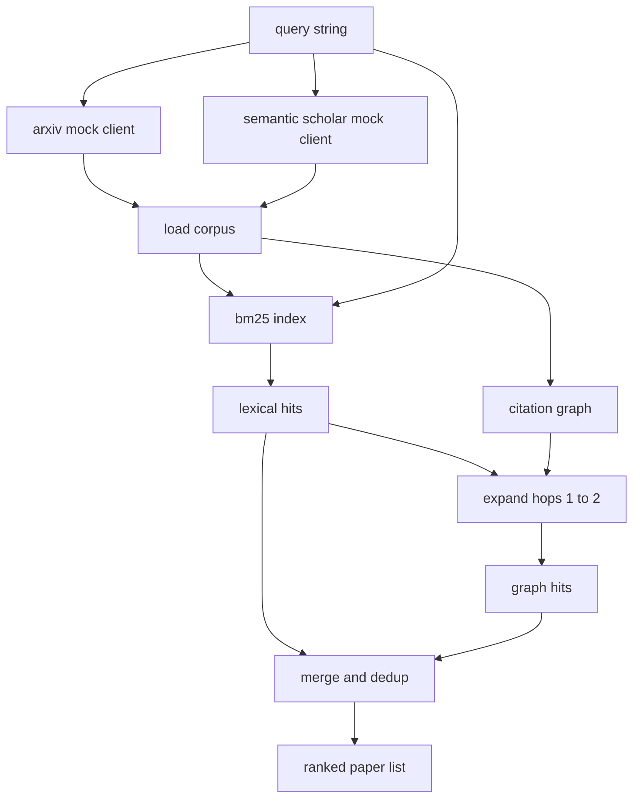

# استرداد الأدب

> فرضية رخيصة، معرفة ما إذا كان شخص ما قد أثبتها بالفعل هو الجزء الثمين، بناء طبقة الاسترداد التي تجيب على هذا السؤال قبل أن يدور الركاب فوق صندوق الرمال.

**Type:** Build
**Languages:** Python
**Prerequisites:** Phase 19 Track A lessons 20-29
**Time:** ~90 minutes

## أهداف التعلم
- قم بتصميم سجل ورقي صغير مع الحقول التي ستقرأها الحلقة أسفل النهر
- بناء مؤشر BM25 على المجردات مع هيكل البيانات stdlib فقط.
- أبحث عن الرسومات التي لم تُجد في البحث
- يضرب الـ "ددوبليكيت" عبر اللغة و يمر الرسم البياني عبر "مُرسل الورق" المستقر.
- إغلف اثنين من المزيفات الخارجية من خلال API خلف عميل واحد بحيث يظل موقع المكالمة فوق التيار نفسه عندما تنتهي النقاط النهائية الحقيقية.

## لماذا تم إعادة إعادة إعادة إعادة إعادة إعادة إعادة إعادة إعادة إعادة إعادة إعادة إعادة إعادة إعادة إعادة إعادة إعادة إعادة إعادة إعادة إعادة إعادة إعادة إعادة إعادة إعادة إعادة إعادة إعادة إعادة إعادة إعادة إعادة إعادة إعادة إعادة إعادة إعادة إعادة إعادة إعادة إعادة إعادة إعادة إعادة إعادة إعادة إعادة إعادة إعادة إعادة إعادة إعادة إعادة إعادة إعادة إعادة إعادة إعادة إعادة إعادة إعادة إعادة إعادة إعادة إعادة إعادة إعادة إعادة إعادة إعادة إعادة إعادة إعادة إعادة إعادة إعادة إعادة إعادة إعادة إعادة إعادة إعادة إعادة إعادة إعادة إعادة إعادة إعادة إعادة إعادة إعادة إعادة إعادة إعادة إعادة إعادة إعادة إعادة إعادة إعادة إعادة إعادة إعادة إعادة إعادة إعادة إعادة إعادة إعادة إعادة إعادة إعادة إعادة إعادة إعادة إعادة إعادة إعادة إعادة إعادة إعادة إعادة إعادة إعادة إعادة إعادة إعادة إعادة إعادة إعادة إعادة إعادة إعادة إعادة إعادة إعادة إعادة إعادة إعادة إعادة إعادة إعادة إعادة إعادة إعادة إعادة إعادة إعادة إعادة إعادة إعادة إعادة إعادة إعادة إعادة إعادة إعادة إعادة إعادة إعادة إعادة إعادة إعادة إعادة إعادة إعادة إعادة إعادة إعادة إعادة إعادة إعادة إعادة إعادة إعادة إعادة إعادة إعادة إعادة إعادة إعادة إعادة إعادة إعادة إعادة إعادة إعادة إ إ إعادة إعادة إعادة إعادة إعادة إ إ إ إعادة إعادة إ إ إ إ إ إ إ إ إ إ إ إ إ إ إ إ إ إ إ إ إ إ إ إ إ إ إ إ إ إ إ إ إ إ إ إ إ إ إ إ إ إ إ إ إ إ إ إ إ إ إ إ إ إ إ إ إ إ إ إ إ إ إ إ إ إ إ إ إ إ إ إ إ إ إ إ إ إ إ إ إ إ إ إ إ إ إ إ إ إ إ إ إ إ إ إ إ إ إ إ إ إ إ إ إ إ إ إ إ إ إ

بحث الكلمات الرئيسية على المجردات يعيد ورقات تشارك المفردات مع السؤال. هذا يغطي معظم السطح إنها تفوت قضيتين الأول هو عندما تستخدم الورقة الأساسية مخفوفة لغات مختلفة؛ على سبيل المثال ، يفتقد استفسار "التأمل المتقطع" ورقة بعنوان "اختيار الكتل في توجيه المحولات". الثاني هو عندما تكون الورقة ذات الصلة متابعة تشير إلى مرسوم معروف ؛ فمن الأفضل العثور على المرسوم والسير إلى الأمام من القوة البشعة الجسيمة.

يُبني الدروس كلا الممرين. يلتقط BM25 على المجردات الضربات اللغوية. يوسع عبرة الرسم البياني للنقض بذرة وضعت إلى الأمام والخلف بمقربة أو اثنين من القفز. يتم نقل الاتحاد عن طريق الهوية الورقية وتصنيفها بواسطة نتيجة مختلطة صغيرة.

## شكل الورق

```text
Paper
  id          : str           (stable identifier, "p001" for the mock corpus)
  title       : str
  abstract    : str
  year        : int
  authors     : list[str]
  references  : list[str]     (paper ids this paper cites)
  citations   : list[str]     (paper ids that cite this paper)
  source      : str           (which mock api supplied it, "arxiv" or "s2")
```

تشكل حقل الإشارات والإقتباسات الرسم البياني للإقتباسات الموجزة. تُعيد مُصدرات إطار الإقتباسات المزيفة المتداخلة ولكن ليست نفس الحقول، لذا يجمعها محمول الجسم على `id`. . .

```figure
cg-citation-hops
```

## الهندسة المعمارية



يمتلك عميل الاسترداد كلا من المراسلات والاندماج. يقوم المتصل بإعطائه استفسارًا ويستعيد قائمة مرتبة حيث يحمل كل إدخال في كل حقل درجة ورقة (`bm25_score`،`graph_distance`،`recency_score`،`final_score`) التي تفسر التصنيف.

## BM25 من الصفر

التنفيذ هو معيار Okapi BM25 مع معايير افتراضية `k1=1.5`،`b=0.75`المؤشر هو قاموسين:`term -> doc_frequency`و`term -> list of (doc_id, term_count)`طول الوثيقة هو عدد الرمز من المجرد. يتم حساب متوسط طول الوثيقة مرة واحدة في وقت إنشاء المؤشر. تسجيل استفسار هو جمع على شروط استفسار من `idf * tf_norm`أين`tf_norm`هو تردد المفهوم المعتاد على طول BM25.

الـ (توكينيزر)`lower`ثم تقسيمها على غير الحرفي الرقمية. لا يتم تشغيلها. نظام الإنتاج سيتم تبادل في صواريخ صغيرة. واجهة البقاء نفسها.

```text
idf(t)      = log((N - df + 0.5) / (df + 0.5) + 1.0)
tf_norm(t)  = (f * (k1 + 1)) / (f + k1 * (1 - b + b * dl / avgdl))
score(d, q) = sum over t in q of idf(t) * tf_norm(t)
```

## التقاطع من الرسم البياني للمشاركات

يتم بناء الرسم البياني مرة واحدة من الجسم. تذهب الحواف الأمامية من ورقة إلى مرجعيها. تذهب الحواف الخلفية من ورقة إلى نقولاتها. يعد التجاوز عرضًا في البحث الأول الذي يزرعه أعلى ضربات BM25 ، مع وضع حد في قفزة اثنتين.

اثنين من القفز هو السقف المتعمد. القفز واحد هو سطحي جداً؛ وكيل غالباً ما يريد الأجد أو النسل المباشر. ثلاثة قفز ينفجر حجم النتيجة على الرسم البياني المتصل ويميل إلى التجول عن الموضوع. الكشف عن حد القفز كقرع تشكيل حتى حلقة أسفل التيار يمكن أن تشددها.

## التخفيضات والتصنيف

يُرجع المخططان المترتبة على بعضهما البعض، وتُضاف المفاتيح على الورق. لكل ورقة النتيجة النهائية هي مزيج مُوزن.

```text
final_score = w_bm25 * bm25_score_norm
            + w_graph * graph_score
            + w_recency * recency_score
```

`bm25_score_norm`هو نتيجة BM25 مقسمة على أقصى نتيجة BM25 في مجموعة المدمجة (حتى يعيش الحقل في صفر إلى واحد). `graph_score`هو واحد لضربات لغوية مباشرة، ثم `0.6`لقفز واحد`0.3`لـ2 قفزات، صفر خلاف ذلك.`recency_score`هو ريمب خطي من الصفر عند السنة القصوى للجسم إلى واحد في أقصى حد.

الوزن الافتراضي هو `0.5`،`0.3`،`0.2`الوزن هو محور، موضوع قديم قد يضعف الحديث بينما موضوع سريع الحركة يرفعه.

## المزيفة

الـ"كوربوس" يضم مائة ورقة، تم إنشاؤها من قبل`build_corpus()`. كل ورقة لها عنوان مكتوب يدويا ومجرد في واحدة من خمسة موضوعات: الاهتمام النقطة، زيادة الاستخدام، ومعدلات منخفضة الرتب، وتقطيع مجموعة البيانات، وتقييم الحوار. يتم تشكيل المراجع والحوارث على كل موضوع على شكل شريط متصل مع بعض حواف المواضيع المتقاطعة.

العملاء المزدوجين لل API (`ArxivMockClient`،`SemanticScholarMockClient`يُرجع Arxiv العنوان، المجردة، السنة، المؤلفين. يضيف Semantic Scholar مرجعيات ونقود. يُرجع اتحادات العملاء على id؛ يتم تأجيل التعامل مع الخلافات بين العملاء في الحقول إلى درس متابعة.

## ما الدروس 52 و 53 القراءة

الجاري في الدروس 52 يقرأ`paper.id`،`paper.title`و ثلاث جمل في الأعلى من المجرد كسياق للمجربة.`paper.year`و`paper.references`ليعطي خط أساسية ورقة معينة.

العميل الاحتياطي يعيد `RetrievalResult`مع كل من القائمة المرتبة ومقاييس لكل استفسار: عدد ضربات، متوسط النتيجة، أعلى النتيجة، إجمالي وقت الجدار. يقوم المتدرب بتسجيل هذه حتى يتمكن المرور من ملاحظة الجودة على مر الزمن.

## كيفية قراءة الرمز

`code/main.py`يحدد`Paper`،`ArxivMockClient`،`SemanticScholarMockClient`،`BM25Index`،`CitationGraph`،`RetrievalClient`و التجربة التحريرية. العملاء المزدوج والجسم في نفس الملف حتى تظل الدروس محمولة. تنفيذ BM25 هو فئة واحدة، ستين خطا. التقاطع الرسم البياني هو طريقة واحدة.

`code/tests/test_retrieval.py`تغطي المسار اللغوي، مسار الرسم البياني، الاندماج، الخصم، والمسألة الفارغة.

## حيث هذه الفتحات في

يُنتج الدروس الخمسين فرضية. يبحث الدروس الخمسين والحادي في الأدب لمعرفة ما إذا كانت هذه الفرضية قد استقرت بالفعل. يدير الدروس الخمسين والثاني التجربة إذا لم تكن كذلك. يقرأ الدروس الخمسين والثالث نتيجة الاسترداد ومقاييس التجربة لكتابة الحكم. العميل الاستردادي هو أرخص من المراحل الأربعة ويجري أولاً في الموسيقي.
