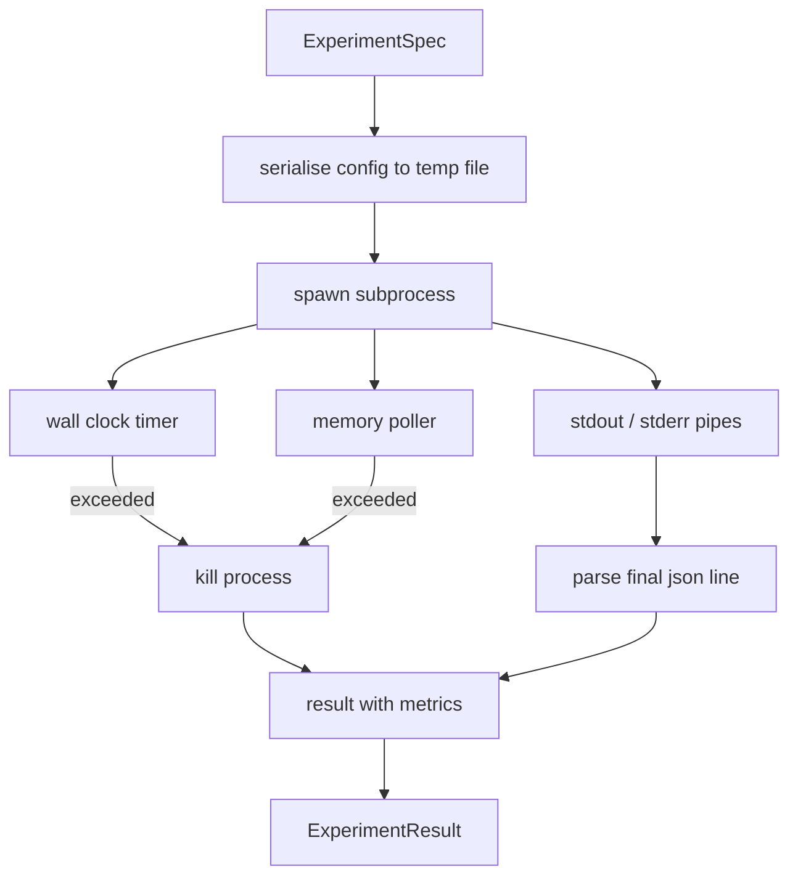

# "جريبه التجربة"

> الحلقة هي فقط صادقة مثل قياساتها. بناء المتدرب الذي يأخذ تحديد، ويجري ذلك في عملية فرعية مربع الرمال، وإصدار مقياسات json بقعة يمكن للمقيّم الثقة.

**Type:** Build
**Languages:** Python
**Prerequisites:** Phase 19 Track A lessons 20-29
**Time:** ~90 minutes

## أهداف التعلم
- ترميز تجربة كمتصفح من نوعه يمكن للمركض أن يسلسل إلى عملية فرعية.
- أطلق عملية فرعية مع ساعة حائطية صلبة وقبض ذاكرة ناعم، وظهر كلاهما كظروف نهائية.
- التقاط stdout، stderr، والمقاييس المهيكلة البقع في سجل واحد النتيجة.
- بناء جدول التشويش الذي يصفح زر تشكيل واحد في كل مرة على تحديد قاعدة ثابتة.
- ضع كل نتيجة محددة مع منح بذرة حتى يرى المقيّم نفس الأرقام عبر الجوائز.

## لماذا عملية فرعية

حلقة البحث تعمل كود غير موثوق به. جاءت الفرضية من عينة، جاءت النص التجريبي من نفس المسار؛ معالجة أي من ذلك على أنه آمن في العملية يطلب حادثًا يؤدي إلى سقوط الموسيقي. العمليات الفرعية هي أبسط عزل السفينة اللغة: عملية منفصلة، مساحة عنوان مستقلة، ومقبض إشارة على الجانب الأم.

لا يوجد في هذا الموقع مجموعة كاملة من المربعات الرملية. لا يوجد مجموعة، لا يوجد فلتر سيكومب، لا يوجد إعادة رسم مساحة الأسماء. ما يحتوي عليه هو توقيت ساعة جدارية، ودورة استطلاع لتنمية الذاكرة، وطريق قتل ينهي العملية في أي من الحدود. هذا هو عقد الوقت التشغيلي كلما امتدت مربع الرملية المكلفة. الدرس يبقي العقد صغيرًا بما فيه الكفاية لقراءة في جلسة واحدة.

## شكل تجربة Spec

```text
ExperimentSpec
  spec_id        : str            (stable id, "exp_001")
  hypothesis_id  : int            (link back to the queue from lesson 50)
  script_path    : str            (path to the python script to run)
  config         : dict           (passed to the script as one json arg)
  seed           : int            (deterministic seed for the experiment)
  wall_timeout_s : float          (hard timeout, killed on exceed)
  memory_cap_mb  : int            (soft cap, polled; killed on exceed)
  metric_keys    : list[str]      (which fields the evaluator will read)
```

يكتب السكريبت الإعداد إلى مسار ملف مؤقت يقرأه السكريبت. من المتوقع أن يقوم السكريبت بطبع خط json واحد على stdout الذي تكون مفاتيحه مجموعة كبيرة من `metric_keys`أي شيء آخر على Stdout يتم التقاط ولكن تجاهل من قبل المصفح المقاييس.

```figure
cg-runner-limits
```

## الهندسة المعمارية



الجاري هو فئة واحدة مع طريقة واحدة رئيسية. المسح هو خيط صغير يستيقظ مرة واحدة في كل فترة استطلاع`psutil`المكافئ من نظام الملفات المتاحة، والتي تعود إلى عدم وجود عملية عندما لا يُعرضها المنصة.

## لماذا قبعة ذاكرة ناعمة

محطات الذاكرة الصلبة تحتاج`resource.setrlimit`ويعمل فقط على POSIX. يقدم الدروس نهجاً محمولاً: إجراء استطلاع عن حجم مجموعة المقيمين من المنصة ويقتل العملية الفرعية إذا تجاوزت الحد الأقصى. تكون الحد الأقصى ناعمة لأن المسح لديه فترة غير صفرية. يمكن للعملية أن ترتفع فوق الحد الأقصى بين الاستطلاعات ثم تتراجع. يقوم المتدرب بتسجيل أقصى عدد RSS الملاحظ حتى يستطيع المقيّم رؤية مدى قرب الجري إلى الحد.

على الأنظمة التي لا تدعم فحص العمليات، يقوم المسح بتسجيل تحذير واحد وتعطل نفسه. ما زال الوقت المحدد للسيارة يطبق. تغطي اختبارات الدروس كلا المسارين.

## "القبض على "ستدوات " و "ستدر"

يقرأ المتجاوز كلا الأنابيب المستنزفة عند الانتهاء. يتم مسح Stdout خطًا خطًا ؛ الخط الأخير الذي يحلل كjson مع كل ما يلزم `metric_keys`يتم أخذها كقطعة المقاييس. يتم حفظ خطوط Json السابقة في النتيجة`intermediate_metrics`يمكن للمقيّم استخدام هذه للمحافظات للتعلم.

يتم احتجاز Stderr حرفياً في النتيجة. لا يرفع المتجاوز أبداً على رمز الخروج غير الصفر ؛ بدلاً من ذلك يسجل الرمز في النتيجة. يتم وضع علامة على أي خروج غير الصفر`"crash"`حتى عندما طبعت النص المقاييس، لذلك المقيّم يعامل الجاريات الجزئية كفشل افتراضي.

## جدول التخلص

```python
def ablate(base: ExperimentSpec, knob: str, values: list[Any]) -> list[ExperimentSpec]:
    ...
```

وبالنظر إلى المفردات الأساسية و اسم الزر، يعيد المساعد المفردات المفردة واحدة لكل قيمة مع `config[knob]`كل تحديد يحصل على مشتق`spec_id`(`f"{base.spec_id}_{knob}_{value}"`السائق يُرسل`AblationRunner`الذي يديرهم في النظام ويرد `AblationTable`المفتاح بمقيمة الزر

لماذا واحدة في وقت واحد. تنفجر المضايقات الفاكتورية الكاملة بشكل متكامل وتنتج نتائج لا يمكن للمقيّم تفسيرها. تنفجر المضايقة واحدة في وقت واحد محورًا نظيفًا يمكن للمقيّم رسمها. يدعم الدروس المضايقات متعددة المضايقات فقط كإزالة مفاتيح واحدة متكررة، التي يكوّنها المدعو.

## القرار

كل تحديد يحمل بذرة. الجاري يقدم البذرة إلى النص عبر إصدار التشريع (`config["__seed"] = spec.seed`) النصوص التجريبية المزيفة في`code/experiments/`ويحترم البذور ويحقق مقاييس متطابقة عبر السباقات. يعتمد المقيّم في الدروس 53 على هذا؛ دون التحديد قد يكون "التراجع" بداية عشوائية مختلفة.

## نص التجربة المزيفة

الدروس تُرسل كتابة تجربة واحدة:`code/experiments/sparsity_experiment.py`إنه نص حقيقي يقرأ ملف التكوين، يحاكي تشغيل تدريب صغير مع مرور عشوائي، ويقوم بطبع نقطة مقياسات json.`sleep_s`القنبلة لامتحان وقت التوقف و `allocate_mb`القنبلة لاختبار مسح الذاكرة.

المحاكاة ليست تدريب أي شيء حقيقي. انها حساب عددي يحاكي شكل حلقة تدريب: منحنى الخسارة، والحيرة النهائية، وقت الجدار. نقطة الدروس هو الجاري، وليس المحاكاة. سينقل نص تجربة حقيقية نموذج.

## شكل النتيجة

```text
ExperimentResult
  spec_id              : str
  hypothesis_id        : int
  exit_code            : int
  terminal             : "ok" | "timeout" | "oom" | "crash"
  wall_time_s          : float
  peak_rss_mb          : float | None
  metrics              : dict
  intermediate_metrics : list[dict]
  stdout_tail          : str
  stderr_tail          : str
```

القيّم يقرأ `metrics`و`terminal`أولاً، إذا كان المحطة هي أي شيء آخر غير`"ok"`يعد التجربة فشلاً ويقضي المقيّم تلقائيًا، وإلا يتمّ اجتياز المقاييس من خلال اختبار الأهمية.

## كيفية قراءة الرمز

`code/main.py`يحدد`ExperimentSpec`،`ExperimentResult`،`ExperimentRunner`،`AblationRunner`و إظهار ديموتيرنيستي. إدارة العمليات الفرعية هي فئة واحدة. محاكاة الذاكرة هي خيط صغير. مساعد التخلص هو وظيفة واحدة.

`code/experiments/sparsity_experiment.py`هو تجربة مزيفة تستخدم في الاختبارات. يقرأ مسار ملف التكوين من argv ويكتب خط واحد من مقياس json عند الانتهاء.

`code/tests/test_runner.py`تغطي مسار النجاح، مسار التوقف، مسار الإصطدام، جدول التخلص، والتحقق من التحديد عبر مسيرتين.

## حيث هذه الفتحات في

الدرس الخمسين يولد الفرضية. الدرس الخمسين واحد يصف كل ما قد حلته الأدب بالفعل. الدرس الخمسين والثاني يدير التجربة لما تبقى. الدرس الخمسين والثالث يقرأ النتيجة، ويجري اختبار الأهمية، ويكتب الحكم الذي يحفظه الموسيقي ضد هوية الفرضية.
