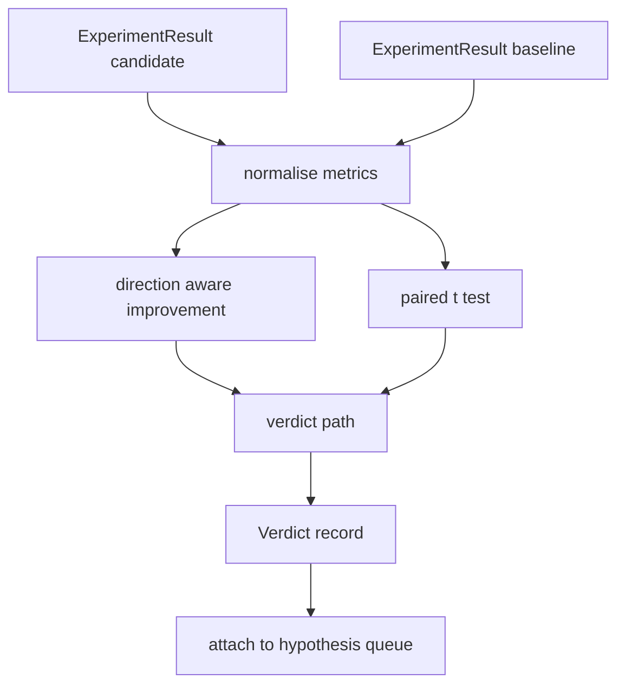

# مؤشر النتائج

> يُحدد المُتَجربُ ما إذا كانت تلك الأرقام تحسن أو رجعة أو ضجيج. يُبني مسار الحكم الذي يُحول المقاييس إلى نتيجة خط واحد.

**Type:** Build
**Languages:** Python
**Prerequisites:** Phase 19 Track A lessons 20-29
**Time:** ~90 minutes

## أهداف التعلم
- مقارنة المرشحين في الجولة مع خط أساسي باستخدام التحسينات المعرفة على الاتجاه والعدودي الثابت.
- قم بإجراء اختبار t المزدوج من الصفر على كل مقياس البذور وقراءة قيمة p الناتجة.
- عادي قياسات الحسابات المتوسطة بحيث يمكن لتقرير أسفل التيار دمجها مع المقاييس الخطية.
- أصدري حكمًا لكل فرضية يمكن للمؤلف أن يرفقه إلى الصف من الدروس الخمسين
- أبقي كل خطوة نظيفة حتى نفس المدخلات دائماً تنتج نفس الحكم.

## لماذا اختبار مزدوج

لا يوجد رقم واحد من الجاري يخبرنا ما إذا كان التغيير حقيقي نفس التكوين مع بذرة مختلفة يعطي حيرة مختلفة. قد يكون التغيير ضجيجاً يتم مقارنة الحق: نفس البذور ذات نفس البيانات، تم تشغيلها مرة مع المرشح ومرة مع خط الأساس. كل بذرة تساهم في الفرق متوسط هذه الاختلافات هو التأثير الخطأ القياسي في هذه الاختلافات هو أرضية الضوضاء.

الدرس يطبق الاختبار من الصفر`scipy.stats`الرياضيات صغيرة بما فيه الكفاية للقراءة في شاشة واحدة

```text
diffs    = [a_i - b_i for i in seeds]
mean     = sum(diffs) / n
variance = sum((d - mean) ** 2 for d in diffs) / (n - 1)
t_stat   = mean / sqrt(variance / n)
df       = n - 1
p_value  = two_sided_p(t_stat, df)
```

تستخدم قيمة p الجانبيين وظيفة بيتا غير كاملة منتظمة. يرسل الدروس تنفيذ صغير يستخدم كسرة لنتز المستمرة. كل شيء هو ستين خط من الرياضيات stdlib.

## تحسينات في الإرشاد

بعض المعايير تتحسن عند ارتفاعها (الدقة، التدفق) ، والبعض الآخر يتحسن عند انخفاضها (الخسارة، والحيرة، وقت الجدار).`direction`الحقل على كل متري

```text
if direction == "higher_is_better":
    improvement = (candidate - baseline) / abs(baseline)
elif direction == "lower_is_better":
    improvement = (baseline - candidate) / abs(baseline)
```

تحسينات توقيع. تحسن سلبي على أعلى هو أفضل مقياس يعني المرشح هو أسوأ.

(عالم المعدل المستوى)`improvement_threshold=0.02`يقرر ما إذا كان التغيير كبير بما فيه الكفاية للدعوة. أسفل ذلك الحكم هو "الضوضاء" بغض النظر عن قيمة p. لا يهتم الحلقة بالتغييرات التي لا يمكن للمستخدم قياسها.

```figure
cg-paired-verdict
```

## الهندسة المعمارية



يقوم المقيّم بتشغيل ثلاثة حسابات مستقلة و يجمعها في مسار الحكم. كل حساب هو وظيفة نقية بدون حالة مشتركة.

## تطبيع السجلات

الارتباك هو متكامل في الخسارة. انخفاض 0.1 في الخسارة هو انخفاض أكبر بكثير في الارتباك. مقارنة الارتباك مباشرة عبر تشكيلاتين أمر جيد، ولكن مزيجها مع المقاييس الخطية في تقرير واحد يتطلب التطبيع.

الدروس تعاديل أي مقياس`scale`الحقل هو`"log"`من خلال أخذ السجل الطبيعي قبل حساب التحسين. ثم يتم تطبيق العدالة في مساحة السجل. انخفاض التعقيد من 32 إلى 28 هو`log(28) - log(32) = -0.133`على أقل هو مقياس أفضل، والتي هي فوق عتبة النسبة 2 في المئة.

```text
if scale == "log":
    a = log(candidate)
    b = log(baseline)
else:
    a = candidate
    b = baseline
```

المقاييس مع `scale="linear"`(الابتكار) تخطي التحويل نفس مسار الشفرة يتعامل مع كليهما

## اختبار الزوجات لكل بذرة

يُصدِّر الركض من الدروس 52 نقطة قياسية واحدة نهائية لكل جولة. بالنسبة للاختبار المزدوج يحتاج المقيّم إلى نقطة واحدة لكل بذرة للمرشح وواحدة لكل بذرة للخط الأساسي. يقوم الموسيقي بتشغيل التجربة نفسها تحت كلتا التكوينات عبر قائمة من البذور ويمنح المقيّم قائمة من البذور.`ExperimentResult`السجلات

يقوم المقيّم بتزاوجها حسب البذور (البذور يعيش في`result.metrics["seed"]`) ويمشي على المقياس المطلوب. إذا لم تتطابق البذور في القائمتين، يقوم المقيّم برفع `PairingError`يجب أن يبدأ الموسيقي

## شكل الحكم

```text
Verdict
  hypothesis_id          : int
  metric                 : str
  direction              : "higher_is_better" | "lower_is_better"
  scale                  : "linear" | "log"
  candidate_mean         : float
  baseline_mean          : float
  improvement            : float       (signed, fraction; see direction rules)
  p_value                : float | None  (None if n < 2)
  significance_threshold : float
  improvement_threshold  : float
  verdict                : "improved" | "regressed" | "noise" | "failed"
  rationale              : str
```

طريق الحكم هو جدول قرار صغير:

```text
1. If any candidate result has terminal != "ok": verdict = "failed"
2. else if |improvement| < improvement_threshold:  verdict = "noise"
3. else if p_value is None or p_value > significance: verdict = "noise"
4. else if improvement > 0:                          verdict = "improved"
5. else:                                             verdict = "regressed"
```

العقلانية هي جملة ذات سطر واحد يمكن القراءة من قبل الإنسان يمكن للموسيقي تسجيل ضد المفترضات.

## كيفية قراءة الرمز

`code/main.py`يحدد`MetricSpec`،`Verdict`،`Evaluator`تطبيق اختبار t في الرياضيات النقيّة؛ ويتم استخدام numpy فقط لقراءة قائمة المقاييس ووسائل الحساب والاختلافات.

`code/tests/test_evaluator.py`تغطي المسار المحسن، المسار المتراجع، المسار الضوضائي (تحسين صغير) ، المسار الضوضائي (نخفض) ، المسار النهائي الفاشل، المسار المعتاد في السجل، اختبار t ضد قيمة مرجعية معروفة، وأخطاء الزواج.

## حيث هذه الفتحات في

درس الخمسين أنتج صف الفرضية. درس الخمسين واحد قام بتصفية أي شيء حلته الأدب. درس الخمسين والثاني أجرى التجربة تحت تكوينات المرشح والخط الأساسي عبر البذور. درس الخمسين والثالث يقرأ تلك الرحلات ويكتب الحكم. يطوي الموسيقي الأربعة معا:

```text
for hypothesis in queue:
    literature = retrieval.search(hypothesis.text)
    if literature_settles(hypothesis, literature):
        attach(hypothesis, verdict="settled")
        continue
    candidates = runner.run_all(specs_for(hypothesis))
    baselines  = runner.run_all(baseline_specs_for(hypothesis))
    metric_spec = MetricSpec("perplexity", direction=LOWER, scale=LOG)
    verdict = evaluator.evaluate(hypothesis.id, metric_spec, candidates, baselines)
    attach(hypothesis, verdict)
```

هذا الموسيقي ليس في هذه الدروس؛ الدروس الأربعة تتكون منها دون أي ضغوط خارج الفئات البيانية التي تعرّف كل منها.
