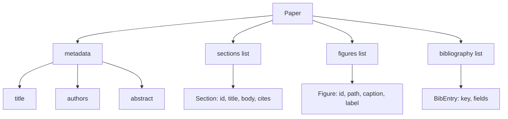
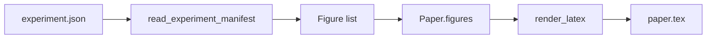
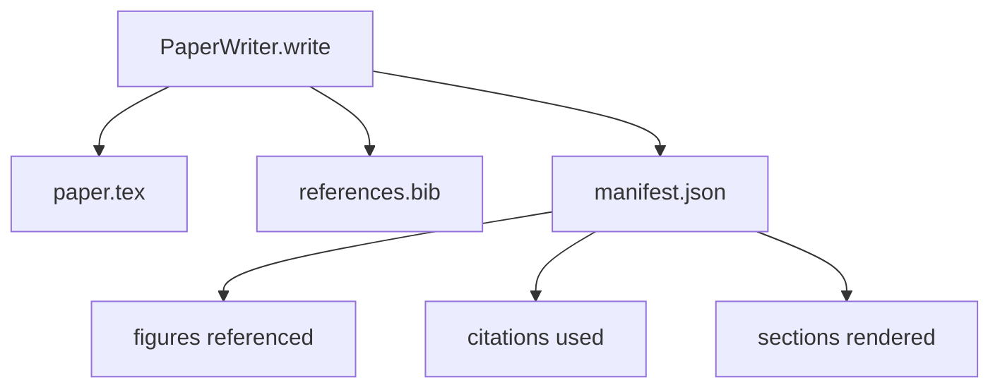

# كاتب ورق

> العظام اللاتكس هو عقد بين الباحث ومدفع النص. إذا تم كسر العقد ، فإن الوثيقة لا تجمع ، والفشل صاخب. قم ببناء العظام أولاً ، ثم املأه.

**Type:** Build
**Languages:** Python
**Prerequisites:** Phase 19 lessons 50-53
**Time:** ~90 minutes

## أهداف التعلم

- تعامل ورقة بحثية كآثار مهيكلة مع رسمية قسم معروفة، وليس وثيقة في شكل حر.
- إنشاء هيكل لا تيكس الذي يعلن عن المجرد، والقسمات، والمساحات الرقمية، ومفاتيح الكتابة قبل كتابة أي بروسة.
- حقن الأرقام من نتائج التجربة (الطرق والعناوين) في العظم من خلال آلية فتحة تحديدية.
- سلك مولد النص المزعج الذي يملأ كل قسم من مخطط مهيكل حتى يكون القناع قابلاً للتحقق من دون نموذج.
- أطلقوا واحدة`paper.tex`+ a`references.bib`بالإضافة إلى إشارة قائمة بكل رقم مرجع إليه وكل اقتباس مستعمل

```figure
ch-paper-skeleton
```

## لماذا العظم أولاً

يكتسب مشروع يبدأ بالنثر الدين الهيكلي. يكتسب المقدمة ثلاثة فقرات يجب أن تكون في العمل المرتبط. يتم إشارة إلى رقم قبل تعريفه. ينتهي الكتابة المكتوبة بمفاتيح ثلاثة لنفس الورقة. بحلول الوقت الذي يلاحظ فيه المؤلف، تكلفة إعادة الكتابة أعلى من تكلفة الكتابة.

العظام يعكس ذلك يتم إعلان الهيكل مقدماً كبيانات. القسمات هي فتحات مع الأسماء والترتيب. الأرقام هي فتحات مع الهويات والقوائم. يتم إعلان مفاتيح الكتابة في الأعلى مع الإدخالات التي تشير إليها. يتم إنتاج النص في تلك الفتحات واحدة في كل مرة يمكن أن يؤكد الحزام، قبل أن يتم كتابة أي بروتين، أن كل شخصية لديها فتحة، كل اقتباس لديه مدخل، وكل قسم يظهر في جدول المحتوى.

هذا هو نفس التخصص الذي تطبق عليه الدروس السابقة على الخطط، و أدوات الاتصال، و آثار.

## شكل الورق



كل حقل هو بيانات بيثون عادية.`Paper`إلى سلسلة لا تيكس. يمكن للخيط أن يتطلع إلى الورق قبل التصوير: احتساب القسمات، قائمة الملفات المفقودة، تحقق من كل `\cite{key}`لديه مطابقة`BibEntry`. . .

## عقد الإصدار

يضمن جهاز التصوير ثلاث خصائص أولاً، كل فتحة في العظم تنبعث`\begin{figure}`كتلة مع علامة ثابتة على النموذج `fig:<id>`ثانياً، كل قسم ينبعث`\section{}`مع علامة ثابتة على النموذج`sec:<id>`لذا فإن الإشارات المتقاطعة تعمل. ثالثاً، فإن الكتابة الإلكترونية تنبعث عن`\bibliography`كتلة من`references.bib`يحتوي على الإدخالات التي أعلنتها على الورق، لا أكثر ولا أقل.

إن خرق أي من هذه العبارات هو خطأ في التصوير، وليس تحذير. العظام هو العقد؛ التصوير الذي يضع في صمته رقم هو خرق العقد.

## حقن الرقم من التجارب

أدت الدروس السابقة في هذا المسار إلى إنتاج نتائج التجربة كما يظهر JSON. يحمل كل منشور قائمة من الأدوات مع المسارات والقوائم القصيرة. يقرأ كاتب الورق الذي يظهر وينتج `Figure`السجلات



الحقن هو تحديد. تم استنباط أرقام الهوية من اسم التجربة بالإضافة إلى عداد واحد. الأسعار تأتي من المظاهر. يتم تطبيع المسارات نسبيا إلى دليل الخروج في الورقة حتى يتم تجميع LaTeX حتى عندما تكون نتائج التجربة في مكان آخر على القرص.

## مولد النص المهزوم

الدروس لا تدعو إلى نموذج`MockProseGenerator`يقرأ شكل الخطوط المخطوطة ويصدر النصوص بشكل محدد. شكل الخطوط المخطوطة حبل قصير لكل قسم. مولد توسيع هذا السلسلة إلى فقرتين قصيرة مع عنوان القسم منسوجة. النصوص المولد اسم - قطرات الأرقام والحروف بالضبط عندما يعلن الخطوط المخطوطة لهم.

هذا يكفي لاختبار كل سلوك من الكاتب. تنفيذ حقيقي سوف تغير المولد لموديل المكالمة. الحبل حولها لا يتغير. وهذا هو قيمة إعلان المولد النصي كالمكالمة: الاختبار يحل محل تحديد واحد، إنتاج يحل محل نموذج واحد، بقية خط الأنابيب هو نفسه.

## الخروج المبين

يُصدر الكاتب ثلاثة ملفات إلى دليل الخروج.



المخطط هو ما يقرأه المقيّم أو حلقة النقد أسفل التيار. لا ينفحص LaTeX؛ إنه يقرأ المخطط. الدروس التالية، حلقة النقد، تأخذ هذا المخطط كمدخول وينتج قائمة ردود الفعل. لهذا السبب يكون المخطط جزءًا من العقد وليس LaTeX.

## بوابات التحقق من المصادقة

الكاتب يدير أربعة بوابات قبل كتابة أي ملف.

1. كل رقم هو فريد في الورقة.
2. كل قسم`cites`يشير الحقل إلى مفتاح الكتابة المعلنة على الورق.
3. المجرد ليس فارغًا
4. العنوان ليس فارغًا

بوابة فشلت ترتفع`PaperValidationError`مع سبب دقيق. الحزام يظهر السبب كوضع فشل. لا يوجد كتابة جزئية: إما كل الملفات الثلاثة يتم إصدارها، أو لا.

## كيفية قراءة الرمز

`code/main.py`يحدد`Paper`،`Section`،`Figure`،`BibEntry`،`PaperValidationError`،`MockProseGenerator`،`PaperWriter`و`render_latex`وظيفة`write`طريقة تأخذ إطار الخروج وتصدر `paper.tex`،`references.bib`و`manifest.json`- المُؤمنون`read_experiment_manifest`المساعد يحول قائمة من التجارب إلى`Figure`السجلات

`code/tests/test_paper_writer.py`تغطية: عرض العظام بدون أقسام، عرض كامل مع أقسام و اثنين من الأرقام، بوابة الإشارة المفقودة، بوابة الهوية المكررة الأرقام، محتوى المظهر، وعقد سلسلة لا تيكس (كل قسم ينبعث من `\section{}`كل رقم يُصدّر`\begin{figure}`)

## الذهاب إلى أبعد

إضافة اثنين من التطبيقات الحقيقية سوف تحتاج. أولا، التسجيل متعدد الأشكال: نفس `Paper`يجمع الشكل إلى Markdown للمشاركات في المدونات و HTML للمبصرات المسبقة.`Paper`ثانيا، إثراء الاقتباسات: يحصل الكاتب على إدخالات BibTeX من مفتاح الاقتباسات، نظراً لخزنة محلية من DOIs. كلاهما يمكن إضافة قيمة، كلاهما يمكن إضافة دون لمس العقد العظمي.

العظم هو الرهان. القسمات والأرقام والحروف المعلنة كبيانات، النصوص التي تم إنشاؤها في فتحات، والذي يتم إصدارها جنبا إلى جنب مع لاتكس. كل تحسين آخر يكوّن على رأس.
