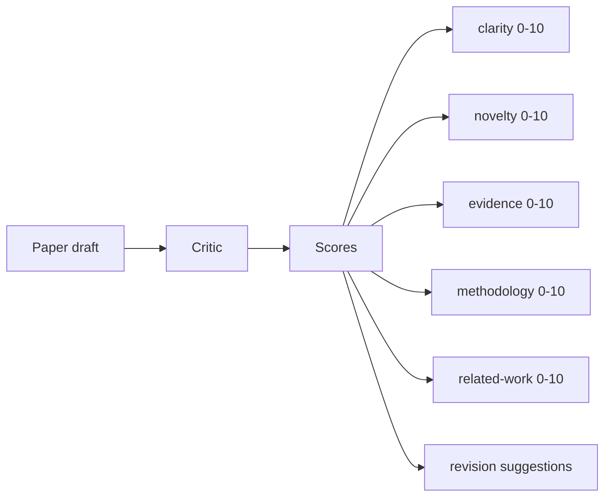
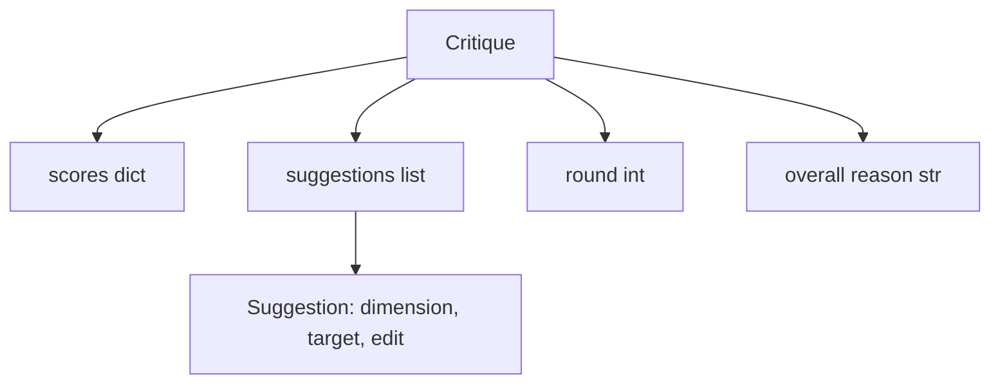
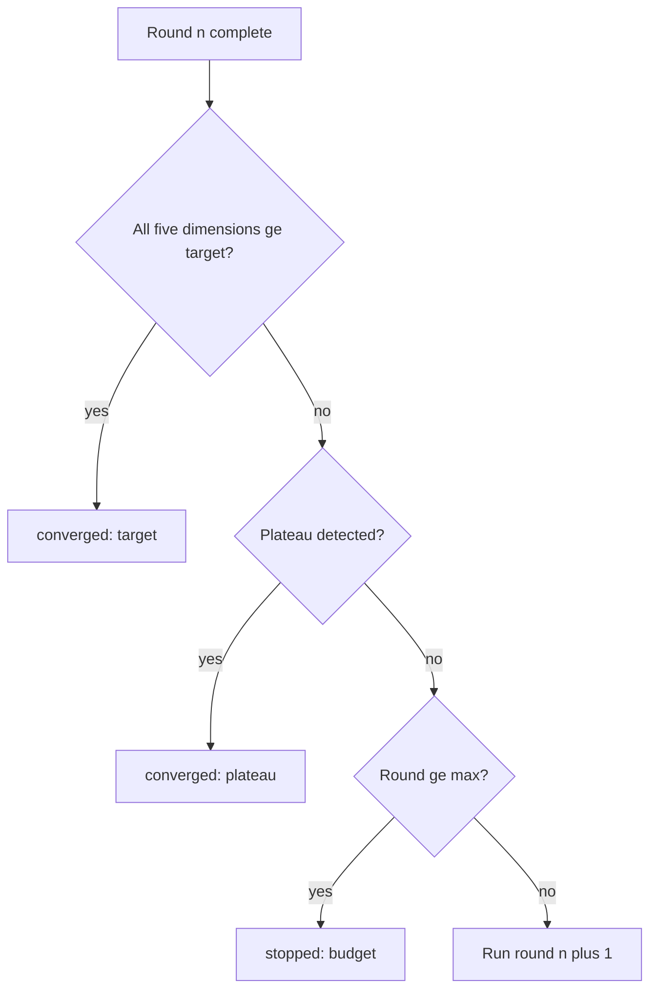
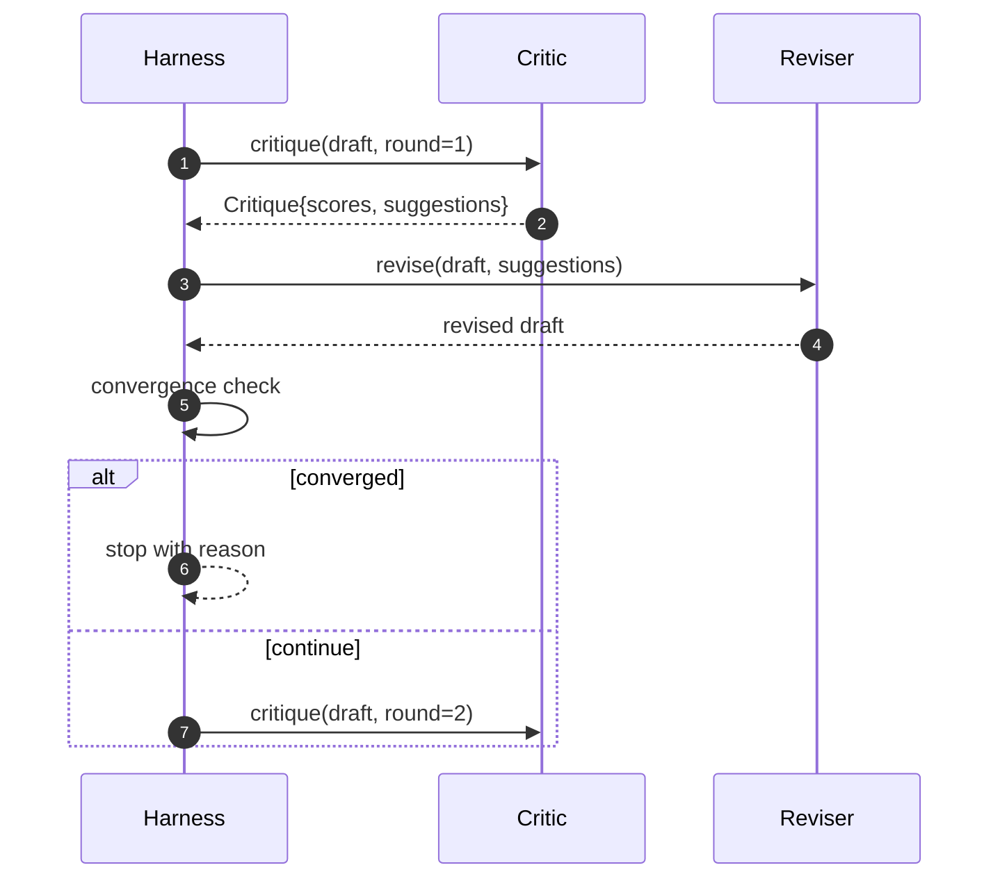

# حلقة النقد

> النقاد الذي يعود "يبدو جيدا" في المرة الأولى هو مكسور. النقاد الذي يعود دائما "حاجة إلى العمل" هو مكسور. النقاد المثير للاهتمام هو الذي يتقارب، ويجب عليك أن تصميم التقارب.

**Type:** Build
**Languages:** Python
**Prerequisites:** Phase 19 lessons 50-53
**Time:** ~90 minutes

## أهداف التعلم

- تسجيل مسودة ورقة على خمسة أبعاد ثابتة: وضوح، والابتكار، والدليل، والنهجية، والعمل المتعلق.
- تطبيق انتقاد كل جولة كإصدار منظم مختلف بدلا من إعادة كتابة شكل حر.
- اكتشاف التقارب عن طريق مقارنة النتائج عبر الجولات؛ توقف على المستوى، هدف قد تم، أو الميزانية قد نفدت.
- الحد الأقصى من الميزانية لتحديد الميزانية، لذا لا ينجح النقاد غير المتوافقين للأبد.
- إصدر مسار لكل جولة حتى يمكن لوحة التحكم أو المرحلة التالية أن تعرض مسار النتيجة.

```figure
ch-critic-converge
```

## لماذا خمسة أبعاد ثابتة

النقد الحر هو نموذج يعيد فقرة من الاقتراحات. مراجعة الجولة التالية تعامل مع الفقرة على أنها سياق بيئي. ما إذا كان إعادة الكتابة تناول النقد غير قابلة للتحقق لأنه لم يكن للنقد أبدا بنية.

خمسة أبعاد تعطى الحزام عقد.



النتيجة هي متجهة. الحزام يراقب كل بعد عبر الجولات. مراجعة التي تزيد من وضوح ولكن مخازن الأدلة هي تراجع على الأدلة، والتحقق من التقارب يراه. ناقد نموذج فقط لا يمكن أن تقدم هذه الضمان.

## شكل النقد



كل اقتراح يحمل بعد تحسينه، والقسم الذي يستهدف، و`edit`التعليمات التي يمكن للمحرر تطبيقها. يمكن أيضاً استدعاء المحرر. يرسل الدروس المحرر التحديدي الذي يفسر تعليمات التحرير كعملية إضافة إلى قسم. يقوم المحرر القائم على النموذج بتفسير نفس الحقل كإشارة. لا يتغير العقد.

## قواعد التقارب، حسب

حلقة النقد تنتهي عندما تنفجر أي من الحالات الثلاثة



الهدف هو الحالة الأكثر صرامة: يجب أن يصل كل من الأبعاد الخمسة (وضوح، الجدولية، الأدلة، المنهجية، العمل المتعلق)`>= target_score`(الوضع الافتراضي `8.0`) قبل أن يعود الحلقة النجاح. متوسط عال مع بعد ضعيف واحد ليس كافيا. اكتشاف المستوى يُقارن متوسط الجولة الحالية مع متوسط الجولة السابقة. إذا كان التحسن أقل `plateau_epsilon`(الوضع الافتراضي `0.1`) لفترتين متتاليتين، يخرج الحلقة مع `plateau`. الميزانية هي حدة صارمة على الجولات (الخفض الائتمان `5`) و تخرج مع `budget`. . .

النظام مهم. الهدف يفوز على المستوى يفوز على الميزانية. إذا ضرب الجولة الثالثة الهدف على نفس التكرار الذي سيزعز أيضا مستوى، والنتيجة هي`target`لا ، لا`plateau`. . .

## لماذا يمتد الكشف عن المرتفعات على مدار جولتين

مستوى مستوى واحد هو الضجيج. يقوم النقاد الحقيقي بإرجاع درجة مختلفة قليلاً في كل تكرار حتى على مسودة ثابتة ، لأن درجة تحديدية لا تزال تعتمد على اقتراحات تم تطبيقها وفي أي ترتيب. يتطلب جولتين مستوى متتاليتين تصفية الضجيج. إذا أبلغ الحزام عن مستوى ، فقد توقف المسودة بالفعل عن التحسين.

## النقاد المحدد في هذه الدروس

لا يستدعي الدروس نموذجا. النقيب المرسل هو مدعو يسجل مسودة استنادا إلى ثلاثة إشارات: متوسط طول الجسم القسم (وضوح) ، عدد الأرقام وعدد المشاركات (الدليل) ، و`originality_tag`المراجعة تعرف كيفية دفع كل نتيجة إلى الأعلى.

```text
clarity      grows when the average section body length increases
novelty      grows when originality_tag is set to "high"
evidence     grows when a section's figure_refs is non-empty
methodology  grows when a section titled "Method" exists with body
related-work grows when a section titled "Related Work" exists with body
```

يقوم المتحقق بتفسير كل اقتراح كإضافة موجهة. بعد الجولة الأولى، يمكن للقنبلة مراقبة النتيجة في ارتفاع. تستخدم الاختبارات هذه الملكية للتأكيد على أن الحلقة تقلل من الفجوة.

## عقد الحلقة الكاملة



يمتلك الحزام العداد الدائرة، والعلامة، والتحقق من التقارب. يمتلك النقدي النقطة. يمتلك المراجع الاختلاف. لا يلمس أي من الثلاثة حالة الآخرين.

## إنتاج البصمة

كل جولة تنشر حدثًا واحدًا مع رقم الجولة ، ومتجه النتيجة ، وعد الاقتراح ، وحكم التقارب. يتم إرجاع المسار الكامل جنبا إلى جنب مع المسودة النهائية. يمكن لوحة التحكم التدريجية التدريجية أن تعيد رسم الرقم لكل جولة. درساً يلي ، وهو منظم التكرار ، يقرأ المسار لتحديد ما إذا كان الفروع يستحق الاحتفاظ به.

## الميزانيات التي تحمي من النقاد السيئين

النقاد الذي يقدم اقتراحات لا تحسن أبداً النتيجة سيقفل الحلقة في السقف القصوى للتعليقات.`budget`يقرأ المستخدم أنه كخطأ نقدي، وليس خطأ مسودة البديل، الذي يظهر فقط مسودة نهائية، يخفي التشخيص. التصميم الأول يظهر عليه.

## كيفية قراءة الرمز

`code/main.py`يحدد`Critique`،`Suggestion`،`Critic`البروتوكول`Reviser`البروتوكول`CriticLoop`و`make_deterministic_critic_pair`مصنع يعيد النقاد الحكمي ومراجعة مطابقة.`Paper`يتم تضمين الشكل حتى يكون الدروس منفصلة

`code/tests/test_critic_loop.py`تغطية: تحسين أحاديث النغمة بعد الجولة الأولى، التقارب المستهدف على مسودة مُتأقلمة، اكتشاف المستوى بعد جولتين مسطحتين، استنفاد الميزانية عندما لا تحسن أي اقتراح، تطبيق اقتراح من قبل المُحَرِّر، وشكل البصمة.

## الذهاب إلى أبعد

اثنين من التوسعات التي سوف يطلبه تنفيذ حقيقي. أولاً، الوزن الأبعاد: ورقة لمؤتمر العمل يوزن الابتكار أعلى من المنهجية؛ والجلد يوزن العكس. تصبح اختبار التقارب متوسطاً موازناً. ثانياً، النقاد المزدوج: يحصل أحد النقاد على درجات، ويقرر النقاد الثاني الاقتراحات قبل أن يراها المراجع. كلاهما يضيف قيمة، وكلاهما يكوّن على نفس الشيء `Critique`الشكل

الرهان هو متجه النتيجة. بمجرد أن يتم هيكلة النقد، كل تحسين آخر، قاعدة التقارب، لوحة التحكم، النقاد المزدوج، ينخفض دون تغيير الحلقة.
