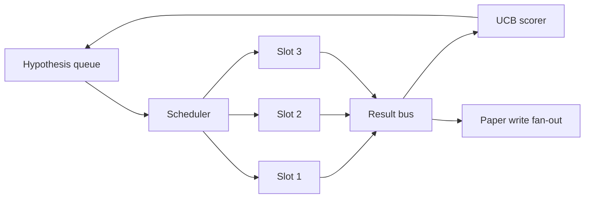
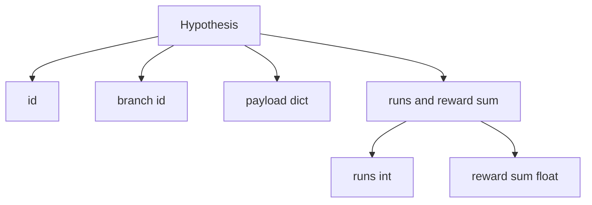
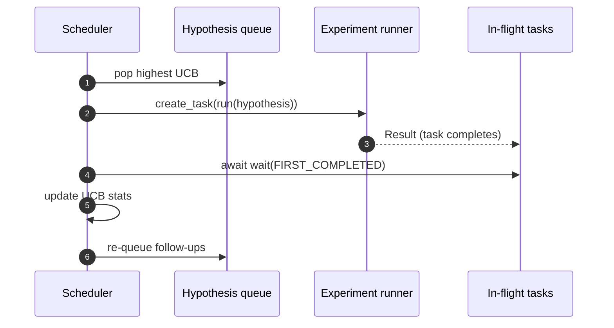

# المخطط التكراري

> حلقة بحثية بدون خريط جدول هي صف مع الوهم. خريط جدول هو المكان الذي يقرر فيه الحلقة ما يجب التوقف عن استكشافه، وهذا القرار هو اللعبة بأكملها.

**Type:** Build
**Languages:** Python
**Prerequisites:** Phase 19 lessons 50-53
**Time:** ~90 minutes

## أهداف التعلم

- نموذج سير عمل البحث كمركز فرضية يغذى فتحات التجربة المتوازية التي تنتج نتائجها.
- إنجاز تجارب متعددة بالتزامن مع Asyncio حتى يمكن للمجدول أن يبقي جميع الفتحات مشغولا.
- تسجيل كل فرع فرضية مع UCB حتى يمكن للمخطط أن يحصن فروع منخفضة الإنتاج دون التخلي عن الاستكشاف.
- ونشر النتائج النهائية إلى مرحلة كتابة ورقة ومرحلة ترتيب أخرى حتى تنتج فرع عالي الإنتاج فرضيات متابعة.
- أظهر على السطح أثر التكرار مع نقاط الفرع، احتلال الفتحة، وقرارات القص.

```figure
ch-ucb-scheduler
```

## لماذا المخطط وليس قائمة عمل

قائمة عمل مسطحة تعمل على الوظائف بالتسلسل في الترتيب. هذا جيد عندما تكون كل وظيفة مستقلة. البحث ليس مستقلًا: يغير نتائج التجربة الثالثة أولوية التجربة الرابعة والخامسة. يقوم المخطط الذي يقرأ المنتج المنتج ومع ذلك يعيد ترتيب الصف بأكثر عمل مفيد يتم القيام به لكل وحدة حساب.

اختيار التصميم المثير للاهتمام هو قاعدة تسجيل النقاط. يسعى المستحق الجشع دائمًا إلى اختيار الزعيم الحالي ولا يستكشف أبدًا. لا يستغل المستحق الجشع الموحد أبدًا. UCB (التي تُحدد الثقة العليا) هو الطريق الوسطى: استغل الزعيم مع احتياط القدرة على الفرع التي تم تجربتها أقل.

## شكل النظام



يحتوي الصف على فرضيات. يختار المخطط الفرضية ذات أعلى مستوى من UCB عندما تفرغ فتحة. كل فتحة تعمل تجربة غير متزامنة. تجارب انتهت تنفجر نتيجة على الحافلة. يقوم الحافلة بتحديث إحصاءات UCB على الفرع الأصلي وتقوم بتحديث إصدار الفروع إلى مرحلة الكتابة الورقية عندما يتجاوز عواقب.

## شكل الفرضية



`branch`هو مفتاح إحصاءات UCB. قد تشارك فرضات متعددة فرعًا (الفرع هو اتجاه البحث؛ الفرضية هي تجربة واحدة داخلها). `runs`هو عدد التجارب التي تم الانتهاء منها لهذا الفروع`reward_sum`هو الجائزة المتراكمة.

## تسجيلات UCB

الصيغة UCB المستخدمة في هذا الدروس هي UCB1 الكلاسيكية.

```text
ucb(branch) = mean_reward(branch) + c * sqrt( ln(total_runs) / runs(branch) )
```

`total_runs`هو عدد جميع التجارب التي تم إنجازها عبر جميع الفروع.`c`هو وزن الاستكشاف ؛ الدروس غير متكاملة إلى `sqrt(2)`- فروع مع صفر من الرحلات تحصل`+inf`فالأفروع التي لم يتم تجربتها يتم جدولةها أولاً دائماً. فروع ذات متوسط مرتفع من المكافآت تحتفظ بمعدل مرتفع حتى تتساوى الفروع الأخرى؛ فروع التي تعمل مرات عديدة دون مكافأة كبيرة يتم استغلاقها من قبل البدائل الأقل إدارة.

يُزيل البوابة التقطيعية عن المُختار. يُزيل التقطيع فرعًا من الجدول المُخطط للمستقبل عندما تنخفض متوسط مكافأته إلى أقل من مستوى مطلقاً (بالتعيين`0.2`) بعد`prune_after_runs`المحاكمات (الديفال`3`هذا يبقي الصف محدوداً

## فتحات متوازية مع asyncio

المخطط يقوم بتجربة مع`asyncio.create_task`كل مهمة تتم على طريق المدير التجريبي`async def`(التي تعيد الـ`Result`الحلقة الرئيسية تنتظر مجموعة من المهام أثناء الرحلة مع`asyncio.wait(..., return_when=asyncio.FIRST_COMPLETED)`ويرسل تحديثات النتيجة في كل اكتمال



ثلاث فتحات تعمل بالتزامن. الحلقة الرئيسية لا تُحجب في تجربة واحدة. يبدأ المخطط بمواصلة بدء مهام جديدة بمجرد إطلاق فتحة، حتى يكون الصف فارغًا ولا تكون هناك مهام في الطيران.

## التشغيل: محركات تشغيل الورق

عندما تتعرض الجائزة المتوسطة لفرع`paper_threshold`(الوضع الافتراضي `0.7`) ولم تنتج هذه الفرع ورقة بعد، ويعزف المخطط`paper.trigger`في هذه الدروس يتم التقاط الزناد كقائمة حتى يمكن للاختبارات أن تؤكد ذلك.

## التوسع: فرضيات متابعة

عندما يصل النتيجة عالية الإنتاجية ، يمكن للمخطط أن يطلب المستخدم المقدمة `expander`لإنتاج فرضية متابعة واحدة أو أكثر على نفس الفرع.`Result`إلى`list[Hypothesis]`. الدروس ترسل مُوسعًا تحديديًا ينتج اثنين من المتابعات لأي نتيجة تتجاوز مكافأة عتبة الورق.

## الميزانيات

ميزانيتين تحمي المخطط من حلقات الهرب

```text
max_experiments    : total count of experiments run across all branches
max_seconds        : wall-clock cap (asyncio time)
```

عندما يطلق أي من هذه المهام، يتوقف المخطط عن جدولة المهام الجديدة، وينتظر المهام في الرحلة، ويرد البصمة النهائية.`stop_reason`. . .

## التقرير النهائي

كل قرار في الجدول (التقاط، إرسال، النتيجة، التقطير، الترويج) ينشر حدثًا واحدًا. يجمع التقرير النهائي إحصاءات لكل فروع، والمسارات الإجمالية، والساعة الجدارية الإجمالية، والحركات التي تنفجر. يقرأ الدروس التالية، الظهور النهائي، هذا التقرير لدفع كاتب الورق.

## كيفية قراءة الرمز

`code/main.py`يحدد`Hypothesis`،`Result`،`BranchStats`،`IterationScheduler`و`make_deterministic_runner`المصنع الذي يعيد من يدير تجربة غير متوافقة مع مكافآت متوقعة.`delay_ms`(الوضع الافتراضي `5ms`) لذلك يمكن ملاحظة التزامن.

`code/tests/test_scheduler.py`تغطية: يختار UCB الفرع غير المختبرة أولاً، وموظف الفراغ المتوازي، ويقوم أجهزة الورق عند تجاوز العد، ويقوم بترقيع الفرع بعد التجارب ذات الأداء المنخفض، ويتم فرضيات متابعة متزايدة، ويتم الخروج من الميزانية (كلا من عدد التجربة و ساعة الجدار).

## الذهاب إلى أبعد

ثلاثة تمديدات ستحتاجها تنفيذ حقيقي. أولاً، إحصاءات UCB المستمرة عبر الجلسات: الإحصاءات الحالية تعيش في الذاكرة؛ المخطط الحقيقي سوف يراقبها حتى إعادة البدء يحافظ على ميزانية الاستكشاف التي تم إنفاقها بالفعل. ثانياً، تسجيل النقاط متعددة الأهداف: بدلاً من مكافأة مستوى، كل نتيجة تنبعث عن متجه و UCB تصبح محركاً للاختيار في نمط باريتو. ثالثاً، القراصنة السياقية: ظروف الاختيار على ميزات الفرضية (الطول، التعقيد) لذلك الفرضيات المماثلة تشارك الاستكشاف.

المخطط هو المكان الذي يصبح فيه البحث أكثر من قائمة عمل. بمجرد أن يتم تشبيه UCB والمسارات تعمل بالتوازي، كل تحسين آخر يتكون في الأعلى.
