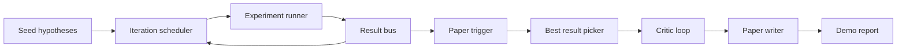
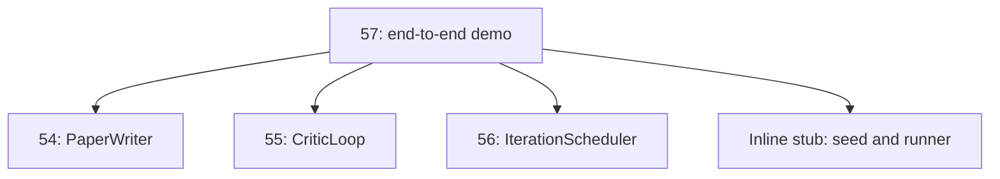
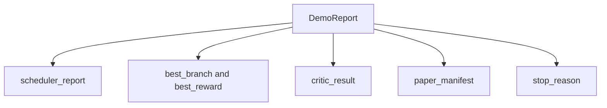

# التجربة البحثية من النهاية إلى النهاية

> الظهور هو المكان الذي يجب أن يكتب فيه كل عقد كتبته سابقاً إذا تسرب أي منهما، الظهور هو الدروس التي تلتقطه.

**Type:** Build
**Languages:** Python
**Prerequisites:** Phase 19 lessons 50-53
**Time:** ~90 minutes

## أهداف التعلم

- سلك حلقة البحث الذاتي من نهايتها إلى نهايتها: بذرة الفرضية، ومدرب التجربة، وزميل، و حلقة النقاد، و كاتب ورقة.
- قم بتكوين الأصول البدائية من دروس Track D السابقة من خلال استيراد Python البسيط ، وليس إطار.
- إشغلي الحلقة إلى نهاية ذاتية الانتهاء وإصدار تقرير تجريبي واحد يذكر كل مرحلة.
- حافظ على التثبيت التجريبي حتى يتمكن مجموعة الاختبار من تأكيد الشكل النهائي.
- إضافة وضع فشل واضح عند كسر عقد أي مرحلة، حتى لا يتم تشغيل المرحلة التالية مع مدخل مكسور.

```figure
ch-research-pipeline
```

## ما الذي يكوّن هنا



خمس مراحل. البذور هي قائمة من ثلاثة فرضيات. يقوم المخطط بتشغيل ست تجارب عبرها مع ثلاث فتحات متوازية. تبلغ الحافلة عن أحد أو أكثر من أسباب تشغيل الورق. يختار المختار النتيجة الأفضل. يتكرر حلقة النقاد على مسودة بنيت من ذلك النتيجة. يقوم كاتب الورق بإصدار LaTeX النهائي ، BibTeX ، والإبراز.

## لماذا تستورد وليس تدوين

كل درس سابق يُرسل`main.py`مع فئات البيانات العامة والمهام.`sys.path`هذا ليس تشبيه إطار؛ إنه نفس إدخال الملفات الاختبارية في الدروس السابقة التي تستخدم بالفعل.



تعتبر الصفوف الداخلية محل الدروس الخمسين إلى الخمسين وثلاثة: مولد صغير من فرضيات البذور و وظيفة مكافأة متزامنة. يمكن للمستخدم تبادل الصفوف الداخلية للابتدائيات الحقيقية من تلك الدروس عن طريق تعديل واردات اثنتين.

## ضمانات التحديد

التجربة هي تحديدية من خلال البناء. يُزرع المتشغيل التجربة بثبات. يمر مرر حلقة النقيب الأبعاد الثابتة بالترتيب الثابت. مولد النصوص الورق هو المهزوم من الدروس خمسة وأربعة. يقطع خيار UCB من المجدول العلاقات على ترتيب التكرار ، وليس اختيار عشوائي.

ويعطي نفس البذور، الإثبات الإثبات الإصدار نفس التقرير. يثبت الاختبار هذه الممتلكات عن طريق تشغيل الإثبات مرتين ومقارنة المخطط.

## شكل تقرير التجربة



كل حقل يأتي حرفيا من مرحلة الصعود. الظهور لا يحول أي إصدار؛ فإنه يكوّن لهم. هذا هو الاختبار الظهور هو.

## التعامل مع وضع الفشل

كل مرحلة إما تنجح أو تثير خطأ في كتابة النص.

```text
Scheduler ........ returns SchedulerReport with stop_reason
                   in {queue_empty, max_experiments, deadline}
Best-result pick . raises NoTriggerError if no paper trigger fired
Critic loop ...... returns LoopResult with status converged or stopped
Paper writer ..... raises PaperValidationError on contract break
```

فشل في أي مرحلة قصيرة الدوائر التجريبية مع استثناء من نوعها.`test_no_triggers_raises_typed_error`و`test_best_picker_raises_when_no_triggers`تأكيد أن المختار يرفع`NoTriggerError`- لا ، لا`BestResultError`عندما لا يطلق أي فرع الزناد، ولا يُدعى الكاتب أبداً.

## أفضل نتيجة

يقوم المخطط بإصدار محفزات ورقية لكل فرع. يختار المختار الفرع الذي يحصل على أعلى متوسط مكافأة بين جميع المحفزات. يتم كسر العلاقات بشكل أحرفي حسب اسم الفرع لذلك يكون التجربة محددة. المختار وظيفة صغيرة نقية؛ يقوم بتجربة إدخالها على تقرير المخطط الثابت.

## تسلك حلقة الحرجة

الحلقة النقدية في الدروس الخمسين وتعمل على`MiniPaper`. الظهور يبني`MiniPaper`من الفروع المختار من خلال ملء المجرد مع اسم الفروع، زراعة قسمين (الاندماج والنتائج) ، وتحديد `originality_tag`من متوسط مكافأة الفرع (على إذا `>= 0.8`، متوسط إذا`>= 0.6`، منخفضة في خلاف ذلك).

ثم يقوم المراجع بتكرار المسودة إلى التقارب. وتذهب الخروج إلى كاتب الورق.

## تلقّي خطّة كاتب الورق

كاتب الورق في الدروس 54 يعمل على كامل`Paper`أشكال مع الأرقام والسجلات.`MiniPaper`عبر`mini_to_full_paper`، الذي يرفق رقم واحد للفرع المختار ومكتبة صناعية صغيرة بنيت من اتحاد مفاتيح الاقتباس اقترح النقاد. كل اقتباس يضيف الديمو يضاف أيضا إلى قائمة المكتبة، وبالتالي يتم تصحيح.

## كيفية قراءة الرمز

`code/main.py`يحدد`BestResultError`،`NoTriggerError`،`DemoReport`،`pick_best_branch`،`build_mini_paper`،`mini_to_full_paper`و`run_demo`. الإيرادات في أعلى مستوى`sys.path`مرة واحدة و سحب`PaperWriter`،`CriticLoop`و`IterationScheduler`من دروسهم

`code/tests/test_e2e.py`تغطية: تشغيل التجربة من نهاية إلى نهاية ويعطي تقريرا مع جميع الحقول الخمسة المكتوبة ، والتحديد على اثنين من الجري ، لا تسبب الخطأ عندما لا يتجاوز أي فرع العدالة ، ورقة التحقق الخطأ عندما ينتهي عقد الكاتب ، ويرشيد الورق يحتوي على رقم الفرع المختار ، وسبب توقف المخطط هو واحد من القيم المتوقعة.

## الذهاب إلى أبعد

ثلاثة تمديدات تستحق التشغيل بمجرد أن يكون التجربة خضراء. أولاً، حالة مستمرة: يتم كتابة نتيجة كل مرحلة إلى مخزن JSON صغير حتى يتمكن إعادة تشغيل دون إعادة تشغيل المراحل الرخيصة. ثانياً، لوحة التحكم: تحديد الأحداث من المخطط والحلقة النقدية كخط زمني واحد. ثالثاً، دعوات النموذج الحقيقية: استبدال مولد النص المهزوم والنقاش الحاسم لأولئك القائمين على النموذج؛ لا يتغير التسلك.

مهمة التجربة هي إثبات أن التركيب هو الهندسة المعمارية خمس دروس، أربعة واردات، تقرير واحد. في المرة القادمة التي تضيفين فيها مرحلة، تنمو السلكات بنسبة خط واحد بالضبط.
