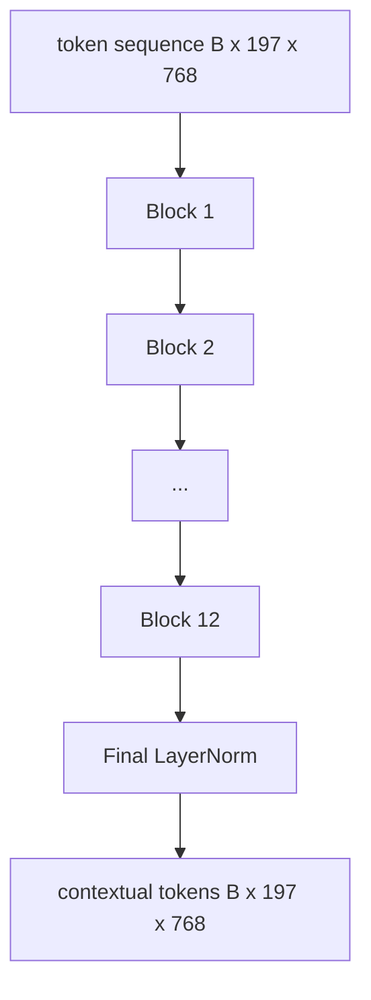
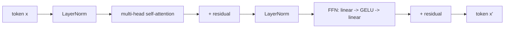

# مُرسلات تحويل الرؤية

> لا ترى اللقطات وحدها. محول pre-LN من 12 طبقة مع 12 رأسًا من الانتباه يحول تسلسل رموز اللقطات إلى تسلسل من رموز السياق ، مع تمزيق رموز CLS لميزات الصورة الكاملة في حالتها الخفية النهائية. هذه الدروس هي غرفة المحركات لكل نموذج لغة الرؤية الحديثة.

**Type:** Build
**Languages:** Python
**Prerequisites:** Phase 19 lessons 30-37 (Track B foundations)
**Time:** ~90 minutes

## أهداف التعلم

- تنفيذ كتلة محولة سابقة لـ LN مع مراقبة الذات متعددة الرؤوس وطبقة فرعية إرسال إلى الأمام.
- قم بتجميع 12 كتلاً مع 12 رأس لتشكيل مُشفّر قاعدة (في تي)
- سلكي الطرف الأمامي من الدروس 58 في المُشفّر و إضغطي على المُخطط الأمامي
- التحقق من أن رمز CLS يجمع المعلومات من كل إصلاح.

## المشكلة

إن إدراج اللصقة ينتج تسلسلًا من 197 رمزًا ، كل واحد متجهًا دون أي إدراك لأي صلة أخرى. صورة القطة تحتاج إلى كل ملابس لتعرف أي ملابس تحتوي على الشارب، والتي تحتوي على الخلفية، والتي تحتوي على العين. المحول هو الآلية التي تبني هذا الوعي، طبقة واحدة من الاهتمام في وقت واحد. بدونها، فإن الطرف الأمامي للمصطلح هو رمز ذكي دون فهم.

الوصفة القياسية 12 كتلاً عميقة، 12 رأسًا بعرض، مع وضع قبل الطبقة، تنشيط GELU، وتوسيع إرسال إلى الأمام بنسبة 4x. هذه الوصفة هي العمود الفقري لـ CLIP ViT-L، SigLIP، DINOv2، عائلة Qwen-VL، InternVL، وكل مرموز رؤية مفتوحة أخرى من 2025-2026. الوصفة مستقرة بما فيه الكفاية بحيث يمكنك قراءة أي من هذه الأوراق وتفترض هذا الشكل الحجم ما لم يقلوا صراحة خلاف ذلك.

## المفهوم





### قبل الـ LN مقابل بعد الـ LN

وضع محول الأصلي LayerNorm بعد بقايا. Pre-LN (LayerNorm قبل كل طبقة فرعية) هو النسخة التي يستخدمها كل نموذج لغة الرؤية الحديثة ، لأنه يتدرب بشكل مستقيم دون خدوش تسخين معدل التعلم. الفرق هو خط واحد في المرور الأمامي ، وتدفق التدفق عند عمق 12+ هو الليل والنهار.

### الاهتمام الذاتي متعدد الرؤوس

كل رأس يُقترح المتجه الرمزي إلى رأسه`(query, key, value)`ثلاثي مع بعد`head_dim = hidden / num_heads`مع`hidden = 768`و`heads = 12`كل رأس لديه`dim = 64`. 12 رأس يلتحق بالتوازي ، ثم تصل نتائجها إلى الأبعاد 768 وتمر عبر مشروع الخروج. نقطة رأس متعدد هو أن رأس واحد يمكن أن يتعلم "التواجد في عين القط" بينما يتعلم آخر "التواجد في تراجع الخلفية" دون تدخل.

### لماذا التوسع في التغذية المستقبلية 4x

" إنّ " الفين يذهب`hidden -> 4 * hidden -> hidden`مع GELU في الوسط. العامل 4 هو تجربي وقد احتفظت عبر المحولات اللغة والرؤية منذ عام 2017. أصغر (2x) يصل إلى أقل، أكبر (8x) يصل إلى أكثر من ميزانية البيانات الثابتة. حيث يحتفظ النموذج معظم الحقائق التي تعلمتها، والوسط الأوسع هو حيث يجلس.

| Component | Parameters at ViT-Base scale |
|-----------|------------------------------|
| qkv projection per block | `3 * 768 * 768 = 1.77M` |
| output projection per block | `768 * 768 = 590K` |
| FFN per block (4x expansion) | `2 * 768 * 4 * 768 = 4.72M` |
| LayerNorm per block | `4 * 768 = 3K` |
| Total per block | about 7.1M |
| 12 blocks | about 85M |
| Plus front end | about 86M total |

ViT-Base هو مرموز ذو ملامح 86M. هذا صغير بحسب معايير 2026 (SigLIP-So400M هو 400M ، Qwen-VL ViT هو 675M) ، ولكن الهندسة المعمارية هي نفسها حتى العرض والعمق.

### قناع السببية أم لا؟

تحويلات الرؤية هي فقط مُرمّدة ومتوجّهة إلى الاتجاهين: رمز `i`قد يشارك في الاحتفال`j`لا يوجد قناع، الاهتمام المتقاطع في الجهة المزعجة في الدروس 61 سوف يستخدم قناع السببية، ولكن داخل قناع الرؤية، الاهتمام متصل تماما.

### ما يتعلمه رمز CLS

تبدأ رمز CLS كمعلم متعلم ، وليس له محتوى مساحة خاصة به ، ويجمع المعلومات من خلال الاهتمام عبر كل كتلة. بحلول الطبقة النهائية ، يكون صف CLS ملخصًا للنقل للصورة بأكملها ؛ الرؤوس التدريجية تنبع هذا النقل الواحد إلى علامات الفصل ، أو تضمينات متضاربة ، أو مفاتيح الاهتمام المتقاطعة لفكّر النص.

```figure
ch-cls-funnel
```

## بناءها

`code/main.py`تطبيقات:

- `MultiHeadSelfAttention`، مع`qkv`والتنبؤات الخارجة، والحسابات المحددة للنتج والتركيز، والتأكيدات على الشكل.
- `FeedForward`، 4x التوسع GELU MLP.
- `Block`، كتلة ما قبل LN تتكون من طبقات فرعية للدقة والإرسال إلى الأمام مع بقايا.
- `ViT`، كومة من 12 بلوك مع الطبقة النهائية.
- `VisionEncoder`، أي أسلاك `VisionFrontEnd`من الدروس 58 إلى الـ`ViT`يضعها على كومة ويكشفها`forward()`إعادة التسلسل السياقي والمتجهة CLS المجمعة.
- عرض عرض يدير صورة ثابتة مختلطة 224 × 224 عبر المُرمّع الكامل ويطبّق شكل المدخل، شكل الخروج، عدد المعلمات، ومعيار CLS في كل طبقة أخرى.

إشغله

```bash
python3 code/main.py
```

الناتج: يتم تشفير الجهاز إلى `(1, 197, 768)`تنسور. تنحدر معايير CLS نحو الأعلى مع تكوين الطبقات، ثم تستقر عند معايير LayerNorm النهائية.

## استخدمها

إن المُرمّد المحدد هنا هو، حتى العرض والعمق، نفس كومة الكتل التي ترسل داخل كل VLM مفتوح الوزن في 2025-2026.

- **Width and depth.**(في تي-لارج)`hidden=1024, depth=24, heads=16`؛ سيجليب سو400م هو `hidden=1152, depth=27, heads=16`نفس الشقّة
- **Pooling head.**تجمع CLS (هذا الدروس) مقابل تجمع متوسط (SigLIP) مقابل تجمع الاهتمام (لاحقا VLMs).
- **Position handling.**الصناعي الثابت (المدرس 58) مقابل تعلم 1D مقابل ALiBi مقابل 2D RoPE.
- **Register tokens.**دينوف 2 يقدم أربعة رموز إضافية تعلمت.

هذه الكتل هي الأساس، والدرس التالي (60-63) تقف فوقها.

## الاختبارات

`code/test_main.py`تغطية:

- حفرة واحدة تحافظ على الشكل وهي غير متغيرة مع حجم اللحظة المدخلة
- نقاط الاهتمام مجموع إلى واحد على طول المحور الرئيسي (القدرة على الاعتناء القاسية)
- يتم تشغيل المسارات المتبقية (إن المدخل الصفر لا يزال ينتج output غير الصفر عبر رمز CLS)
- يُنتج مرسلة مدمجة للأمام بـ 4 طبقات الشكل الصحيح
- تدفق التدرج إلى مشروع اللقطة من خروج CLS

إشغلهم

```bash
python3 -m unittest code/test_main.py
```

## التمارين

1. إضافة رموز السجل (4 متجهات تعلمت تم تعديلها بعد CLS) وإعادة تشغيلها. مقارنة سلاسة خريطة الاهتمام عبر الانتروبية من توزيع softmax على الطبقة الأخيرة.

2. تغيير قبل LN بعد LN والدفع لمدة واحدة على تصنيف الشكل الاصطناعي. لاحظ أي واحد تدفع بشكل مستقيم دون LR تسخين.

3. تنفيذ التخفيض السببي كـ`attn_mask`الحجة حتى يتم إعادة استخدام نفس الكتل ككتل فك. شكل القناع هو `(seq, seq)`، مثلثي أسفل

4. الملفات الشخصية إرسال المخططات إلى الأمام في أحجام اللحوم 1، 8، 64 مع `torch.profiler`طبقة MLP تهيمن على الوقت الجداري، وليس الاهتمام

5. استبدل توقعات رأس الانتباه واحد بمركز لورا منخفض، وتجمد البقية، وتحقق من تدفق التدفق فقط حيث تتوقع.

## الشروط الرئيسية

| Term | What it means |
|------|---------------|
| Pre-LN | LayerNorm applied before each sub-layer instead of after |
| Self-attention | Each token attends to every other token in the same sequence |
| Multi-head | The hidden dim is split across `H` independent attention heads |
| FFN expansion | The feed-forward layer widens to `4 * hidden` before contracting |
| CLS pooling | Use the first token's final hidden state as the image summary |

## المزيد من القراءة

- صورة تستحق 16 × 16 كلمة (فييت، 2021) لوصفة المُرمّد.
- DINOv2 (2023) لبرامج التسجيل والهدف المسيطر عليه الذات قبل التدريب.
- SigLIP (2023) لمتغير المتوسط المشترك والخسارة المقابلة sigmoid المستخدمة في الدروس 62.
