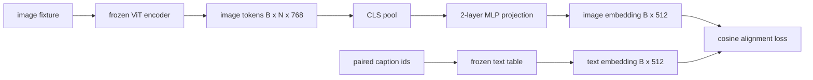

# طبقة التنبؤ لمواءمة التنظيم

> إن مُشفّر الرؤية ينتج رموز الصورة. مُشفّر النص يستهلك رموز النص. يعيش الاثنان في مساحات متجهة مختلفة. يُنشر MLP صغير من طبقتين رموز الصورة في مساحة إدراج النص، ويهدف فقدان التوجه الكوسيني ضد عنوان مُزدوج إلى الاتفاق بين المساحتين. هذا التنبؤ هو أصغر قطعة من نموذج لغة الرؤية والذي يهم أكثر للتحويل.

**Type:** Build
**Languages:** Python
**Prerequisites:** Phase 19 lessons 30-37 (Track B foundations)
**Time:** ~90 minutes

## أهداف التعلم

- قم ببناء مشهد MLP من طبقتين يخطط ميزات الصورة إلى مساحة إدراج النص.
- قم ببناء جدول تضمين نص مزيف (لا توكيينيزر متدرب مسبقًا ، لا وجود للكتابة الحقيقية).
- احسب فقدان التوجه بين رموز الصورة المتوقعة وتضمين الترجمة المزدوجة.
- تدريب الإشارة وحدها مع مرموز الرؤية المجمدة و جدول النص المجمد.

## المشكلة

لديك جهاز تشفير الرؤية (الدرس 58-59) ينتج علامات الأبعاد`vision_hidden = 768`لديك جهاز تشخيص النص تريد إضافةها إلى الجزء العلوي مع أبعاد إضافة`text_hidden = 512`(أي رقم آخر هو معقول تماما). ينتظر المفكّر رموز شكل نص. رموز الصورة ليست شكل نص: أنها تعيش في قاعدة تعلمها المفكّر خلال التدريب المسبق للرؤية فقط، دون أي علاقة بمتجهات الكلمات المفكّر.

يُسدّر التنبيه المُتَطَلّق (الخطيّ، GELU، الخطيّ) الفجوة.`768 * 1024 + 1024 * 512 = 1.3M`المعلم الرسمي يظل يتجمد. تبقى الجدول المضمن للنص يتجمد. يتحرك فقط الاستطلاع. هذه وصفة LLaVA التي تم شحنها في عام 2023 ، التي أعادت BLIP-2 تشكيلها ك Q-Former ، وأن كل VLM مفتوح الوزن منذ ذلك الحين قد تبنت في شكل ما.

## المفهوم



### تجميع قبل التقاط

يقوم مرموز الرؤية بإصدار 197 رمزًا. يحتوي الجانب النص على ضم واحد على مستوى الأسطح. لتحقيق التوصل إليهم تحتاج إلى متجه واحد على مستوى الصورة لكل عينة. تجمع CLS هو أبسط ما يمكن القيام به: أخذ الرمز الأول من مرموز الرمز والتصوير عليه. التجميع المتوسط على جميع الرمز 197 هو خيار آخر وهو ما يستخدمه SigLIP. إما تجمع 197 متجهًا إلى واحد.

### لماذا طبقتين وليس واحد

يمكن أن يدور مشهد خطي واحد ويعيد مقياسه لكنه لا يمكن إصلاح الأساس إذا كانت الفضاءين يمتلكان عدم مطابقة منحنى. يمنح GELU بين طبقتين خطية التنبؤ منحنى غير خطي واحد، وهو ما يكفي تجريبياً لتواءم ميزات نمط CLIP إلى إضافة نموذج اللغة. التنبؤات العميقة (LLaVA-NeXT استخدم GLU؛ Qwen-VL استخدم كومة من طبقات الاهتمام) هي امتدادات؛ MLP ذات طبقة اثنتين هي الخط الأساسي القنوني وهو ما تحت قبعة سفن القيادة التنبؤية Q-Former من BLIP-2.

| Layer | Shape | Parameters |
|-------|-------|------------|
| fc1 | `(vision_hidden, projection_hidden)` | `768 * 1024 + 1024` |
| activation | GELU | 0 |
| fc2 | `(projection_hidden, text_hidden)` | `1024 * 512 + 512` |

حوالي 1.3 مليون مبرمير لـ`768 -> 1024 -> 512`رأسك

### فقدان التوجه الكوزيني

التوصل لا يعني`image_emb == text_emb`. " التوصل " يعني`image_emb`نقاط في نفس الاتجاه`text_emb`في الفضاء المشترك فقدان الكوسين هو`1 - cos_sim(image, text)`يمتد التدريب إلى الصفر لكل زوج. يُعمّل الدروس 62 إلى مجموعة متناقضة (InfoNCE) حيث يجب أن تكون كل صورة أقرب إلى عنوانها الخاص من أي عنوان آخر في اللعبة. يستخدم هذا الدروس نسخة لكل زوج حتى تكون الديناميكيات مرئية.

### إنّ المُشفّر المُجمد هو الحيلة

جهاز تشفير الرؤية لديه ملامح 86 ميليون جدول النص لديه بضعة ملايين أخرى تدريبهم جميعاً من مجموعة مزيفة ليس بداية التجمد يعني أن ملامح 1.3M من التنبؤ هي الشيء الوحيد الذي يتغير، وبضع مئات الخطوات على أزواج اصطناعية يكفي لتقليل الخسارة. هذا هو بالضبط الشكل التشغيلي لكل VLM القائم على المعدل: الأجزاء الثقيلة تبقى جمدة، القطارات الجسر الخفيفة.

```figure
ch-projection-bridge
```

## بناءها

`code/main.py`تطبيقات:

- `MLPProjector(in_dim, hidden_dim, out_dim)`، 2 طبقات خطية MLP مع تفعيل GELU.
- `MockTextEmbedding(vocab_size, dim)`، جدول إضافة مجمد مع بداية تحديدية من بذرة.
- `make_pair(seed, vocab_size)`، الذي يجمع عينة واحدة مُزدوجة (الصورة، الأسطح) . الأسطح هي تسلسلات هوية قصيرة؛ يتم دمج الأسطح المتوسط على ضم أوراق رمزية.
- `cosine_alignment_loss(image_emb, text_emb)`، في كل زوج`1 - cos_sim`هدف
- حلقة تدريبية تعمل على عرض 200 خطوة على 32 زوجًا اصطناعيًا (منتهية الدورة) ، مع تجميد مبرمجي الرؤية وجدول النص ، وتطبيع الخسارة كل 25 خطوة.

إشغله

```bash
python3 code/main.py
```

الناتج: تقارير التدريب تقع من الخسارة الأولية حوالي 1.07 إلى حوالي 0.80 في غضون 200 خطوة، مما يظهر أن التنبيه وحده يمكن أن يسحب رموز الصورة نحو مساحة النص. يتم طباعة تشابه الكوسين النهائي لكل زوج أيضًا.

## استخدمها

نفس النمط يظهر في كل VLM مفتوح الوزن:

- **LLaVA 1.5.**التنبيه GELU MLP من طبقة اثنتين من CLIP-ViT-L مخفي إلى LLaMA تضمين ضئيل. مرموز الرؤية المجمدة، LLM المجمدة، تدريب فقط التنبيه (ثم فك التبريد LLM في المرحلة الثانية).
- **BLIP-2.**يأخذ Q-Former 32 رمزًا من استفسارات المتعلمة من خلال الاهتمام المتبادل مع رموز الصورة ، ثم يُنشر إلى LLM تضمين ضئيل. رأس الإشارة في نهاية Q-Former هو مقارنة مع MLP هذا الدروس.
- **MiniGPT-4.**التنبيه الخطي الواحد من خروج BLIP-2 Q-Former إلى Vicuna تضمين ضئيل.
- **Qwen-VL.**مُعدّل الاهتمام المتقاطع مع عدة طبقات، لكنّ القطعة النهائية هي مرة أخرى عرضًا إلى إضافة LM.

الشكل يختلف لكن الدور هو نفسه: رموز الصورة المجمعة، مشروع إلى نص تضمين ضباب، القطار وحده.

## الاختبارات

`code/test_main.py`تغطية:

- تشكل خروج المبرمج يطابق المكونات`out_dim`
- جدول إدراج النص المجمد له صفر `requires_grad`المعلمات
- خسارة الكوسين هو صفر على متجهات متطابقة و هو 2 على متجهات مضادة للموازات
- تدفقات تراجع المُرسل بعد مرور واحد للخلف
- حلقة التدريب تقلل من الخسارة بين الخطوة 0 و الخطوة 200

إشغلهم

```bash
python3 -m unittest code/test_main.py
```

## التمارين

1. استبدل جمع CLS بمجموعة متوسطة على 196 رمزة اللصقة ومقارنة الخسارة النهائية بعد 200 خطوة. عادة ما يتدفق جمع متوسط بشكل أسرع على البيانات الاصطناعية. CLS أكثر كفاءة في استخدام العينات على الصور الطبيعية.

2. إضافة درجة حرارة مستوى المتعلمة إلى خسارة الكوسين (`cos / tau`) ولاحظ ما يحدث عندما`tau`ضئيلة جداً (ضجيج تراجع) أو كبيرة جداً (مستويات الخسارة عالية).

3. قم بتبادل MLP ذات طبقتين لتكون طبقة خطية واحدة وتحديد الفجوة في الخسارة. لا يهم عدم الخطية أكثر على خصائص الصورة الطبيعية وأقل على الصور الاصطناعية.

4. أضف عقوبة صغيرة من L2 على أوزان المضرب ومراقبة كيف يتفاعل مع التوجه الكوسين (كوسين هو غير متغير في الحجم، لذلك تعتبر العقوبة في الغالب تقلص الاتجاهات غير المستخدمة).

5. ثقيلة المشروع مستمرة، ثم إعادة الشحن وتشغيل الاستنتاجات دون أن يمر مرموز الرؤية إلى الوراء للتحقق من أن المشروع فقط مطلوب في وقت النشر.

## الشروط الرئيسية

| Term | What it means |
|------|---------------|
| Modality alignment | The act of making image and text embeddings comparable in one shared space |
| Projection head | The small module that maps one space to another, usually a 2-layer MLP |
| Cosine similarity | Dot product divided by the product of L2 norms |
| Frozen encoder | The vision (or text) model has all parameters with `requires_grad=False` |
| Mock corpus | Synthetic pairs used so training has no dataset download dependency |

## المزيد من القراءة

- ورق LLaVA للقطار المرحليين (المشروع، ثم فك التجميد LM).
- ورقة BLIP-2 لـ Q-Former كبديل للتعلم في التصوير.
- تقرير تقني Qwen-VL لمتكيفات الانتباه المتقاطع كقواصير إلقاء الأشرطة العميقة.
