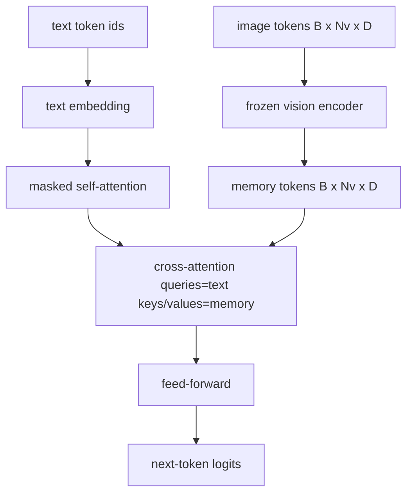
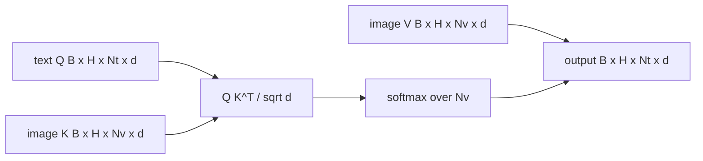

# الاندماج بين الانتباه

> طبقة التبديل تعادل متجهة صورة واحدة مع متجهة عنوان واحدة. ويحتاج مُشفّر لغة الرؤية الحقيقي إلى كل رمز نصيّ ليتمّ إدارته لكل رمز إصطحاف، حتى يتمكن النموذج من وضع كل كلمة في منطقة. الاهتمام المتقاطع هو كيف يحدث هذا التأريض. النص يطرح الأسئلة، مفاتيح الرؤية والقيم يجيب. هذا الدروس يبني حظر الانتباه المتبادل، والنص السببية الانتباه الذاتي، والقناع أشكال التي تبقي كل من القانونية.

**Type:** Build
**Languages:** Python
**Prerequisites:** Phase 19 lessons 30-37 (Track B foundations)
**Time:** ~90 minutes

## أهداف التعلم

- تنفيذ الاهتمام المتبادل متعدد الرؤوس حيث يكون تيار الاستفسار نصًا وتدفق المفتاح / القيمة هو الرؤية.
- قم بتكوين كتلة للكشف: الاهتمام الذاتي السببي + الاهتمام المتبادل + التقدم.
- احصل على شكل القناع الصحيح: قناع سببية للانتباه الذاتي، لا قناع للانتباه المتبادل.
- إشغال مرور إلى الأمام مع رموز نصية المجموعة ومجموعة ثابتة من رموز الصورة.

## المشكلة

إنّ إضافة رموز الصورة ورمز النص إلى تسلسل واحد هو خيار الاندماج الأول (الاندماج المبكر، والمسار الذي يأخذه Chameleon و Emu3). الاهتمام المتقاطع هو الآخر (الاندماج المتأخر، والمسار الذي قدمه Flamingo والذي نسخ كل مُشعّر شكل Flamingo منذ ذلك الحين). في الاندماج المتأخر، يعمل مُشعّر النص على رموز نصية فقط ويمتد إلى تيار الصورة من خلال الاهتمام المتقاطع في كل طبقة.

التضميد المتأخر له مزيئين. أولاً ، يبقى تيار النص نظيفًا والنموذج يحافظ على قدرات النص فقط. ثانياً ، يتم حساب تيار الصورة مرة واحدة لكل صورة وإعادة استخدامها لكل خطوة من مراحل تشفير الرسوم ، لذلك إنتاجها رخيص حتى بالنسبة للقوائم الطويلة. التكلفة هي طبقة فرعية إضافية واحدة للاهتمام لكل كتلة.

## المفهوم





### شكل القناع

الاهتمامين داخل كتلة المفكّر يحتاجون إلى أقنعة مختلفة:

| Attention | Query length | Key length | Mask | Why |
|-----------|--------------|------------|------|-----|
| Self-attention | `Nt` (text) | `Nt` (text) | Causal: lower-triangular `(Nt, Nt)` | Text tokens may not look ahead during autoregression |
| Cross-attention | `Nt` (text) | `Nv` (vision) | No mask | The whole image is visible to every text position |

الدروس تشمل وظيفة واحدة للتحقق من الشكل لذلك خطأ خلطهم في السطح`ValueError`بدلاً من منحنى الخسارة المكسور بصمت

### لماذا لا يوجد قناع على الانتباه المتبادل

يتم ملاحظة الصورة بالكامل قبل أن يتم إنشاء أي نص.`t`قد يشارك في أي مساحة من الصورة؛ لا يوجد ترتيب زمني على مساحات الصورة. بعض فلامينغو المتغيرات تضيف نمطًا من الاختفاء لكل عينة عند ترك العديد من الصور وقطع النص، ولكن بالنسبة إلى صورة واحدة بالإضافة إلى أسطح ، يرى الانتباه المتقاطع كل شيء.

### تخزين المفتاح/القدر

يتم حساب مفاتيح الصورة والقيم مرة واحدة في بداية فك الشفرة ويحتفظ في التخزين. كل رمز نص جديد يستخدم التخزين التخزينية دون إعادة الحساب. هذا ما يجعل التسجيل السريع في الاستنتاج: يتم تشغيل ViT الثقيل مرة واحدة. يستخدم التدقيق المتقاطع مفاتيحه والقيم في كل خطوة. يكتشف الدروس التخزين وتختبر مسار التخزين المتضرر.

### تركيب الكتل

يدير كتلة المفكّر: pre-LN -> انتباه الذات -> بقايا -> pre-LN -> انتباه متقاطع -> بقايا -> pre-LN -> تغذية إلى الأمام -> بقايا. ثلاثة طبقات فرعية، كل منها مع طبقة خاصة به. أضاف ورقة فلامينغو بوابة تعلم على الانتباه المتقاطع حتى يتمكن النموذج من الامتناع عن مسار الصورة بتكلفة استقرار وقت التدريب. لا يوجد بوابة في الخط الأساسي القنوني (المستخدم هنا).

```python
class DecoderBlock:
  def forward(self, text_tokens, image_tokens, text_mask, cross_mask):
      text_tokens = text_tokens + self.self_attn(self.ln1(text_tokens),
                                                 mask=text_mask)
      text_tokens = text_tokens + self.cross_attn(self.ln2(text_tokens),
                                                  image_tokens,
                                                  mask=cross_mask)
      text_tokens = text_tokens + self.ffn(self.ln3(text_tokens))
      return text_tokens
```

```figure
ch-crossattn-fan
```

## بناءها

`code/main.py`تطبيقات:

- `CrossAttention(hidden, heads)`, الاهتمام المتقاطع متعدد الرؤوس مع منفصلة`q`و`kv`التوقعات
- `CausalSelfAttention(hidden, heads)`، الاهتمام الذاتي المخفي من جهاز تشخيص القياسية
- `DecoderBlock`، يجمع ثلاث طبقات فرعية مع بقايا قبل LN.
- `VisionLanguageDecoder`، مُشفّر أربع طبقات يتم تغذيته بواسطة إصدار مُشفّر رؤية مزيف و جدول إضافة نص صغير.
- `causal_mask(length)`إرجاع`(length, length)`الـ "بوليان" التنسور الثلاثي السفلي
- عرض عرض يغذى على مجموعة من تسلسلين نصيين بطول 10 مع ذاكرة الصورة بطول 197 ويطبع شكل الخروج، شكل قناع الاهتمام الذاتي، ونموذج الخروج من الاهتمام المتقاطع لكل موقف.

إشغله

```bash
python3 code/main.py
```

الناتج: المفكّر ينتج `(2, 10, text_vocab)`الـ (لوجيتس) الـ (تانسر) شكل القناع هو`(10, 10)`. تُؤكد التحقق من إعادة استخدام KV-Cache التسجيلات المُتطابقة بين المسارات المحفوظة في الاحتفاظ والمسارات غير المحفوظة في الاحتفاظ.

## استخدمها

الاهتمام المتبادل يظهر في عائلتين إنتاجية:

- **Flamingo and IDEFICS.**إدراج طبقة فرعية للاهتمام المتقاطع لكل كتلة نموذج لغة K ، مع LM المجمد. مُعدل لغة الرؤية هو كتلة الاهتمام المتقاطع بالإضافة إلى بوابةها.
- **BLIP-2.**يستخدم Q-Former الانتباه المتقاطع من مجموعة ثابتة من 32 رمزا استفسار في ميزات الصورة ، ثم يرمز الاستفسارات إلى مساحة إدمج LM.

شكل الكتلة في هذا الدروس يخطط مباشرة على كليهما. تنضباط القناع (سبب على الذات، لا أحد على الصليب) هو نفسه.

## الاختبارات

`code/test_main.py`تغطية:

- القناع السببية هي مثلثية أدناه وتطابق الشكل البولية المتوقع
- شكل الناتج للاهتمام المتقاطع هو `(B, Nt, hidden)`بغض النظر عن طول المفتاح
- مسار KV-Cache يطابق مسار غير مسجل مع تحمل العبور
- عدم مطابقة الشكل بين تدفقات النص والصور يثير واضح `ValueError`
- إن إرسال المقطع المكمل للأمام يُنتج الشكل الصحيح للشحنة والسلسلة

إشغلهم

```bash
python3 -m unittest code/test_main.py
```

## التمارين

1. إضافة بوابة تانح تعلمت إلى بقايا الانتباه المتقاطع (حيلة فلامينغو) وتحقق من التقارب التدريبي من بوابة أولية قريبة من الصفر. تبدأ البوابة عند 0؛ يستعيد النموذج سلوك نصي فقط قبل خلط تيار الصورة.

2. تنفيذ الاهتمام المتداخل حيث يستغرق نفس المفكّر صورًا متعددة بالإضافة إلى فئات نص متعددة. قم ببناء قناع الاهتمام المتقاطع لكل عينة الذي يمنع فئة النص 2 من الالتحاق بالصورة 1.

3. الملف الشخصي للصورة المتقاطعة للاهتمام مقابل الطبقة الاهتمام الذاتي في `Nt=64, Nv=576`(شبكة 24 × 24 عند ارتفاع الدقة) تكلفة الانتباه المتقاطع هي `Nt * Nv`ويتهيمن على ارتفاع قرار الصورة

4. إضافة إيقاف جانب الاستفسار على خريطة الانتباه المتقاطع وقياس تنوع الأسعار على التجربة (تزداد اختلاف نموذج الأسعار مع الإيقاف في الخريطة المتقاطعة).

5. قم بتبادل طبقة الاهتمام المتقاطع مقابل كتلة الاهتمام على شكل Q-Former حيث يلبي مجموعة استفسارات ثابتة من 32 رمزًا لميزات الصورة مرة واحدة في كل طبقة.

## الشروط الرئيسية

| Term | What it means |
|------|---------------|
| Late fusion | Text and vision stay in separate streams; cross-attention bridges them at every block |
| Cross-attention | Q comes from one stream, K and V from another |
| Causal mask | Lower-triangular boolean mask that prevents looking ahead during autoregression |
| KV cache | Image keys and values stored once and reused for every decode step |
| Memory tokens | The frozen image tokens that the decoder reaches into |

## المزيد من القراءة

- فلامينغو (2022) لتصميم التآكل المتأخر القنوني مع الاهتمام المتقاطع المفتوح.
- BLIP-2 (2023) لـ Q-Former ، وهو كتلة الانتباه المتقاطع التي ترتدي ملابس كمجم استفسارات متعلمة.
- إديفيكس (2023) لترجمه مفتوحة الوزن لوصفة فلامينغو.
