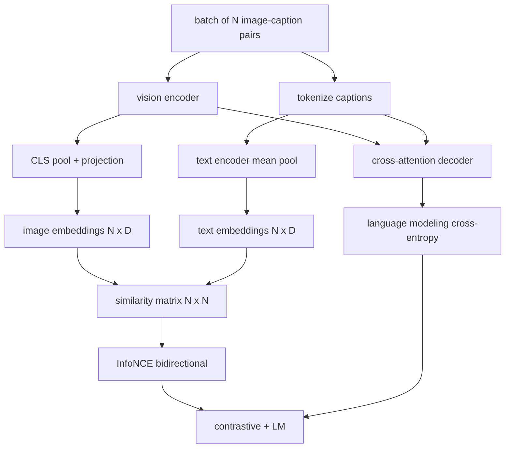

# تدريب لغة الرؤية

> يتم تشغيل المبرمج والإلقاء الرسوم والمقترح والمقترح. الآن تدربهم معا. هناك هدفين يقودون التعلم: فقدان الصورة والنص المقابل (InfoNCE) الذي يسحب أزواج المقابلة معًا في مساحة الإدخال المشترك ، وفقدان نمذجة اللغة الذي يطلب من المقرر أن يضع أسمائًا لكل صورة. مجتمعة ، يعلّمون الشبكة على حد سواء العثور على الصورة المناسبة للأسمائ وكتابة أسمائً للصورة.

**Type:** Build
**Languages:** Python
**Prerequisites:** Phase 19 lessons 30-37 (Track B foundations)
**Time:** ~90 minutes

## أهداف التعلم

- تنفيذ InfoNCE خسارة التناقض عبر مجموعة من أزواج الرسم الصوري.
- تكوين الخسارة المقابلة مع الخسارة التمثالية لغة autoregressive.
- قم بتجميع 200 زوج من صور مزيفة بدون تحميل مجموعة بيانات حقيقية
- إشغلي حلقة تدريب تجريبية 50 خطوة وشاهدوا كل من الخسائر تتراجع.

## المشكلة

يتطلب نموذج لغة الرؤية مهاراتًا. يجب أن يرتب: مع إعطاء عنوان ، العثور على الصورة المناسبة بين العديد. يجب أن يولد: مع إعطاء صورة ، اكتب عنوانًا. تدريب النموذج على مهارة واحدة وحدها يعطيك نصف النظام. CLIP ترتيب المسامير ولكن لا يمكن أن يكون عنوانًا. GPT-4V يمكن أن يضع عنوانًا ولكن يستخدم رأس استرداد منفصل للتصنيف. يتحصل التدريب المعدني على كل من المهام في مرور واحد.

يدير InfoNCE نصف التصنيف. بالنسبة لفرقة من أزواج N، يعامل النموذج أزواج N المتناسبة كإيجابية و `N^2 - N`أزواج غير متطابقة كسلبيات، ثم يدير خسارة الانتروبيا المتقاطعة على النتيجة `(N, N)`المصفوفة المماثلة. فقدان LM يتعامل مع نصف الجيل: التنبؤ القياسي التالي التوقيع على الصورة. كل من الخسائر يمكن التمييز ويمكن مشاركة الوزن المرموز، والمضرب، ومع decoder.

## المفهوم



### InfoNCE في فقرة واحدة

قم بتجميع إضافة الصورة N إلى صفوف وإضافة النص N إلى صفوف. L2- عادي كل منهما. احسب `N x N`المصفوفة`S = I T^T / tau`أين`tau`هي درجة حرارة تعلمت. الإدخالات الأفقية هي أزواج مطابقة؛ الإدخالات خارج الأفقية هي سلبية. تطبيق التقاطع بين الجسم والهدف `argmax`يسير أسفل على المقاطع: صف `i`يجب أن يكون لها أعلى إدخال في العمود `i`قم بنفس الشيء بالتناظر على طول العمودات، إجمالي هو متوسط الاثنين، هذا هو خسارة CLIP في ثمانية خطوط.

### درجة الحرارة مهمة

درجة الحرارة`tau`يحدد مدى ذروة المعدل الغير مرنة.`tau = 0.01`) والنحو يأتي فقط من أقوى سلبية، التدريب ضجيج. كبير جدا والنحو السلمية يُسطح والنحو يختفي. CLIP تعلم `tau`كبرامتر، التجربة هنا تفعل الشيء نفسه.

### فقدان نمذجة اللغة

يستهلك جهاز القيادة رموز ذاكرة الصورة عن طريق الاهتمام المتبادل ويتوقع رمزا النص التالي في كل موقف. الخسارة هي الانتروبية المتبادلة القياسية مع هدف الموقف التالي. يتم إخفاء مواقف التشغيل من الخسارة.

### الجمع بين الخسائر

`total = contrastive + lm_weight * lm`أين`lm_weight`هو مقياس (غالبا 1.0). تقاسم الخسائر الثنائية تراجعات في المرموز والتحديد؛ فقط المرفق يحصل على تراجيع فقدان LM. هذه وصفة متعددة المهام التي تستخدم جميعها نماذج طراز CoCa، BLIP، و SigLIP، مع وزن مختلف.

| Component | Loss surface | Affects |
|-----------|--------------|---------|
| InfoNCE | Pair ranking in the joint space | Encoder + projection + text head |
| LM | Token prediction conditioned on image | Encoder + projection + decoder |
| Combined | Multi-task | Whole stack |

### لماذا 50 خطوة كافية لإجراء عرض

المزيّف هو مجموعة مصنوعية من 200 زوج مع صور عشوائية ومدونات أسماء عشوائية. بعد 50 خطوة SGD مع حجم البطاقة 16, تنخفض الخسائر بشكل مرئي حتى لو بقيت القيم المطلقة فوق ما يمكن أن يحققه نموذج بيانات حقيقية. نقطة التجربة هي التأكيد على أن عمليات التوصيل المتحركية من نهايتها إلى نهايتها وأن إضافة فقدان LM لا يزعزز هدف المناقض.

```figure
ch-infonce-diagonal
```

## بناءها

`code/main.py`تطبيقات:

- `MultimodalModel`، يجمع بين مُرمّد ViT صغير، ومُرّيّد MLP، ومُرمّد نصيّ صغير (مجموعة متوسطة على المُصدرات المُضَّمة) ، ومُرمّد الاهتمام المتقاطع من الدروس 61.
- `info_nce_loss(image_emb, text_emb, temperature)`، الخسارة المقابلة على النمط الثنائي CLIP.
- `lm_loss(logits, target_ids, padding_id)`، مخفي التقاطع الإنتروبي التالي
- `make_mock_corpus(seed, n_pairs)`، يعود 200 زوج من التحدد (الصورة، caption_ids).
- حلقة تدريبية تعمل 50 خطوة مع حجم اللحظة 16 ، ومحافظ آدم ، ومعلم لوج-حرارة المعيار. يتم طباعة كل الخسائر كل 5 خطوات.

إشغله

```bash
python3 code/main.py
```

الناتج: انخفاض الخسارة المقابلة من حوالي `ln(16) = 2.77`نحو 2.4 ، انخفاض خسارة LM من خط أساسي متساوي عشوائي من`ln(512) ≈ 6.24`في حوالي 4.7، كل من الانخفاضات تثبت أن التدفقات مرتبة بشكل صحيح. النماذج الحقيقية تدرب على ملايين الخطوات؛ الديناميكية هي نفسها.

## استخدمها

هذه نفس وصفة الخسارة التي أرسلتها:

- **CLIP (2021).**الصورة-نص مُقابل فقط، مع صوّة منفصلة من المُفرجات-مُشفّر الترجمة.
- **CoCa (2022).**الصورة- النص المقابلة بالإضافة إلى صورة- عنوان فقدان LM في نموذج واحد. النمط الدقيق هذا الدروس يبنيه.
- **BLIP (2022) and BLIP-2.**التناقض + LM + الصورة - النص تطابق رأس. ثلاثة خسائر مجتمعة.
- **SigLIP (2023).**يغير InfoNCE لخسارة زوج sigmoid؛ نفس الدور المقابل، شكل وظيفي مختلف.
- **LLaVA family.**تدريب مرحلتين حيث المرحلة الأولى هي التنحية (الخلف على المرحلة المجمدة) والمرحلة الثانية تضيف فقدان المرحلة المجمدة مع المرحلة المفروضة. دراسة 60 خريطة للمرحلة الأولى؛ هذا الدروس خريطة للمرحلة الثانية.

## الاختبارات

`code/test_main.py`تغطية:

- إنفوكس الخسارة متماثلة عبر الصور/صيغ النص
- يعود خسارة InfoNCE 0 عندما تكون المصفوفة المماثلة هي خط خطية مثالية للأعداد الإيجابية الكبيرة
- فقدان LM يغطى بشكل صحيح مواقع التدليك
- النموذج المضي قدما ينتج كلا الخسائر دون أخطاء
- حلقة تدريب 5 خطوات تقلل من الخسارة المشتركة

إشغلهم

```bash
python3 -m unittest code/test_main.py
```

## التمارين

1. استبدل InfoNCE بخسارة زوج sigmoid على طراز SigLIP وقارن التقارب على جسم المزيّف.

2. إضافة خطوة استخراج صعبة سلبية: كل خيار آخر، اختيار أصعب زوج خارج الشوارع من الخيار السابق وإضافة ذلك. تدريب وتفحص ما إذا كان الخسارة المقابلة ينخفض بشكل أسرع.

3. إضافة رأس ثنائي يطابق الصورة والنص على أعلى التوابل المشترك (صادق/أكاذب: هل يطابق هذه؟) للخسارة الثالثة، وتكرار إعداد BLIP ثلاثية الرأس.

4. استبدل الجسم المزيف بتسلسلات معرف الترجمة المستمدة من سلسلة ماركوف التي يتم تحديدها على الهاش الصورة. يجب أن تنخفض خسارة الترجمة بعد ذلك لأن هناك إشارة قابلة للتعلم الفعلية.

5. قم بتدريب نفس النموذج مع`lm_weight = 0`ومرة أخرى مع`lm_weight = 1`. مقارنة الخسارة المقابلة؛ الخسارة LM لا ينبغي أن تراجع هدف التصنيف.

## الشروط الرئيسية

| Term | What it means |
|------|---------------|
| InfoNCE | Noise contrastive estimation: cross-entropy on a similarity matrix |
| Temperature | Scalar that controls how peaked the contrastive softmax is |
| Hard negative | An off-diagonal pair the model finds confusing, useful for sampling |
| LM loss | Standard next-token cross-entropy on the captioning side |
| Joint embedding space | The shared space where image and text vectors live after projection |

## المزيد من القراءة

- ورقة "كليب" لـ"الوصفة المُقارنة الأصلية".
- ورقة كوكا للمقارنة بالإضافة إلى الترجمة في نموذج واحد
- ورقة SigLIP لـ (سيغمويد) و لماذا تتحسن نطاقها
