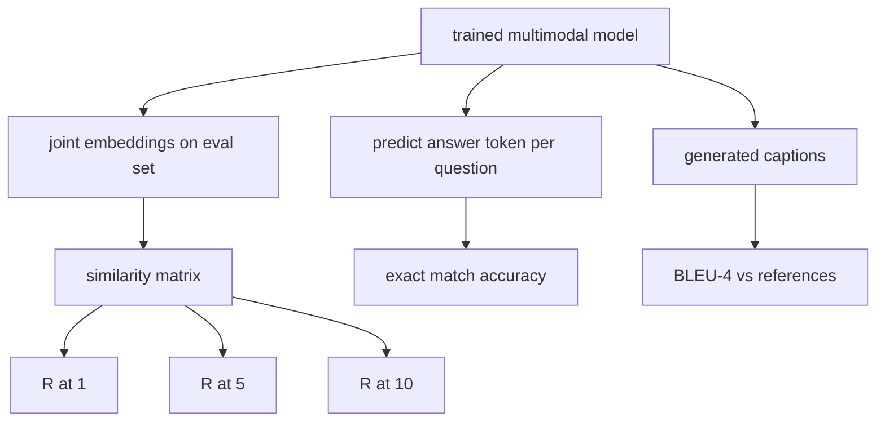

# التقييم المتعدد الحركات

> التدريب هو نصف الحلقة. النصف الآخر هو القياس. هذه الدروس تبني ثلاث سطحات تقييم من البدائيات: استرداد عنوان الصورة الذي يبلغ عنه R@1, R@5, R@10؛ الإجابة على الأسئلة المرئية التي يبلغ عنها دقة مطابقة دقيقة؛ وتسجيل الصورة التي يبلغ عنها BLEU-4. كل مقياس هو وظيفة على نتائج النموذج ومجموعة تقييم اصطناعية تعمل في ثواني.

**Type:** Build
**Languages:** Python
**Prerequisites:** Phase 19 lessons 58-62 (Track E foundations: encoder, transformer, projection, cross-attention fusion, pretraining)
**Time:** ~90 minutes

## أهداف التعلم

- احسب Recall@K من ماتريكية تشابه بين إضافة الصورة والقسم.
- احسب دقة VQA المتماثقة بدقة من نموذج يقوم بتخريط (الصورة، السؤال) إلى قاموس الإجابة الثابت.
- احسب BLEU-4 من تسلسلات الرمز المولد والمرجعية دون أي مكتبة خارجية.
- اجري كلّ هذه التقييمات ضد مجموعة اصطناعية بنيت فوق النموذج المدرب من الدروس 62.

## المشكلة

الإغراء هو إعلان أن نموذج متعدد الطرق قد انتهى عندما تتراوح مستويات الخسارة التدريبية. تدابير خسارة التدريب تناسب توزيع التدريب ؛ لا يقيس ما إذا كان النموذج يمكن تصنيف الأزواج في مجموعة طويلة ، أو الإجابة على سؤال ، أو كتابة عنوان سيقبل الإنسان. ثلاث سطحات تقييم هي معيار:

- **Retrieval (R@1, R@5, R@10).**قم ببناء الإضافة المشتركة لصفحة الاستفسار؛ قم بتقييم كل صورة في مجموعة تقييم بالكونس؛ قم بتقرير ما إذا كانت الصورة المقابلة تقع في الجزء العلوي 1 ، الجزء العلوي 5 ، الجزء العلوي 10.
- **Visual question answering (exact match).**في حالة (الصورة، السؤال) ، يخرج النموذج رمز الإجابة. المقابلة الدقيقة هي بيت واحد لكل عينة: هل كانت الإجابة المتوقعة تساوي الإجابة المرجعية؟ متوسط على مجموعة تقييم.
- **Captioning (BLEU-4).**توليد عنوان. حساب المتوسط الهندسي من 1 جرام إلى 4 جرام من الدقة ضد عناوين مرجعية، مع عقوبة اختصار. تعتبر التعليقات المتعددة النموذج القياسي (صورة واحدة، عدة عناوين مرجعية).

كل مقياس هو وظيفة رقيقة. الدرس يبني كل منهم في الرمز بحيث الرياضيات هي ملموسة والسطح يبقى تحت سيطرتك. مجموعات المقياس الحقيقية (MS-COCO، VQA v2، GQA، OK-VQA) تتصل في نفس أشكال الوظيفة.

## المفهوم



### تذكر @ K من ماتريكس التشابه

بناء `(N, N)`المصفوفة المماثلة بين الصورة والجزء المحتوي. لكل سطر، قم بتصفية الأعمدة عن طريق التشابه المنخفض. recall@K هو جزء من الصفوف حيث يقع مؤشر العمود المقطعية داخل المواقع العليا K. يتم حساب Symmetric Recall@K (الترتيب إلى الصورة) على المصفوفة المنقولة. كلتا الرقمين تم الإبلاغ عنهم بالنسبة لـ N = 100 eval، R@1 = 0.6 يعني أن 60 من 100 عنوان استعادوا صورتهم الصحيحة كالتطابق العلوي.

### التطابق الدقيق في VQA

لكل صورة (الصورة، السؤال، الجواب) ، قم بتشفير الصورة، وضمن السؤال، ودمج عبر المفكّر، وقرأ الرمز التالي. يتم مقارنة الهوية التوقعة مع الهوية المرجعية؛ صحيح إذا كانت متساوية. متوسط على مجموعة التقييم مجموعة بيانات VQA الحقيقية تملك عدة إجابات من قبل البشر لكل سؤال واستخدام صيغة دقة ناعمة (1.0 إذا وافق 3 من بين 10 مفسرين على الأقل ، مقياس أسفل) ؛ تستخدم الدروس مطابقة دقيقة للرد الواحد من أجل الوضوح.

### (BLEU-4)

```text
BLEU-4 = BP * exp(mean(log p1, log p2, log p3, log p4))
```

أين`p_n`هو دقة n-gram المعدلة (عدد المقطوع من n-grams المولودة التي تظهر في أي مرجع، مقسمة على مجموع n-grams المولودة) ، و `BP`هو عقوبة قصيرة:

```text
BP = 1                if generated length > reference length
   = exp(1 - r/g)     otherwise, where r is reference length and g is generated
```

مطلوب التسهيل في عينات صغيرة حيث بعض`p_n`هو صفر. يستخدم التنفيذ "طريقة 1" (إضافة 1 إلى العداد والاسم لجميع العد الصفر) ، والتي هي الأمان المتبقي لنظم القليل العد.

### مجموعة تقييم اصطناعي

يتم بناء مجموعة 50 عينة في الذاكرة من نفس نمط الجهاز المزيف المستخدم في الدروس 62, مع بذرة تمت. تشكل القوائم الثلاثة مجموعة:

- `pairs`: 50 زوج (صورة، عنوان_صور) لاسترداد.
- `vqa`: 50 (الصورة، أسئلة، إجابة) ثلاثية.
- `caps`: 50 (صورة، [reference_caption_ids، ...]) إدخالات ذات ما يصل إلى 3 مرجع لكل صورة.

يتم تحديد المجموعة من البذور وتحمل من جسم التدريب ، لذلك يتم حساب المقاييس على البيانات التي لم يرها النموذج. يتم ترك الحفاظ على المجموعة إلى JSON كتمارين (انظر أدناه).

| Metric | Range | Random baseline (N=50) |
|--------|-------|------------------------|
| R@1 | 0 to 1 | 0.02 (1 / N) |
| R@5 | 0 to 1 | 0.10 |
| R@10 | 0 to 1 | 0.20 |
| VQA EM | 0 to 1 | 1 / vocab |
| BLEU-4 | 0 to 1 | small but nonzero |

بالنسبة لدورة تدريبية 50 خطوة على بيانات اصطناعية، لا يتوقع أن تكون المقاييس مرتفعة؛ ومن المتوقع أن تكون فوق خط الأساس العشوائي، وهو ما يختبر التجربة التجريبية.

```figure
ch-recall-window
```

## بناءها

`code/main.py`تطبيقات:

- `recall_at_k(sim_matrix, k)`، يعيد العائفة في`[0, 1]`في كلا الاتجاهين
- `vqa_exact_match(predictions, references)`، يعيد المتوسط على`int`المساواة
- `bleu4(generated, references, smoothing=True)`، مع دعم متعدد المراجع.
- `build_eval_suite(seed, n_samples, vocab_size, max_len)`، يعيد ثلاثة قوائم تقييم تحديدية.
- `evaluate(model, suite)`، الذي يدير كل المقاييس الثلاثة ويرد`dict`من الأرقام
- تمثيل يقوم بتحميل نموذج متعدد الطرق من الدروس 62، يقوم بتقييمه، ثم يقوم بتدريبه لمدة 50 خطوة، ثم يقوم بتقييمه مرة أخرى، ويقوم بطبع المقاييس قبل/بعد.

إشغله

```bash
python3 code/main.py
```

الناتج: الجدول الميتركي قبل / بعد يظهر تحسن الاستيلاء من حالة عشوائية تقريبًا نحو إشارة النموذج المتعلمة ، وتحسن VQA فوق حالة عشوائية ، وتحسن BLEU-4 (هيكل الاصطناعي يكفي لرفع دقة 4 غرام).

## استخدمها

كل مقياس يقوم بتخريط مباشرة على مقياس قياسي للإنتاج:

- **Retrieval.**MS-COCO 5K val، Flickr30K، ImageNet صفر-التقاط هي جميع R @ K المشاكل على نفس المصفوفة المثلي. استبدل تقييم الاصطناعي مع الملفات الحقيقية وتحتفظ توقيع الوظيفة دون تغيير.
- **VQA.**تستخدم VQA v2 ، GQA ، OK-VQA نفس الشكل المتماثل تمامًا (مع acc مبلل بدلاً من EM ذات إجابة واحدة ل VQA v2).
- **BLEU-4.**تحت عنوان MS-COCO، لا كابس، Flickr30K تحت عنوان كل استخدام BLEU-4 بالإضافة إلى CIDEr و METEOR. إضافة CIDEr هو وظيفة أخرى.

بالنسبة للمؤشرات المرجعية الحقيقية، تبادل `build_eval_suite`ويحافظ على أجهزة الوظيفة. الرياضيات هي مقياسية-جوهرية.

## الاختبارات

`code/test_main.py`تغطية:

- recall@k يعود 1.0 على المصفوفة المثالية للتشابه الهوية و 0.0 على المصفوفة المقلدة ل k < N
- يُحترم`k <= N`الحدود العليا
- bleu4 يعود 1.0 عندما يتم توليد يساوي واحدة من المراجع بالضبط
- bleu4 يعود 0.0 على المفردات المختلفة
- vqa المقابلة الدقيقة تساوي جزء من أزواج متساوية
- build_eval_suite يعيد العدد المتوقع من الأزواج، عناصر vqa، وإدخالات الأسطح

إشغلهم

```bash
python3 -m unittest code/test_main.py
```

## التمارين

1. إضافة CIDEr إلى مقاييس الترجمة. يستخدم CIDEr وزن TF-IDF على n-جرام ، والذي يكافئ الرموز المعلوماتية.

2. تنفيذ دقة مرنة VQA: العديد من الإجابات البشرية لكل سؤال، الدقة هي `min(human_count / 3, 1)`إذا كان أي مطابقة، يكرر VQA v2.

3. إضافة نوع آمن من NaN`bleu4`التي تتعامل مع تسلسلات فارغة بدون تحطم

4. الحساب المتوسط للرتب المتبادلة (MRR) جنبا إلى جنب مع R@K. MRR حساسة إلى حيث يقع العنصر الصحيح خارج أعلى K؛ R@K حساسة إلى ما إذا كان يقع في أعلى K.

5. قم بإجراء تقييم على النموذج في خمس نقاط تفتيش أثناء التدريب (خطوة 0، 10، 20، 30، 40، 50) وخطّط منحنى التعلم. تأكد من المسارات الميترية تتبع مسار الخسارة.

## الشروط الرئيسية

| Term | What it means |
|------|---------------|
| R@K | Fraction of queries where the correct match lands in the top K results |
| Exact match | The simplest VQA scoring: predicted answer equals reference |
| BLEU-4 | Geometric mean of 1- to 4-gram precisions, with brevity penalty |
| Multi-reference | A captioning metric accepts several reference captions per image |
| Held-out | The eval set is sampled from a seed disjoint from the training corpus |

## المزيد من القراءة

- ورقة VQA v2 لصيغة الدقة الناعمة وإحصاءات مجموعة البيانات.
- ورقة CIDER لترتيبات n جرام معززة على TF-IDF.
- الأصلية من اللون الأبيض (Papineni et al., 2002) للخيارات المُسطحة.
- نصوص تقييم MS-COCO تحت الأسطح لتنفيذ المرجعية القنونية.
