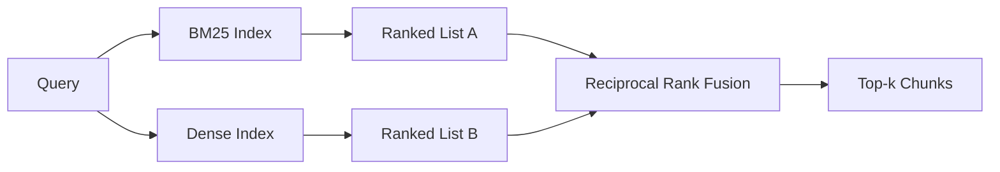

# الاسترداد الهجري مع BM25 ودمج كثيف

> الفشل في الاسترداد اللكسي والمعنى في توزيعات الاستفسارات المقابلة. لا يتداخل الاسترداد الهجري مع اندماج الترتيب المتبادل ، لكنه يصوت - والصوت يفوز في كل فئة استفسار.

**Type:** Build
**Languages:** Python
**Prerequisites:** Phase 11 lessons 04 (embeddings), 06 (RAG); Phase 19 Track B foundations (lessons 20-29); Phase 19 lesson 64 (chunking strategies)
**Time:** ~90 minutes

## أهداف التعلم
- تنفيذ BM25 من الصفح من صيغة روبرتسون وسبارك جونز ، مع وزن الحقل ، وتطبيع طول الوثائق ، ويمكن ضبط k1 و b.
- بناء محرك استرجاع كثيف فوق مزيفة تحديدية تضمين حتى الحلقة تعمل خارج الاتصال.
- تنفيذ الاندماج المتبادل للدرجة بالضبط كما نشرته كورماك وكلارك وبوتشر في عام 2009، وشرح لماذا يهيمن على التقاطع الموزن على النتائج.
- ضبط ثابت RRF k ووزن الحالة الواحدة وقراءة التداولات على جسم الجهاز الصغير.

## المشكلة

يربح البحث اللكسي عندما يحمل البحث معرفا حرفياً يحتوي الجسم على حرفي.`AbortMultipartOnFail`يعيد وظيفة Go الصحيحة عبر BM25 في ثوانٍ صغيرة. نفس الاستفسار ، مدمج ، يقع على حدود ثلاث مجموعات مماثلة ويقوم محاكم الكثافة بتصنيف الملف الخطأ أولاً.

يربح البحث الكثيف عندما يتم نقل البحث بعيداً عن رموز اللغة الفعلية في الجسم. لا يكتب المستخدم "كيف نتعامل مع عمليات تحميل تم إلغاءها" كلمة إلغاء أو متعددة الأجزاء. يعيد BM25 جزء الوثائق على "تحميل ملفات كبيرة" لأن تلك الصفحة تحتوي على كلمة تحميل. يجد استرداد الكثيف وظيفة إلغاء التي يذكر الموجز الإلغاء.

الخيار بين الاثنين ليس ثابتًا. توزيع الاستفسار هو المتغير. نظام RAG الإنتاج يتعامل مع كلا الفئات من نفس النقطة النهائية، لذلك يجب على الاسترداد التعامل مع كليهما في وقت واحد. هذا هو استرداد هجاني. خطوة الاندماج هي الجزء الذي يجب أن يكون صحيحًا.

## المفهوم



### BM25 في فقرة واحدة

يدرج BM25 زوج السؤال-وثيقة عن طريق جمع، على شروط السؤال، عامل تردد وثيقة عكسية مضاعفة مع عامل تردد الشبعية المفتاح الذي يتضمن تصحيح التطبيع الطول.`k1`يسيطر على الاكتفاء بالتيار المحدد؛ النتائج المضبوطة 1.5 هي التوصية المنشورة ولا يجب أن تتحرك دون مقياس. `b`يحدد مقدار طول الوثيقة مهمة، والحد الافتراضي 0.75 يقول أن الوثائق أطول تعاقب، ولكن ليس خطيا.

صيغة الجيش الإسرائيلي تستخدم تعريف روبرتسون و سبارك جونز المُسطح، وهو`log((N - df + 0.5) / (df + 0.5) + 1)`.المركز الإضافي داخل السجل يبقي الجيش الإيجابي عندما يظهر مصطلح في أكثر من نصف الكوربوس هذا يهم في الكوربوس الصغيرة حيث الكلمات الموقفة نادرة تقنيا.

تسمح لك الوزن الحقل بإخبار BM25 بأن المباراة على اسم الرمز تعتبر أكثر من المباراة في الجسم. التنفيذ هو مضاعف على المباراة تعتبر أثناء الإندكس ، وليس في وقت تسجيل النقاط. هذا يبقي الرياضيات متطابقة ويجنب تسجيل منفصل لكل حقل.

### الاستخدام الكثيف في فقرة واحدة

إدراج كل جزء في متجه بعمق ثابت مع نموذج إدراج. في وقت الاستفسار، إدراج الاستفسار، ترتيب كوزين لكل جزء من التشابه، وعودة أعلى-ك. النموذج هو المتغير الذي يقرر الجودة. خوارزمية الاسترداد نفسها هي خطين: نقطة المنتج والفرقة.

تستخدم هذه الدروس إضافة تحديدية تقوم على الهاش حتى تتمكن من قراءة الرياضيات الاندماجية دون دعوة شبكة. يجمع الهاش تعويضات مفتاح الرمز إلى متجه 96 بعدًا ويطبق. صفوف الكوسينات تحدد عبر الجوائز ، وهو ما يتطلبه مجموعة الاختبار.

### الاندماج المتبادل من الدرجة، الصيغة المنشورة

قائمة مرتبة. لكل مرشح يظهر في أي قائمة، قم بتجميع مساهماته المتبادلة.`1 / (k + rank)`مع k = 60 كمقياس افتراضي. ترتيب حسب النتيجة الإجمالية. هذا هو الخوارزمية بأكملها.

ثابتة k = 60 المنشورة ليست تعسفية. مع k = 60 مساهمة الرتبة 1 هي 1 / 61 والمساهمة الرتبة 10 هي 1 / 70. تسقط المساهمة ببطء حتى لا يزال المرشحون العميقون يصوتون. يجعل k الأصغر تهيمن على النتائج العليا.

هناك عقدين قابلين للتنسيق في تنفيذنا`k`ثابتة. زوج من الوزن لكل طريقة حتى تتمكن من تعزيز BM25 أو كثافة عندما يكون لديك دليل مسبق واحد أفضل على جسمك. مضاعفة مساهمة الصف بالوزن هو أسهل تنفيذ مبدأي؛ فإنه يحافظ على شكل الصف-تدهور ويبقى خالية من المقياس.

### لماذا الاندماج يفوق الاندماج الموزن

نقاط BM25 غير محدودة ومتوقفة على الجسم. تشابهات الكوزين محدودة في -1 إلى 1. مزيج خطي `alpha * bm25 + (1 - alpha) * cosine`يتطلب ضبط ألفا لكل جسم ويتوقف كل مرة تقوم فيها بإعادة الترتيب. لا يفعل التدمير القائم على الرتب. الصفيان مقارنين عبر الطرق. يضرب خط الأساس RRF المنشور من التقاط النقاط في كل مسار TREC العام منذ عام 2010.

هذه هي نفس الحجة التي تسمعها عن RankFusion vs RRF في وثائق Vespa و Weaviate. وصلوا إلى نفس الاستنتاج: البقاء على أساس الرتب ما لم يكن لديك دليل قوي جدا للتقاطع النتائج.

```figure
rrf-fusion
```

## بناءها

`code/main.py`تطبيقات:

- `tokenize(text)`-إنه رمز سريع للـ (ريجكس)
- `BM25Index`- معدل الميدان، مع `add`و`search`ويمكن ضبطها k1، b.
- `mock_embed`،`DenseIndex`- نفس التضمينات التحدّدية التي تمّ تطبيقها في الدروس 64، لذا فالأجزاء يمكن مقارنة بها.
- `rrf(rankings, k, weights)`- الاندماج المنشورة مع الوزن المتعدد الوسائط.
- `HybridRetriever`- يجمع بين BM25 و dense
- عرض عرض`main()`الذي يحمل مجموعة صغيرة من المواد، ويقوم بعمل ثلاثة استفسارات تستهدف نقاط القوة والضعف لكل مسترد، ويقوم بطبع التصنيف لكل طريقة تنتج بالإضافة إلى القائمة المدمجة.

إشغله

```bash
python3 code/main.py
```

اقرأ إصدار التجربة جنبا إلى جنب. يصل استفسار المعرف حرفي إلى BM25 رتبة 1 ، رتبة كثيفة 4 ، رتبة RRF 1. يصل استفسار المفرد إلى BM25 رتبة 6 ، رتبة كثيفة 1 ، رتبة RRF 1. يصل الاستفسار الغامض إلى BM25 رتبة 3 ، رتبة كثيفة 3 ، رتبة RRF 1.

## أضع أزرار

| Knob | Default | Move it up when | Move it down when |
|------|---------|----------------|------------------|
| BM25 k1 | 1.5 | Terms repeat in documents and you want frequency to matter more | Documents are short and term repetition is noise |
| BM25 b | 0.75 | Long documents really do say less per word | Document length is uncorrelated with topic |
| RRF k | 60 | Deep candidates should keep voting | The top-1 should dominate |
| BM25 weight | 1.0 | Your corpus contains literal identifiers and queries match them | Your queries are user-paraphrased |
| Dense weight | 1.0 | Queries are paraphrased | Queries are literal |

أجهز من خلال إعادة تشغيل دراسة 68 من القائمة التقييم على مجموعة استفساراتك المحتملة، وليس من خلال الحدس.

## أوضاع الفشل سوف تختفي الديمو

**Out-of-vocabulary tokens.**يتم حساب IDF من BM25 من الجسم، لذلك فإن العبارات فقط في الاستفسار تساهم في الصفر. الهلوسة التوابل الكثيفة متجهة لنفس المصطلح. على المعرفات خارج الجسم يعود الوسيلة الكثيفة المثيرة للصدق ولكن الجيران الخطأ. الاندماج يستوعب هذا لأن BM25 لا يعود شيئا وتسقط مساهمة الصف ، ولكن فقط إذا قمت بتخفيض النسخة عن طريق الوثيقة ، وليس عن طريق الجزء.

**Stop-token domination.**يُنتج BM25 ضد كلمة "ال" تصنيفًا موحدًا على الجسم. قم بتصفية رموز التوقف في المؤشر أو تقبل أن تعبيرات IDF عالية تهيمن بشكل طبيعي.

**Identical content across modalities.**إذا كان جسمك صغيرًا بما فيه الكفاية بحيث يكون أعلى -1 من BM25 أعلى -1 من الكثافة أيضًا ، فإن RRF يعطيك نفس أعلى -1 مع نفس الجيران. هذا سلوك صحيح ، وليس فشلًا ، لكنه يجعل الاندماج يبدو غير مرئيًا. أضف زوجًا من استفسارات معارضة في تقييمك للتحقق من أن الاندماج يعمل بالفعل.

## استخدمها

أنماط الإنتاج:

- مؤشر BM25 في عملية؛ عقدة الزجاجة هي قاموس التردد المصطلح، وليس المتجهات.
- إدراج المتجهات الكثيفة في متجر منفصل (في هذه الدروس نستخدم قائمة مسطحة؛ في الإنتاج كنت تستخدم HNSW).
- اجري كلا الاستفسارات بالتوازي، الاندماج هو دمج متواصل عبر الاتحاد.
- استمر في وضعية كل ضربة تم استردادها حتى يمكن للمستعدين أن يروا أي وضعية صوتت لها.

## أرسله

التدريب 66 يأخذ top-k المدمج من هذا الدروس ويضع في صفوفه مع جهاز تشفير. يقيّم الدروس 68 خط الأنابيب بأكمله بدقة، والذكرى، و MRR، و nDCG. هو الجهاز الهجري الذي يتم استخدامه في هذا الدروس هو المرحلة الأولى من النظام من نهاية إلى نهاية في الدروس 69.

## التمارين

1. استبدل`mock_embed`مع نموذج حقيقي من مزودك. إعادة تشغيل التجربة وتقرير كيف تغير التصنيف الكثيف فقط على استفسار المفرد.
2. إضافة طريقة ثالثة: ملخصات المكونات المفهومة بشكل منفصل ودمجها كقائمة مرتبة ثالثة. قياس المكاسب.
3. ابحث عن RRF k عبر 10, 30, 60, 100, 200. رسم منحنى recall@k من الدروس 68. إبلاغ قيمة k حيث يصل منحنى على جسمك.
4. قم بتنفيذ BM25F بشكل صحيح (تطبيع طول كل حقل بدلاً من خدعة المضاعف) ومقارنة على جسم حيث تتناسب الرمز مهمة أكثر.

## الشروط الرئيسية

| Term | What people say | What it actually means |
|------|-----------------|------------------------|
| BM25 | "Lexical search" | Probabilistic ranking with idf x saturating tf x length normalization |
| RRF | "Rank fusion" | Sum of 1 / (k + rank) across ranked lists; k = 60 default |
| k1 | "TF saturation" | Controls how fast a repeated term stops adding more score |
| b | "Length penalty" | 0 means ignore document length, 1 means full normalization |
| Field weighting | "Symbol boost" | Repeat tokens during indexing to boost matches in that field |
| Rank-based vs score-based fusion | "Why RRF beats linear" | Ranks are comparable across modalities; scores are not |

## المزيد من القراءة

- كورماك، كلارك، بويتشر، "الاندماج المتبادل للدرجة يتفوق على أساليب كوندوركيت وتعلم الدرجة الفردية"، SIGIR 2009
- روبرتسون ووكر وبولييو وكاتفورد وبيين "أوكابي في TREC-3" (ورقة BM25 الأصلية)
- [Vespa: Hybrid Retrieval with BM25 and Embeddings](https://docs.vespa.ai/en/tutorials/hybrid-search.html)
- [Weaviate: Hybrid Search](https://weaviate.io/developers/weaviate/search/hybrid)
- المرحلة 11 الدروس 06 - أساسيات المجموعة
- المرحلة 19 دروس 64 - المقطوعات التي يتم تحديدها هنا
- المرحلة 19 دروس 66 - المتعدد المتقاطع المعدل الذي يستهلك top-k المدمج
