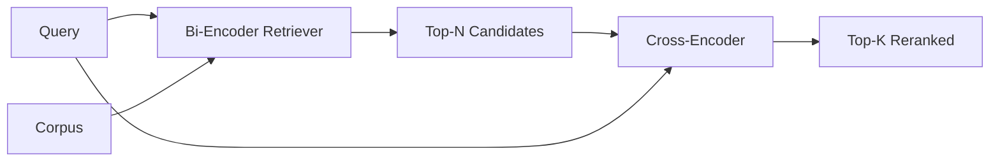

# إعادة ترتيب المرسومات المتقاطعة

> يقوم المُشفّر الثنائي بإدمج الاستفسار والوثيقة بشكل مستقل. يقوم المُشفّر المتقاطع بتجميعها ويقرأها في وقت واحد. يُعدّ المُشفّر المتقاطع أذكى قراءة وأبطأ. يُستخدم كمرحلة ثانية على أعلى المُشفّر الثنائي، وهو يدفع نفسه.

**Type:** Build
**Languages:** Python
**Prerequisites:** Phase 11 lesson 06 (RAG), Phase 11 lesson 07 (advanced RAG); Phase 19 Track B foundations (lessons 20-29); Phase 19 lesson 65 (hybrid retrieval feeding this stage)
**Time:** ~90 minutes

## أهداف التعلم
- تمييز استرداد المشفيرين من إعادة ترتيب المشفيرين عبر شكل المدخلات وعدد المعلمات وتكلفة كل استفسار.
- تنفيذ رمز عبر صغير من الصفر ككتلة تحولية تستخدم تسلسلًا معبأة (الطلب ، الوثيقة) وتصدر مستوىً واحدًا من الصلة.
- سلك خط أنابيب مرحلتين لاستعادة ثم إعادة ترتيب: استرداد أعلى N مع إعادة ترتيب رخيص، إعادة ترتيب N إلى أعلى K مع جهاز التشفير المتقاطع، عودة K.
- قياس التنازل عن التأخير مقابل الجودة على مجموعة صغيرة من الأجهزة واختيار N الصحيحة لتنظيم ميزانية التأخير المحددة.

## المشكلة

يقوم المُرمّع الثنائي بتحديد المُسألة والوثيقة في نفس المساحة المتجهة وترتبها بالكونس. لا تُرى المُرمّعتان أبداً بعضها البعض. يجب على النموذج ضغط كل شيء مفيد عن المستند إلى متجه واحد، عمياء عن المُسألة. هذا سريع - إضافة واحدة لكل وثيقة في وقت المؤشر وواحدة لكل استفسار في وقت المُسألة - وهو الطريقة الوحيدة لتصنيف على مقياس الجسم.

التكلفة هي الدقة. يمكن أن يكون لدى وثائقين لديهم نفس الموضوع العام ضمنتين متطابقة تقريباً حتى عندما يجيب أحدها على السؤال والآخر لا يجيب. لا يمكن للمرسلين المزدوج أن يفرقوا بينهما.

يقوم جهاز تشفير متعدد بحل هذا الأمر عن طريق قراءة الاستفسار والوثيقة معاً.`[query] [SEP] [document]`كسلسلة واحدة، يدير الاهتمام الكامل عبر المشترك، ويجري واحد من مقياس الصلة. كل رمز من الوثيقة يمكن أن يشارك في كل رمز من الاستفسار.

التكلفة هي التكامل. حيث يقوم المُضبط الثنائي بتضمين مرة واحدة والسؤالات إلى الأبد، يتم تشغيل المُضيف المتقاطع مرة واحدة لكل زوج (سؤال، وثيقة). بالنسبة إلى مجموعة من الوثائق التي تبلغ 10 ملايين مرسلة إلى الأمام لكل استفسار. غير قابلة للتشغيل في ميزانية الطلب.

الحل هو التنسيق. استخدم المُشفّر الثنائي لاستعادة أعلى N. استخدم المُشفّر المتقاطع لإعادة تصنيف N إلى أعلى K. N صغير (50 إلى 200) وتركز رفع جودة المُشفّر المتقاطع حيثما يهم. يبقى التأخير الإجمالي في ميزانية الطلب. الجودة الإجمالية هي جودة المُشفّر المتقاطع، التي تُحدّد من استدعاء المُشفّر الثنائي عند N.

## المفهوم



### شكل المدخل للشفرة المتقاطعة

التعبئة القياسية هي`[CLS] query_tokens [SEP] document_tokens [SEP]`. يتم إدخال خروج مركز CLS إلى رأس خطي واحد يخرج مقياس الصلة. تستخدم بعض التطبيقات المعدل المتوسط بدلا من CLS؛ والفرق صغير. النقطة هي أن النموذج ينتج رقم واحد لكل زوج.

كراس كودر 22M (المطبوعة في`ms-marco-MiniLM-L-6-v2`فئة الوزن) هو نقطة الإنتاج النموذجية. النماذج الصغيرة تفقد الجودة أسرع من أنها توفر التخفيف. النماذج الكبيرة (مثل `bge-reranker-v2-m3`في 568M المعلمات) يحتفظون لإعادة التصنيف خارج الاتصال أو لإعادة التصنيف في الصفحة الأولى حيث K صغير.

### لماذا هذا الدروس تدرب واحد صغير

إنّ المُشفّر المتقاطع الحقيقي هو محول مُشفّرٍ مُحَلَّق. في الإنتاج تقوم بتحميل نقطة تفتيش وتشغيلها. في هذه الدروس الهدف هو أن تُظهر لك شكل النموذج وشكل منحنى جودة التأخير، وليس لتدريب محكمٍ متطور. لذلك نبنيّ قاعدة صغيرة`nn.Module`مع كتلة محول واحدة، والاهتمام متعدد الرؤوس (4 الرؤوس الافتراضي) ، ورؤوس رجعة واحدة. يتم تشغيلها بشكل تحديدي من بذرة بحيث يكون التجربة قابلاً للتكرار دون أوزان على القرص.

يتعلم نموذج اللعبة الشكل الصحيح من مجموعة الأدوات: أزواج السؤال الوثيقة ذات الصلة لديها درجات متوقعة أعلى من الأزواج غير ذات الصلة. يرتبط خط الأنابيب من النهاية إلى النهاية بمخرج المصفوفين الثنائي ويتواصل أعلى صفوف المصفوفات مع علامات الذهب.

### التأخير مقابل الجودة

خط الأنابيب المكون من مرحلتين لديه واحد قابل للتنسيق: N. مسح N من 5 إلى 100 على مجموعة استفسارات مدفوعة وتحصل على منحنى.

| N | Recall@1 of stage 2 | Cross-encoder forward passes per query | Latency |
|---|--------------------|---------------------------------------|---------|
| 5 | 0.62 | 5 | low |
| 20 | 0.81 | 20 | medium |
| 50 | 0.86 | 50 | high |
| 100 | 0.86 | 100 | very high |

الأرقام أعلاه تُوضح الشكل، وليس القياسات من هذا المُصَلِّح. الشكل حقيقي. هناك دائماً ركبة حول 20 إلى 50 مرشح حيث يُشبع رفع الترتيب. بعد الركبة أنت تدفع مقابل أي شيء.

اختر N من منحنى التقييم زائد ميزانية التخفيف. لا يمكن لـ cross-encoder رفع التذكر فوق التذكر الثنائي في N، لذلك N منخفضة حد الجودة، وليس فقط التخفيف.

```figure
rerank-funnel
```

## بناءها

`code/main.py`تطبيقات:

- `CrossEncoder`- صغير`torch.nn.Module`: إضافة رمزية، كتلة تحويل واحدة مع الاهتمام متعدد الرؤوس والرؤوس المقدمة، المتوسط المجمعة تنتج واحد مستوى.
- `tokenize_pair(query, document)`- يجمع السطرين في تسلسل واحد من أرقام الهوية مع أرقام الهوية التي تميز الحد، تحديدية و stdlib.
- `train_tiny(pairs)`- تمرير واحد من التدريبات المراقبة على قائمة ثلاثية معلقة يدوياً (الطلب، الوثيقة، الصلة) ، بحيث ينتج النموذج نقاط معقولة على المعدة.
- `rerank(query, candidates, top_k)`-تواصل الإنتاج
- `pipeline(query, retriever, top_n, top_k)`-تدفق المراحل الثنائية
- عرض عرض`main()`الذي يحمل الجسم من نمط الدروس 65، يستعيد أعلى N، رينكس إلى أعلى K، طباعة كل من القوائم جنبا إلى جنب، وتقرير تأخر كل مرحلة.

إشغله

```bash
python3 code/main.py
```

يظهر الخروج أعلى N للمؤلفة الثنائية ، أعلى K للمؤلفة المتقاطعة ، وموجب التوقيت. يستغرق المؤلفة المتقاطعة وقت أطول لكل مكالمة ولكن لا تعمل على الجسم الكامل. يبقى إجمالي المراحل الثنائية داخل ميزانية الطلب أثناء اختيار الإجابة التي احتلت المؤلفة الثنائية المرتبة الثانية أو الثالثة.

## أوضاع الفشل سوف تختفي الديمو

**Cross-encoder is not symmetric.** `rerank(q, d)`و`rerank(d, q)`دائماً إطعام السؤال أولاً، إذا قمت بتبادل الخطة، فإن التذكير ينهار.

**N is too low to expose the bug.**إذا قمت بتعيين N = K، لا يمكن لـ (المنعطف) إعادة ترتيب، فإنه فقط يمكن إعادة الوزن. المصعد يبدو صفر. اختر N على الأقل ثلاث مرات K.

**Training data leaks into the eval.**إذا كانت أزواج التدريب المُشعَّرَة يدوياً تضم استفسارات التقييم، فإنّ إعادة التصنيف تبدو سحرية.

**Production weights are dense.**إن مُشفّر عبر 22M هو 88MB في float32. قم بتخطيط ذاكرة الخادم النموذجي قبل أن تعد sub-100ms p95.

**Batching matters.**إنّ جهاز تشفير متقاطع حقيقي يستخدم مرشحي N في مجموعة واحدة.`_batch_encode`، الذي يبني الـ " id " المكتوب و الـ " id " الـ " tensor " مع`torch.tensor(...)`و يُجري مرّة واحدة إلى الأمام، و يُجري تخطيّة المجموعات و يُضاعف التأخير بـ N

## استخدمها

أنماط الإنتاج:

- ضبط المُشفّر الثنائي، المُشفّر المتقاطع، و N معاً، تغيير أيّ واحد يُبطل التقييم.
- تخزين إصدار المرتبة المُجددة بواسطة (سؤال، سند_هش). نفس السؤال ضد جسم مستقر يرتبط بنفس الترتيب؛ إصدارات الاحتفاظ بالمرتبة المُقدمة تُشتري لك خفضًا مجانيًا للتخفيف.
- سجل درجة 1 درجة التشفير المتقاطع. استفسار الذي يكون درجة 1 الأولى أقل من عتبة محددة للجسم هو ضرب خارج النطاق؛ سجل ذلك إلى ماجستير في العلوم ك"أنا لست واثقا".

## أرسله

دراسة 68 تقييم هذا خط الأنابيب المكون من مرحلتين من نهاية إلى نهاية. دراسة 69 تدير هذا المعدل الخارجي خلف الجهاز الهجري من الدروس 65 وقبل مولد الإجابة.

## التمارين

1. مسح N من 5 إلى 50 وخط recall@1 من الناتج المعدل. العثور على الركبة على هذا العرض.
2. قم بتدريب المُشفّر المتقاطع لـ 10 حقول بدلاً من واحدة، وقاس هامش النتيجة بين الأزواج الإيجابيّة والسلبيّة في كل حقول.
3. استبدل المعدل المشترك بالرأس المشاركة بالرمز CLS. مقارنة التقارب على هذا العرض.
4. إضافة رأس كروس كودر ثان يتنبأ بالثنائي "هذه الإجابة في الوثيقة" علامة. استخدم كلا الرؤوس عند الاستنتاج؛ واحد لتصنيف، واحد إلى العد.
5. استبدل المُحاكِم الثنائي المُحاكم المُحاكم المُحاكم بالمُحاكم المُحاكم من الدروس 65 وتسلسل المراحل. قيّم التغيير في المُحاكم الثنائية بمُحاكمها وحدها.

## الشروط الرئيسية

| Term | What people say | What it actually means |
|------|-----------------|------------------------|
| Bi-encoder | "Vector retriever" | Encodes query and doc independently; cosine ranks them |
| Cross-encoder | "Reranker" | Encodes (query, doc) jointly; outputs one relevance scalar |
| Two-stage pipeline | "Retrieve and rerank" | Cheap retriever returns N, expensive reranker keeps K |
| N (candidate budget) | "Rerank pool" | The number of candidates the cross-encoder scores per query |
| Mean-pooling head | "Mean of last hidden" | Average the encoder's last-layer outputs into one vector |

## المزيد من القراءة

- نوغويرا، تشو، "إعادة ترتيب الممر مع BERT"، 2019 - ورقة تصنيف المترجمات المتقاطعة القنوني
- ريمرز، غوريفيخ، "Sentence-BERT: جملة تضمين باستخدام شبكات BERT السيامية"، 2019 - على المشفّرات الثنائية مقابل المشفّرات المتقاطعة
- [SentenceTransformers Cross-Encoders documentation](https://www.sbert.net/examples/applications/cross-encoder/README.html)
- [BGE Reranker v2 model card](https://huggingface.co/BAAI/bge-reranker-v2-m3)
- المرحلة 19 الدروس 65 - الـ (هيبريد ريتريفر) الذي يغذى هذه المرحلة من إعادة التصنيف
- المرحلة 19 الدروس 68 - تقييم الذي يقيس الرفع هذا الترتيب
