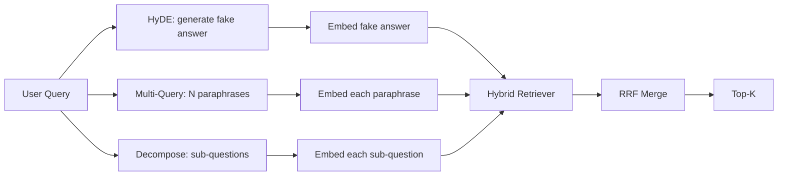

# إعادة كتابة الأسئلة: HyDE، Multi-Query، و Decomposition

> لا يُرجع البحث الذي يكتب به المستخدم البحث الذي يريده المستخدم. إعادة الكتابة تعطي الفجوة قبل الاستعراض، لذلك يرى المؤشر شيئاً أقرب إلى ما يبدو عليه الإجابة.

**Type:** Build
**Languages:** Python
**Prerequisites:** Phase 11 lessons 04 (embeddings), 06 (RAG); Phase 19 Track B foundations (lessons 20-29); Phase 19 lessons 64 and 65
**Time:** ~90 minutes

## أهداف التعلم
- تنفيذ إرسال وثائق افتراضية (HyDE): إنشاء إجابة مزيفة، إرسالها، استرداد ضد ذلك المتجه بدلا من متجه السؤال.
- تنفيذ توسيع متعدد الاستفسارات: إعادة كتابة استفسار واحد إلى N المقاطع، استرداد مع كل واحد، دمج الاتحاد عن طريق التضميد المتبادل للدرجة.
- تنفيذ تفكيك الاستفسار: تقسيم سؤال معقد إلى أسئلة فرعية، استرداد لكل أسئلة فرعية، دمج.
- مقارنة ثلاثة أعداد من الكتابة رأسا على رأس على جهاز و اشرح متى كل استراتيجية تفوز.
- سلكة LLM مزيفة التي تنتج تحديد، على المثبتات الخروج حتى حلقة إعادة الكتابة تعمل خارج الاتصال.

## المشكلة

يكتب مستخدم "ماذا يفعل فريقنا عندما تفشل تحميلات الملفات وتختفي الميزانية؟". يحتوي الجسم على وثيقة تقول "إجهاض MultipartOnFail إجهاض تحميل متعدد الأجزاء S3 في الطيران وتقلص من ميزانية إعادة المحاولة لكل سطل عندما يفشل التحميل". لا يشترك السؤال والوثيقة في عبارة اسمية. (بي إم 25) تفشل يضع المُشفّر الثنائي المستند في المرتبة الثالثة أو الرابعة لأنّ متجه الاستفسار يقع في منطقة من مساحة الإدراج التي تفضل الوثيقة حول الوظائف المحلّة، وليس الوثيقة حول عمليات الترقية المُقطّعة. يمكن أن ينقذ الإجابة من المرحلة الثانية من الدروس 66 إذا كانت في أعلى N، ولكن إذا لم تصل حتى إلى أعلى N، فإن المرتبة المعدلة لا ترى أبدا.

الحل هو إعادة كتابة الاستفسار قبل أن يلمس الجهاز أعلنت ورقة 2023 "التحقيق الدقيق في الصفر الصارخ الكثيف دون علامات الصلة" (Gao et al.) HyDE: اطلب من ماجستير في مجال التعليمات العليا كتابة الوثيقة التي ستجيب على السؤال ، وإدمج هذا الوثيقة الافتراضية ، واستخدام إدمجها كمتجهة الاسترداد. الوثيقة المفترضة تقع في المنطقة اليمنى من مساحة الإدراج لأنه مكتوب بصوت الجسم. متجه الاستفسار لم يفعل.

تقنيتين قريبتين تتزامن مع HyDE. توسيع الاستفسارات المتعددة (المصطلح الذي استخدمه Microsoft's GraphRAG) يخلق N من المقاطع من الاستفسار ويسترد مع كل واحد، ثم يدمج. تقسيم التفكيك (المعروف باسم "تفكيك الاستهداف" في عمل ستانفورد DSPy لعام 2024) تقسيم "ما الذي يقوم به فريقنا عندما تفشل الترقيمات والميزانية قد اختفت" إلى سؤالين: "ما الذي يحدث عندما تفشل الترقيم" و "ما الذي يحدث عندما تختفي ميزانية المحاولة المجددة". اثنين من الاستعراضات، نتيجة واحدة دمج، كلتا قطعتين من الإجابة قابلة.

هذا الدرس يطبق كل ثلاثة ويقوم بتشغيلهم ضد نفس الجهاز المثبت.

## المفهوم



### (هيدي) بالتفصيل

يبدل HyDE متجه استفسار المستخدم متجهًا افتراضيًا للوثائق مكتوبًا في LLM.

```
You are a domain expert. Write a one-paragraph passage that answers the question
below. Use the same vocabulary and phrasing the documentation in this domain would
use. Do not refuse. Do not say you do not know.

Question: {user_query}

Passage:
```

إجابة الماجستير في القانون خاطئة كجواب واقعي لأن الماجستير في القانون لا يعرف جسمك. هذا جيد لا يهتم المُستعيد بالصواب الفعلي، فقط بالتوزيع الرمزي. المقطع الافتراضي يحتوي على الكلمات "الإجهاض"، "العديد الأجزاء"، "المدفأة"، "الميزانية"، لأن هذا ما ستقول منه المقطع الوثائقي حول هذا الموضوع. ضع هذا الممر المتجه يقترب من الممر الحقيقي

في الإنتاج، تُحدد الوثيقة الافتراضية إلى جملتين أو ثلاث جملات. الأفتراضات الطويلة تجمع المزيد من الضوضاء. الأفتراضات القصيرة تفقد الإشارة الكسرية التي تحتاجها HyDE.

### التوسع المتعدد من الاستفسارات بالتفصيل

إنشاء N المقاطع من استفسار المستخدم. أسهل طلب:

```
Rewrite the following question in {N} different ways. Each rewrite must preserve
the original intent. Number them 1 to {N}. Do not add explanations.
```

استعاد أعلى ك لكل إفصاح. دمج القوائم المرتبة N مع RRF (الخوارزمية نفسها من الدروس 65). رخيص، متوازي، تحديد.

يفوز الاستفسار المتعدد عندما تكون صياغة المستخدم واحدة من العديد من الطرق الصحيحة على حد سواء لطرح السؤال، وأي من إعادة الكتابة كان سيطرحها بشكل أفضل. يخسر عندما تكون جميع إعادة الكتابة سيئة على حد سواء لأن الأصلية كانت سيئة بنفس الطريقة.

### التفكك بالتفصيل

لا يمكن استرداد واحد أن يلبي سؤال متعدد الأوجه. يطلب التفكك من ماجستير القانون أن يقسّم السؤال إلى أسئلة فرعية والنظام يسترد لكل أسئلة فرعية.

```
The following question may require information from multiple distinct topics.
Decompose it into a list of sub-questions. Each sub-question must be answerable
independently. If the question is already atomic, return it unchanged.

Question: {user_query}
```

استرداد لكل سؤال فرعي. دمج. التفكك هو الأداة المناسبة للأسئلة التي تحتوي على تركيبات، أو مقارنات متعددة النقاط، أو موضوعين غير مرتبطة. أداة خاطئة للأسئلة الذرية؛ وظيفة المفكك هناك هي إعادة السؤال الواحد وليس اختراع أسئلة فرعية مزيفة.

### لماذا كل الثلاثة موجودة

هذه الثلاثة متكاملة. يُكسر HyDE الفجوة بين البحث والجسم. تغطي البحث المتعدد اختلافات المقاطع. تغطي التفكك البحث المتعدد المواضيع. يدير نظام إنتاج كل ثلاثة وتختار الاستراتيجية لكل سؤال (يظهر النظام النهائي للآخر في الدروس 69 المختار).

## ماجستير في مجال حقوق الإنسان المزيف

يتم تشغيل الدروس دون اتصال. هي جدول بحث صغير يتم وضعها على مفتاح استفسار المستخدم ، بالإضافة إلى عكس استفسارات لم يرها. تحتوي جدول البحث على:

- لكل استفسار: مقطع افتراضي مكتوب، ثلاث مقاطع، و تدمير.
- لبحث مجهول: تحويل تحديدي: خذ كلمات محتوى البحث، ووسعها من خلال خريطة متجانسة، وعاد النتيجة.

شكل المزيّف هو ما يهمّ، وليس البيانات في الإنتاج تبدل المزيّف على مكالمة نموذجية حقيقية

```figure
cd-hyde-vector
```

## بناءها

`code/main.py`تطبيقات:

- `MockLLM`- التغييرات المحددة الموصوفة أعلاه.
- `HyDERewriter`- يدعو الجامعة القانونية إلى كتابة الوثيقة الافتراضية، يعيد إصدار إعادة الكتابة على شكل `RewriteResult`مع النص الافتراضي والسؤال الذي يجب أن يستخدمه المتسجل
- `MultiQueryRewriter`- يطلب من ماجستير القانون "N" ويرجع قائمة بالسؤال
- `DecomposeRewriter`- يطلب من ماجستير القانون أن يتحلل، يعيد الأسئلة الفرعية.
- `retrieve_with_rewriter`- يأخذ إعادة كتابة و إعادة كتابة، يدير إعادة كتابة، يدمج النتائج.
- عرض عرض يدير ثلاث إعادة الكتابة على جهاز ثابت ويطبع استراتيجية أعادت وثيقة الرد الذهبية أولاً.

يتم إعادة استخدام شكل الردع من الدروس 65 (BM25 + مواتية هجينة). الاندماج هو نفس RRF. الشكل الجديد الوحيد هو واجهة إعادة الكتابة ، والتي هي صغيرة.

إشغله

```bash
python3 code/main.py
```

الناتج هو ترتيب لكل استراتيجية وموجز نهائي. يفوز HyDE على استفسار التعبير غير المماثل. يفوز الاستفسار متعدد على استفسار التفردز. يفوز التفكيك على استفسار متعدد الموضوعات. يفقد الفشل (لا إعادة كتابة) على الأقل واحد من الثلاثة.

## أوضاع الفشل سوف تختفي الديمو

**HyDE hallucinates corpus-specific identifiers wrong.**يختلق النموذج اسمًا للعمل. تسقط درجة BM25 المفترضة على الوثيقة اليمنى لأن الاسم المختلع الآن رمز ذو وزن كبير لا يظهر في المؤشر. حد طول المفترض وزنه BM25 أقل في الاندماج.

**Multi-query rewrites all converge.**النموذج الضعيف ينتج ثلاث عبارات متطابقة تقريبًا. تسترد عمليات استرداد N نفس العلوي-k. لا يفضل مزيج RRF من استرداد واحد. أضف تعليمة تنوع صريحة إلى طلب إعادة الكتابة وتكتشف النسخ المزدوجة من قبل جاكارد.

**Decomposition over-splits.**يقوم المتحلل بتحويل سؤال ذري إلى قائمة. جميع عمليات الاسترداد تعيد نفس الوثيقة ولكن مع مرتبة منخفضة. الاندماج أسوأ من الأصلي. اكتشاف هذا مع "هل هذه الأسئلة الفرعية متميزة بما فيه الكفاية" قبل التميز.

**Latency multiplies.**تكلف HyDE مكالمة LLM واحدة. تكلفة الاستفسار المتعدد مكالمة LLM واحدة لتوليد N إعادة الكتابة، ثم N استرداد. تكلفة التفكك مكالمة LLM واحدة للتفكك، ثم M استرداد. تستمر الاسترداد على قدم المساواة؛ مكالمة LLM هي الأرض.

## استخدمها

أنماط الإنتاج:

- اختيار الاستراتيجية لكل استفسار حسب طول الاستفسار: استفسارات قصيرة الذرية تحصل على استفسارات متعددة، استفسارات معقدة متعددة النقاط تحصل على التفكك، استفسارات جرغون ثقيلة تحصل على HyDE.
- تخفي خروج إعادة الكتابة بواسطة hash استفسار. العديد من الاستفسارات تتكرر.
- إدارة كل ثلاثة بالتوازي ودمج مجموعات النتائج الثلاثة في واحدة مع RRF. التكلفة ثلاثة دعوات LLM ودمج واحد؛ الجودة هي اتحاد تغطية كل الاستراتيجيات الثلاث.

## أرسله

الدروس 69 تعيد خطة إعادة الكتابة هذه قبل الردع من الدروس 65 والردع من الدروس 66. الدروس 68 تقييم الرفع إعادة الكتابة يضيف إلى استرداد التذكر.

## التمارين

1. تنفيذ RAG-Fusion (مختلفة 2024 من الاستفسار المتعدد) حيث تكون عبارات المُرجع المتعددة عمداً، ثم تقوم خطوة إعادة التصنيف (المدرسة 66) باختيار القائمة النهائية.
2. إضافة استراتيجية رابعة: التدقيق الخلفي (اسأل الجامعة للأسئلة الأكثر عامة، استرجع على ذلك، ثم ضيق). مقارنة على العد.
3. تدريب المفكّر على التعرف على الأسئلة الذرية عن طريق إضافة رأس "هل السؤال الذري" وقياس معدل الانقسام المفرط قبل وبعد ذلك.
4. استبدل الجامعة المزيفة بمثابة مكالمة نموذجية حقيقية، وقاس تأخير كل استراتيجية على كومة
5. إضافة درجة ثقة لكل إعادة كتابة، إسقاط إعادة كتابة أسفل الحد الأدنى، قياس تأثير التذكير.

## الشروط الرئيسية

| Term | What people say | What it actually means |
|------|-----------------|------------------------|
| HyDE | "Fake-document retrieval" | LLM writes the answer; embed and retrieve on that instead of the query |
| Multi-query | "Paraphrase expansion" | N rewrites of the query; retrieve N times, merge by RRF |
| Decomposition | "Subquery split" | Multi-topic queries split into sub-questions, retrieved separately |
| Atomic query | "Single-topic" | Cannot be decomposed without inventing fake sub-questions |
| Step-back | "Abstract the query" | Ask the more general question, retrieve, then narrow |

## المزيد من القراءة

- غاو، ما، لين، كالان، "الانتشارا الكثيف الدقيق صفر-شرطة دون علامات الصلة" (HyDE) ، 2023
- بحث مايكروسوفت، "التوسع متعدد الأسئلة لاسترداد"
- ستانفورد DSPy، "تفكيك السؤال الخاص بـ"ملي هوب QA"
- [LlamaIndex query transformations documentation](https://docs.llamaindex.ai/en/stable/optimizing/advanced_retrieval/query_transformations/)
- المرحلة 11 الدروس 07 - أنماط RAG المتقدمة
- المرحلة 19 الدروس 65 - الردّ هذا الرائد يطعم
- المرحلة 19 الدروس 68 - تقييم الذي يقيس رفع إعادة الكتابة
