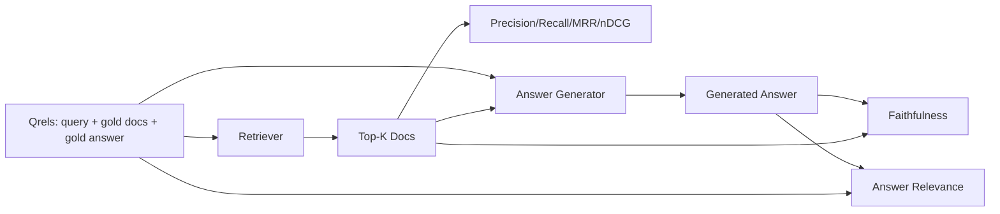

# تقييم RAG: دقة، تذكر، MRR، nDCG، الولاء، أهمية الإجابة

> إذا لم تتمكن من تصنيف استردادك وجوابك في نفس الوقت، لا يمكنك شحن النظام. لا تكون المقاييسين نفسها وتفشل نفس الإشارة على محور مختلفة.

**Type:** Build
**Languages:** Python
**Prerequisites:** Phase 11 lessons 06 (RAG), 10 (evaluation); Phase 19 Track B foundations (lessons 20-29); Phase 19 lessons 64, 65, 66, 67
**Time:** ~90 minutes

## أهداف التعلم
- احسب أربعة مقاييس استرداد من قروض الذهب: precision@k، recall@k، MRR (معدل الرتب المتبادلة) ، و nDCG@k.
- قم بحساب مقاييس درجة الإجابة: الوفاء (كل ادعاء يستند إلى السياق الذي تم استرداده) وصلة الإجابة (الرد يُجيب على السؤال).
- قم ببناء ملف Qrels ثابت (الأسئلة، وثائق الهوية الذهبية، النص الذهبية للرد) الذي يقرأ تقييم نهاية إلى نهاية.
- اقرأ القيم المقاييسية لتشخيص أين تنفشل خط الأنابيب: الاسترداد أو التصنيف أو التوليد أو التأريخ.

## المشكلة

نظام RAG لديه أربعة أجزاء تحركية على الأقل: chunker، retriever، reranker، مولد. أي من هذه الأجزاء يمكن أن تكون سبب إجابة خاطئة. بدون قياسات لكل مرحلة أنت تطير عمياء.

يبلغ المستخدم عن إجابة خاطئة. هل هو لأن الكمبيوتر قطع فترة الإجابة؟ هل هو لأن الردف لم يضمن الكمبيوتر الجزء في أعلى-ك؟ هل هو لأن المعدل دفع الجزء اليمنى الماضي الموقف الأول؟ هل هو لأن المولد تجاهل الجزء واختلق شيئا؟ لا يمكنك معرفة من الإجابة وحدها. تحتاج:

- مقاييس الاسترداد لتقييم ما خرج من الجهاز
- ترتيب المقاييس إلى الدرجة حيث كان الجزء الصحيح في الترتيب.
- الوفاء لتقييم ما إذا كان المولد بقيت داخل السياق المسترد.
- الإجابة ذات صلة لدرجة ما إذا كان الإجابة تناول السؤال على الإطلاق.

هذه الدروس تبني كل الستة على أعلى ملف Qrels ثابت. التقييم غير متصل بالإنترنت ومتحدد؛ في الإنتاج يمكنك تبادل LLM المزيفة كقاضي واحد حقيقي.

## المفهوم



### Precision@k

من الوثائق العليا التي أعادتها المسترد ، ما هي الجزء الكبير في مجموعة الذهب؟ إذا كان الذهب لديه ثلاثة وثائق و 3 أعاد اثنين منها و واحد خاطئ ، الدقة@ 3 هو 2 / 3. استخدم الدقة عندما تكون تكلفة قطعة غير ذات صلة استعادت مرتفعة (الجهاز توليد الرمز على ذلك ، أو الجزء يسمم الجواب).

### التذكير

من الوثائق الذهبية، ما هي الفصل العلوي في الـ k؟ إذا كان الذهب لديه ثلاث وثائق ويتضمن الخامسة الأولى الثلاثة، recall@5 هو 1.0. استخدم التذكر عندما تكون تكلفة الإجابة المفقودة مرتفعة (يفضل أن ترى جزءًا واحدًا غير صحيحًا إضافيًا من تفوت جزء الإجابة بالكامل).

في الإنتاج RAG المقياسية الناس عادة ما يقتبس هو recall@k. الجيل يمكن أن تسقط قطع غير ذات صلة بسهولة؛ فإنه لا يمكن أن يخترع إجابة من قطعة لم يرى.

### (متوسط الدرجة المتبادلة)

لكل استفسار، ابحث عن موقع أول وثيقة ذات صلة في القائمة المرتبة. الرتبة المتبادلة هي 1 / موقع. متوسط عبر مجموعة الاستفسار. MRR هو ملخص واحد من الأرقام حول كيفية وضع المستخدم أفضل إجابة في الأعلى.

يزن MRR الموقف 1 بشكل كبير. استفسار حيث يقع الوثيقة الذهبية في المرتبة 1 يساهم في 1.0. يساهم المرتبة 2 في 0.5. يساهم المرتبة 10 في 0.1. تهيمن المقاييس على أعلى القائمة.

### nDCG@k

الميزانية المجموعة المخصومة المعايضة. تعطي الصيغة الكاملة مكاسب لكل وثيقة تم استردادها (غالباً ما 1 بالنسبة للذات أهمية ، 0 بالنسبة لغيرها) ، والخصومات من خلال سجل الموقف ، والكميات ، والقسمات من خلال DCG المثالي (الDCG الذي سيكون لديك إذا كنت تصنف بشكل مثالي).

nDCG يستوعب الصلة المحددة: يمكن للذهب أن يقول "doc A هو 3 ، doc B هو 2 ، doc C هو 1". MRR و recall@k يسطحون كل شيء إلى ثنائي. استخدم nDCG عندما يكون في الجسم العديد من الوثائق ذات الصلة جزئيًا لكل استفسار.

### الوفاء

لكل مطالبة في الإجابة المولدة، تحقق ما إذا كانت المطالبة مدعومة بالسياق المسترد. يستخدم التنفيذ القياسي عرض LLM-as-judge الذي يأخذ (المطالبة، السياق) ويرد نعم أو لا. المقياس هو جزء من المطالبات التي تمت.

الوفاء يلتقط وضع فشل المولد حيث يختلق النموذج المحتوى. حتى لو عاد المخرج إلى قطع الصحيحة، يتم كسر المولد الذي يوحي.

هذه الدروس تنفذ الولاء مع قاضي مزيف تحديدي الذي يُحقق من ما إذا كانت رموز كل مطالبة تتداخل مع السياق المُسترد من قبل عتبة. في الإنتاج تقوم بتبادل إلى دعوة نموذجية حقيقية. شكل المقياس هو نفسه.

### أهمية الإجابة

هل الإجابة تُجاوب السؤال فعلاً؟ يسأل النزاهة "هل الجواب مُعتمد على السياق؟" يسأل النزاهة الإجابة "هل الجواب مُعتمد على السؤال؟" يجوز للجواب الموثوق ولكن غير المفروض أن يكون عالياً في الوفاء والنسبة. الجواب القصير والنسبي الذي يتجاهل السياق يُجازى عالياً في الصلة والنسبة.

يستخدم التنفيذ القياسي أيضاً LLM-as-judge: take (سؤال، إجابة) والسؤال ما إذا كان الإجابة تلبي السؤال.

## الجهاز

```python
{
  "qid": "q1",
  "query": "what is the abort threshold for multipart uploads",
  "gold_doc_ids": ["d1", "d3"],
  "gold_answer_substring": "three failed parts",
  "graded_relevance": {"d1": 3, "d3": 2},
}
```

كل استفسار يحمل:
- سلسلة الاستفسار
- مجموعة من أوراق الوثائق الذهبية (للمزيد من الدقة / التذكر / MRR)
- إشارة ذات صلة (لـ nDCG)
- السلك الذهبي للرد (يحفظ كمتطالعات مرجعية على كل قريل؛ يتم حساب الوفاء في هذا الدروس عن طريق الحكم على المطالبات المستخرجة على السياق المسترد ، وليس على هذا السلك الفرعي).

في الإنتاج تضع علامة على هذه، هذه الدروس ترسل جهازًا مصنوعًا يدويًا حتى ينفذ التقييم من الصندوق.

```figure
ci-rag-metric-ladder
```

## بناءها

`code/main.py`تطبيقات:

- `precision_at_k(retrieved, gold, k)`- التعريف الحرفي
- `recall_at_k(retrieved, gold, k)`- التعريف الحرفي
- `mean_reciprocal_rank(retrieved_list_of_lists, gold_list)`-المتوسطة حول الأسئلة
- `ndcg_at_k(retrieved, graded_relevance, k)`- DCG / IDCG مع مكاسب ثنائية أو معدلة.
- `extract_claims(answer)`- يقسّم الإجابة إلى ادعاءات على شكل جملة
- `faithfulness(claims, context_texts, judge)`- جزء من المطالبات التي تم إدراكها معتمدة.
- `answer_relevance(question, answer, judge)`- تقرر ما إذا كان الإجابة تُجاوب السؤال.
- `MockJudge`-حكم التداخل بين الشكوكات الحتمية حتى يتم تشغيل التقييم خارج الاتصال
- `evaluate_pipeline(pipeline_fn, qrels, ks)`-الموسيقي الذي يدير كل متري
- عرض تجريبي يستخدم ثلاثة أنواع من خط الأنابيب (خط أساسي من المواد، استرداد الهجينة، الهجينة + إعادة التصنيف) ضد القواعد ويقوم بطبع جدول المقاييس.

إشغله

```bash
python3 code/main.py
```

تظهر الخروج precision@k، recall@k، MRR، nDCG@k، الولاء، والسوابية لكل فارقة في جدول واحد للمقاييس. صف الاسترداد الهجري يفوق خط الأساس في التذكر. صف تعديل الفئة يفوق الهجري على MRR.

## قراءة المقاييس لتشخيص الفشل

| Symptom | Likely cause | What to fix |
|---------|-------------|-------------|
| Low recall@k, low precision@k | Chunker cut the answer or retriever cannot find it | Chunker boundaries (lesson 64) or retriever modality (lesson 65) |
| Decent recall@k, low MRR | Right chunk is in top-k but not at position 1 | Reranker (lesson 66) |
| High MRR, low faithfulness | Generator invents content despite right context | Generation prompt; force-cite-or-refuse |
| High faithfulness, low relevance | Answer is grounded but off-topic | Query rewriter (lesson 67) or generation prompt |
| All four high, users still complain | Eval set is unrepresentative | Expand qrels with real user queries |

## أوضاع الفشل سوف تختفي الديمو

**LLM-as-judge bias.**النموذج يحكم على نتائجه الخاصة بأنها أكثر ولاءً مما هي عليه استخدم عائلة نموذجية مختلفة للقاضي من مولد أو تصنيف عينة يدوياً

**Qrels rot.**الجوابات الذهبية تتحرك مع تغيرات الجسم. وثيقة كانت الذهب ل Q1 في يناير 2024 لم تعد الجواب الصحيح في أكتوبر 2024 لأن الفريق قام بإعادة تسمية الوظيفة. جدولة مراجعة ربع سنوي قريل.

**Faithfulness micro-checks miss macro-claims.**يمكن أن يمر الوفاء بالجملة بينما يضلل بنية الإجابة العامة. أضف مراجعة نوعية على مستوى العينة فوق المقياس الآلي.

**Recall@k masks per-query failures.**يمكن أن تخفي متوسط استدعاء 90% أن فئة استفسار واحدة تفوت دائمًا. قم بتقسيم القواعد حسب فئة الاستفسار (حرفيًا ، مقبسًا ، متعدد الموضوعات) وتقديم تقرير لكل قطعة.

## استخدمها

أنماط الإنتاج:

- قم بإجراء تقييم على كل تغيير في الجهاز أو المولد. تعامل رجعة التذكر @ k مثل فشل الاختبار.
- إثبات البحث عن البيانات المترتبة لكل استفسار. عندما يشكو المستخدم، ابحث عن إدخال qrels الذي يطابقها ومعرفة ما إذا كان قد تم القبض عليه.
- تدرج القواعد: مجموعة دخان من 20 استفسار يتم تشغيله في CI؛ مجموعة رجعة من 200 يتم تشغيله كل ليلة؛ مجموعة عميقة من 2000 يتم تشغيله كل أسبوع.

## أرسله

الدروس 69 تشغيل خط الأنابيب بأكمله (المركز، الجهاز الاستعلامي، الجهاز المعدل، المولد) وتشغيل هذا التقييم ضد النظام من نهاية إلى نهاية.

## التمارين

1. أضف مقياسًا خامسًا للحصول على النتائج: hit-rate@k. قارنه مع recall@k. شرح متى تختلف.
2. تنفيذ نسبة وفاء: 0 (غير مدعوم) ، 1 (دعم جزئي) ، 2 (دعم كامل). قم بتحديث المقياس وفقا لذلك.
3. استبدل قاضي المزيّف بمكالمة نموذجية حقيقية، وقاس خلافات بين المزيّف والقاضي الحقيقي على المُثبت.
4. إضافة شريحة من فئة الاستفسار ("حرفيا"، "مفارقة"، "مجموعة من المواضيع"). تقرير المقاييس لكل شريحة.
5. أضف مقياس "طول الإجابة" وتربطه بالصدق.

## الشروط الرئيسية

| Term | What people say | What it actually means |
|------|-----------------|------------------------|
| Precision@k | "Hit rate over retrieved" | Fraction of top-k that are gold |
| Recall@k | "Hit rate over gold" | Fraction of gold in top-k |
| MRR | "First-hit position" | Mean of 1 / rank of first relevant document |
| nDCG@k | "Graded ranking quality" | DCG over the top-k divided by ideal DCG |
| Faithfulness | "Groundedness" | Fraction of answer claims supported by retrieved context |
| Answer relevance | "Did it address the question?" | Whether the answer matches the question's intent |
| Qrels | "Gold labels" | The labeled set of queries and their gold documents and answers |

## المزيد من القراءة

- باكلي، فورهيز، "تقييم استقرار تدابير التقييم"، SIGIR 2000 - ورقة قائمة حول قياسات التصنيف
- جارفيلين، كيكالينين، "تقييم تقنيات IR على أساس المكاسب المتراكمة" - ورقة nDCG
- [Ragas: Automated Evaluation of RAG Pipelines](https://docs.ragas.io)
- [Anthropic, Evaluating RAG](https://www.anthropic.com/news/evaluating-rag)
- المرحلة 11 الدروس 10 - أساسيات إطار التقييم
- المرحلة 19 دروس 64-67 - المكونات التي تم تقييمها هنا
- المرحلة 19 الدروس 69 - خط الأنابيب من نهاية إلى نهاية هذه الدرجات التقييم
