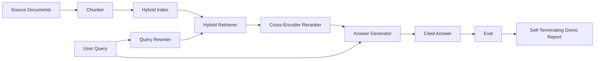

# نظام RAG من نهاية إلى نهاية

> ست دروس من المكونات، خط أنابيب واحد، حلقة تقييم واحدة، عرض إيقاف ذاتي واحد، هذا هو النظام الذي تقوم بإرساله.

**Type:** Build
**Languages:** Python
**Prerequisites:** Phase 11 lessons 06 (RAG), 10 (evaluation); Phase 19 Track B foundations (lessons 20-29); Phase 19 lessons 64, 65, 66, 67, 68
**Time:** ~90 minutes

## أهداف التعلم
- قم بتجميع المفتاح، المفتاح الهجري، إعادة كتابة الاستفسار، إعادة ترتيب المشفير المتقاطع، و مولد الإجابة في خط أنابيب واحد من نهاية إلى نهاية.
- تنفيذ مولد الإجابة الذي يقتبس ادعائه بواسطة المرسومات، مع رد على القليل من الثقة.
- اجري دراسة 68 تقييم ضد خط الأنابيب المجمعة و أثبت أن التكوين المرحلي يفوز على كل متريك على نفس المكونات بشكل منفصل.
- قم ببناء عرض CLI ينهي الذات الذي يتناول جسم المثبتات، ويعمل مجموعة استفسارات ثابتة، ويتخرج من الصفر مع تقرير ملخص.

## المشكلة

ستة مكونات في عزلة لا تثبت أي شيء. يمكن للجثث الفوز على recall@5 ضد الجسم والخسارة على recall@5 النظام لأن الردع لا يمكن ترتيب ما يصدره الجثث. يمكن لـ (Renker) رفع MRR على مجموعة من المرشحين الاصطناعيين و الفشل على المرشحين الحقيقيين لـ (bi-encoder) لأن استدعاء (bi-encoder) في ميزانية (Renker) منخفضة جدا. يمكن للكاتب إعادة كتابة الاستفسار تعزيز الوثيقة الذهبية على استفسار واحد والانقطاع على التالي لأن محاكاة ماجستير في العلوم العليا يعود افتراضية مهينة.

اختبار التكامل هو أنبوب كامل يمر من نهاية إلى نهاية ضد نفس المعدات المثبتة، مع نفس المقياسة، مع ملف واحد الموسيقي الذي يضم كل شيء معا. هذا ما يبنيه هذا الدروس. إذا كانت المقياسات على خط الأنابيب المتكاملة تفوق المقياسات على كل مرحلة من التجربة المعزولة، لقد أثبتت النظام.

## المفهوم



### خيارات السلك

خط الأنابيب هو رسم صغير كل مرحلة هي وظيفة مع توقيع واضح.

| Stage | Input | Output |
|-------|-------|--------|
| Chunker | Document text | List of Chunk records |
| Retriever | Query string | Top-N Chunk records |
| Rewriter (optional) | Query string | List of rewrites + hypothetical |
| Reranker | Query, candidates | Top-K Chunk records with cross scores |
| Generator | Query, top-K Chunk records | Answer string with citations |

التركيب هو بسيط عندما تكون كل توقيع مستقرة.`Pipeline`الصف يحمل الخمس مراحل و `query`كل مرحلة قابلة للتبادل: تمرير مختلفة من المواد، أو الرد، أو إعادة الكتابة، أو إعادة ترتيب، أو مولد، والخطوط لا تزال تعمل.

### مولد الإجابة مع الاقتباسات

إنّ المولد هو المرحلة الأخيرة وأسهل الكسر.

1. يأخذ قطع أعلى مستوى من K.
2. يختار ما يصل إلى قطعتين يحتوي النص على أعلى علامة محتوى تتداخل مع الاستفسار.
3. يُصدّر إجابة هي سلسلة من جملة واحدة من كل قطعة مختارة، مع كل جملة تليها جملة `[doc_id:chunk_index]`المُركب
4. إذا لم يكن هناك قطعة تتداخل فوق عتبة النفايات، فإنها تنشر "لا أعرف" دون إشارة.

في الإنتاج تقوم بتبادل المزيّف مقابل مكالمة حقّية لـ LLM مع نموذج الإستعارة:

```
You are answering a question using only the snippets below.
Cite every claim with the anchor in parentheses.
If the snippets do not answer the question, say "I do not know".

Question: {query}

Snippets:
{enumerated chunks with anchors}

Answer:
```

مسار رفض على انخفاض الثقة هو السبب كله في تسجيل درجة 1 من نقاط التشفير. إذا كان يقع تحت عتبة الجسم، فإن المولد يرفض. هذه هي صمام الأمان ضد الردود الهلوسة.

### التجربة التي تُنهي نفسها

يطبق التجربة كل شيء من نهاية إلى نهاية. فإنه يطبخ تقسيمًا لكل مرحلة من استفسار واحد ، ويجري تقييم على أربعة قواعد المكونات ، ويطبق جدولًا للمقاييس ، ويخرج مع حالة الصفر إذا كانت جميع المقاييس الدروس 68 تلبي العدوان المحددة في التجربة. إذا كانت أي متريكه أقل من العدوان ، فإن التجربة تخرج مع حالة غير صفر ورسالة تسمي المقاييس الفاشلة.

هذا هو الشكل الذي يأخذه اختبار الدخان CI. النبوب يذهب خارج الاتصال، سريع، تحديد. السوائل ضيقة عمدا على العداد لذلك التراجع في أي من الدروس الستة يفشل في التجربة.

```figure
rag-pipeline-flow
```

## بناءها

`code/main.py`تطبيقات:

- `Chunk`- السجل الذي يتم خلال جميع المراحل (موسع شكل الدروس 64 مع مؤشر chunk_index و doc_id المصدر).
- `Chunker`- يختار استراتيجية من الدروس 64 (تقسيم متكرر افتراضي).
- `HybridIndex`- حزم BM25 + كثيفة + RRF من الدروس 65.
- `Rewriter`(اختياري) - يختار واحد من HyDE، متعددة الاستفسارات، التفكك من الدروس 67 من طول الاستفسار وحضور العلاقات.
- `Reranker`- المُعدّل المتعاقب المدرب من الدروس 66، مع مجموعة تدريبية أصغر من الأجهزة بحيث يتقارب في ثواني.
- `Generator`- مولد مزيف ديترمينيستي مع اقتباسات ورفض على الثقة المنخفضة.
- `Pipeline`- يضم المراحل الخمسة مع`query(question)`طريقة تعود`Result(answer, top_k, latency_ms_per_stage)`. . .
- `run_demo()`- يستهلك الجسم، يدير ثلاث استفسارات في المعدات، يدير التقييم، يطبخ النتائج، يحدد رمز الخروج حسب العد.

إشغله

```bash
python3 code/main.py
```

إن الخروج هو واحد من أثر الاستفسار المطبوع ، والجدول التقييم الكامل ، وحالة الإجازة / الفشل النهائية. يعيد رمز الخروج 0 على العبارة.

## أوضاع الفشل سوف تختفي الديمو

**Chunker boundary drift.**إذا قمت بتبادل استراتيجية chunker بين مرور تصنيف eval qrels والإعراض، فإن هويات الوثائق الذهبية لم تعد تتسلسل. قم بحجب استراتيجية chunker في ملف qrels. الاكتشاف يتضمن عنوان يسمي chunker.

**Reranker training set leaks into the eval.**تتضمن 14 استفسارات تدريبية ثلاثية في الدروس 66 استفسارات تشبه استفسارات تقييم. في الإنتاج، قم بإجراء استفسارات تقييم صارمة. استفسارات تقييم التجربة في التجربة تختلف عمدا عن مجموعة تدريبات إعادة التصنيف.

**Mock generator hides hallucination risk.**لا يمكن للمزيّف أن يوحش لأنّه يُبعث فقط نصًا من قطع المُستردّة. يلاحظ الدروس هذا ويشير إلى مسار تبادل الإنتاج إلى نموذج حقيقي.

**No streaming.**يعود خط الأنابيب الإجابة الكاملة في نهاية كل مرحلة. سيستم الإنتاج سيستمر في تشغيل إنتاج المولد. التدفق خارج نطاق النطاق؛ وتعمل معايير درجة الإجابة على السلسلة النهائية في أي من الطرق.

**Latency is offline.**المكالمات المزيفة لـ LLM هي وقت ثابت. المكالمات الحقيقية لـ LLM تهيمن. خطط ميزانية تأخر في نطاق الطلب؛ توقيت الدروس لكل مرحلة يحدد فقط عمل CPU.

## استخدمها

أنماط الإنتاج:

- أرسل ملف خط الأنابيب تحت جهاز موسيقى واحد مع واجهات مرحلة صريحة. تجنب نشر السلك عبر الاستعمال.
- إضافة تقييم قبل كل عملية دمج تلمس مرحلة إذا انخفض تقييم، فإن الاندماج لا يصل.
- استمر في تعقب المقاييس لكل جولة CI حتى تتمكن من إعطاء التراجعات إلى تبادل المرحلة.
- إضافة مجموعة دخان من 20 استفسار (مجموعة فرعية من مجموعة التراجعات) التي تعمل في أقل من 30 ثانية؛ مجموعة التراجعات الكاملة تعمل كل ليلة.

## أرسله

ملف خط الأنابيب في هذه الدروس هو الشكل الذي يتخذه بقية دروس مرحلة 19 من المسار F. الدروس اللاحقة ستضيف تلقائية تناول الطعام، إعادة إدراج التنفيذية، والمتسع، وطبقة خدمة في الأعلى. يتم اكتمال نصفات الاسترداد، وإعادة التصنيف، وإعادة الكتابة، والقيام بتقييم هنا.

## التمارين

1. إضافة اختيار استراتيجية لكل استفسار داخل إعادة الكتابة: الهيورستيات من الدروس 67 (طول، صلالات، نسبة الجارغون) اختيار HyDE، متعددة الاستفسارات، أو التفكك.
2. أضف مكالمة حقيقية لـ (الجامعة) للجهاز المولّد خلف علم (الإنف) ، افتراضية إلى المزيّف، قياس دلتا التخفيف.
3. تمديد التجربة لتحقيق`--corpus path`العلامة التي تحميل جسم حقيقي، إعادة تشغيل تقييم و التحقق من العد.
4. إضافة`--strategy`علامة إلى القمامة. قياس مساهمة كل استراتيجية في استدعاء نهاية إلى نهاية.
5. إضافة واجهة مولد التدفق وتغذيتها في تقييم. تأكد من أن الوفاء يتم حسابها على السلسلة النهائية وليس على المقبلات المتدفقة.

## الشروط الرئيسية

| Term | What people say | What it actually means |
|------|-----------------|------------------------|
| Pipeline | "RAG pipeline" | The composed stages from ingestion to cited answer |
| Citation anchor | "Source link" | The (doc_id, chunk_index) reference attached to each claim |
| Refuse-on-low-confidence | "I do not know" | Generator returns no answer when the reranker top-1 score sits below threshold |
| Smoke set | "CI eval" | The minimal qrels subset that runs in every PR check |
| Stage interface | "Function signature" | The stable input and output type of each pipeline stage |

## المزيد من القراءة

- [Anthropic, Building search and retrieval](https://www.anthropic.com/news/contextual-retrieval)
- [Pinterest, MCP internal search](https://medium.com/pinterest-engineering)- بنية الإنتاج المرجعية
- [Ragas: Automated Evaluation of RAG Pipelines](https://docs.ragas.io)
- المرحلة 11 الدروس 06 - أساسيات المجموعة
- المرحلة 19 الدروس 64-68 - المكونات التي تم تجميعها هنا
