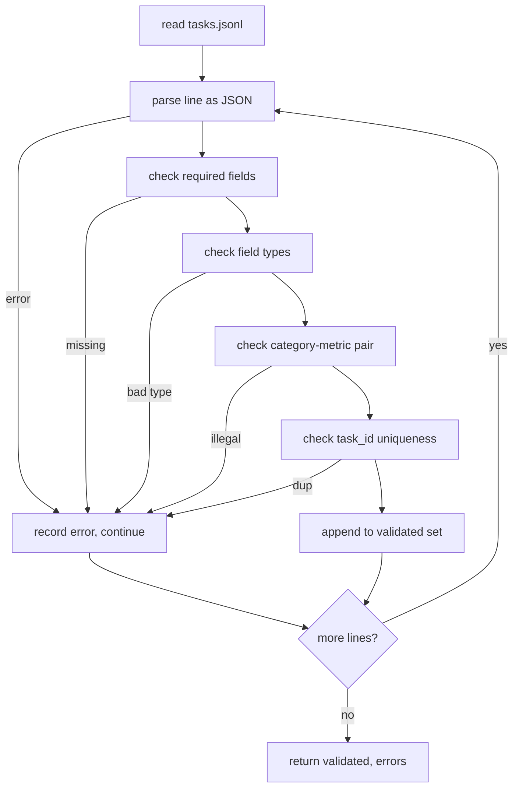

# تنسيق مواصفات المهمة

> استخدام تقييم جيد فقط بقدر ما يُكرم العقد مهامه. تجميد شكل JSONL ومفرد المقياس قبل كتابة وظيفة تسجيل واحدة.

**Type:** Build
**Languages:** Python
**Prerequisites:** Phase 19 Track B foundations
**Time:** ~90 min

## أهداف التعلم

- حدد مخطط سجل مهمة JSONL يغطي الحسابات، والخيار المتعدد، وتنفيذ الرمز، والتصنيف، وتجميع النص الحر في شكل واحد.
- قم بإعداد لغة مغلقة من الأسماء المترتبة بحيث يمكن أن تُرسل الدروس (71-73) في مجال واحد.
- تحديد عدد قليل من الأمثلة والقواعد بعد المعالجة كجزء من المهمة، وليس الجاري، بحيث نفس الإرشاد ينتج نفس الهدف عبر النماذج.
- تنفيذ مؤكد صارم يرفض السجلات الملفقة قبل أن تصل إلى المتدرب.
- أرسل مجموعة من المعدات التي تعمل على 10 مهام تمارس كل فروع من المواصفات حتى يكون للمؤكد شيء حقيقي لضغينه.

```figure
ci-task-spec-gate
```

## لماذا المفردات المجمدة

قاعدة البحث سوف تتراكم نصوص تقييم أسرع من أنها تتراكم الاختبارات. في ستة أشهر، كل دفتر ملاحظات لها شكل JSON الخاص به، كل مقياس يتم إعادة تنفيذ مرتين، ولا يمكن مقارنة أي شيء عبر الجري. الإصلاح ممل. اختيار مخطط. كتابة مؤكد. رفض كل شيء آخر. وهذا ما يفعله هذا الدروس.

يستخدم الشكل الأفكار من الحبال في النمط الكبير، والصدق، والطريقة الزمنية، ولكن أسماء المجال هي لنا. لكل مجال مالك واحد. يقرأ الجاري المهمة. يقرأ المقياس الهدف. خطوة ما بعد العملية تعاديل الجيل. لا يوجد مجال يتغير في منتصف الأنابيب.

## شكل السجل

المهمة هي جسم JSON على سطر واحد.`tasks.jsonl`ويقوم بتحقق كل سطر بشكل مستقل.

```json
{
  "task_id": "arith_001",
  "category": "arithmetic",
  "prompt": "Compute the result. Question: 17 + 24\nAnswer:",
  "targets": ["41"],
  "metric_name": "exact_match",
  "few_shot_examples": [
    {"prompt": "Question: 2 + 2\nAnswer:", "completion": "4"}
  ],
  "post_process": "strip_whitespace",
  "metadata": {"difficulty": "easy"}
}
```

الحقول المطلوبة هي`task_id`،`category`،`prompt`،`targets`،`metric_name`،`post_process`. .`few_shot_examples`و`metadata`غير معروفة الحقول المستوى العلوي فشل التحقق من التحقق

## قواعد الميدان

`task_id`هو سلسلة بدون مساحة بيضاء. المحقق يفرض الاختلاف على جميع الملفات.

`category`هو واحد من`arithmetic`،`mcq`،`code_exec`،`classification`،`summary`. تفرض الفئة قيود على زوج الميترات والعقليات التي تتم بعد العملية.`code_exec`المهمة يجب أن تستخدم`metric_name = code_exec`و (أ)`mcq`المهمة يجب أن تستخدم`metric_name = exact_match`ضد هدف واحد حرف

`prompt`هو سلسلة غير فارغة. المحقق يحظر التراجع في الفضاء الأبيض ويرفض السجلات التي تحتوي بالفعل على كتلة بضع صواريخ في الجسم المطلوب. يحدث تقديم صواريخ بضع صواريخ في المتدرب، وليس المؤلف.

`targets`هو قائمة غير فارغة من السلاسل.`exact_match`، أي عنصر يطابق يعد.`f1`و`rouge_l`،الهدف الأكثر رصيدًا يفوز`mcq`، القائمة تحتوي على عنصر واحد بالضبط.

`metric_name`هو واحد من`exact_match`،`f1`،`bleu_4`،`rouge_l`،`accuracy`،`code_exec`المفردات مغلقة، المقياس الجديد يتطلب درس جديد و مدخل جديد هنا

`few_shot_examples`هو قائمة `{prompt, completion}`المحقق يضع حدوداً على القائمة إلى ثمانية إدخالات للحفاظ على الحدود.

`post_process`هو واحد من`none`،`strip_whitespace`،`lower`،`extract_letter`،`extract_code_block`،`extract_first_line`كل قاعدة لها سلوك محدد واحد. المحقق يحظر مزيج القواعد.

## سلوك المحقق



يعيد المؤكد قائمتين: سجلات معتمدة وسجلات خطأ مع الخط المخالف، والقاعدة المخرقة، والحقل الخطأ. يرفض المتدرب البدء إذا كانت قائمة الخطأ غير فارغة ما لم يكن صريحا `--allow-bad-tasks`العلم جاهز

## إصدار قليل

يجمع المتشغيل أمثلة قليلة من المقاطع أمام المشاركة مع منفصل خط فارغ. يسير مسار الشفرة نفسه لكل نموذج، لذلك المصدر الوحيد للخلاف هو النموذج نفسه. يكتب المؤلفون أمثلة مرة واحدة، وليس مرة واحدة لكل مزود.

```python
def render(task):
    parts = []
    for ex in task.get("few_shot_examples", []):
        parts.append(ex["prompt"] + " " + ex["completion"])
    parts.append(task["prompt"])
    return "\n\n".join(parts)
```

## قواعد ما بعد العملية

الخطوة بعد العملية تمر بعد الجيل، قبل الميتر. إنها تحديدية وغير ذات أساسية.

- `none`يعيد السلسلة دون تغيير
- `strip_whitespace`الشريطات التي تقود وترتيب الفضاء الأبيض
- `lower`يقلل من السلسلة
- `extract_letter`يعيد أول حرف يطابق`[A-E]`يستخدم في المادة المختلفة
- `extract_code_block`يعيد جسم أول كتلة محاصرة ثلاثية الخلفية، تستخدم لتنفيذ الرمز.
- `extract_first_line`يعود أول سطر غير فارغ، المستخدم للتصنيف المختص.

مهمة تحتاج إلى قاعدة خارج هذه القائمة تنتمي إلى دروس جديدة.

## ما لا يفعله هذا الدروس

لا تسجل، لا تدعو نموذجاً، لا تشغيل الرموز، هذه الدروس تأتي في الدروس 71، 72، و 75.

يحتوي جهاز التثبيت العشري على عناصر رياضية، وعن عناصر MCQ، وعن عناصر تنفيذ رمز، وعن عناصر تصنيف، وعن عناصر تلخيص. يقوم المحقق بتقديم جميع العشرة.`tasks_bad.jsonl`) يطرد كل قاعدة و يعيد المؤكد بالضبط الكثير من الأخطاء.

## كيفية قراءة الرمز

`main.py`يحدد`TaskSpec`،`validate_task`،`validate_file`، و نقطة دخول CLI. محمول الأجهزة هو `load_fixtures`. المساعدين في التصوير و بعد العملية يعيشون بجانب التحقق من التحقق لذلك السائق في الدروس 75 يستورد وحدة واحدة.

اقرأ`main.py`من أعلى إلى أسفل، ثم اقرأ`code/tests/test_spec.py`الاختبارات تحدد كل قاعدة التحقق وكل سلوك بعد العملية.`main.py`يصدق على الجهاز المجمّع ويطبّق ملخصاً.

## الذهاب إلى أبعد

تطور مجموعات تقييم حقيقية الفئات بالطريقة التي تنمو بها الخطة العمودات. الخطوة النظيفة هي رفض إضافة فئة دون إضافة متريكا، قاعدة ما بعد العملية، ومهمة ثابتة واحدة على الأقل. تعامل المضمونة مثل هجرة قاعدة البيانات. يتم مراجعة كل تغيير، وتصيغ، ومرافقة اختبارات. المؤكد في هذه الدروس هو البوابة.
