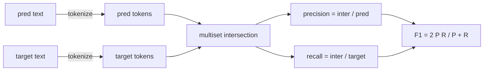
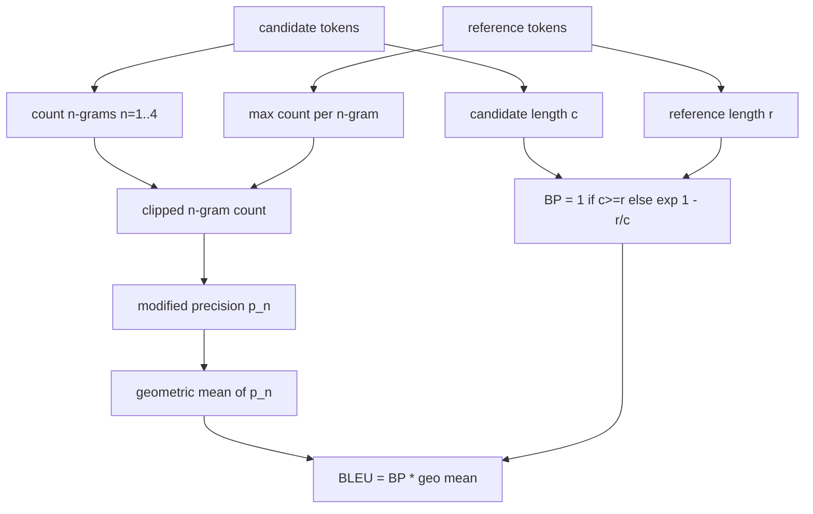

# المقاييس الكلاسيكية

> بليو، ROUGE-L، F1، مطابقة دقيقة، دقة. خمسة مقاييس التي لا تزال تشكل معظم أرقام تقييم LLM المنشورة. تنفيذ كل من المبادئ الأولى حتى تعرف ما يعنيه الرقم.

**Type:** Build
**Languages:** Python
**Prerequisites:** Phase 19 Track B foundations, lesson 70
**Time:** ~90 min

## أهداف التعلم

- تنفيذ مطابقة دقيقة على مستوى الرمز، F1، والدقة مع قواعد التوضيح الصريحة.
- تنفيذ BLEU-4 من الصفر: دقة n-جرامية معدلة، المتوسط الهندسي على n يساوي 1 إلى 4، عقوبة الاختصار.
- تنفيذ ROUGE-L باستخدام أطول سلسلة عامة، مع مزيج F-beta من الدقة والإستدعاء.
- إرسال على حقل metric_name من الدروس 70 حتى يبقى المتجاوز متري-غير معرفتي.
- قم بتحديد السلوك مع متجهات مرجعية استخرجت من أمثلة عمل، وليس من مكتبة طرف ثالث.

```figure
cd-bleu-overlap
```

## لماذا إعادة تنفيذها

ستقرأ أوراق تقرير بليو 28.3 وآخر تقرير بليو 0.283. ستجد نقاط ROUGE-L تختلف بنسبة عشرة نقاط في مكتبتين لأن واحدة تقلص إلى الحرف الصغرى والآخر لا. أسرع طريقة للتوقف عن الارتباك هي كتابة المقاييس بنفسك، ثم توجيه إلى الخط حيث يتم تحديد الوسيط والخط حيث يتم تطبيق التسهيل. بعد ذلك، تقارن الأرقام بين الأوراق يصبح مسألة قراءة الإعدادات المقاييسية، وليس النقاش حول المكتبات.

ستدليب + نومبي يكفي. بليو هو العد والقبض. ROUGE-L هو البرمجة الديناميكية. F1 هو تقاطع محدد على الرموز. الجزء الأصعب هو اختيار رمز التعبير والالتزام به.

## التأليف

الـ (توكنيزر)`re.findall(r"\w+", text.lower())`. الحروف الصغرى، الجري الحرفي، التخطيط التقطيع. كل مقياس في هذا الدروس يستخدم هذا الوهم بالضبط. لا يحصل الجري لاختيار. إذا كنت تبادل الوهم، كنت تشغيل مقياس مختلف.

```python
TOKEN_RE = re.compile(r"\w+", re.UNICODE)
def tokenize(text):
    return TOKEN_RE.findall(text.lower())
```

هذا هو تبسيط متعمد. سيتركيبات الإنتاج سوف تهتم حول CJK، التقلصات، وتعرفات الرمز. نقطة الدروس هي أن الوهم هو عقد، وليس زر.

## مطابقة تمامًا

```python
def exact_match(pred, targets):
    return float(any(pred.strip() == t.strip() for t in targets))
```

يعود 1.0 أو 0.0 لكل مهمة. مجموع مجموعة بيانات هو المتوسط. هذا هو حصان العمل للمهام الحسابية و MCQ ، والتصنيف القصير.

## مستوى الرمز F1

قم بتعيين مجموعة متعددة الوهم للتنبؤ والهدف. الدقة هي التقاطع متعدد الوهم مقسمة على مجموعة متعددة التنبؤ. تذكر هو نفس التقاطع مقسم على مجموعة متعددة الوهم. F1 هو المتوسط الهارموني. التنفيذ يتعامل مع حالات التنبؤ الفارغ وحافة الهدف الفارغ.



بالنسبة للمهام متعددة الأهداف، نأخذ أفضل ف1 فوق قائمة الأهداف، وهذا يطابق سلوك النمط SQuAD الذي تم الإبلاغ عنه على نطاق واسع في الأدب.

## (BLEU-4)

بليو هو مقياس الترجمة الآلية القنوني وهو ما يظهر في العمل المختصر. الصيغة التي نستخدمها هي بليو 4 على مستوى الجسم مع عقوبة القصر القياسية والضخم واحد التسهيل على حسابات n-جرام معدلة حتى لا تضغط 4 جرام واحد مفقودة النتيجة إلى الصفر.

لكل زوج مرجعية مرشحة، نقوم بعد دقة n-جرامية معدلة ل n يساوي 1, 2, 3, 4. يقطف الدقة المعدلة عدد المرشح n-جرامية بمقدار الحد الأقصى من ذلك n-جرام في أي مرجع، لذلك لا يمكن للمرشح أن ينفخ من خلال تكرار عبارة واحدة. يتم تغليف المتوسط الهندسية عبر الدقة الأربعة بالعقوبة القصيرة.



قاعدة التسهيل هي الطريقة التي يسمى بها لين وأوك 1: إضافة واحد لكل من العداد والاسم لكل n-جرام الدقة قبل أخذ السجل. هذا يجنب`log 0`عندما لا يكون هناك مرجع يطابق 4 جرام ويظل قريبًا من القيمة غير المضطربة على المرشحين الطويلين.

## (روج)

يُقارن ROUGE-L أطول سلسلة متواصلة مشتركة من تسلسلات الرمز المرشح والإشارة. يحتفظ LCS بترتيب الكلمات دون فرض التواصل، ولهذا السبب هو مقياس التجميع الافتراضي. نحسب طول LCS باستخدام جدول برمجة ديناميكية قياسي، ثم نستخرج التذكير على النحو`lcs / reference length`، دقة مثل`lcs / candidate length`و يجمع مع F-beta حيث بيتا يساوي واحد للشكل التوافقي F1.

```python
def lcs_length(a, b):
    n, m = len(a), len(b)
    dp = numpy.zeros((n + 1, m + 1), dtype=int)
    for i in range(n):
        for j in range(m):
            if a[i] == b[j]:
                dp[i+1, j+1] = dp[i, j] + 1
            else:
                dp[i+1, j+1] = max(dp[i+1, j], dp[i, j+1])
    return int(dp[n, m])
```

الجدول المميز يجعل التنفيذ قابلاً للقراءة؛ وستعمل قوائم Python النقية أيضًا. تدفع المهام التي تختار ROUGE-L تكلفة O(n) لكل مهمة. بالنسبة إلى الطولات المختصرة النموذجية التي تبقى أقل من ميل ثانية.

## الدقة

بالنسبة لمهمات تصنيف متعددة الأهداف، فإن الدقة تقلل إلى مطابقة دقيقة مع هدف واحد معتاد. نحن نضعها كعمل منفصل حتى يتمكن المرسل من إرسال`metric_name`دون أن يمروا في المقارنات داخل الجاري.

## عقد الشحن

نقطة الدخول الوحيدة هي`score(metric_name, prediction, targets)`- يعيد العائفة`[0, 1]`لا يتعرض الجاري لسم الميتر. يرفع المكالمة ويكتب النتيجة. هذه هي السطح الذي سيتم لصقها في الدروس 75 إلى تحديد المهمة من الدروس 70.

```python
def score(metric_name, pred, targets):
    if metric_name == "exact_match":
        return exact_match(pred, targets)
    if metric_name == "f1":
        return max(f1_score(pred, t) for t in targets)
    if metric_name == "bleu_4":
        return max(bleu4(pred, t) for t in targets)
    if metric_name == "rouge_l":
        return max(rouge_l(pred, t) for t in targets)
    if metric_name == "accuracy":
        return accuracy(pred, targets)
    raise ValueError(f"unknown metric_name: {metric_name}")
```

`code_exec`يتم التعامل معها في الدروس 72 و يتم وضعها في جهاز التنقل هناك.

## ما لا يفعله هذا الدروس

لا تدعو إلى نموذج. لا تعاديل الأجيال أكثر مما فعلت قواعد ما بعد العملية من الدروس 70 بالفعل. لا تقوم بحساب فترات الثقة. لا تقوم بـ BLEURT أو BERTScore (التي تحتاج إلى نموذج وتعيش في درس مختلف). النقطة هي الطابق: خمسة مقاييس، توكينيزر واحد، جدول إرسال واحد.

## كيفية قراءة الرمز

`main.py`تعريف كل متريك كعمل حر زائد المرسل. المتجهات المرجعية تعيش في `_reference_examples`الحلقة في أسفل الملف. التجربة تشغيل المرسل ضد ثمانية أمثلة وتطبيق النتائج المترتبة.`code/tests/test_metrics.py`قم بتحديد متجهات المرجعية وتأكيد كل حالة حافة (التنبؤ الفارغ، المرجعية الفارغة، لا توجد رموز مشتركة، المقابلة الدقيقة، قص العبارات المتكررة).

اقرأ`main.py`من أعلى إلى أسفل. يتم ترتيب الوظائف حسب التعقيد. exact_match والدقة هي خط واحد لكل واحد. F1 هي ستة خطوط. BLEU و ROUGE-L هي الأجزاء الثقيلة وتشمل تعليقات مفصلة على قاعدة التسهيل وتكرار LCS.

## الذهاب إلى أبعد

المقاييس الكلاسيكية ضرورية، ليست كافية. أنها تكافئ التداخل السطحي وتفتقر إلى المعنى. التحدي هو وضع المقاييس القائمة على النموذج فوق (BLEURT، BERTScore، GEval) بمجرد أن تثق في الأرض الكلاسيكية. هذا درس لاحقا. الآن: جعل هذه الخمسة تعمل، وضعها مع اختبارات، ولديك كومة المقاييس التي يمكن مراجعتها، سريعة، ويمكن إعادة تكوينها.
