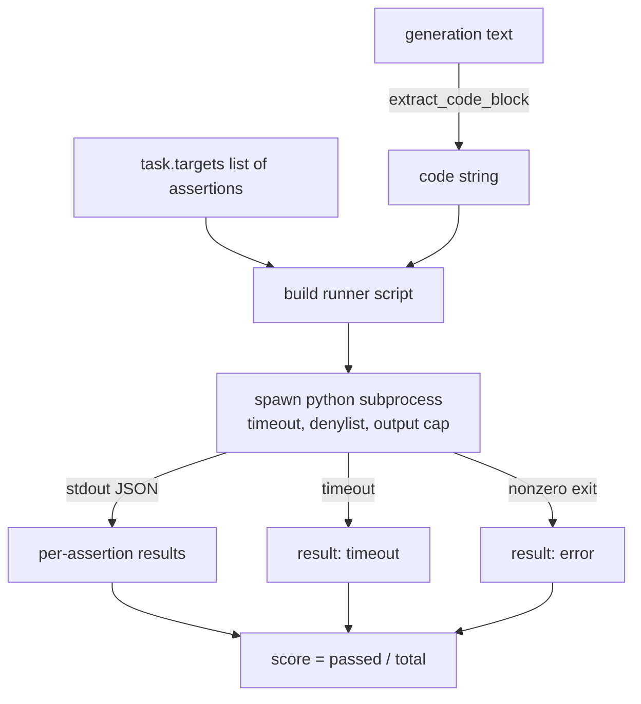
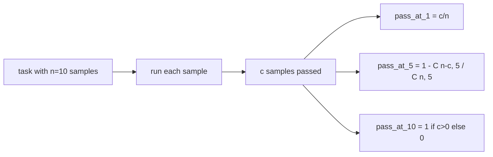

# الرمز المقياس التنفيذي

> الكود الذي تم إنشاؤه صحيح عندما يمر بالاختبارات. يجب على حزمة التقييم استخراج الكود، تشغيله دون تحطم المضيف، وتحساب معدلات المرور بصراحة. هذا الدروس يبني تلك السطح.

**Type:** Build
**Languages:** Python
**Prerequisites:** Phase 19 Track B foundations, lessons 70 and 71
**Time:** ~90 min

## أهداف التعلم

- استخراج كتلة رمز من توليد الشكل الحر بطريقة تتطابق مع قاعدة ما بعد العملية من الدروس 70.
- تنفيذ رمز المرشح في عملية فرعية معزولة مع توقيت ساعة الحائط ، وقفز الخروج ، وسلسلة استيراد.
- تسجيل المهمة كجزء من السلاسل المقدمة للتأكيد التي تمر ضد المرشح.
- الحسابات المضي في ك للمهام التي تستعمل عدة أجيال من نموذج واحد.
- تعامل حوادث تحطم صندوق الرمال، أخطاء النص، وتوقيت التوقيت كطرق الفشل من الدرجة الأولى مع رموز الخروج المميزة يمكن للمسير تسجيل الدخول.

```figure
sandbox-runner
```

## لماذا عملية فرعية معزولة

في الخط`exec`هو خطر على الأمن والاستقرار.`while True: pass`يمنع التقييم للأبد`import shutil; shutil.rmtree('/')`هو بالضبط كما كارثية كما يبدو. التحدي هو أن تنشأ مترجم بيثون جديد لكل مرشح، ونقل الشفرة على stdin، ونكتب نتائج التأكيد إلى stdout، ونقضي على العملية إذا تجاوز. عملية تقييم المضيف يستمر في التشغيل.

تستخدم عمليات تقييم حقيقية مثل HumanEval و MBPP و BigCodeBench و LiveCodeBench جميعها صندوق رمل فرعي. بعض الطبقة Docker في الأعلى. نوقف في العملية الفرعية لسبب: هو محمول ، وهو stdlib ، ويصطاد أوضاع الفشل التي تهم تقييم التعليم. تنشر الإنتاج يضيف seccomp ، عزلة الشبكة ، ونظام ملفات القراءة فقط. الدروس التالية حول تصلب الأرواح خارج هذا المسار.

## شكل مهمة تنفيذ الكود

أ`code_exec`المهمة تحمل سلسلة التأكيد في `targets`.الركض يستخرج حجر رمز محاصر من الجيل، و يبنى حلقة اختبار حولها، و يدير النتيجة.



النتيجة هي جزء من`[0, 1]`. مهمة مع ثلاثة تصريحات حيث اثنين من المرورات تسجل 0.667. يعيد الجاري نفس الشكل بغض النظر عن ما يفشل: يتم رسم الخطأ الفرعي العملية إلى رمز خطأ معتاد، وليس تعقب Python يزعج إلى الحبل.

## " دينيليس "

قائمة دينيليست تستند إلى الاستيراد قبل تشغيل رمز المرشحين، يقوم النص التجاري بإعادة كتابة استيراد وحدات خطيرة إلى قطعة`ImportError("denied")`القائمة محافظة عمداً`os.system`،`subprocess`،`socket`،`requests`،`urllib`،`urllib.request`،`urllib.error`،`urllib.parse`،`ctypes`،`shutil`،`http.client`،`asyncio.subprocess`. . .

لا نتظاهر بأن هذا مضاد للرصاص. يمكن للكود المعارض المحدد الهروب من أي صندوق رمل في العملية في Python. الدينيلست هو محطة حماية. وقت التوقف على الحائط والقفز الخارجي هي التحكمات الحمل.

```python
DENIED = {
    "os.system": True,
    "subprocess": True,
    "socket": True,
    "shutil": True,
    "requests": True,
    "urllib": True,
    "ctypes": True,
}
```

نُغلف المرشح عن طريق الإستعداد`import sys`و حارس يُصطدم القرد`os.system`لنرفع، الشكل الكامل موجود`main.py`. . .

## توقيت التوقف

كل عملية فرعية تحصل على ميزانية افتراضية من ثلاث ثواني ساعة الحائط.`subprocess.run(..., timeout=t)`إذا أطلقت الموعد، فسيصطاد الجاري`TimeoutExpired`، يقتل العملية، ويُسجل`timeout`سبب الخروج من المهمة، والنتيجة لهذا المهمة هي صفر، والركض يتقدم.

يمكن تشكيل الوقت المحدد لكل مهم من `task.metadata.timeout_s`. اختبارات الوحدة طويلة الأمد يمكن أن تطلب المزيد؛ المحقق من الدروس 70 يحد من القيمة في ثلاثين ثانية للحفاظ على الحدود.

## القبو المخرج

يمكن أن تغمر العملية الفرعية المضيف ، وتفقد ذاكرة المضيف. يُدفق الجاري المضيف إلى حافظة ويموت الطفل بمجرد أن يتجاوز إجمالي الجاري 256 كيلو بايت. يتم تسجيل النتيجة على أنها `exit_code = error`مع سلسلة التفاصيل`"output overflow"`هذا يظهر في الممارسة العملية عندما يكتب جيل عن طريق الخطأ حلقة لا نهاية لها التي طبعت.

## -مرّة

"Pass-at-k" هو مقياس غير متحيز يستخدمه "هيومن إيفال" وأصدقائه`n`عينات مستقلة لكل مهمة و`c`من خلالها تمر، احتمال أن عينة من حجم `k`من`n`يحتوي على حل واحد على الأقل هو:

```
pass_at_k(n, c, k) = 1 - C(n - c, k) / C(n, k)
```

متى`n - c < k`العداد غير محدد والقيمة هي `1`التنفيذ يتعامل مع قضية الحافة مباشرة`pass_at_k(n, c, k)`للاستخدام من قبل طبقة الرقم في الدروس 74.



## رموز الخروج

يرد الجاري واحد من خمسة نتائج لكل مهمة:

- `pass`" عندما تمت كل تأكيد " أي تأكيد " .
- `assertion_fail`عندما تم تشغيل الشفرة ولكن على الأقل تأكيد واحد فشل.
- `syntax_error`عندما لا يتم استيراد الرمز أو كان هناك خطأ في النص.
- `timeout`عندما انتهت ساعة الجدار
- `error`لأي حادث آخر، بما في ذلك ضربات النسخة الجهازية والانفجار المنتج (سطحات الانفجار المفصلة `"output overflow"`)

لا يزال النتيجة جزءاً كبيراً. رمز الخروج هو البيانات المعدنية. الدروس المتدفقة في النهاية يمكن أن تقرر ما إذا كان يجب احتساب وقت وقف كصفر أو كمعلومات مفقودة.

## ما لا يفعله هذا الدروس

لا يمنحك صندوق رمل حقيقي. لا يعمل كودًا غير موثوق به من الويب المفتوح. لا يتعامل مع مهام دولية مثل الملفات أو مكالمات الشبكة. هذه تحتاج إلى حاوية أو microVM. نقطة هذا الدروس هي العقد: عملية فرعية معزولة ، قائمة دينيلا ، وقتاً متأخرًا ، وترأس خروج ، ومفردات كود الخروج النظيفة ، والرياضيات المترتبة على المضي.

## كيفية قراءة الرمز

`main.py`يحدد`extract_code`،`run_candidate`،`score_code_exec`و`pass_at_k`. نص متشغيل العملية الفرعية بنيت كسلسلة و تم تمريرها ك `-c`إلى مترجم بيثون جديد.`code/tests/test_exec.py`تمارس الرموز الأربعة للخروج بالإضافة إلى "pass-at-k" مقابل الأمثلة المستخدمة التي تم استخدامه من أسلوب "HumanEval".

اقرأ`main.py`من أعلى إلى أسفل. نموذج الجري هو قطعة تحمل الحمل. انظر إلى حلقة التأكيد حتى يمكنك التنبؤ لفافة JSON التي تكتبها مرة أخرى إلى العملية الأم.

## الذهاب إلى أبعد

بمجرد أن يعمل شكل العملية الفرعية، فإن القلق التالي هو النقل. إصدارات Python المختلفة تتعامل مع SIGKILL بشكل مختلف على Windows. أفضل حل هو وضع المتسابق في صورة (دوكر) الشيء التالي بعد ذلك هو استبدال سلسلة التأكيد بملفات اختبار الوحدة الحقيقية حتى يطابق تقييم ما يفعله مؤشر الإنتاج. توقف عن تسمية أسلوب التأكيد اختبارات في تلك النقطة؛ فهي اختبارات لعبة ولديها وضع فشل لعبة.
