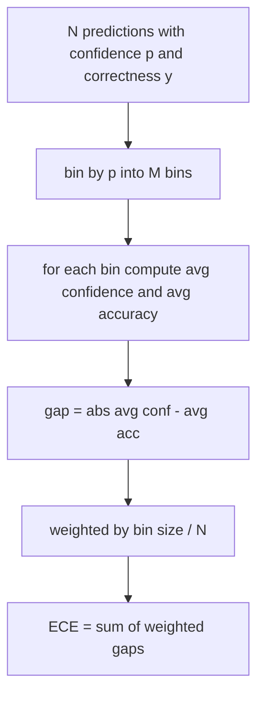
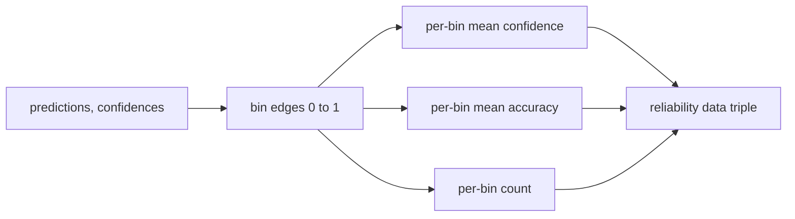

# الارتباك والتحديد

> إذا قال نموذجك أن 90٪ واثق من ألف إجابة وتحصل على ستة مئات صحيحة، فإنه ليس مقياسًا جيدًا. التقييم هو نصف تقييم موثوق به. النصف الآخر هو الارتباك، الذي يخبرك ما إذا كان النموذج يعتقد أن النص المحتفظ به معقول على الإطلاق.

**Type:** Build
**Languages:** Python
**Prerequisites:** Phase 19 Track B foundations, lessons 70 and 71
**Time:** ~90 min

## أهداف التعلم

- احسب الارتباك على مستوى الرمز على جسم تمت إحتفاظ به من احتمالات السجلات السلبية الرمزية التي قدمها مُعدل النموذج.
- احسب خطأ التصفية المتوقع (ECE) للفصيلة أو اختيار متعدد من خلال الاحتمالات المتوقعة.
- احسب درجة برير (الخطأ المتوسط في مربع مقابل مؤشر الصواب) و اشرح متى تقوم بما لا تفعله الايسيه.
- بناء بيانات رسمية الموثوقية اللازمة لرسم منحنى الثقة مقابل الدقة.
- سلك كل ثلاثة في الحزام التقييم حتى يمكن للجري`perplexity`،`ece`و`brier`أرقام تقرير نموذج

```figure
cd-reliability-diagram
```

## ما الذي يخبرك به الارتباك

الارتباك هو متوسط احتمالات السجل السلبي المتبعاً لكل رمز. أقل أفضل تعقيد واحد يعني أن النموذج يعطي احتمال واحد لكل رمز فعلي تعقيد حجم المفردات يعني أن النموذج متوحد ولم يتعلم شيئاً الأرقام الحقيقية تقع بينها: نموذج أساسي قوي في 2026 على ويكيتيكست 103 يقع حول ثمانية إلى اثني عشر. السيء على نفس النص يجلس على خمسين زائد.

لا يحسب الحبل احتمالات السجل نفسه. تلك تأتي من المعدل النموذجي. مجموعات الحبل: يأخذ قائمة من احتمالات السجل لكل رمز، قائمة من حسابات الرمز لكل تسلسل، ويرد تعقيد الجسم.

```python
def perplexity(neg_log_probs, token_counts):
    total_nll = sum(neg_log_probs)
    total_tokens = sum(token_counts)
    return math.exp(total_nll / total_tokens)
```

يُعامل التنفيذ حالات الحافة الصفرية للبرمجة ويؤكد أن احتمالات السجل السلبية غير سلبية. خطأ شائع هو نسيان السلبية: جهاز تعديل يعود `log p`بدلاً من`-log p`يُنتجُ حيرة أقل من واحد، وهو أمر مستحيل.

## ما هي تدابير الإقليمية

مجموعة الخطأ المتوقع للتصفية التنبؤات من خلال ثقتها في عدد ثابت من الحاويات، ثم قياس الفجوة المتوسطة بين الثقة والدقة عبر الحاويات، وزنها عن طريق حجم الحاوية.



الصيغة القياسية تستخدم عشرة حاويات ذات الاحجام المتساوية على`[0, 1]`. التنفيذ يدعم أي عدد إيجابي من الأعداد الكاملة .`bins`المعلم حتى يتمكن المتسابق من الاختيار بين اتفاقية النشر (10) و اتفاقية المقارنة (15).

يتم تحديد ECE من خلال عدد القمامة وحجم العينة. مع عشرة قمامة ومئة توقعات ، لا يمكنك تمييز 0.02 ECE من الضوضاء العشوائية. يعيد التنفيذ عدد القمامة المكتشفة جنبا إلى جنب مع ECE حتى يتمكن المتدرب من رفض الإبلاغ عن رقم واحد على قليل جدا من العينات.

## ما هي النتيجة التي يقدمها برير التي لا يقدمها إيكي

يُهتم ECE فقط بالفجوات المتوسطة. يمكن أن يكون نموذج يثق بشكل مفرط في نصف الصناديق وقل الثقة في النصف الآخر من ECE منخفضًا بينما يتم تحديده بشكل سيء محلياً. قياس درجة Brier يقيس خطأ مربع ضد النتيجة الحقيقية لكل تنبؤ ، لذلك يعاقب الانتشار مباشرة.

بالنسبة للنتائج الثنائية، برير هو `mean((p_i - y_i)^2)`يُحسب النتيجة والتحلل، ويقوم السائق بإبلاغ عن التحلل، لكنه يسجل التحلل على لوحة التحكم.

```python
def brier(p, y):
    return float(np.mean((p - y) ** 2))
```

## بيانات رسمية موثوقية

مخطط الموثوقية يتنبأ بالثقة ضد الدقة التجريبية في كل قمامة. التناحية هي التصفية المثالية. يعيد الوظيفة ثلاثة صفوف: متوسط الثقة لكل قمامة، متوسط دقة كل قمامة، وعدد كل قمامة. يعيش رمز التخطيط أسفل النهر؛ هذه الدروس تتوقف عند شكل البيانات.



توبل العودة هو ما يحتاجه طبقة الدعوة لسحب المسار أو حساب فاريان ECE المخصص (ECE التكيفية، مسح ECE، إلخ). نعيد صفوف numpy حتى لا يتعين على رمز أسفل التيار تحويل.

## مصادر الثقة

الحزام لا يفترض أن الثقة تأتي من softmax.`[0, 1]`لكل توقعات. بالنسبة للمهمات متعددة الاختيارات الثقة الطبيعية هي `softmax over option log-likelihoods`بالنسبة للنص الحر الثقة الطبيعية هي احتمال النموذج الذي يبلغ عن نفسه أو المعدل المتعدد من احتمال السجل المتوسط.

## قضايا الحافة

- كل التنبؤات خاطئة: ECE هو متوسط الثقة، Brier هو مرتفع، الارتباك هو ما يعتقد النموذج من النص.
- جميع التنبؤات صحيحة مع ثقة عالية: ECE بالقرب من الصفر، برير بالقرب من الصفر.
- ناقص تماماً في التنبؤ p=0.5: ECE هو 0.5 ناقص دقة، Brier هو 0.25 ناقص مصطلح التصحيح.
- إدخال فارغ: إعادة إرسال الإلكتروني، و Brier، و موثوقية `0.0`(أو صفوف مملوءة صفر) يعود الارتباك`NaN`لا توجد أي من هذه المسارات تنطلق تحذيراً؛ يقوم المتدرب بفحص القيم ويقرر ما إذا كان يجب الإبلاغ أم عدم الإبلاغ.

هذه الحالات يتم خبزها في الاختبارات. لن يضربها نموذج حقيقي على مقياس حقيقي، ولكن سيضربها جهاز تعديل البغ أو عينة صغيرة، والركض لا يجب أن يتعثر.

## الإرسال

التصفية ليست مقياس لكل مهمة مثل ف1 إنها تقرير لكل نموذج`(confidence, correct)`يُحسب الارتباك على مجموعة نصية متبقية، منفصلة عن تسجيل المهام حسب المهام.

الواجهة هي:

```python
report = CalibrationReport.from_predictions(confidences, correct)
report.ece          # float
report.brier        # float
report.reliability  # tuple of three numpy arrays
report.populated_bins  # int
```

`PerplexityResult.from_token_nll(neg_log_probs, token_counts)`يعيد الارتباك والمتوسط السلبي احتمال التسجيل لكل رمز.

## ما لا يفعله هذا الدروس

لا يدعو نموذج. لا ينفذ softmax. لا يقدر الثقة من رموز الخروج؛ وهذا هو عمل المعدل. لا يقوم بتقييم درجة الحرارة أو تقييم Platt؛ هذه هي إصلاحات ما بعد الهوك التي تعيش في درس مختلف. هدف هذا الدروس هو جعل الأرقام الثلاثة (الغموض، ECE، Brier) موثوقة ويمكن إعادة تكوينها.

## كيفية قراءة الرمز

`main.py`يحدد`perplexity`،`expected_calibration_error`،`brier_score`،`reliability_diagram`، و `CalibrationReport`- لا ، لا`PerplexityResult`درجة البيانات. تم تشغيل التجربة على التنبؤات الاصطناعية حيث تعرف الحقيقة الأرضية: نموذج مقياس جيد، واحد متيقن جدا، والآخر غير متيقن.`code/tests/test_calibration.py`قم بتحديد كل حالة حافة بالإضافة إلى قيم مرجعية للمتنبؤات الاصطناعية

اقرأ`main.py`من أعلى إلى أسفل. ترتيب الوظيفة يذهب من مستوى إلى متجه لتقرير. كل وظيفة لديها سلسلة وثائق قصيرة مع الرياضيات والعقد.

## الذهاب إلى أبعد

التصفية هي المحور الأكثر تجاهلاً في تقييم المنشور. معظم المجلات الإحصائية تقرير رقم واحد دقة ويقول انه قد تم. نموذج يفوز بالدقة وخسر برير هو انتشار إنتاج أسوأ من نموذج يسجل بضع نقاط أقل على الدقة ولكن يبلغ بشكل موثوق عن عدم اليقين. بمجرد أن يكون لديك سباك التصفية في مكانها، أضف مقياس درجة الحرارة على شريحة التحقق المحتملة، أعيد حساب ECE، ومشاهدة انخفاض الفجوة. هذا درس منفصل، لكن الأرضية تعيش هنا.
