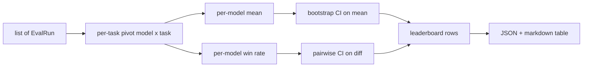
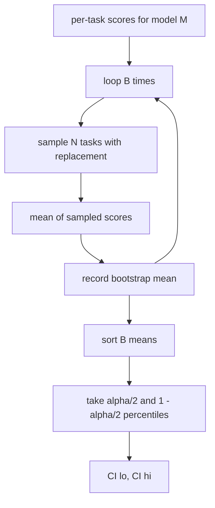

# جمع المخططات

> النتائج لكل مهمة سهلة. ترتيبات لكل نموذج في المهام المتعددة الصعوبة. الأهمية الإحصائية على قائمة التنبؤات الفائقة هي الجزء الذي يخطفه الجميع. هذا الدروس لا يخطفه.

**Type:** Build
**Languages:** Python
**Prerequisites:** Phase 19 Track B foundations, lessons 70, 71, 73
**Time:** ~90 min

## أهداف التعلم

- جمع النتائج لكل مهمة عبر نماذج متعددة ومهام متعددة في صف نظيف لكل نموذج.
- تمييز النتائج المتعددة لدرجة عدم تأثير أسعار الإجازة والقيم المضادة للقيمة الأبيض على المجموع.
- قم بتقييم النماذج حسب المتوسط و حسب معدل الفوز، و اشرح متى كل منها هو الموجب الصحيح.
- احسب فترات ثقة التشغيل على متوسط النتيجة لكل نموذج وعلى اختلافات الزوجية.
- أخرج قائمة النتائج كقاعدة بيانات JSON وكجدولة التسجيل يمكن للمسابق في الدروس 75 إلصاقها في تعليق CI.

```figure
ci-leaderboard-ci
```

## شكل المدخل

المجموعة تستهلك قائمة `EvalRun`السجلات:

```python
@dataclass
class EvalRun:
    model_id: str
    task_id: str
    metric_name: str
    score: float          # in [0, 1]
    category: str
```

الجاري في الدروس 75 يُصدّر رقماً واحداً لكل`(model, task)`زوج. لا يهتم المجمّع كيف تم إنتاج النتيجة. يتوقع أن يحدث بالفعل التطبيع: كل نتيجة في`[0, 1]`. . .

## الناتج

ثلاثة طاولات تخرج:



الصف في قائمة النتائج يحتوي على: `model_id`،`mean_score`،`mean_ci_lo`،`mean_ci_hi`،`win_rate`،`tasks_completed`، و اختياري`categories`خريطة لمتوسط لكل فئة

## التطبيع

إذا كانت مهمة واحدة تسجل في`[0, 1]`وآخر في`[0, 100]`، والثاني يهيمن بصمت على المتوسط. المجمع يؤكد أن كل نقطة دخول تقع في`[0, 1]`ورفض الجري في خلاف ذلك. العدالة تعيش في الأعلى من التيار: المقياس يجب أن يعود بالفعل جزء. الدروس 71 إلى 73 تنفذ تلك العقد.

## متوسط معدل الفوز

الخطة المرتبة الخدمة هدفين مختلفين.

متوسط النتيجة هو متوسط النتيجة لكل مهمة لنموذج واحد. إنه تقرير الرقم الرئيسي لدرجات الرتب. هو حساس لمتفاصيل وعدم التوازن في المهام.

يعد معدل النصر كم عدد المرات التي يفوز فيها نموذج مع كل نموذج آخر في نفس المهمة. لكل مهمة، يفوز نموذج لديه أعلى درجة (تقسيم العلاقات). معدل النصر يساوي الفوز مقسمًا على عدد المهام التي يحصل فيها النموذج على درجة. هو أقل حساسية للقياسات الفارقة والفروق في الحجم لكنه يفقد المعلومات.

```python
def win_rate(model_id, runs_by_task, all_models):
    wins, total = 0, 0
    for task_id, runs in runs_by_task.items():
        scores = {r.model_id: r.score for r in runs if r.model_id in all_models}
        if model_id not in scores:
            continue
        total += 1
        best = max(scores.values())
        if scores[model_id] >= best:
            wins += 1
    return wins / total if total else 0.0
```

يذكر الحزمة كلتا الاثنين. يرتب الركاب في الدروس 75 حسب المتوسط حسب الافتراض؛ عمود التسجيل لعدد الفوز هو هناك في حالة تفضيل المستخدم.

## فترات الثقة في إطلاق

معدل لكل نموذج يأتي مع فترة ثقة تقدير عن طريق bootstrap resampling على المهام. نعيد استبدال أرقام تعريف المهام مع استبدال، حساب المتوسط على مجموعة resampled، تكرار `B`في أوقات التراجع، وخذ فترة الفصيلة على المستوى`alpha`. . .



للمقارنات المتزاوجة نطلق الفرق لكل مهمة`score_A - score_B`، تأخذ فترة الفصلية ، وتقرير ذلك. يقرأ المستخدم ما إذا كانت الفصل يستبعد الصفر. إذا كان كذلك ، فإن الفرق كبير في المستوى ألفا. إذا لم يكن كذلك ، فإن اللوحة الرتبية تعامل مع النماذج على أنها متساوية.

المساعدون منخفضة المستوى (`bootstrap_mean_ci`،`bootstrap_pairwise_diff`) الاختلالات`B=1000`؛ المجمعات العامة (`aggregate`،`pairwise_diffs`) الاختلالات`b=500`لذا الاكتشافات والاختبارات تبقى سريعة الفا الافتراضي هو 0.05

## الفئات

إذا`EvalRun.category`يتم تعيينها، ويعطي المجمع أيضاً متوسط لكل فئة. هذه العمود على كل جدول قياسي يقول `math`،`reasoning`،`code`،`safety`يسمح للمسابقين بمعرفة ما إذا كان النموذج جيد بشكل عام ولكن ضعيف في الشفرة، وهو المعلومات التي تخفي العنوان.

## إعادة التعبير

يتم عرض جدول النسب على شكل جدول التسجيل:

```text
| Rank | Model | Mean | 95% CI | Win rate | Tasks |
|------|-------|------|--------|----------|-------|
| 1    | gpt   | 0.78 | 0.74-0.82 | 0.62 | 50 |
| 2    | claude| 0.75 | 0.71-0.79 | 0.34 | 50 |
| 3    | random| 0.10 | 0.07-0.13 | 0.04 | 50 |
```

يتم فرز الجدول حسب متوسط النتيجة. يتم تقديم المعلومات إلى اثنين من العشرات. يتم تقليص هويات النموذج الطويلة إلى عشرين حرفًا.

## ما لا يفعله هذا الدروس

لا تشغيل نماذج. لا تدعو الطبقة الميترية. لا تنفيذ ECE التكيفية أو مختلفات التصفية الأخرى؛ هذه هي الدروس 73. لا تنفيذ وزن المهام. كل مهمة تعتبر نفسها هنا. قائمة المهام الوزن الإنتاجية؛ نحن نترك هذا الرمز مفتوحا من خلال `weight`لكن تجاهله في المجمع. أضف الوزن في درس متابعة إذا كنت بحاجة إليه.

## كيفية قراءة الرمز

`main.py`يحدد`EvalRun`،`LeaderboardRow`،`aggregate`،`bootstrap_mean_ci`،`bootstrap_pairwise_diff`و`render_markdown`. يُبني التجربة مجموعة صناعية من ثلاثة نماذج و12 مهمة، وتجميعها، وتطبيع قائمة النتائج بالإضافة إلى الجدول المختلف بالزوجات.`code/tests/test_leaderboard.py`إضافة القيادة، إظهار التسجيل، قضايا الحافة الفائزة، و سلوك المدخل الفارغ.

اقرأ`main.py`من أعلى إلى أسفل. شكل البيانات (EvalRun، LeaderboardRow) يأتي أولا، الجمع التالي، البث الثالث، التسجيل الأخير. كل وظيفة لديها عقد مركز.

## الذهاب إلى أبعد

الخطوة التالية الطبيعية هي أهمية المهام المزدوجة بدلاً من إطلاق المزدوجة. إذا كان النموذج A و B كل من أجرى نفس المئة المهام، الاختبار المناسب هو الزوجه التشغيل على المهام من خلال المهام الاختلافات، التي نطبقها. وبالإضافة إلى ذلك، تريد خطوة تشغيل سلسلية تحترم عائلات المهام (المشاكل الرياضية ليست مستقلة عن بعضها البعض؛ نمط خطأ الحسابية يؤثر على عشرة منهم). هذا هو متابعة. الهدف من هذا الدروس هو الحصول على الأرضية الصحيحة حتى تقرير تقييم عدد يمكنك الدفاع عنه.
