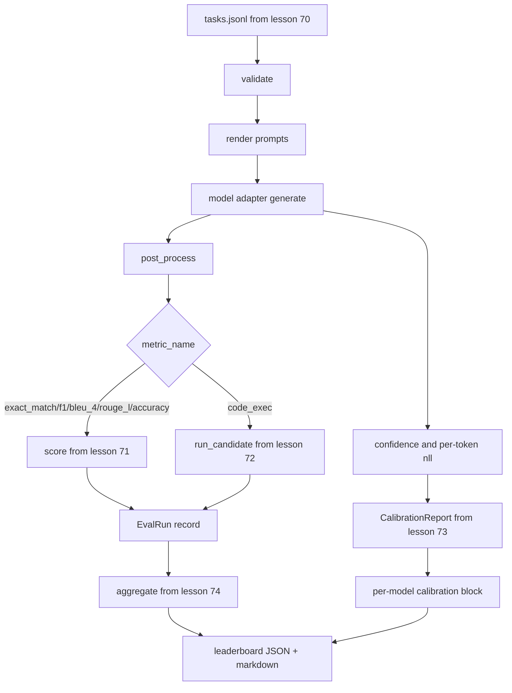

# "راري "إيفال من النهاية إلى النهاية

> خمس دروس للسباكة، درس واحد للاصطحاب. يقرأ المتسابق مواصفات المهمة من الدروس 70، يدعو نموذجًا من خلال جهاز تعديل، يسجل مع الدروس 71 و 72, يرفق تقرير التصفية من الدروس 73, ويصدر قائمة التسجيل من الدروس 74.

**Type:** Build
**Languages:** Python
**Prerequisites:** Phase 19 Track B foundations, lessons 70 through 74
**Time:** ~90 min

## أهداف التعلم

- تعريف`ModelAdapter`واجهة يمكن لأي نموذج (مزيّف أو محلي أو API) أن يرضي بها على سطح طريقة صغيرة.
- قم بإجراء تقييم على ملف JSONL ثابت مع تنفيذ مهام متوازية عبر مجموعة من العمال.
- قم بتجميع الطبقة الميترية (exact_match، F1, BLEU-4, ROUGE-L، code_exec) مع طبقة التصفية في مرسل واحد.
- إصدار لكل نموذج`EvalRun`تسجل وتغذيها مباشرة في جمع قائمة الدرجات.
- إصدار كل من تقرير JSON وجداول التميز؛ إصدار الذاتي مع خروج صفر على تشغيل نظيف، غير صفر على التحقق من التحقق أو فشل وقت تشغيل.

```figure
eval-grid
```

## خط الأنابيب



الجاري هو نقطة التكامل. كل دراسة 70 إلى 74 تمتلك وحدة واحدة يتم تجميعها من قبل الجاري. لا يقوم الجاري بتكرار أي منطق من هذه الوحدات: إنه يستوردها.

## واجهة المعدل

المعدل هو المفتاح بين المتدرب وأي نموذج. واجهة صغيرة عمدا.

```python
class ModelAdapter:
    model_id: str

    def generate(self, prompt: str, task: TaskSpec) -> Generation: ...
```

`Generation`هي فئة بيانات مع:

- `text`: إنتاج النموذج في شكل حر
- `confidence`: يطفو في`[0, 1]`تمثل احتمال النموذج الذي تم تقريره بنفسه للإجابة
- `token_nll`: مجموع اختياري من احتمالات السجل السلبية على الرموز المولدة
- `token_count`: عدد اختياري من الرموز المولدة

مُعدّلات المُزيّفة في المُسير توفر ثلاث طعامات: `RuleBasedAdapter`(محددة، شبه مثالية)`NoisyAdapter`(مبالغ في الثقة، غالباً ما يكون خطأ) ، و`BiasedAdapter`(جيد في فئة واحدة، فظيع في أخرى) التجربة تمر على كل ثلاثة على الدروس 70 المثبت.

## التنفيذ المتوازي

المركض يستخدم`concurrent.futures.ThreadPoolExecutor`لتنفيذ المهام بالتوازي لكل نموذج. عدد العامل يتم تحديده إلى أقل من ثمانية وتعداد المهام. الخيوط كافية لأن عقدة الزجاجة للمكالمات النموذجية الحقيقية هي شبكة I / O. يول رمز-تنفذ يخلق فرع عمل خاص به داخل المهام والممثل فقط يخطط للانتظار.

بالنسبة للاختبارات المحددة، يُعرض الجاري`run_eval(adapters, tasks, parallel=False)`حتى يمكن للاختبارات تحديد أمر الإعدام

## حلقة تسجيل الممر الواحد

لكل مهمة:

1. اعرض الإشارة (مضمونة لعدة صواريخ بالإضافة إلى الجسم الإشارة).
2. اتصل بالاعدادة وتوقّف المكالمة
3. بعد العملية، الجيل حسب قاعدة المهمة.
4. إرسال إلى الطبقة المتريكية
5. بناء`EvalRun`سجل مع النتيجة والبيانات الميترية.
6. إضافة `(confidence, correct)`إضاف إلى عازف التصفية

- نعم`correct`الإشارة هي`score >= 1.0`لمتريكات نمط المقابلة بالضبط (`exact_match`،`accuracy`،`code_exec`) و `score >= 0.5`لمتريكات المرتبة.`_correct_from_score`و لا يضع الجاري على علنى السيطرة

## التجميع

بعد كل مهمة لديها نتيجة، الجاري يطلق`aggregate`و`pairwise_diffs`من الدروس 74 و `CalibrationReport.from_predictions`من الدروس 73. الخروج هو غلاف واحد JSON:

```json
{
  "leaderboard": [...],
  "pairwise": [...],
  "calibration": {
    "model_id_a": {"ece": 0.04, "brier": 0.10, "populated_bins": 8, ...},
    ...
  },
  "summary": {
    "tasks": 10,
    "models": 3,
    "wall_seconds": 1.2
  }
}
```

يكتب المتدرب أيضا جدول التسجيل إلى stdout حتى يتمكن المستخدم من لصق النتيجة في مراجعة علاقات عامة.

## التجربة الذاتية

يستخدم المشاهد ثلاث مُكافئ مزيفة على مدار المهام العشرة المُثبتة من الدروس 70. يجب أن يُقضي الوقت على الجدار أقل من عشر ثواني. رمز الخروج هو صفر على عملية تنفيذ نظيفة.

المعايير النظيفة هي:

- كل مهمة معتمدة تحت الدروس 70.
- كل مهمة حصلت على دروس 71 و 72.
- تقرير التصفية المجمّع تحت الدروس 73 دون أخطاء.
- رتبت اللوحة الرتبة المعتدل القائم على القواعد فوق المعتدل العشوائي بشكل صارم.

إذا كسر أي من هذه، فإن المتشغيل يخرج من غير الصفر مع خطأ مهيكلي في غلاف JSON.

## ما لا يفعله هذا الدروس

لا ينادى النموذج الحقيقي. لا ينطبق تدفق مفتاح API أو معالجة الحد السريع. لا ينطبق التدفق أو الجيل الجزئي. يعيد المعدل جيلًا واحدًا لكل مكالمة. لا يقوم بإعادة المحاولات أو التخزين الآلي. هذه المخاوف تعيش في طبقة المعدل. يكون المتدرب متريكيًا وكذلك معدل المقدم.

## كيفية قراءة الرمز

`main.py`هو التكامل. فإنه يستورد من الخمسة وحدات الدروس الأخرى من خلال`_load_sibling`المساعد الذي يحل لهم عن طريق المسار النسبي.`Generation`،`EvalReport`و`ModelAdapter`المعدات المزيفة في أسفل الملف

اقرأ`main.py`من أعلى إلى أسفل، فحص الواردات، ثم انظر`run_eval`، ثم`_score_one`و بعد ذلك المعدلات، و التجربة في النهاية هي نقطة الدخول

الاختبارات في`code/tests/test_runner.py`وضع واجهة المعدل، ودورة المرور الواحد، والموازية مقابل التسلسل، ومضخة التصفية، وشكل غلاف JSON.

## الذهاب إلى أبعد

هذا المتشغيل هو الأرض. نظام تقييم الإنتاج يضيف: مخزن مخزن النتائج المفتاح بواسطة `(task_id, model_id, model_version)`، دفتر التكاليف الذي يتتبع الدولارات والرموز لكل جولة، وطبقة التجربة التي تدعم حدود السعر، وسياسة أخذ العينات لمهام التدفق على الك، ونموذج إخراج التدفق للجنات الطويلة. كل من هذه هي مشكلة واحدة التي تغطي المتدرب دون تغيير الطبقات الميترية أو التجميع. هذا الانفصال هو نقطة العقد.

إضافة مُعدّل لمُقدّم حقيقي بعد أن تكون لديك المُزّحّات تعملة، اختر واحدًا مع طبقة مجانية، اكتب ثلاثين سطر من الغراء، شاهد إضاءة اللوحة التمهيدية، ثم إضافة المُقدّم الثاني ودع الحزام يقوم بالعمل.
